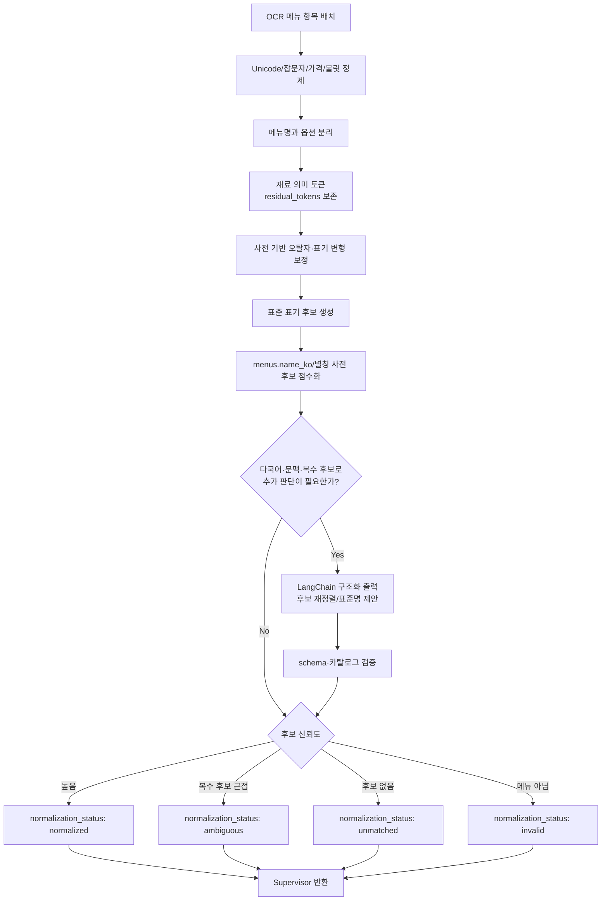

# ② Menu Normalization Agent 스펙

담당: 박다은
상태: 초안 (미확정 항목은 §8 참조)
상위 문서: `caution-multi-agent-architecture.md`, `caution-db-schema.md`

---

## 0. 역할 범위

②는 ① OCR Tool이 추출한 원본 메뉴명을 DB 매칭에 적합한 형태로 정제하는 **전처리 전용 Agent**다.

핵심 목표는 `menus.name_ko`와 매칭 가능한 후보를 만들되, 불확실한 추측을 확정 사실처럼 만들지 않는 것이다. 정규화는 매칭 가능성을 높이는 단계이지, 메뉴 존재 여부를 판정하는 단계가 아니다.

| 하지 않음 | 담당 |
|---|---|
| 가게 식별 | ⓪ Supervisor Agent |
| DB / Ontology 조회 | ④ |
| 변형 메뉴의 remain 토큰 해석 | ④ |
| 재료 추론 | ④/⑤/⑥ |
| 최종 위험 판정 | ⑧ |
| DB 쓰기 | ⑦ |

### 0-1. 설계 원칙

- 입력 순서를 유지한다. 메뉴판의 표시 순서가 사용자 응답 UI와 연결되기 때문이다.
- 원본 문자열을 버리지 않는다. 정규화 실패나 검수 시 OCR 원문이 필요하다.
- 옵션과 메뉴명을 분리하되, 옵션을 완전히 폐기하지 않는다.
- 과한 의미 추론을 하지 않는다. "차돌된장찌개"를 "된장찌개"로 확정하지 않고, ④가 변형 태깅할 수 있도록 후보와 토큰을 남긴다.
- 결정론적 규칙을 먼저 적용하고, 다국어·문맥·복수 후보처럼 규칙만으로 확정할 수 없는 경우에만 LLM을 호출한다.
- LLM은 후보를 재정렬하거나 표준명 후보를 제안할 수 있지만 카탈로그에 없는 `menu_id`를 만들 수 없다.
- 불확실성을 `ambiguous`/`unmatched`로 보존하고 억지로 하나의 메뉴로 확정하지 않는다.

---

## 1. 입력 / 출력 스펙

### 1-1. 입력 (Supervisor로부터 배치 수신)

| 필드 | 타입 | 필수 | 설명 |
|---|---|---|---|
| `context` | object | 필수 | `schema_version`, `trace_id`, `scan_session_id`, 양의 정수 `store_id` |
| `items` | NormalizationInputItem[] | 필수 | `item_id`, OCR 원문, 설명, OCR confidence, 언어 힌트 |

운영 경로에서 `store_id`는 Supervisor 공통 문맥의 필수 필드다. 다만 매장별 별칭 사전이 없거나 조회에 실패해도 정규화 자체는 전역 표준 사전과 원문 기반으로 계속 동작한다.

```json
{
  "context": {
    "schema_version": "1.0",
    "trace_id": "0199...",
    "scan_session_id": "scan-123",
    "store_id": 123456
  },
  "items": [
    {
      "item_id": "scan-123:0",
      "raw_menu_name": "■ 김치 찌개 2인",
      "description": null,
      "ocr_confidence": 0.93,
      "locale_hint": "ko"
    }
  ]
}
```

### 1-2. 출력 (Supervisor에게 반환)

```json
{
  "items": [
    {
      "item_id": "scan-123:0",
      "raw_menu_name": "■ 김치 찌개 2인",
      "normalized_menu_name": "김치찌개",
      "display_name": "김치 찌개 2인",
      "options": ["2인"],
      "residual_tokens": [],
      "match_candidates": [
        {
          "menu_id": "menu-id-or-null",
          "name_ko": "김치찌개",
          "score": 0.97,
          "match_type": "canonical"
        }
      ],
      "normalization_status": "normalized",
      "warnings": []
    }
  ]
}
```

- `item_id`, `raw_menu_name`, 입력 순서는 절대 변경하지 않는다.
- `menu_id`는 표준 메뉴 카탈로그에서 조회된 값만 허용한다. 신규·미확정 후보는 null이다.
- `residual_tokens`는 ④가 변형 재료로 해석해야 할 `치즈`, `차돌` 같은 의미 토큰이다.

### 1-3. `normalization_status`

| 값 | 의미 | Supervisor 동작 |
|---|---|---|
| `normalized` | 대표 정규명이 안정적으로 생성됨 | ③/④에 `normalized_menu_name` 전달 |
| `ambiguous` | 후보가 여러 개거나 score가 근접함 | ④에 후보 목록까지 전달 |
| `unmatched` | 의미 있는 후보를 만들지 못함 | 원본 기반 unknown 경로 허용 |
| `invalid` | 메뉴명이 아닌 잡문자/가격/헤더로 판단 | 기본적으로 분석 대상에서 제외 |

---

## 2. 처리 로직



### 2-1. 정제 단계

| 단계 | 예시 | 결과 |
|---|---|---|
| OCR 잡문자 제거 | `"■김치찌개–"` | `"김치찌개"` |
| 가격 제거 | `"김치찌개 8,000"` | `"김치찌개"` |
| 공백 정규화 | `"김치 찌개"` | `"김치찌개"` |
| 표기 통일 | `"돈까스"` | `"돈가스"` |
| 옵션 분리 | `"부대찌개 2인"` | 메뉴 `"부대찌개"`, 옵션 `["2인"]` |
| 크기 분리 | `"냉면 곱빼기"` | 메뉴 `"냉면"`, 옵션 `["곱빼기"]` |

### 2-2. 제거/분리 대상

| 유형 | 예시 | 처리 |
|---|---|---|
| 가격 | `8000`, `8,000원`, `₩8,000` | 제거 |
| 수량/인분 | `1인`, `2인분`, `소`, `중`, `대` | `options`로 분리 |
| 조리 옵션 | `순한맛`, `매운맛`, `곱빼기` | `options`로 분리 |
| 메뉴판 장식 | `■`, `★`, `-`, `•` | 제거 |
| 섹션 헤더 | `식사류`, `추천메뉴`, `주류` | `invalid` 가능 |

옵션 중 재료 의미가 강한 토큰은 제거하지 않는다. 예를 들어 "치즈 추가", "차돌 추가"는 알레르기/식이 위험과 연결될 수 있으므로 `options`와 `residual_tokens` 성격으로 남겨 ④가 해석할 수 있게 한다.

### 2-3. 결정론적 처리와 LLM 경계

| 처리 | 방식 |
|---|---|
| Unicode NFKC, 공백, 가격, 불릿 제거 | 결정론적 규칙 |
| 인분·크기·맵기 옵션 분리 | 결정론적 규칙 |
| 표기 통일·동의어 | 버전 관리되는 사전 |
| canonical/spacing/synonym 후보 | 결정론적 매칭 |
| fuzzy 후보 점수 | 결정론적 알고리즘 |
| 다국어 메뉴 의미 해석 | 필요할 때만 LLM |
| OCR 문맥상 복수 후보 재정렬 | 필요할 때만 LLM |
| 변형 재료 확정·재료 추론 | 수행하지 않음 — ④/⑤/⑥ 책임 |

LLM 호출은 LangChain의 구조화 출력으로 제한하고 결과를 Pydantic schema로 검증한다. timeout, 파싱 실패, 카탈로그에 없는 `menu_id`가 반환되면 LLM 결과를 폐기하고 규칙 기반 후보를 그대로 반환한다.

---

## 3. 매칭 후보 생성

②는 최종 하나의 정규명을 반환하되, 내부적으로는 후보 목록을 같이 제공한다.

```json
{
  "raw_menu_name": "돈까스",
  "normalized_menu_name": "돈가스",
  "match_candidates": [
    {
      "name_ko": "돈가스",
      "menu_id": "menu-id-or-null",
      "score": 0.96,
      "match_type": "synonym"
    }
  ]
}
```

### 3-1. `match_type`

| 값 | 의미 |
|---|---|
| `canonical` | DB 대표명과 직접 일치 |
| `spacing` | 띄어쓰기만 다른 경우 |
| `synonym` | 사전 기반 표기 통일 |
| `ocr_correction` | OCR 오탈자 보정 |
| `fuzzy` | 편집거리/유사도 기반 후보 |
| `llm_context` | 다국어·OCR 문맥으로 기존 후보를 재정렬한 경우 |
| `unmatched` | 후보 없음 |

### 3-2. 후보 점수와 판정

후보 판정에는 다음 두 설정을 사용한다.

- `accept_threshold`: 1위 후보를 `normalized`로 받아들일 최소 점수
- `ambiguity_margin`: 1위와 2위 점수 차이가 이 값보다 작을 때 `ambiguous`로 처리할 기준

실제 수치는 임의로 확정하지 않는다. 대표 OCR 오류·표기 변형·다국어·변형 메뉴가 포함된 검증 데이터에서 FN 중심으로 측정한 뒤 설정 파일에 기록한다. threshold를 코드 곳곳에 하드코딩하지 않는다.

### 3-3. ambiguous 처리

후보 1위와 2위 점수 차이가 작으면 `ambiguous`로 반환한다.

```json
{
  "raw_menu_name": "갈비",
  "normalized_menu_name": "갈비",
  "normalization_status": "ambiguous",
  "match_candidates": [
    {"menu_id": "menu-1", "name_ko": "갈비구이", "score": 0.78, "match_type": "fuzzy"},
    {"menu_id": "menu-2", "name_ko": "갈비찜", "score": 0.75, "match_type": "fuzzy"}
  ],
  "warnings": ["multiple_close_candidates"]
}
```

Supervisor는 ambiguous 결과를 실패로 처리하지 않는다. ④에 후보 목록을 전달해 메뉴 category, longest-match, 변형 태깅과 함께 다음 판단을 하게 한다.

---

## 4. 변형 메뉴와의 경계

②는 변형 메뉴를 확정하지 않는다.

| 입력 | ② 출력 | ④에서 할 일 |
|---|---|---|
| `차돌된장찌개` | `차돌된장찌개`, 후보 `된장찌개` 가능 | longest-match로 base=`된장찌개`, remain=`차돌` 판정 |
| `해물순두부` | `해물순두부`, 후보 `순두부찌개` 가능 | remain 토큰 `해물` 해석 |
| `치즈김치볶음밥` | `치즈김치볶음밥`, 후보 `김치볶음밥` 가능 | `치즈`를 변형 재료로 제안 |

정규화 단계에서 remain 토큰을 잘라 버리면 ④가 변형 재료를 태깅할 근거가 사라진다. 따라서 ②는 "대표 후보가 있음"까지만 표시하고, 변형 확정은 ④에 맡긴다.

---

## 5. Supervisor와의 계약

| ②가 받는 것 | 보장 사항 |
|---|---|
| `context` | 유효한 `schema_version`, `trace_id`, `scan_session_id`, 양의 정수 `store_id` |
| `items` | ① OCR Tool이 추출한 원본 순서와 `item_id` 그대로 |

| ②가 돌려주는 것 | Supervisor의 후속 판단 |
|---|---|
| `normalization_status: normalized` | ③/④에 `normalized_menu_name` 전달 |
| `ambiguous` | ④에 `match_candidates`까지 전달 |
| `unmatched` | ④ unknown/longest-match 경로로 전달 |
| `invalid` | 기본 분석 대상에서 제외하되, UI에는 필요시 숨김/낮은 우선순위 표시 |

②는 어떤 경우에도 ③④⑤⑥⑦⑧을 직접 호출하지 않는다.

②가 표준 메뉴 카탈로그를 읽어 후보를 만들 수는 있지만, DB 메뉴 존재 여부·레시피·온톨로지를 판정하지 않는다. 매장 별칭 조회 실패 시 전역 표준 사전으로 fallback하고 warning을 남긴다.

---

## 6. 예외 처리

| 상황 | 처리 |
|---|---|
| 빈 문자열 | `invalid`, warning `empty_string` |
| 가격만 있는 문자열 | `invalid`, warning `price_only` |
| 한 글자 메뉴명 | 후보가 명확하지 않으면 `ambiguous` 또는 `unmatched` |
| 외국어 메뉴명 | 한식 메뉴 사전에 있으면 후보 생성, 없으면 `unmatched` |
| OCR confidence 낮음 | warning에 `low_ocr_confidence` 표시 |
| 후보 score 낮음 | `unmatched`로 두고 ④/⑥ 경로 허용 |
| 매장 별칭 조회 실패 | 전역 사전으로 계속 처리, warning `store_alias_unavailable` |
| LLM timeout/파싱 실패 | LLM 결과 폐기, 규칙 기반 후보로 fallback |
| LLM이 없는 `menu_id` 생성 | 해당 후보 폐기, warning `invalid_llm_candidate` |

---

## 7. 테스트 케이스

| # | 입력 | 기대 출력 | 검증 포인트 |
|---|---|---|---|
| 1 | `["■김치 찌개– 8,000"]` | `김치찌개`, 옵션 없음 | 잡문자/가격/공백 제거 |
| 2 | `["돈까스"]` | `돈가스`, `match_type: synonym` | 표기 통일 |
| 3 | `["부대찌개 2인"]` | `부대찌개`, 옵션 `["2인"]` | 옵션 분리 |
| 4 | `["차돌된장찌개"]` | 원문 의미 보존, 후보 `된장찌개` 가능 | 변형 토큰 삭제 금지 |
| 5 | `["갈비"]` | `ambiguous` | 갈비구이/갈비찜 등 복수 후보 유지 |
| 6 | `["식사류"]` | `invalid` | 메뉴 섹션 헤더 제외 |
| 7 | `["마라샹궈"]` | `unmatched` 또는 후보 낮은 점수 | ④/⑥ unknown 경로 가능 |
| 8 | 다국어 메뉴 + 유효 후보 | 구조화 출력으로 후보 재정렬 | 카탈로그 밖 ID 생성 없음 |
| 9 | LLM timeout | 규칙 기반 후보 반환 | 전체 배치 실패 없음 |
| 10 | 메뉴 3개 중 빈 문자열 1개 | 2개 정상 + 1개 invalid | 입력 순서와 item_id 유지 |

---

## 8. 미확정 항목 (팀 확인 대기)

- [ ] 표기 통일 사전의 최종 소유 주체: 초기 버전의 버전 관리 파일 + 추후 DB adapter 제안 승인
- [ ] fuzzy `accept_threshold`와 `ambiguity_margin` 검증 데이터·실제 수치
- [ ] 매장별 별칭 사전 조회 API와 갱신 주체
- [ ] PPT의 다국어 해석을 ②의 제한적 LLM 경로로 포함하는 안 승인
- [ ] 재료 의미 옵션 전달 필드를 `residual_tokens`로 통일하는 안을 ④ 담당자와 승인
- [ ] LLM 모델·timeout·호출 예산

---

## 9. 구현 계획 (GitHub Backlog / Iteration)

아래 항목은 GitHub Issue 등록 시 각각 하나의 Sub-issue로 만든다. 문서 작업은 #68, 구현 작업은 #56에 연결한다.

### Iteration 1 — 처리 경계와 정책 확정 (10/13까지)

#### `[DOCS] Menu Normalization 처리 경계와 후보 판정 정책 확정`

**작업 내용**

규칙 기반 전처리, 후보 매칭, 제한적 LLM 보정 범위와 Supervisor·④ 사이의 데이터 계약을 확정한다.

**배경**

정규화가 OCR과 Rule Engine에 흩어져 있고, 변형 토큰을 과하게 제거하거나 LLM이 메뉴를 임의 확정하면 위험 근거가 사라질 수 있다.

**세부 작업**

- [ ] 결정론적 정제·옵션 분리 단계 확정
- [ ] `residual_tokens`와 ④ 전달 계약 확정
- [ ] 상태·후보·match type 판정 조건 확정
- [ ] 사전·카탈로그 소유와 fallback 확정
- [ ] LLM 호출 조건·구조화 출력·금지 규칙 확정
- [ ] fuzzy threshold 산정 방법과 ④ 책임 경계 확정

**관련 서비스**

- [x] ai_ocr
- [ ] ai_result
- [x] ai_ruleengine
- [ ] ai_web_search_agent
- [ ] crawling
- [x] 공통 (app.py, README, 인프라)

**참고**

- 상위 이슈 #68, 구현 이슈 #56
- `docs/ppt-baseline.md`, `docs/caution-multi-agent-architecture.md`
- `ai_ruleengine/modifier_strip.py`, `ai_ruleengine/menu_matcher.py`, `ai_ocr/normalizer.py`

### Iteration 2 — 핵심 구현

#### `[FEAT] Menu Normalization 결정론적 전처리 파이프라인 구현`

**작업 내용**

원문을 보존하면서 잡문자·가격·공백을 정리하고 옵션과 residual token을 분리하는 규칙 기반 파이프라인을 구현한다.

**배경**

LLM과 fuzzy matching 전에 재현 가능한 정제 기반이 필요하며 기존 수식어 제거에서 위험 재료 토큰이 사라지면 안 된다.

**세부 작업**

- [ ] 배치 Pydantic 모델과 item_id·순서 보존 구현
- [ ] Unicode·공백·불릿·가격 정제 구현
- [ ] 인분·크기·맵기 옵션 분리 구현
- [ ] 재료 의미 옵션의 residual token 보존
- [ ] invalid 분류와 #38 회귀 테스트
- [ ] 변형 토큰 보존 단위 테스트

**관련 서비스**

- [x] ai_ocr
- [ ] ai_result
- [x] ai_ruleengine
- [ ] ai_web_search_agent
- [ ] crawling
- [ ] 공통 (app.py, README, 인프라)

**참고**

- 상위 이슈 #56
- 선행: #68 및 Iteration 1 정책 확정

#### `[FEAT] Menu Normalization 후보 매칭과 불확실성 보존 구현`

**작업 내용**

표준 메뉴 후보 생성·점수화와 ambiguous/unmatched 처리를 구현하고 필요한 경우에만 LangChain 구조화 출력 보정을 적용한다.

**배경**

후보를 하나로 억지 확정하지 않고 불확실성을 ④에 전달해야 FN 위험을 줄일 수 있다.

**세부 작업**

- [ ] canonical·spacing·synonym·OCR·fuzzy 후보 구현
- [ ] 검증 데이터로 threshold와 margin 산정
- [ ] 후보별 menu_id/name/score/match_type 반환
- [ ] ambiguous·unmatched 처리 구현
- [ ] 제한적 LLM 구조화 출력과 fallback 구현
- [ ] 카탈로그 밖 ID 방지 및 상태별 테스트

**관련 서비스**

- [x] ai_ocr
- [ ] ai_result
- [x] ai_ruleengine
- [ ] ai_web_search_agent
- [x] crawling
- [ ] 공통 (app.py, README, 인프라)

**참고**

- 상위 이슈 #56
- `ai_ruleengine/data/menus.csv`

### Iteration 3 — 기존 로직 통합

#### `[REFACTOR] 기존 정규화 로직을 ② Agent로 통합하고 Supervisor에 연결`

**작업 내용**

OCR과 Rule Engine에 흩어진 정규화 책임을 ②로 통합하고 기존 API와 Supervisor가 동일 구현을 재사용하도록 정리한다.

**배경**

중복 로직을 유지하면 단계별로 다른 메뉴명이 만들어지고 기존 동작 회귀를 발견하기 어렵다.

**세부 작업**

- [ ] 기존 정규화 책임 목록과 이관 범위 확정
- [ ] 중복 정제·옵션 분리 로직 통합
- [ ] OCR 원문 보존과 Rule Engine 재정규화 제거
- [ ] Supervisor·기존 API 호환 adapter 연결
- [ ] 변경 전후 회귀 fixture와 전체 테스트
- [ ] 관련 README 갱신

**관련 서비스**

- [x] ai_ocr
- [ ] ai_result
- [x] ai_ruleengine
- [ ] ai_web_search_agent
- [ ] crawling
- [x] 공통 (app.py, README, 인프라)

**참고**

- 상위 이슈 #56
- 관련 이슈 #38

### Iteration 4 — QA

#### `[CHORE] Menu Normalization 시나리오 QA 및 회귀 검증`

**작업 내용**

정상·다국어·변형·모호·실패 입력을 검증하고 후보 오확정과 위험 토큰 손실을 수정한다.

**배경**

정규화의 잘못된 확정은 이후 모든 재료 판정의 입력을 왜곡하므로 FN 중심의 회귀 검증이 필요하다.

**세부 작업**

- [ ] normalized·ambiguous·unmatched·invalid 전체 검증
- [ ] 다국어·OCR 오인식·변형 토큰 보존 검증
- [ ] threshold precision/recall/F2 측정
- [ ] LLM timeout·파싱 실패 fallback 검증
- [ ] 기존 API 결과와 Supervisor 경로 회귀 검증

**관련 서비스**

- [x] ai_ocr
- [ ] ai_result
- [x] ai_ruleengine
- [ ] ai_web_search_agent
- [x] crawling
- [x] 공통 (app.py, README, 인프라)

**참고**

- 상위 이슈 #56
- 북극성 지표: FN 최소화, F2 기준
