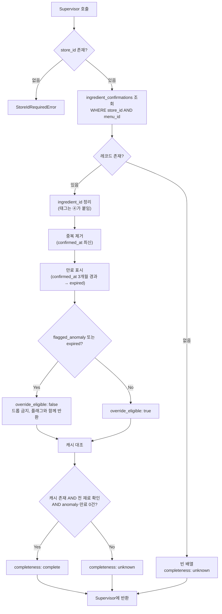

# ③ Exact Feedback Tool (재료 단위 확인 조회)

담당: 정유진 / 상위 문서: `caution-multi-agent-architecture.md`

---

## 0. 역할 범위

**③은 순수 조회기다. 판단하지 않는다.**

- 하는 것: `store_id + menu_id`로 `ingredient_confirmations` 조회 → 재료 단위 확인 맵 반환
- 하지 않는 것: 재료 태그(`constraint_tags`, 재료가 걸리는 제한 태그, 예: 돼지고기 → `is_pork`)는 붙이지 않는다. **태그는 ④가 모두 관리한다** (결정, 2026-10-10, ④ §2-7). ③은 확인값마다 `ingredient_id`만 정확히 돌려주고, ③만 거치는 경로에서는 Supervisor가 ④의 태그 조회(`lookup_tags`)를 불러 태그를 붙인다 (⓪ §2-11)
- 설계 원칙: **메뉴 단위 이분법 금지.** 부분 확인을 반드시 지원한다.

| 하지 않음 | 담당 |
|---|---|
| 재료 확장 / 변형 판정 | ④ |
| 전부·일부 판단 후 라우팅 | ⓪ Supervisor Agent |
| 사용자 알레르기 태그 매칭 | ⑧ Decision Policy / XAI Agent |
| 확률 계산 | ⑤ |
| DB 쓰기 | ⑦ |

### 0-1. 순서 문제와 해결

③은 ④보다 먼저 실행되므로 **그 메뉴의 전체 재료 목록(분모)을 모른다.** 따라서 "전부 확인됨"을 ③이 단독 판정할 수 없다.

→ **③은 보유한 확인 레코드만 반환한다.** 완전성은 `menu_ingredient_cache`(④가 과거 확장 결과를 저장한 테이블)가 있을 때만 `complete`로 표기하고, 없으면 `unknown`으로 반환해 Supervisor가 ④를 호출하게 한다.

---

## 1. 입력 / 출력 스펙

### 1-1. 입력 — `ExactFeedbackRequest` (Supervisor로부터)

입출력 JSON은 ⓪ §1(공통 모델)·§4-2를 기준으로 한다. 아래는 같은 내용을 옮긴 것이다.

```json
{
  "context": {
    "schema_version": "1.0",
    "trace_id": "0199a2f0-0000-7000-8000-000000000001",
    "scan_session_id": "scan-123",
    "store_id": 123456,
    "call_scope": "item",
    "item_id": "scan-123:0"
  },
  "menu": {
    "menu_id": "menu-001",
    "normalized_menu_name": "김치찌개"
  },
  "scope_hint": "exact",
  "warnings": [],
  "errors": []
}
```

| 필드 | 설명 |
|---|---|
| `context` | 요청 공통 정보 (⓪ §1-2 `NodeContext`). `context.store_id`는 양수 필수. 없거나 0 이하면 즉시 에러. 전역 조회 금지. ③은 `context`를 수정하지 않고 그대로 반환 |
| `menu.menu_id` | 조회 대상 메뉴. 변형/base 구분 없이 이 값 하나만 봄. `menu_id`가 없으면 Supervisor가 ③을 호출하지 않음 |
| `menu.normalized_menu_name` | 정규화된 메뉴명. ③ 조회에는 쓰지 않고 로그·추적용 |
| `scope_hint` | `exact \| inherited`. 반환 레코드에 붙일 라벨. ③은 이 값을 **해석하지 않고** `confirmation_scope`로 그대로 반환 |
| `warnings` / `errors` | 앞 단계에서 넘어온 신호. ③은 그대로 보존하고 자기 신호를 덧붙임 |

### 1-2. 출력 — `ExactFeedbackResponse` (Supervisor에게 반환)

```json
{
  "context": {
    "schema_version": "1.0",
    "trace_id": "0199a2f0-0000-7000-8000-000000000001",
    "scan_session_id": "scan-123",
    "store_id": 123456,
    "call_scope": "item",
    "item_id": "scan-123:0"
  },
  "menu_id": "menu-001",
  "confirmation_scope": "exact",
  "completeness": "unknown",
  "confirmations": [
    {
      "ingredient": {
        "ingredient_id": "ingredient-001",
        "canonical_name": "돼지고기"
      },
      "constraint_tags": ["is_pork"],
      "status": "present",
      "evidence": {
        "evidence_id": "evidence-001",
        "evidence_class": "hard",
        "source_type": "owner_feedback",
        "source_ref": "ingredient_confirmations:confirmation-001",
        "verification_status": "owner_confirmed",
        "reliability_weight": 1.0,
        "observed_at": "2026-09-01T00:00:00Z"
      },
      "flagged_anomaly": false,
      "override_eligible": true,
      "superseded": false,
      "expired": false
    }
  ],
  "warnings": [],
  "errors": []
}
```

| 필드 | 설명 |
|---|---|
| `context` | 입력 `context`를 그대로 반환 |
| `menu_id` | 조회한 메뉴 |
| `confirmation_scope` | 입력 `scope_hint` 값 그대로 (§1-5) |
| `completeness` | `complete \| unknown` (§2). ⓪에는 `partial`도 있으나 기준이 정해지지 않음 (§6) |
| `confirmations[].ingredient` | 재료 (⓪ §1-2 `IngredientRef`) |
| `confirmations[].constraint_tags` | ③은 항상 `[]`로 보낸다. Supervisor가 ④ 태그 조회 결과로 채운다 (§0) |
| `confirmations[].status` | `present \| absent \| unknown` (§1-3) |
| `confirmations[].evidence` | 근거 (⓪ §1-2 `EvidenceRef`). 사장님 답변은 `evidence_class: hard`, `source_type: owner_feedback`, `verification_status: owner_confirmed` (§1-4). `observed_at`은 DB `ingredient_confirmations.confirmed_at` 값 |
| `confirmations[].flagged_anomaly` | 통계적으로 이상한 답변 표시. ⑦이 저장할 때 붙인 값을 ③은 그대로 읽는다 (기준은 §1-6) |
| `confirmations[].override_eligible` | 이 확인값으로 판정을 덮어써도 되는지 (§1-6) |
| `confirmations[].superseded` | 같은 재료의 더 최신 기록이 있어 밀려난 기록인지. DB가 재료당 1건이면 필요 없어짐 (#167) |
| `confirmations[].expired` | 확인 후 3개월이 지났는지 (§1-7). **⓪ §4-2에는 아직 없음 — ⓪ 담당자에게 추가 요청** |
| `warnings` / `errors` | 입력 신호를 보존하고 ③의 신호를 덧붙임 |

### 1-3. `status` — 3값 필수 (2값 금지)

| 값 | 의미 |
|---|---|
| `present` | 들어있다고 확인됨 |
| `absent` | 없다고 확인됨 |
| `unknown` | 아직 확인 안 됨 (레코드 없음과 동일 취급) |

> ⚠️ `true/false` 2값으로 설계하면 **"없다고 확인됨"과 "아직 안 물어봄"이 구분되지 않는다.** 전자는 override 대상, 후자는 확률 계산 대상 — 정반대 처리다.

### 1-4. `evidence` — 근거 종류

| `evidence.source_type` | `evidence_class` | `verification_status` | 후속 처리 |
|---|---|---|---|
| `owner_feedback` | `hard` | `owner_confirmed` | override 후보 |

> 확인 기록은 **사장님 답변만** 다룬다. 사용자(관광객)가 직접 알려준 재료 정보(`user_hard`)는 수집 경로가 없어 제외했다 (2026-10-09). 제출 PPT 8쪽의 "사용자 피드백 우선 반영"은 사용자 화면에 띄운 확인 질문을 통해 받은 **사장님 답변**으로 해석한다 (`ppt-baseline.md` 7쪽 ③ 정의 "확정 근거(Hard Evidence) 조회", 8쪽 "사장님 확인 정보 → 기록").

### 1-5. `confirmation_scope`

| 값 | 의미 | Supervisor의 사용법 |
|---|---|---|
| `exact` | 이 menu_id에 직접 확인됨 | **override** — ⑤ 스킵 가능 (단 `override_eligible: true`일 때만) |
| `inherited` | base 메뉴에서 상속 | **prior로만** ⑤에 전달. **스킵 금지** |

### 1-6. `override_eligible` — anomaly 정책 반영 (확정)

**정책 확정**: FN-minimization 원칙에 따라, base rate와 명백히 모순되는 확인값은 override 대상에서 제외한다. (예: 돈까스에 `돼지고기: absent`)

**anomaly 판정 기준 (결정, 2026-10-06, #193 — ⑦ §2-3)**: 레시피상 그 재료가 들어갈 확률(⑤ `posterior_mean`)이 **0.9 이상**인데 사장님 답이 **"없음"(`absent`)**이면 `flagged_anomaly: true`다.

- **"있음"(`present`) 답변은 anomaly가 아니다.** "있음"을 믿는 쪽이 더 조심하는 방향이라 위험을 놓치지 않는다. "있음"에 표시를 붙이면 override가 거부돼 DANGER 근거가 CAUTION으로 내려간다.
- 표시를 붙이는 주체는 ⑦이다 (사장님 답변 저장 시). ③은 판정하지 않고 DB의 `flagged_anomaly`를 그대로 읽는다.
- DB 스키마의 예외 규칙(`flagged_anomaly: true` + `present: false`, `caution-db-schema.md` §6)과 같은 방향이다.

| 조건 | `override_eligible` | Supervisor 동작 |
|---|---|---|
| `flagged_anomaly: false` AND `expired: false` AND `scope: exact` | `true` | override 적용, ⑤ 스킵 가능 |
| `flagged_anomaly: true` | **`false`** | **override 거부 → 해당 재료를 ⑤로 전달**, ⑧에서 CAUTION 이상 강제 유지 |
| `expired: true` (§1-7) | **`false`** | override 거부 → 해당 재료를 ⑤로 전달 |
| `scope: inherited` | `false` | 항상 prior 보정용 |

> ⚠️ **anomaly 재료를 "무시"하면 안 된다.** 재료 자체가 리스트에서 사라지면 확률 계산도 안 되고 판정에서도 빠져 **FN이 발생한다.** 반드시 ⑤로 넘겨 확률을 계산하게 하고, 결과를 CAUTION 이상으로 유지한다.

### 1-7. 확인값 유효기간 — 3개월 (결정, 2026-10-06 회의)

사장님 확인값은 **확인 시점(`confirmed_at`)부터 3개월 동안만** 확정 정보로 쓴다. 메뉴 레시피는 바뀔 수 있으므로 오래된 확인값으로 계속 override하면 FN이 생길 수 있다.

| 조건 | `expired` | 처리 |
|---|---|---|
| `confirmed_at`이 3개월 이내 | `false` | 기존 규칙대로 (§1-6) |
| `confirmed_at`이 3개월 경과 | `true` | `override_eligible: false`. 확정 정보로 쓰지 않는다 |

- **만료 레코드도 드롭하지 않는다.** `expired: true`로 표기해 반환한다. 재료가 리스트에서 사라지면 FN이 생긴다 (§1-6과 같은 이유).
- 만료 판정은 ③이 조회 시점에 `confirmed_at`만 보고 한다. DB 레코드를 지우거나 바꾸지 않는다 (DB 쓰기는 ③ 범위 밖).
- 만료된 재료는 사장님에게 다시 확인받을 대상이다. 재질문 경로는 §6 미확정.

---

## 2. 처리 로직



### 2-1. 함수 시그니처

```python
def query_exact_confirmations(
    request: ExactFeedbackRequest,                  # context.store_id 필수·양수. None/0 이하 → StoreIdRequiredError
) -> ExactFeedbackResponse:
    """context.store_id + menu.menu_id 스코프의 재료 단위 확인 레코드를 조회해 그대로 반환.
    판단·확장·라우팅 없음."""


def check_completeness(
    confirmations: list[Confirmation],
    store_id: int,
    menu_id: str,
) -> Literal["complete", "unknown"]:
    """menu_ingredient_cache가 있고, 전 재료가 확인됐고, anomaly·만료가 0건일 때만 complete.
    캐시가 없으면 항상 unknown (④ 호출 유도)."""


def resolve_override_eligibility(c: Confirmation, scope: str) -> bool:
    """anomaly이거나, 만료(expired)됐거나, inherited 스코프면 False.
    False인 재료는 드롭하지 않고 ⑤로 전달한다."""
```

### 2-2. 의사코드

```
store_id = request.context.store_id
menu_id = request.menu.menu_id
scope_hint = request.scope_hint
warnings = list(request.warnings)                    # 입력 신호 보존

if store_id is None or store_id <= 0:
    raise StoreIdRequiredError

rows = db.query("ingredient_confirmations",
                store_id=store_id,          # 스코프 필수
                menu_id=menu_id)

confirmations = [to_confirmation(r) for r in rows]   # anomaly 포함, 드롭 금지

for c in confirmations:
    c.constraint_tags = []                           # 태그는 ④가 붙인다 (④ §2-7)

confirmations = dedupe_latest(confirmations)         # 중복 시 confirmed_at 최신 채택

for c in confirmations:                              # §1-7. 드롭하지 않고 표기만
    c.expired = c.confirmed_at < now() - months(3)

for c in confirmations:
    c.override_eligible = resolve_override_eligibility(c, scope_hint)

cached = db.get_menu_ingredient_cache(store_id, menu_id)
completeness = (
    "complete"
    if cached
       and all(c.status != "unknown" for c in cover(cached, confirmations))
       and all(not c.flagged_anomaly and not c.expired for c in confirmations)
    else "unknown"
)

return ExactFeedbackResponse(
    context             = request.context,          # 수정 없이 그대로
    menu_id             = menu_id,
    confirmation_scope  = scope_hint,
    completeness        = completeness,
    confirmations       = confirmations,            # evidence.observed_at = DB confirmed_at
    warnings            = warnings,
    errors              = list(request.errors),
)
```

> **`complete` 조건에 anomaly 0건이 포함되는 이유**: anomaly는 "확인은 됐지만 믿을 수 없는 확인"이다. 이를 `complete`로 처리하면 ④⑤가 스킵되고 모순된 값이 그대로 판정에 반영된다.

---

## 3. Supervisor와의 계약 (Contract)

**호출 시점**: ② Menu Normalization Agent 직후, ④보다 **먼저**. 가벼운 경로 조기 종료를 위해.

### 3-1. 호출 횟수: 최대 2회 — ③은 자신이 몇 번째 호출인지 모른다

| 회차 | 인자 | 시점 | 결과 사용 |
|---|---|---|---|
| 1차 | `menu_id`=대상 메뉴, `scope_hint="exact"` | ④ 이전 | `complete`면 ④⑤ 스킵하고 ⑧ 직행 |
| 2차 | `menu_id`=`base_menu_id`, `scope_hint="inherited"` | ④가 `base_menu_id`를 반환한 **이후** | ⑤에 **prior로만** 전달 |

> 2차 호출이 필요한 이유: `base_menu_id`는 ④가 DB 컬럼을 읽거나 longest-match로 판별한 결과다. ③에 변형 판정을 넣으면 순서 모순이 발생하므로, 상속은 **Supervisor의 재호출**로 처리한다.

### 3-2. 상속 범위: `base_menu_id` 단일 메뉴만 (확정)

형제 변형(해물된장찌개 등)은 상속 대상이 **아니다.**

- base(된장찌개)는 변형(차돌된장찌개)의 **부분집합**이므로 상속 근거가 성립한다.
- 형제(해물된장찌개)는 부분집합 관계가 아니다. 해물된장찌개의 `새우: present`가 차돌된장찌개로 넘어오면 오판이다.
- 형제 상속을 하려면 "공통 재료 vs 변형 고유 재료" 필터가 필요한데, 그것은 사실상 base를 다시 계산하는 것이다.

### 3-3. ③ → Supervisor 반환값별 후속 판단

| 반환 | Supervisor 동작 |
|---|---|
| `completeness: complete` | ④⑤ 스킵 → ⑧ 직행 |
| `confirmations` 일부 존재 | ④ 호출 시 `confirmed_ingredients`에 **`status != unknown` AND `override_eligible: true`** 인 재료만 전달 |
| `confirmations` 빈 배열 | ④ 호출 (`confirmed_ingredients=[]`) |
| `override_eligible: false` 포함 | 해당 재료를 override에서 제외하고 **⑤ 계산 대상에 포함** |
| `confirmation_scope: inherited` | **override 금지.** ⑤에 `inherited_confirmations`로 전달 |

**③이 직접 호출하지 않는 것**: 어떤 Agent·Tool도 호출하지 않는다. 조회 후 반환하고 종료.

---

## 4. 케이스별 관여 범위 / 예외

### 4-1. 원본 시나리오별 동작

| 케이스 | ③의 동작 | 반환 |
|---|---|---|
| **1) DB 존재 + 피드백 없음** | 조회 → 레코드 없음 | 빈 배열, `unknown` |
| **2) DB 존재 + 피드백 일부** | 해당 재료만 반환 | 부분 맵, `unknown` |
| **2-b) 피드백 전부 (anomaly 없음)** | 캐시 대조 후 완전 확인 | `complete` → ④⑤ 스킵 |
| **2-c) 피드백 전부 (anomaly 포함)** | 캐시 대조하되 `complete` 불가 | `unknown` → ④⑤ 정상 진행 |
| **3) 변형 메뉴** | 1차: 변형 menu_id / 2차: `base_menu_id` | `exact` + `inherited` 2건 |
| **4) DB에 없는 unknown 메뉴** | 메뉴 자체 없음 → 빈 배열 | `unknown`. 에러 아님 |
| **5) 웹서치까지 실패 (엣지)** | **관여 없음** | 4번에서 이미 종료 |

### 4-2. 예외 처리

| 상황 | 처리 |
|---|---|
| `context.store_id` 누락/null/0 이하 | `StoreIdRequiredError`. **전역 조회 fallback 금지** |
| `menu_id`가 DB에 없음 | 빈 배열 + `unknown` 반환. 예외 발생시키지 않음 |
| `flagged_anomaly: true` | **드롭 금지.** `override_eligible: false`로 표기해 반환 → ⑤ 계산 대상 |
| 동일 재료 중복 레코드 | `confirmed_at` 최신 1건 채택, 나머지 `superseded: true` |
| 확인 후 3개월 경과 | **드롭 금지.** `expired: true`, `override_eligible: false`로 반환 → ⑤ 계산 대상 (§1-7) |
| `menu_ingredient_cache` 없음 | `completeness: unknown` 강제 → ④ 호출 유도 |
| 2차 호출인데 `base_menu_id`가 null | Supervisor가 호출하지 않음. 도달 시 빈 배열 반환 |
| 캐시와 실제 재료 목록 불일치 | 캐시 무효로 간주 → `unknown` 반환 (안전 방향) |

---

## 5. 테스트 케이스

| # | 입력 | 기대 동작 | 검증 포인트 |
|---|---|---|---|
| 1 | 확인 레코드 0건 | 빈 배열 + `unknown` | 에러 발생하지 않을 것 |
| 2 | 5개 중 2개만 확인 | 2건 반환 + `unknown` | **메뉴 단위 이분법 없을 것** (부분 확인 지원) |
| 3 | `status: absent` 레코드 | `absent`로 반환 | `unknown`과 구분될 것 (3값 검증) |
| 4 | 차돌된장찌개 1차 호출 | 빈 배열 + `scope: exact` | base 정보를 ③이 스스로 끌어오지 않을 것 |
| 5 | 된장찌개 2차 호출 | `scope: inherited`, `override_eligible: false` | Supervisor가 override로 쓰지 않을 것 |
| 6 | `context.store_id` 누락 | 즉시 에러 | 전역 fallback 없을 것 |
| 7 | 돈까스 `돼지고기: absent` (anomaly) | `override_eligible: false` + 재료 유지 | **드롭도 자동채택도 하지 않을 것**, ⑤로 전달될 것 |
| 8 | 전 재료 확인 + anomaly 1건 | `completeness: unknown` | anomaly가 `complete`를 막을 것 |
| 9 | 캐시 존재 + 전 재료 확인 + anomaly 0 | `complete` | ④⑤ 스킵 경로 작동할 것 |
| 10 | 동일 재료 레코드 3건 | 최신 1건 + `superseded: true` 2건 | 중복 집계되지 않을 것 |
| 11 | 4개월 전 `돼지고기: absent` | `expired: true`, `override_eligible: false` + 재료 유지 | override되지 않고 ⑤로 전달될 것 |
| 12 | 캐시 존재 + 전 재료 확인 + 그중 1건 만료 | `completeness: unknown` | 만료값이 `complete`를 막을 것 |
| 13 | 돼지고기 `status: present` 확인값 | `ingredient_id` 정확히 반환, `constraint_tags: []` | 태그를 ③이 붙이지 않을 것. Supervisor가 ④ 태그 조회 후 ⑧이 `is_pork`로 대조할 것 (⓪ 테스트 12) |
| 15 | 김치찌개 `땅콩: present` + `flagged_anomaly: false` (레시피 확률 낮음) | `override_eligible: true` | "있음" 답변은 anomaly가 아니므로 override가 거부되지 않을 것 |

---

## 6. 미확정 항목 (팀 확인 대기)

- [x] **확인 정보 유효기간** — 3개월로 결정 (2026-10-06 회의, §1-7)
- [ ] **만료 후 처리 세부** — "3개월"을 날짜 기준으로 셀지 90일로 셀지, 만료된 재료를 사장님에게 다시 물어보는 경로(⑧ 사장님 카드 우선순위 등)
- [ ] **`menu_ingredient_cache` 무효화 시점** — 테이블과 컬럼은 `caution-db-schema.md` §6에 이미 정의됨 (`store_id`, `menu_id`, `ingredients_snapshot`, `computed_at`, UNIQUE `(store_id, menu_id)`). 캐시 저장 명령은 ④가 만든다 (파생 캐시라 ⑦ 승인 대상 아님, AGENTS.md 확정). 남은 것: ④ 재확장 시 갱신, 온톨로지 변경 시 전체 무효화, 사장님 확인값이 새로 들어왔을 때 무효화할지 (#169)
- [ ] **`completeness: partial` 기준** — ⓪ §4-2는 `complete | partial | unknown` 3값인데, ③은 `complete | unknown`만 정의함. 언제 `partial`이고 언제 `unknown`인지 ⓪ 담당자와 정해야 함
- [x] **anomaly 판정 기준** — 레시피 확률(⑤ `posterior_mean`) 0.9 이상 + "없음" 답변이면 anomaly. "있음"은 대상 아님 (2026-10-06, #193, ⑦ §2-3, §1-6)

## 7. 확정된 결정 (변경 금지)

- **anomaly 정책**: override 거부, CAUTION 이상 강제 유지 (FN-minimization 우선) — 팀 확정
- **anomaly 판정 기준**: 레시피 확률 0.9 이상 + "없음" 답변. "있음"은 anomaly 아님. 표시는 ⑦이 붙인다 (#193)
- **상속 범위**: `base_menu_id` 단일 메뉴만. 형제 변형 제외
- **`status` 3값**: `present` / `absent` / `unknown`
- **`menu_ingredient_cache`**: 생성하기로 확정
- **확인값 유효기간 3개월**: 만료되면 override 거부, 드롭 금지 (2026-10-06 회의)
