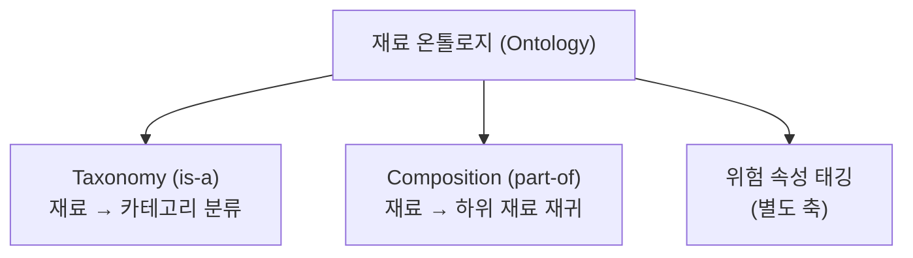
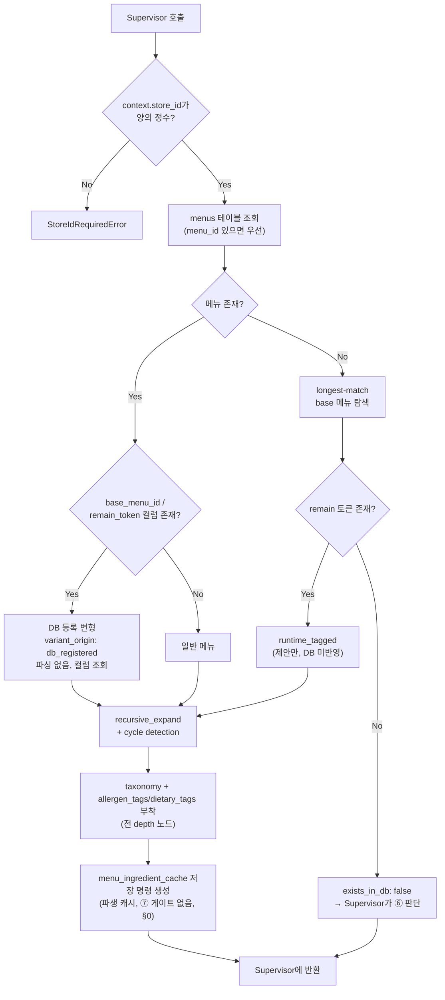
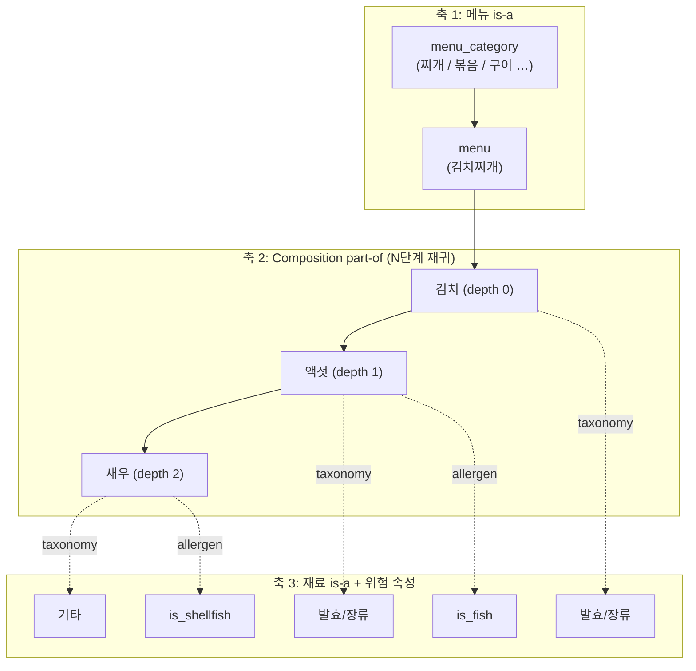

# ④ DB / Ontology Tool 스펙

담당: 윤지
상태: v3 (확정 결정은 §10, 미확정 항목은 §8 참조)
상위 문서: `caution-multi-agent-architecture.md`, `caution-db-schema.md`

---

## 0. 역할 범위

④는 메뉴·레시피·재료 계층과 알레르기·식이 제약 지식을 조회해, 복합 재료를 원재료 수준까지 확장하고 위험 속성을 연결하는 **지식 조회 Tool**이다. 예) 김치찌개 → 김치 → 액젓 → 새우.

한 번의 호출로 세 가지를 처리한다.

1. **레시피 조회** — 이 메뉴에 원래 무엇이 들어가는지
2. **재료 계층 확장** — 숨은 하위 재료를 재귀적으로 펼치기
3. **위험 속성 매핑 + 변형 태깅** — 재료마다 알레르기·식이 태그를 붙이고, 메뉴명의 변형 토큰(예: "차돌")을 재료로 제안

> **재료 태그는 ④만 관리한다** (결정, 2026-10-10). 태그 사전, 재료별 태그 조회, 웹 재료의 표준 재료 매핑을 모두 ④가 맡는다. ③·⑥은 태그를 붙이지 않고 `constraint_tags: []`로 보내며, Supervisor가 ④의 `lookup_tags` / `map_ingredients`로 채운다 (§2-7). 태그를 붙이는 곳이 여러 군데면 어휘나 기준이 갈라져 알레르겐을 놓친다.

| 하지 않음 | 담당 |
|---|---|
| 메뉴명 문자열 정제 | ② |
| 확정 재료 조회 | ③ |
| 도메인 DB 저장 명령 (`menus` / `recipe_ingredients` / `ingredient_evidence_log` INSERT) | ⑦ (관리자 컨펌 후). 물리 쓰기는 백엔드 |
| `ingredient_risk_scores` 갱신 | 누구도 직접 UPDATE하지 않음. 로그 INSERT 후 재계산 |
| 재료 존재 확률 계산 | ⑤ |
| DANGER / CAUTION / SAFE 판정 | ⑧ |
| 웹서치 호출 여부 결정 | ⓪ Supervisor Agent |
| 조리 중 교차오염 추정 | 모델 범위 외 (§0-4) |

> **예외 — `menu_ingredient_cache` 쓰기는 ④가 수행한다.** (AGENTS.md 확정)
> 이 테이블은 ④의 확장 결과를 그대로 저장한 **파생 캐시**이며 도메인 데이터가 아니다. 언제든 재계산 가능하고 관리자 컨펌 대상이 아니므로 ⑦의 승인 흐름을 타지 않는다. "④가 수행한다"는 ⑦을 거치지 않고 ④가 저장 명령을 직접 만든다는 뜻이며, 물리 DB 쓰기와 트랜잭션은 AGENTS.md "물리 DB 쓰기는 백엔드만 수행한다"에 따라 백엔드 영속화 계층이 맡는다. 온톨로지나 레시피가 바뀌면 `menus.knowledge_revision`이 올라가고, 리비전이 다른 캐시는 쓰지 않는다 (§2-1).

### 0-1. 설계 원칙

- **가게 스코프를 지킨다.** 모든 호출은 공통 호출 문맥의 `store_id`를 필수로 받고, 없으면 즉시 실패한다. 전역 조회로 대신하지 않는다.
- **재료를 버리지 않는다.** 미등록 재료, 매핑 실패 토큰, anomaly 재료 모두 결과에 남긴다. 재료 누락은 곧 FN이다.
- **변형 판별은 DB 컬럼이 먼저다.** 문자열 파싱은 DB에 메뉴가 없을 때만 한다.
- **관측 불가능한 위험은 추정하지 않는다.** 교차오염은 확률 모델 범위 밖이며 사장님 질문 경로로 넘긴다.
- **위험 태그는 하나의 어휘를 쓴다.** `ingredient_tags.tag_code`와 ⑧이 쓰는 `is_*` 값을 그대로 쓴다.
- **판단·호출하지 않는다.** ④는 조회 결과를 반환할 뿐, 다음 노드를 직접 부르거나 판정하지 않는다.
- **외부 경계는 Pydantic 모델로 검증한다** (⓪ §1-3).

### 0-2. 기준 문서 대응

[`ppt-baseline.md`](ppt-baseline.md) 7쪽의 ④ 정의와 이 문서의 대응 위치다. 이 표의 항목이 빠지면 이 문서가 틀린 것이다.

| PPT 7쪽 표현 | 이 문서 |
|---|---|
| 메뉴·레시피 조회 (`레시피 조회`) | §2-1 기본 조회 |
| 복합 재료를 원재료 수준까지 확장, 예) 김치→액젓→새우 (`재료 계층 확장`) | §3-2 Composition, §2-1 재귀 확장 |
| 알레르기·식이 제약 지식을 조회해 위험 속성을 연결 (`위험 속성 매핑`) | §3-3 위험 속성 축, §2-3 태깅 |

PPT 8쪽 "3 숨은 재료·변형 확장"(복합 재료 재귀 확장 후 메뉴명에서 변형 재료 태깅)은 §2-2가 담당한다.

### 0-3. 용어 정의 (Ontology vs Taxonomy)

이 문서에서 두 용어는 **다른 것**을 가리킨다. 혼용 금지.

| 용어 | 관계 | 질문 | 예시 | 구현 필드 |
|---|---|---|---|---|
| **Taxonomy** | `is-a` | "이건 무슨 종류인가?" | 액젓 **is-a** 발효/장류 | `taxonomy` |
| **Ontology** | taxonomy + `part-of` 등 | "이건 무엇으로 이루어지는가?" | 김치찌개 **has** 김치 **has** 액젓 | `hidden` + `taxonomy` |

- **Taxonomy는 Ontology의 부분집합이다.** Taxonomy는 계층 분류 트리 하나뿐이고, 여기에 `part-of` 같은 다른 관계가 추가되면 Ontology가 된다.
- `hidden_rules.py`는 두 관계를 모두 담고 있으므로 **재료 온톨로지(ingredient ontology)** 가 정확한 명칭이다.
  - 7개 카테고리 분류 부분만 지칭할 때 → "taxonomy 분류"
  - 재귀 확장 부분을 지칭할 때 → "composition(part-of) 기반 재귀 확장"



### 0-4. 모델 범위 선언 (Scope)

> 본 모델은 **레시피 구성 기반 재료 추론**만을 범위로 한다.
> 조리 과정의 교차오염(공유 기름·도마·불판) 및 제조 공정 오염(가공식품 설비 공유)은 **가게 단위로 관측 불가능**하므로 모델 범위에서 제외한다.
> 해당 위험은 확률 모델이 아닌 **사장님 질문 생성 경로(⑧ Decision Policy / XAI Agent)** 로 위임한다.

**근거**: FN-minimization이 주요 지표이지만, 관측 불가능한 변수를 확률 모델에 강제로 포함하면 근거 없는 추정치가 들어가 노이즈가 증가하고 판정 신뢰도(calibration)가 오히려 저하된다. 관측 불가능한 위험은 **확률로 추정하는 대신 직접 질의**하는 경로로 처리하는 것이 정확도와 설명가능성 모두에서 우위다.

---

## 1. 입력 / 출력 스펙

### 1-1. 입력 (Supervisor로부터, 메뉴 단위)

| 필드 | 타입 | 필수 | 설명 |
|---|---|---|---|
| `context` | object | **필수** | ⓪ §1-3 공통 호출 문맥. `schema_version`, `trace_id`, `scan_session_id`, `store_id`, `item_id`. `store_id`는 양의 정수만 허용하며 없으면 즉시 에러. 전역 조회 금지 |
| `normalized_menu_name` | string | 필수 | ② Menu Normalization Agent 출력. ④는 재정규화하지 않음 |
| `menu_id` | string \| null | 선택 | ②가 표준 카탈로그에서 찾은 값. 있으면 이름 조회보다 **우선** 사용한다. ③과 ④가 같은 메뉴를 보도록 하기 위함 |
| `match_candidates` | object[] | 선택 | ② `normalization_status: ambiguous`일 때의 후보 목록 (`menu_id`, `name_ko`, `score`, `match_type`) |
| `residual_tokens` | string[] | 선택 | ②가 보존한 재료 의미 토큰 (`치즈`, `차돌` 등). 변형 재료 태깅의 입력 |
| `unconfirmed_only` | bool | 필수 | 미확인 재료만 처리할지 |
| `confirmed_ingredients` | `{name, status}`[] | 선택 | ③ 출력 중 `status != unknown` **AND** `override_eligible: true` 인 재료만. `status`는 `present` / `absent` (§2-1) |
| `anomaly_locked_ingredients` | string[] | 선택 | ③이 `override_eligible: false`로 반환한 anomaly 재료. Supervisor가 채운다 |

```json
{
  "context": {
    "schema_version": "1.0",
    "trace_id": "0199...",
    "scan_session_id": "scan-123",
    "store_id": 123456,
    "item_id": "scan-123:0"
  },
  "normalized_menu_name": "김치찌개",
  "menu_id": "menu-id-or-null",
  "match_candidates": [],
  "residual_tokens": [],
  "unconfirmed_only": true,
  "confirmed_ingredients": [{"name": "돼지고기", "status": "present"}],
  "anomaly_locked_ingredients": []
}
```

> ⚠️ `override_eligible: false`인 재료(anomaly)는 `confirmed_ingredients`에 **포함되지 않는다.** 확장 대상에 남아 ⑤로 넘어가야 CAUTION 판정이 가능하다.
> Supervisor는 이런 재료를 `anomaly_locked_ingredients`에 담아 전달한다. `anomaly_locked` 값을 부여하는 주체는 Supervisor이며, ④는 이 값을 가공하거나 재판단하지 않고 **그대로 보존**해서 출력의 해당 재료 노드에 `anomaly_locked: true`로 실어 반환한다 (§1-2). 이 값이 ④에서 끊기면 ⑤/⑧까지 전달이 안 돼 CAUTION 강제가 무력화된다.
>
> `menu_id` / `match_candidates` / `residual_tokens`는 ② 문서 §1-2가 정의한 출력이다. 필드명 확정은 ② §8 승인 대기 항목이므로, 이 문서도 같은 이름을 쓰되 확정 전까지 미확정으로 둔다 (§8).

### 1-2. 출력 (Supervisor에게 반환)

```json
{
  "context": {
    "schema_version": "1.0",
    "trace_id": "0199...",
    "scan_session_id": "scan-123",
    "store_id": 123456,
    "item_id": "scan-123:0"
  },
  "menu_id": 101,
  "base_menu_id": null,
  "remain_token": null,
  "menu_category_id": 19,
  "menu_category": "찌개",
  "exists_in_db": true,
  "is_variant": true,
  "variant_origin": "db_registered",
  "menu_ambiguity_flags": ["has_unclear_jeotgal", "has_unclear_seasoning"],
  "ingredients": [
    {
      "ingredient_id": 212,
      "canonical_name": "멸치액젓",
      "taxonomy_category": "발효/장류",
      "allergen_tags": ["is_fish"],
      "dietary_tags": [],
      "depth": 1,
      "parent_ingredient_id": 87,
      "ambiguity_flag": "has_unclear_jeotgal",
      "source": "expanded",
      "curated": false,
      "observation_basis": "inherited",
      "observations": [
        {"corpus": "10000recipe", "k_count": 41, "n_total": 57},
        {"corpus": "wtable", "k_count": 12, "n_total": 30}
      ],
      "anomaly_locked": false
    }
  ],
  "variant_suggestion": null,
  "unmapped_token": null,
  "warnings": []
}
```

- `context`는 입력 값을 수정하지 않고 그대로 반환한다 (⓪ §4).
- 메뉴·재료 ID는 DB와 같은 정수(BIGINT)다 (백엔드 ERD V7, 2026-10-10). 재료는 `ingredient_id`와 `canonical_name`(`ingredients.name_ko`)을 함께 보낸다.
- `curated`는 그 재료가 큐레이션 레시피(`recipe_ingredients`)에 있는지다. ⑤가 출처 `curated` 근거로 쓴다 (⑤ §3-3).
- `observations`는 출처(크롤링 사이트)별 관측값이다 (§1-5). `observation_basis`는 그 값이 이 재료를 직접 센 것(`direct`)인지, 상위 재료에서 물려받은 것(`inherited`)인지, 관측이 없는 것(`none`)인지다.
- `menu_ambiguity_flags`는 메뉴의 애매함 플래그(`menus.ambiguity_flags`, 5종)를 그대로 보낸다. 재료의 `ambiguity_flag`는 그 재료를 펼친 구성 간선의 플래그(`ingredient_compositions.ambiguity_flag`, 4종)다. 예) 김치 → 멸치액젓 간선의 `has_unclear_jeotgal`. 지금 룰엔진은 이 플래그가 사용자 금지 태그와 관련 있으면 CAUTION으로 판정하고 사장님 질문 근거로 쓴다. ④가 빠뜨리면 이 신호가 끊긴다 (§8, ⑧ 반영 요청).
- `warnings`는 판정에 영향을 주는 데이터 이상을 담는다. 값: `empty_recipe`(레시피 재료 0개), `cycle_detected`(순환 참조 차단), `max_depth_reached`, `broken_base_menu`(참조 메뉴 없음). ⑧이 CAUTION 이상을 유지하려면 이 신호가 ⑧까지 가야 한다 (§8).
- `variant_suggestion`은 `variant_origin: runtime_tagged`일 때만 채운다. 형태는 ⑦ DB Update Tool의 "변형 태깅 제안" 입력(⑦ §1-1)과 같다.

```json
{
  "base_menu_id": "str",
  "remain_token": "차돌",
  "suggested_ingredients": ["소고기"]
}
```

### 1-3. `variant_origin` — 변형의 출처 (⑤ 신뢰도 차등의 핵심)

| 값 | 의미 | 재료 `source` | ⑤ scale |
|---|---|---|---|
| `db_registered` | `menus`에 `base_menu_id` / `remain_token` 컬럼으로 **이미 등록된 변형**. 관리자 컨펌 완료 | `recipe` | **1.0** |
| `runtime_tagged` | DB에 없어 런타임 longest-match로 **추정한 신규 변형** | `variant_suggested` | **0.5** |
| `null` | 변형 아님 | — | — |

> ⚠️ 두 경우를 같게 취급하면 안 된다. `db_registered`는 사람이 컨펌한 확정 데이터이므로 신뢰도를 낮추지 않는다. 신뢰도 하향은 `runtime_tagged`에만 적용한다.

### 1-4. `source` 필드 (⑤가 prior를 차등 적용하는 근거)

| 값 | 의미 | ⑤에서의 취급 |
|---|---|---|
| `recipe` | 메뉴의 직접 재료(depth 0). 큐레이션 레시피(`recipe_ingredients`) 또는 크롤링 코퍼스(`menu_ingredient_priors`)에 나온 재료 (**DB 등록 변형 재료 포함**). 어느 쪽에서 왔는지는 `curated`로 구분 | 확정 prior, scale 1.0 |
| `expanded` | 재귀 확장으로 도출된 하위 재료 | depth 감쇠 적용 (§8) |
| `variant_suggested` | 런타임 태깅 제안 (DB 미반영) | **scale 0.5** |

### 1-5. `k_count` / `n_total` 제공 책임

⑤의 Beta-Binomial 계산(`α = k_count + 1`, `β = (n_total − k_count) + 1`)에 필요한 관측값은 **④가 재료별로 함께 반환한다.** 크롤링 데이터는 사이트(코퍼스)별로 따로 저장되므로(`menu_recipe_corpora`, `menu_ingredient_priors`), 관측값도 **출처별 목록 `observations`** 로 보낸다 (결정, 2026-10-10). ⑤가 출처마다 신뢰도를 곱해야 하기 때문이다 (⑤ §3-3).

- `corpus`: 크롤링 사이트 (`semie` / `wtable` / `10000recipe`)
- `k_count`: 그 사이트의 해당 메뉴 레시피 중 그 재료가 등장한 횟수
- `n_total`: 그 사이트의 해당 메뉴 전체 레시피 수
- **직접 재료(depth 0)는** 메뉴가 있는 사이트에서 한 번도 안 나왔으면 `k_count=0`, `n_total=그 사이트 레시피 수`로 채운다. `menu_ingredient_priors`에는 k가 1 이상인 행만 있으므로, 행이 없다는 건 "n개 중 0개"라는 관측이다. `observation_basis: direct`
- **확장된 하위 재료(depth ≥ 1)는 k=0으로 채우지 않는다** (결정, 2026-10-10). 레시피 작성자는 숨은 재료를 적지 않는다. 김치찌개 레시피에 "새우"가 안 적혔다고 새우가 없는 게 아니라, 김치 안의 새우젓으로 들어 있는 것이다. k=0으로 채우면 숨은 재료 확률이 거의 0(예: 57개 중 0개 → 약 0.017)으로 나와, 변형 재료와 같은 FN이 생긴다.
  - 사이트마다 `k_count = max(그 재료를 직접 센 수, 상위 재료의 k_count)`, `n_total`은 그 사이트 레시피 수로 둔다. 상위 재료가 있으면 숨은 재료도 있을 수 있으므로 상위 재료보다 낮게 보지 않는다.
  - 직접 센 수가 상위보다 크면 `observation_basis: direct`, 아니면 `inherited`다.
  - 깊이에 따른 감쇠는 ⑤가 `depth`로 적용한다 (⑤ §8, 미확정). ④는 관측값만 물려준다.
- 메뉴가 어느 사이트에도 없으면 `observations: []` → ⑤가 낮은 `confidence`로 처리
- **`variant_suggested` 재료는 항상 `observations: []`이다.** base 메뉴 레시피는 변형 재료(예: 차돌된장찌개의 소고기)를 관측한 데이터가 아니다. base 메뉴의 `n_total`을 그대로 쓰면 "57개 레시피 중 0번 등장"으로 계산돼 확률이 0에 가까워지고, 메뉴명에 드러난 재료가 SAFE 쪽으로 기우는 FN이 생긴다.

---

## 2. 처리 로직



### 2-1. 기본 조회 + 재귀 확장

1. `context.store_id` 검증 → 없으면 즉시 에러 (전역 prior 오염 방지)
2. `menus` 조회. 입력에 `menu_id`가 있으면 그 행을 쓰고, 없을 때만 `normalized_menu_name` → `menu_aliases` 순서로 찾는다 (`menus`는 store 무관 전역 테이블)
3. **시작 재료(depth 0)는 큐레이션 레시피(`recipe_ingredients`)와 크롤링 코퍼스(`menu_ingredient_priors`)에 나온 재료의 합집합이다** (결정, 2026-10-10). 큐레이션 목록에만 기대면 크롤링에 자주 나오는 재료가 빠져 FN이 생긴다. 반대로 크롤링에만 기대면 사람이 정리한 대표 재료가 빠질 수 있다
4. `ingredient_compositions`로 `part-of` 재귀 확장, cycle detection 적용. **확인 여부와 무관하게 전체를 먼저 확장한다**
5. 전 노드에 `depth`, `parent_ingredient_id`, `ambiguity_flag`, `observations` 기록. 하위 재료의 관측값은 상위 재료에서 물려받는다 (§1-5)
6. 전체 확장 결과로 `menu_ingredient_cache` 저장 명령을 만든다. 캐시는 `menu_revision`이 `menus.knowledge_revision`과 같을 때만 유효하다. 메뉴의 레시피·온톨로지가 바뀌면 리비전이 올라가 캐시가 자동 무효화된다. ③은 이 캐시를 메뉴의 전체 재료 목록(분모)으로 쓰므로(③ §0-1), 미확인 재료만 담은 부분 목록을 저장하면 안 된다. `anomaly_locked`는 요청마다 Supervisor가 붙이는 값이라 캐시에 넣지 않는다
7. `unconfirmed_only: true`이면 반환 목록에서 확인 재료를 뺀다. 규칙은 아래와 같다

| 확인 상태 | 그 재료 자체 | 그 재료의 하위 재료 |
|---|---|---|
| `present` (있다고 확인) | 반환하지 않음 (override 대상) | **계속 반환한다.** 하위 재료는 아무도 확인하지 않았기 때문이다. 예) 김치 `present`여도 액젓·새우는 미확인 |
| `absent` (없다고 확인) | 반환하지 않음 | 그 재료를 거쳐 온 경로는 반환하지 않는다. 다른 부모를 통해 오는 같은 재료는 반환한다 |

> ⚠️ 확인된 복합 재료의 하위 재료까지 빼면, 김치는 확인됐지만 새우 알레르기는 어디서도 계산되지 않는 FN이 생긴다.

### 2-2. 변형 처리 — **DB 조회 우선, 파싱은 fallback**

**(A) DB에 등록된 변형 (`db_registered`)**

- `menus` 테이블에 `base_menu_id`, `remain_token`이 **컬럼으로 이미 존재한다.**
  (예: `name_ko="차돌된장찌개"`, `base_menu_id`→된장찌개, `remain_token="차돌"`)
- 이 두 컬럼은 AGENTS.md "변형 판별은 DB 컬럼(`base_menu_id` / `remain_token`) 우선"으로 확정된 사항이다. 백엔드 ERD(V7)의 `menus`에 두 컬럼이 모두 있다.
- **문자열 파싱을 수행하지 않는다.** 컬럼을 그대로 읽는다.
- 이 변형의 재료는 관리자 컨펌을 거쳤으므로 `source: recipe` — **신뢰도 하향 대상이 아니다.**

**(B) DB에 없는 신규 변형 (`runtime_tagged`)**

- 메뉴가 `menus`에 없을 때**만** longest-match 실행 → base / remain 분리
- remain을 재료로 매핑 → `variant_suggested` 태깅. ②가 `residual_tokens`를 넘겼으면 그 토큰도 매핑 대상에 포함한다
- `variant_suggested` 재료는 `k_count=0, n_total=0`으로 반환한다 (§1-5)
- **DB에 쓰지 않는다.** ⑤가 메모리에서 즉시 사용
- DB 반영 시엔 원본 row 재사용 금지. `base_menu_id`로 원본을 참조하는 **새 `menus` 행**(`source: variant_generated`) 생성 → 원본 메뉴 확률과 섞이지 않도록. 이 INSERT는 **⑦이 관리자 컨펌 후** 저장 명령을 만들고 백엔드가 수행

### 2-3. 카테고리·위험 속성 태깅

- 확장된 **전 노드**에 taxonomy 카테고리 매핑 (depth 무관)
- 위험 속성 재료에 `allergen_tags` / `dietary_tags` 부착 (`is_*` 어휘, §3-3)
- 재료의 태그 = **노드 태그**(`ingredient_tags`) ∪ **경로 태그**(`ingredient_composition_tags`). 경로 태그는 그 상위 → 하위 경로에서만 성립하는 위험이다. 예) 김치 → 액젓 경로의 `is_shellfish`
- 태그 어휘는 22종이다. 식약처 알레르기 19종(`is_egg` … `is_sulfite`)에 `is_fish`, `is_duck`, `is_alcohol`을 더한다. 원본 키워드 사전은 `ai_ruleengine/constants.py`의 `VARIANT_INGREDIENTS`이고, DB 시드의 `ingredient_tags`도 이 사전으로 만든다 (#223)

### 2-4. 함수 시그니처

```python
def query_ontology(
    context: RequestContext,                # 필수. context.store_id None/0 이하 → StoreIdRequiredError
    normalized_menu_name: str,
    menu_id: str | None = None,             # ② 카탈로그 매칭값. 있으면 우선
    match_candidates: list[MatchCandidate] | None = None,
    residual_tokens: list[str] | None = None,
    unconfirmed_only: bool = True,
    confirmed_ingredients: list[ConfirmedIngredient] | None = None,   # {name, status}
    anomaly_locked_ingredients: list[str] | None = None,  # Supervisor가 부여, ④는 보존만
) -> OntologyResult:
    """④ 진입점. DB 조회 → 변형 판별 → 재귀 확장 → 태깅 → 캐시 저장 명령 생성."""


def resolve_variant(menu_row: MenuRow | None, menu_name: str) -> VariantInfo:
    """변형 판별. DB 컬럼(base_menu_id / remain_token) 우선.
    menu_row가 None일 때만 longest-match fallback."""


def recursive_expand(
    ingredient: str,
    depth: int = 0,
    visited: set[str] | None = None,         # cycle detection
    max_depth: int = 5,                      # 결정 §8. 넘으면 멈추고 max_depth_reached 경고
) -> list[IngredientNode]:
    """part-of 관계 재귀 확장. visited로 순환 차단."""


def attach_taxonomy(nodes: list[IngredientNode]) -> list[IngredientNode]:
    """전 depth 노드에 taxonomy_category + allergen_tags + dietary_tags 부착.
    미등록 재료는 '기타' 부여. 드롭 금지."""


def update_ingredient_cache(
    store_id: int, menu_id: str, nodes: list[IngredientNode]
) -> CacheWriteCommand:
    """menu_ingredient_cache 저장 명령 생성. ④가 담당하며 ⑦ 승인 흐름을 타지 않는다.
    물리 쓰기는 다른 테이블과 같이 백엔드 영속화 계층이 수행한다 (§0)."""
```

### 2-5. 의사코드

```
store_id = context.store_id
if store_id is None or store_id <= 0:
    raise StoreIdRequiredError

menu  = db.get_menu(menu_id) if menu_id else db.find_menu(normalized_menu_name)   # menus는 전역
extra = []

if menu is not None:
    if menu.base_menu_id is not None:          # (A) DB 등록 변형
        variant_origin = "db_registered"       # 파싱 없음, 컬럼 조회
    else:
        variant_origin = None
else:                                          # (B) 신규 변형 추정
    v = longest_match(normalized_menu_name, residual_tokens)
    if v is None:
        return OntologyResult(context=context, exists_in_db=False)
    menu, extra    = v.base_menu, v.suggested_ingredients   # extra: k_count=0, n_total=0
    variant_origin = "runtime_tagged"          # source = variant_suggested

seeds = db.get_recipe_ingredients(menu.id) | db.get_corpus_ingredients(menu.id)   # 합집합 (§2-1)

full = []
for s in seeds + extra:
    full += recursive_expand(s, depth=0, visited=set())             # 확인 여부와 무관하게 전체 확장

full = attach_taxonomy(full)
update_ingredient_cache(store_id, menu.id, full)                     # ③ 분모용: 전체 목록 저장 명령

confirmed = {c.name: c.status for c in (confirmed_ingredients or [])}
nodes = full
if unconfirmed_only:
    nodes = [n for n in full
             if n.name not in confirmed                              # 확인 재료 자체는 제외
             and not has_absent_ancestor(n, confirmed)]              # absent 재료를 거친 경로만 제외
    # present 재료의 하위 재료는 남는다 (§2-1 표)

for n in nodes:
    n.anomaly_locked = n.name in (anomaly_locked_ingredients or [])   # 받은 값 보존만

return OntologyResult(context=context, ingredients=nodes, variant_origin=variant_origin,
                      warnings=collect_warnings(...), ...)
```

### 2-6. 태그 사전과 단독 관리 원칙

- 태그 사전 원본: `ai_ruleengine/constants.py`의 `VARIANT_INGREDIENTS` (22종 `is_*`, 키워드 부분일치, 긴 키워드 우선). DB의 `ingredient_tags`는 이 사전으로 만든다 (#223).
- 사전을 바꾸면 DB 시드의 `ingredient_tags`도 다시 만들어야 한다. 사전과 DB가 다르면 룰엔진 판정과 ⑧ 판정이 갈린다.
- 다른 노드는 태그를 만들거나 고치지 않는다. ⑤·⑧은 받은 `constraint_tags`를 그대로 쓴다.
- **사전을 고친 뒤의 절차**: ① `constants.py` 또는 정규화 규칙 수정 → ② 사이트별 prior와 DB 시드 CSV 재생성(`crawling/README.md` "DB 시드 재생성") → ③ 백엔드가 `knowledge_import_batches`에 새 커밋 SHA로 적재 → ④ 영향받은 메뉴의 `knowledge_revision`을 올려 캐시 무효화. ①과 ③ 사이가 벌어지면 룰엔진과 DB의 태그가 달라지므로, 사전 변경 PR에는 재적재 요청을 함께 적는다.

### 2-7. 태그 조회와 재료 매핑 (다른 경로용 진입점)

메뉴 전체 확장(`query_ontology`) 말고도, 태그가 필요한 다른 경로를 위해 ④가 두 가지 진입점을 제공한다.

| 진입점 | 언제 부르나 | 입력 | 출력 |
|---|---|---|---|
| `lookup_tags` | ③만 거치는 경로 (사장님 확정값이 모두 있어 ④⑤를 건너뛸 때) | `ingredient_id` 목록 | 재료별 `constraint_tags` |
| `map_ingredients` | ⑥ 웹 재료 후보를 ⑤로 보내기 전 | 재료명 목록 | 재료별 `ingredient_id`, `canonical_name`, `constraint_tags` |

```python
def lookup_tags(context: RequestContext, ingredient_ids: list[int]) -> TagLookupResult:
    """ingredient_tags에서 태그 조회. 태그 행이 없는 재료는 정상([])이다.
    재료 마스터(ingredients)에 없는 ID나 조회 오류만 빈 배열로 끝내지 않고
    constraint_tags_lookup_failed warning(forces_caution=True)을 붙인다."""


def map_ingredients(context: RequestContext, names: list[str]) -> MappingResult:
    """재료명 → crawling/normalize_ingredients.py 규칙으로 표준 재료명(canonical) → ingredient_id → 태그.
    DB 비교는 DB 함수 normalize_food_name()으로 한다. ingredients.name_normalized가
    그 함수로 만들어진 생성 컬럼이라, Python 쪽 문자열을 그대로 비교하면 표기가 어긋날 수 있다.
    매핑 실패 재료는 버리지 않고 ingredient_id: null로 남기며
    unmapped_constraint_tags warning(forces_caution=True)을 붙인다."""
```

```sql
-- lookup_tags
SELECT ingredient_id, array_agg(tag_code) AS constraint_tags
FROM ingredient_tags
WHERE ingredient_id = ANY(:ingredient_ids)
GROUP BY ingredient_id;

-- map_ingredients (Python 규칙으로 구한 표준 재료명 → DB 정규화 → 재료 → 태그)
-- :canonical_names = normalize_ingredients.py로 구한 표준 재료명 목록
SELECT i.id, i.name_ko,
       COALESCE(array_agg(t.tag_code) FILTER (WHERE t.tag_code IS NOT NULL), '{}') AS constraint_tags
FROM ingredients i
LEFT JOIN ingredient_tags t ON t.ingredient_id = i.id
WHERE i.name_normalized IN (SELECT normalize_food_name(x) FROM unnest(:canonical_names::text[]) AS x)
GROUP BY i.id, i.name_ko
UNION ALL
SELECT i.id, i.name_ko,
       COALESCE(array_agg(t.tag_code) FILTER (WHERE t.tag_code IS NOT NULL), '{}')
FROM ingredient_aliases a
JOIN ingredients i ON i.id = a.ingredient_id
LEFT JOIN ingredient_tags t ON t.ingredient_id = i.id
WHERE a.alias_normalized IN (SELECT normalize_food_name(x) FROM unnest(:canonical_names::text[]) AS x)
GROUP BY i.id, i.name_ko;
```

- 태그가 비어 있는 재료(`[]`)는 "걸리는 제한 없음"과 "조회 실패"를 구분해야 한다. 재료 마스터에 있는데 태그 행이 없는 건 정상(예: 양파)이고, 재료 자체를 못 찾은 건 실패다. 실패만 warning을 붙인다.

### 2-8. DB 조회 쿼리

백엔드 ERD(V7~V10) 기준 PostgreSQL 예시다. `:menu_id`처럼 `:`가 붙은 값은 파라미터다. ④는 읽기만 하며, 캐시 쓰기만 예외다 (§0).

**메뉴 찾기**

```sql
-- menu_id가 있으면
SELECT id, name_ko, category_id, base_menu_id, remain_token, ambiguity_flags, knowledge_revision
FROM menus WHERE id = :menu_id;

-- 없으면 이름 → 별칭 순서
SELECT m.id, m.name_ko, m.category_id, m.base_menu_id, m.remain_token, m.ambiguity_flags, m.knowledge_revision
FROM menus m WHERE m.name_normalized = normalize_food_name(:menu_name)
UNION ALL
SELECT m.id, m.name_ko, m.category_id, m.base_menu_id, m.remain_token, m.ambiguity_flags, m.knowledge_revision
FROM menu_aliases a JOIN menus m ON m.id = a.menu_id
WHERE a.alias_normalized = normalize_food_name(:menu_name)
LIMIT 1;
```

**캐시 확인** (리비전이 같을 때만 유효)

```sql
SELECT c.ingredients_snapshot
FROM menu_ingredient_cache c JOIN menus m ON m.id = c.menu_id
WHERE c.store_id = :store_id AND c.menu_id = :menu_id
  AND c.menu_revision = m.knowledge_revision;
```

**시작 재료** (큐레이션 ∪ 크롤링)

```sql
SELECT ingredient_id, true AS curated FROM recipe_ingredients WHERE menu_id = :menu_id
UNION
SELECT DISTINCT ingredient_id, false FROM menu_ingredient_priors WHERE menu_id = :menu_id;
-- 같은 재료가 두 쪽에 다 있으면 curated = true로 합친다
```

**재귀 확장과 태그** (순환 차단, 깊이 제한)

```sql
WITH RECURSIVE tree AS (
  SELECT s.ingredient_id, NULL::bigint AS parent_id, 0 AS depth,
         ARRAY[s.ingredient_id] AS path, NULL::varchar AS ambiguity_flag
  FROM unnest(:seed_ids::bigint[]) AS s(ingredient_id)
  UNION ALL
  SELECT c.child_ingredient_id, c.parent_ingredient_id, t.depth + 1,
         t.path || c.child_ingredient_id, c.ambiguity_flag
  FROM ingredient_compositions c
  JOIN tree t ON c.parent_ingredient_id = t.ingredient_id
  WHERE c.relation_type = 'part_of'
    AND c.child_ingredient_id <> ALL(t.path)          -- 순환 차단
    AND t.depth < :max_depth                          -- 5 (§8). 닿은 노드는 max_depth_reached 경고
)
SELECT t.ingredient_id, i.name_ko, i.taxonomy_category, t.parent_id, t.depth, t.ambiguity_flag,
       COALESCE(array_agg(DISTINCT nt.tag_code) FILTER (WHERE nt.tag_code IS NOT NULL), '{}') AS node_tags,
       COALESCE(array_agg(DISTINCT pt.tag_code) FILTER (WHERE pt.tag_code IS NOT NULL), '{}') AS path_tags
FROM tree t
JOIN ingredients i ON i.id = t.ingredient_id
LEFT JOIN ingredient_tags nt ON nt.ingredient_id = t.ingredient_id
LEFT JOIN ingredient_composition_tags pt
       ON pt.parent_ingredient_id = t.parent_id AND pt.child_ingredient_id = t.ingredient_id
GROUP BY t.ingredient_id, i.name_ko, i.taxonomy_category, t.parent_id, t.depth, t.ambiguity_flag;
```

**출처별 관측값** (§1-5) — 아래 결과는 직접 재료(depth 0)에 그대로 쓴다. 하위 재료는 이 값과 상위 재료의 값 중 큰 쪽을 쓴다

```sql
SELECT c.corpus, ids.ingredient_id, c.n_total, COALESCE(p.k_count, 0) AS k_count
FROM menu_recipe_corpora c
CROSS JOIN unnest(:ingredient_ids::bigint[]) AS ids(ingredient_id)
LEFT JOIN menu_ingredient_priors p
       ON p.menu_id = c.menu_id AND p.corpus = c.corpus AND p.ingredient_id = ids.ingredient_id
WHERE c.menu_id = :menu_id;
```

**캐시 저장 명령** (④가 만들고 백엔드가 실행)

```sql
INSERT INTO menu_ingredient_cache (store_id, menu_id, menu_revision, ingredients_snapshot)
VALUES (:store_id, :menu_id, :menu_revision, :snapshot)
ON CONFLICT (store_id, menu_id)
DO UPDATE SET menu_revision = EXCLUDED.menu_revision,
              ingredients_snapshot = EXCLUDED.ingredients_snapshot,
              computed_at = now(), updated_at = now();
```

---

## 3. 재료 온톨로지 3축 구조

④가 다루는 데이터는 **선형 계층이 아니라 3개의 독립 축**이다.



### 3-1. 축 1 — 메뉴 taxonomy (`menu_category`)

- 찌개 / 볶음 / 구이 / 탕 / 면 등 조리법 기반 상위 분류.
- `menus.csv` 76개 항목은 **다중 카테고리로 구성됨** (확인 완료).
- **용도**: ⑤ Bayesian이 store prior 부재 시 **동일 `menu_category` 클러스터 prior로 fallback** 하는 근거. 이 축이 유효하므로 `store → cluster → global → uninformative` 4단계 fallback이 성립한다 (⑤ §1-3).

### 3-2. 축 2 — Composition (`part-of`, 재귀)

- **depth를 고정하지 않는다.** 김치찌개 → 김치 → 액젓 → 새우처럼 깊이가 가변이다.
- 각 노드에 `depth` 값을 기록한다. depth 0(직접 재료)과 depth 3(3단계 하위)을 동일 확률로 취급하면 안 되기 때문 (⑤ 감쇠, §8).
- 순환 참조 탐지(cycle detection)는 재귀 조회에서 지나온 경로를 들고 다니며 이미 지난 재료를 다시 방문하지 않는 방식이다 (§2-8 쿼리). 데이터 원본은 `ai_result/rules/hidden_rules_data.py`이며 DB 시드에서 `ingredient_compositions`로 옮겼다 (#223).

### 3-3. 축 3 — 재료 taxonomy + 위험 속성 (독립 축)

- taxonomy 카테고리는 **재귀의 모든 노드에 붙는다.** depth 0이든 depth 3이든 전부 카테고리를 가진다. 축 2와 독립이기 때문.
- **알레르겐은 taxonomy 카테고리가 아니라 별개 축이다.** 밀가루/새우/땅콩은 재료(ingredient)이지 카테고리가 아니다. taxonomy에 끼워넣으면 분류 체계가 무너진다 → `allergen_tags` 배열로 분리.
- **식이 제약 속성도 같은 방식으로 붙인다.** PPT 7쪽은 ④가 "알레르기·식이 제약 지식"을 연결한다고 정의한다. 돼지고기·소고기·주류처럼 알레르기는 아니지만 종교·채식 제약에 걸리는 속성은 `dietary_tags` 배열에 담는다.
- **태그 값은 `is_*` 어휘 하나로 통일한다.** `ingredient_tags.tag_code`(백엔드 ERD V7), 재료 온톨로지 데이터(`ai_result/rules/hidden_rules_data.py`), ⑧의 `forbidden_tags`가 모두 `is_pork`, `is_fish` 같은 값을 쓴다. ④가 다른 이름(예: "어패류")을 쓰면 ⑧에서 대조가 실패해 FN이 된다.
- `allergen_tags`와 `dietary_tags`로 어느 태그를 나눌지의 상세 목록은 미확정이다 (§8). ⑧은 두 배열의 합집합을 사용자 금지 태그와 대조한다.

---

## 4. Taxonomy 카테고리

재료에 붙이는 taxonomy 카테고리는 아래 7개다.

| 카테고리 | 비고 |
|---|---|
| 발효/장류 | |
| 소스 | |
| 육수 | |
| 양념 | |
| 고명/견과 | |
| 유지류 | |
| 기타 | 어느 카테고리에도 맞지 않는 재료 |

2026-10-06 기준 재료 온톨로지 데이터(`ai_result/rules/hidden_rules_data.py`)에는 카테고리 값이 없다. 재료별 카테고리 값을 채우는 작업이 필요하다 (§8).

---

## 5. Supervisor와의 계약

**호출 조건**: ③이 `completeness: complete`를 반환하지 **않은** 경우, 또는 `menu_id`가 없어 ③을 건너뛴 경우에 Supervisor가 호출한다 (⓪ §2).

### 5-1. Supervisor → ④ (받는 것)

| 필드 | 보장 사항 |
|---|---|
| `context` | 유효한 공통 호출 문맥. `store_id`는 가게 식별 완료된 양의 정수, **null 불가** |
| `normalized_menu_name` | ② Menu Normalization Agent 완료값. ④는 재정규화하지 않음 |
| `confirmed_ingredients` | ③ 출력 중 `status != unknown` AND `override_eligible: true` 인 재료만. `status`(`present`/`absent`)를 함께 전달 |
| `anomaly_locked_ingredients` | ③ 출력 중 `override_eligible: false`인 anomaly 재료. 누락 금지 |
| `menu_id` / `match_candidates` / `residual_tokens` | ② 출력을 그대로 전달. 없으면 생략 가능 |

### 5-2. ④ → Supervisor (돌려주는 것)

| 필드 | Supervisor의 후속 판단 |
|---|---|
| `exists_in_db: false` | → ⑥ Web Search Agent 호출 |
| `exists_in_db: true` | → ⑤ Bayesian 호출 |
| `base_menu_id != null` | → **③을 2차 호출** (`scope_hint="inherited"`) |
| `variant_origin: runtime_tagged` | → ⑤에 즉시 전달 **+** `variant_suggestion`을 ⑦에 관리자 검토 자료로 전달 |
| `variant_origin: db_registered` | → ⑤에만 전달. ⑦ 검토 불필요 (이미 컨펌됨) |
| `ingredients[].source` | → ⑤가 prior 신뢰도(scale)를 차등 적용 |
| `ingredients[].observations` | → ⑤의 Beta-Binomial 관측값 (출처별) |
| `ingredients[].curated` | → ⑤가 출처 `curated` 근거로 사용 |
| `menu_ambiguity_flags`, `ingredients[].ambiguity_flag` | → ⑧이 사용자 금지 태그와 관련 있으면 CAUTION 유지, 사장님 질문 근거로 사용 |
| `warnings` | → ⑧까지 전달해 CAUTION 이상 유지 판단에 사용 (§1-2) |

**④가 직접 호출하지 않는 것**: 어떤 Agent·Tool도 직접 호출하지 않는다. 웹서치 여부, DB 반영, 판정은 모두 Supervisor가 결정한다.

### 5-3. 케이스별 관여 범위

| 케이스 | ④의 동작 | 반환 |
|---|---|---|
| **1) DB 존재 + 피드백 없음** | 전체 재귀 확장 | `exists_in_db: true`, `source: recipe/expanded` |
| **2) DB 존재 + 피드백 일부** | 전체 확장 후 확인 재료를 반환에서 제외. `present` 재료의 하위 재료는 남김 (§2-1) | 부분 리스트. 캐시는 전체 목록 |
| **2-b) 피드백 전부 (anomaly 없음)** | **호출되지 않음** | — |
| **2-c) 피드백 전부 (anomaly 포함)** | 정상 호출됨. anomaly 재료 포함 확장 | ⑤로 전달되어 CAUTION 확보 |
| **3-a) DB 등록 변형 (차돌된장찌개)** | 컬럼 조회 → `db_registered` | `base_menu_id`/`remain_token`, `source: recipe` |
| **3-b) 신규 변형 (DB 없음)** | longest-match → `runtime_tagged` | `variant_suggestion` 채움, **DB INSERT 없음** |
| **4) DB에 없는 unknown 메뉴** | 조회 실패 확인까지만 | `exists_in_db: false`. ⑥은 ④가 호출하지 않음 |
| **5) 웹서치도 실패 (엣지)** | **관여 없음** | 4번에서 이미 종료 |

---

## 6. 예외 처리

| 상황 | 처리 |
|---|---|
| `context.store_id` 누락/null/0 이하 | `StoreIdRequiredError`. **전역 조회 fallback 금지** |
| 순환 참조 (A→B→A) | `visited`로 차단, 경고 로그, 확장분까지 반환. `warnings`에 `cycle_detected`. Supervisor는 이를 보고 ⓪ §6대로 해당 재료를 낮은 신뢰도로 다룬다 |
| 재귀 깊이 과다 | `max_depth` = 5에서 확장을 멈추고 `warnings`에 `max_depth_reached`를 붙인다. ⑧은 이 경고가 있으면 CAUTION 이상을 유지한다. 그 아래 재료를 몰라서 SAFE로 새는 것을 막기 위함 |
| `base_menu_id`는 있으나 참조 메뉴가 없음 | 일반 메뉴로 처리 + 무결성 오류 로그. `base_menu_id: null` 반환, `warnings`에 `broken_base_menu` |
| longest-match 성공, remain 매핑 실패 (`"우리집된장찌개"`) | base로 처리, remain 무시, `unmapped_token`에 기록 |
| taxonomy 미등록 재료 | `기타` 부여. **드롭 금지** — 재료 누락은 FN 직결 |
| `recipe_ingredients` 빈 배열 | `exists_in_db: true`지만 재료 0개 → `warnings`에 `empty_recipe`. ⑧에서 CAUTION 이상 유지 |
| 메뉴가 어느 크롤링 사이트에도 없음 | `observations: []`. ⑤가 낮은 `confidence`로 처리 |

오류는 ⓪ §6-1 공통 오류 모델(`code`, `node`, `item_id`, `retryable`, `fallback`)로 Supervisor에 반환한다.

---

## 7. 테스트 케이스

| # | 입력 | 기대 동작 | 검증 포인트 |
|---|---|---|---|
| 1 | `김치찌개` (DB 존재) | 김치(d0) → 액젓(d1) → 새우(d2) | depth 기록, 전 노드 taxonomy, 새우 `is_shellfish` 태그 |
| 2 | `차돌된장찌개` (DB 등록 변형) | 컬럼 조회 → `db_registered` | **longest-match 실행되지 않을 것**, `source: recipe` |
| 3 | `트러플된장찌개` (DB 없음) | longest-match → `runtime_tagged` | **DB INSERT 없을 것**, `source: variant_suggested` |
| 4 | `듣도보도못한메뉴` | `exists_in_db: false` | ④가 웹서치를 직접 호출하지 않을 것 |
| 5 | `context.store_id` 누락 | 즉시 에러 | 전역 fallback 없을 것 |
| 6 | 순환 참조 재료 | cycle detection 작동 | 무한루프 없을 것 |
| 7 | ③에서 일부 확인됨 | 확인 재료는 반환에서 제외 | 확인 재료가 다시 계산 대상이 되지 않을 것 |
| 7-b | `김치: present` 확인 | 김치는 제외, 액젓·새우는 반환 | **확인된 복합 재료의 하위 재료가 빠지지 않을 것** |
| 7-c | `김치: absent` 확인 | 김치를 거친 액젓·새우는 제외 | 다른 부모를 통해 오는 같은 재료는 남을 것 |
| 7-d | 일부 확인 상태에서 호출 | 캐시 저장 명령에 전체 목록 | ③의 분모가 부분 목록이 되지 않을 것 |
| 8 | ③에서 anomaly 재료 포함 | anomaly 재료도 확장 대상 | **확장에서 빠지지 않을 것** |
| 9 | `우리집된장찌개` | base 처리 + remain 매핑 실패 | `unmapped_token` 기록, 에러 없을 것 |
| 10 | taxonomy 미등록 재료 | `기타` 부여 | 재료 드롭되지 않을 것 |
| 11 | `base_menu_id` 참조 깨짐 | 일반 메뉴 처리 + 로그 | 크래시 없을 것 |
| 12 | 갈비구이-마늘 | `observations`에 사이트별 `k_count`, `n_total` 반환 | ⑤가 사이트별로 α, β를 산출할 수 있을 것 |
| 12-b | 사이트에 메뉴는 있는데 재료가 안 나옴 | 그 사이트 `k_count=0`, `n_total=레시피 수` | 행이 없다고 관측값을 빠뜨리지 않을 것 |
| 12-c | 큐레이션 목록엔 없고 크롤링에만 나온 재료 | 시작 재료에 포함, `curated: false` | 합집합에서 빠지지 않을 것 |
| 13 | 돼지고기 포함 메뉴 | `dietary_tags`에 `is_pork` | ⑧ `forbidden_tags`와 같은 어휘일 것 |
| 14 | `트러플된장찌개`의 변형 재료 | `observations: []` | base 메뉴 레시피 수로 계산되지 않을 것 |
| 21 | 김치찌개의 숨은 재료 새우 (레시피에 직접 안 적힘) | 새우 `k_count`가 상위 재료(김치)의 k 이상, `observation_basis: inherited` | 숨은 재료가 k=0으로 채워져 확률이 0 가까이 떨어지지 않을 것 |
| 22 | 김치찌개 메뉴 (`has_unclear_jeotgal`) | `menu_ambiguity_flags`와 액젓의 `ambiguity_flag`가 출력에 있음 | 애매함 플래그가 ④에서 끊기지 않을 것 |
| 19 | 김치 → 액젓 경로 | 액젓에 경로 태그 `is_shellfish` 포함 | 노드 태그만 보고 경로 태그를 빠뜨리지 않을 것 |
| 20 | 메뉴 레시피 변경 후 호출 | 리비전이 다른 캐시는 쓰지 않음 | 옛 캐시로 재료가 빠지지 않을 것 |
| 15 | `menu_id` 입력 + 다른 이름 | `menu_id` 행 사용 | ③과 ④가 같은 메뉴를 볼 것 |
| 16 | `anomaly_locked_ingredients=["돼지고기"]` | 해당 노드 `anomaly_locked: true` | 값이 ④에서 끊기지 않을 것 |
| 17 | 정상 호출 | 출력 `context`가 입력과 동일 | `store_id`·`item_id`를 수정하지 않을 것 |
| 18 | 레시피 재료 0개 메뉴 | `warnings: ["empty_recipe"]` | 경고가 출력에 실릴 것 |

---

## 8. 미확정 항목 (팀 확인 대기)

- [ ] **재료별 taxonomy 카테고리 값 작성** — 현재 온톨로지 데이터에 카테고리 값이 없음 (§4)
- [ ] **depth 감쇠 함수** — 감쇠 여부 및 형태(선형/지수/없음). ⑤ §8과 연동 결정
- [x] **`max_depth` 상한값** — 5단계 (2026-10-10). 현재 숨은 재료 데이터의 최대 깊이는 2라 여유를 둔 값이다. 닿으면 확장을 멈추고 `max_depth_reached` 경고를 붙여 CAUTION 이상을 유지한다. 깊이 4 이상 경로가 생기면 다시 본다
- [x] **`menu_category` 전체 목록** — `ai_ruleengine/data/menus.csv`의 25개 분류를 `menu_categories`로 시드했다 (2026-10-10, #223)
- [x] **`menu_ingredient_cache` 무효화 시점** — `menus.knowledge_revision`과 캐시의 `menu_revision`이 다르면 무효 (2026-10-10, 백엔드 ERD V10)
- [x] **시작 재료 범위** — 큐레이션 레시피와 크롤링 코퍼스 재료의 합집합 (2026-10-10, §2-1)
- [x] **관측값 형식** — 출처별 `observations` 목록 (2026-10-10, §1-5)
- [x] **분류 관계(is-a) 저장 위치** — `ingredients.taxonomy_category` 컬럼에 둔다 (2026-10-10, #49와 같은 결정). `ingredient_compositions`는 구성 관계(`part_of`)만 담는다. 분류를 구성 간선에 섞으면 재귀 확장이 "갑각류" 같은 분류 이름을 재료처럼 펼친다. 백엔드에 `relation_type`을 `part_of`로 한정해 달라고 요청한다
- [ ] **⑥ Web Search Agent 출력 필드 정합 (외부 의존)** — ⑥ 결과가 ⑤로 갈 때 `source: web_search`, `depth: 0`, `k_count`/`n_total` 필드를 채워야 함. 레시피 수 계산 방식은 단체 논의 #201 (#171, #122)
- [ ] **② 출력 필드 수용** — `menu_id` / `match_candidates` / `residual_tokens`를 ④ 입력으로 받는 안. ② §8 "`residual_tokens`로 통일하는 안을 ④ 담당자와 승인" 항목과 같은 결정
- [ ] **`allergen_tags` / `dietary_tags` 분류 목록** — `is_*` 태그 중 어느 것을 알레르겐, 어느 것을 식이 제약으로 둘지. ⑧ 담당자와 함께 확정
- [x] **재료 공통 식별자** — 출력은 정수 `ingredient_id` + `canonical_name` (2026-10-10, 백엔드 ERD 기준). ⓪ §4 공통 계약(#103)도 같이 고쳐야 함
- [x] **`variant_suggested` 재료의 관측값 규칙** — `observations: []` (2026-10-10, §1-5, ⑤ 담당 확인)
- [x] **cycle detection 구현** — 별도 파일 대신 재귀 조회에서 경로를 들고 다니며 차단한다 (§2-8)
- [x] **`menus.remain_token` 컬럼** — 백엔드 ERD V7에 반영됨. `caution-db-schema.md`는 v4 갱신 때 맞춘다 (#47)
- [x] **확인된 복합 재료의 하위 재료 처리** — §2-1 표대로 간다. `present`면 하위 재료를 남기고 `absent`면 그 경로를 뺀다 (2026-10-06, #181)
- [ ] **`confirmed_ingredients` 형태 (외부 의존)** — 재료명 배열에서 `{name, status}` 배열로 바뀌었다. ⓪ §4-3에서 같은 형태로 전달해야 함
- [x] **확장된 하위 재료의 관측값** — k=0으로 채우지 않고 상위 재료 관측값을 물려받는다. 사이트별 `max(직접, 상위)` (2026-10-10, §1-5)
- [x] **애매함 플래그 전달** — `menu_ambiguity_flags`와 재료별 `ambiguity_flag`를 출력에 넣는다 (2026-10-10, §1-2)
- [ ] **애매함 플래그 사용 (외부 의존)** — ⑧ 입력에 플래그를 받고, 사용자 금지 태그와 관련 있으면 CAUTION 유지·사장님 질문 근거로 쓰는 규칙 추가 요청. 지금 룰엔진 `risk_judge._relevant_ambiguity_flags`와 같은 동작. ⓪ §4 계약에도 필드 추가 필요
- [ ] **재료 단위 변경의 캐시 무효화 (외부 의존)** — 구성 간선·재료 태그는 여러 메뉴에 걸친다. 바뀌면 그 재료가 들어간 메뉴의 `knowledge_revision`을 백엔드가 올려야 한다. 메뉴별로 올릴지, 전역 지식 리비전 하나를 둘지 백엔드와 정한다
- [ ] **taxonomy 7종의 코드 값** — §4는 한글 이름만 있고 ERD `taxonomy_category`는 코드(VARCHAR(20))다. 코드 값(예: `fermented`, `sauce`, `broth`, `seasoning`, `garnish_nut`, `oil`, `etc`)과 재료 324개 분류를 #182에서 정한다. 비어 있으면 ④는 "기타"로 두고 재료는 버리지 않는다
- [ ] **`warnings` 전달 (외부 의존)** — ⓪ §4-7 ⑧ 입력 형식에 `warnings`를 넣는 안. ⓪·⑧ 담당자 확인 필요
- [ ] **캐시 내용 정의 (외부 의존)** — `caution-db-schema.md` §6은 캐시에 "④ 출력의 `ingredients[]`(`anomaly_locked` 포함)"를 저장한다고 적는다. ③이 분모로 쓰려면 확인 재료를 빼기 전 전체 확장 목록이어야 하고, `anomaly_locked`는 요청 단위 값이라 제외해야 한다 (§2-1). 스키마 문서 수정 필요

---

## 9. 구현 계획 (GitHub Backlog / Iteration)

아래 항목은 2026-10-06에 GitHub 이슈로 등록했다. 제목 옆 번호가 이슈 번호이고, 문서 작업은 #70, 구현 작업은 #58의 하위 이슈다. **진행 상황과 결정 내용은 이슈에서 관리한다.** 아래 본문은 등록 당시 초안이다.

### Iteration 1 — 문서와 계약 확정 (10/13까지)

#### `[DOCS] ④ DB / Ontology - 입출력 계약과 위험 속성 어휘 확정` (#181)

**작업 내용**

②·⓪·⑤·⑧과 주고받는 필드 이름과, 재료에 붙이는 위험 태그 어휘를 다른 문서와 일치시킨다.

**배경**

필드 이름이나 태그 이름이 문서마다 다르면 연결 단계에서 위험 재료 정보가 끊긴다. 이대로면 ⑧이 ④가 붙인 알레르기 태그를 알아보지 못해 위험 메뉴가 SAFE로 판정될 수 있다.

**세부 작업**

- [ ] ② 출력 필드(`menu_id`, `match_candidates`, `residual_tokens`) 수용 여부를 ② 담당자와 확정
- [ ] `allergen_tags` / `dietary_tags` 분류 목록을 ⑧ 담당자와 확정
- [ ] 재료 공통 식별자(`ingredient_id` + `canonical_name`) 적용 여부를 #103과 함께 확정
- [ ] 변형 재료 관측치 0 규칙을 ⑤와 함께 확정
- [ ] 확인된 복합 재료의 하위 재료 처리 규칙 확정, `confirmed_ingredients` 형태를 ⓪과 맞추기
- [ ] `warnings`를 ⑧까지 전달하는 안을 ⓪·⑧ 담당자와 확정
- [ ] 스키마 문서에 `remain_token` 컬럼 추가와 캐시 내용 정의 수정 요청

**관련 서비스**

- [ ] ai_ocr
- [x] ai_result
- [x] ai_ruleengine
- [ ] ai_web_search_agent
- [x] crawling
- [ ] 공통 (app.py, README, 인프라)

**참고**

- 상위 이슈 #70, 공통 계약 #103
- `docs/ppt-baseline.md` 7쪽, `docs/0-agent-supervisor.md` §1-3

#### `[DOCS] ④ DB / Ontology - 온톨로지 데이터 범위 확정` (#182)

**작업 내용**

재귀 확장과 카테고리 분류에 필요한 데이터 범위와 한계값을 정한다.

**배경**

재료 카테고리, 재귀 깊이 제한, 캐시 무효화 시점이 정해지지 않으면 같은 메뉴가 실행마다 다른 재료 목록을 낼 수 있다.

**세부 작업**

- [ ] 재료별 taxonomy 카테고리 값 작성
- [ ] `menu_category` 76개 매핑 목록 작성
- [x] `max_depth` 상한 결정 (5)
- [ ] depth 감쇠 방식 결정 (⑤와 함께)
- [ ] `menu_ingredient_cache` 무효화 시점 결정
- [ ] `recursive_expand.py` 위치 확인 또는 신규 구현 결정

**관련 서비스**

- [ ] ai_ocr
- [x] ai_result
- [x] ai_ruleengine
- [ ] ai_web_search_agent
- [x] crawling
- [ ] 공통 (app.py, README, 인프라)

**참고**

- 상위 이슈 #70
- `ai_result/rules/hidden_rules_data.py`, `ai_ruleengine/data/menus.csv`

### Iteration 2 — 핵심 구현

#### `[FEAT] ④ DB / Ontology - 입출력 모델과 메뉴 조회·변형 판별 구현` (#183)

**작업 내용**

공통 호출 문맥을 포함한 입출력 Pydantic 모델을 만들고, 메뉴 조회와 변형 판별을 구현한다.

**배경**

DB 컬럼 우선 판별과 longest-match fallback의 경계가 코드로 고정돼야 변형 메뉴 재료가 원본 메뉴와 섞이지 않는다.

**세부 작업**

- [ ] 입력·출력 모델과 `context.store_id` 검증 구현
- [ ] `menu_id` 우선, 이름 조회 fallback 구현
- [ ] `db_registered` 컬럼 조회 구현
- [ ] `runtime_tagged` longest-match와 `residual_tokens` 매핑 구현
- [ ] 변형 재료 `k_count=0, n_total=0` 반환
- [ ] DB 접근을 저장소 인터페이스와 테스트용 가짜 저장소로 분리

**관련 서비스**

- [ ] ai_ocr
- [ ] ai_result
- [x] ai_ruleengine
- [ ] ai_web_search_agent
- [ ] crawling
- [ ] 공통 (app.py, README, 인프라)

**참고**

- 상위 이슈 #58
- `ai_ruleengine/menu_matcher.py`

#### `[FEAT] ④ DB / Ontology - 재귀 확장과 위험 속성 태깅 구현` (#184)

**작업 내용**

`part-of` 재귀 확장, cycle detection, taxonomy·위험 속성 태깅을 구현한다.

**배경**

숨은 재료가 한 단계라도 빠지면 그 재료의 알레르기 위험을 놓친다. 김치찌개 → 김치 → 액젓 → 새우까지 끊기지 않아야 한다.

**세부 작업**

- [ ] 가변 depth 재귀 확장과 `visited` 순환 차단 구현
- [ ] 전 노드 `depth`·`parent`·`k_count`·`n_total` 기록
- [ ] taxonomy 카테고리와 `기타` fallback 구현
- [ ] `allergen_tags` / `dietary_tags` `is_*` 태깅 구현
- [ ] anomaly 재료 `anomaly_locked` 보존 구현
- [ ] 확인 재료 제외 규칙 구현 (`present` 하위 재료 유지, `absent` 경로 제외)
- [ ] 캐시에는 전체 확장 목록 저장, `warnings` 수집 구현

**관련 서비스**

- [ ] ai_ocr
- [x] ai_result
- [x] ai_ruleengine
- [ ] ai_web_search_agent
- [ ] crawling
- [ ] 공통 (app.py, README, 인프라)

**참고**

- 상위 이슈 #58
- `ai_result/rules/hidden_rules.py`, `ai_ruleengine/ingredient_tagger.py`

### Iteration 3 — 연동

#### `[FEAT] ④ DB / Ontology - 관측치 제공·캐시 명령과 Supervisor 연결` (#185)

**작업 내용**

크롤링 prior 데이터에서 재료별 관측치를 제공하고, 캐시 저장 명령을 만들고, Supervisor adapter에 연결한다.

**배경**

⑤는 ④가 넘긴 관측치로만 확률을 계산한다. 관측치가 빠지면 모든 재료가 무정보 0.5로 계산된다.

**세부 작업**

- [ ] 크롤링 prior CSV에서 `k_count` / `n_total` 조회 구현
- [ ] `menu_ingredient_cache` 저장 명령 생성 구현
- [ ] Supervisor adapter 연결과 `context` 그대로 반환
- [ ] ⑤ 입력 형식과의 연결 테스트

**관련 서비스**

- [ ] ai_ocr
- [x] ai_result
- [x] ai_ruleengine
- [ ] ai_web_search_agent
- [x] crawling
- [x] 공통 (app.py, README, 인프라)

**참고**

- 상위 이슈 #58, Supervisor 연동 #154
- `crawling/normalize_ingredients.py`

### Iteration 4 — QA

#### `[CHORE] ④ DB / Ontology - 시나리오 QA 및 회귀 검증` (#186)

**작업 내용**

§7 테스트 케이스와 케이스별 관여 범위(§5-3)를 끝까지 검증한다.

**배경**

재료 누락은 FN으로 직결되므로, 확장·태깅·anomaly 보존이 모든 경로에서 유지되는지 확인해야 한다.

**세부 작업**

- [ ] §7 테스트 케이스 전체 통과
- [ ] 다섯 케이스(DB 존재, 부분 확인, 변형, unknown, 웹 실패) 경로 검증
- [ ] 위험 태그가 ⑧까지 같은 어휘로 도달하는지 검증
- [ ] 순환 참조·깊이 과다 입력에서 무한 루프가 없는지 검증

**관련 서비스**

- [ ] ai_ocr
- [x] ai_result
- [x] ai_ruleengine
- [ ] ai_web_search_agent
- [x] crawling
- [ ] 공통 (app.py, README, 인프라)

**참고**

- 상위 이슈 #58
- 북극성 지표: FN 최소화, F2 기준

---

## 10. 확정된 결정 (변경 금지)

- **교차오염 카테고리 제외**: 관측 불가능하므로 모델 범위 외. 사장님 질문 경로로 위임
- **변형 판별**: DB 컬럼(`base_menu_id` / `remain_token`) 우선, 파싱은 DB 부재 시에만
- **`db_registered` vs `runtime_tagged`**: 전자는 scale 1.0, 후자만 0.5
- **알레르겐**: taxonomy가 아닌 별도 축(`allergen_tags`)
- **캐시 쓰기**: ④가 수행 (파생 캐시, ⑦ 승인 대상 아님)
