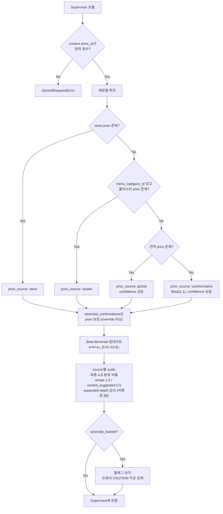

# ⑤ Bayesian Tool 스펙

담당: 윤지
상태: v3 (공식 확정으로 구현 착수 가능. 확정 결정은 §10, 미확정 항목은 §8 참조)
상위 문서: `caution-multi-agent-architecture.md`, `caution-db-schema.md`

---

## 0. 역할 범위

⑤는 확정되지 않은 재료에 대해 사전확률(prior)과 수집된 근거를 결합해, **해당 가게에서 그 재료가 실제로 들어갈 확률**을 Beta-Binomial로 추정하는 **확률 계산 Tool**이다. 입력 재료는 ④가 확장한 목록(또는 ⑥ 웹 후보)이다.

| 하지 않음 | 담당 |
|---|---|
| DANGER / CAUTION / SAFE 판정 | ⑧ Decision Policy / XAI Agent |
| threshold(F2 컷오프) 결정 | ⑧ (보관 주체는 §8 미확정) |
| 사용자 알레르기 태그 매칭 | ⑧ |
| 재료 확장 | ④ |
| `ingredient_risk_scores` 갱신 | **누구도 직접 UPDATE하지 않음.** ⑦이 `ingredient_evidence_log` INSERT 명령을 만들고, 백엔드가 저장한 뒤 애플리케이션 로직이 α/β를 재계산 |

### 0-1. 설계 원칙

- **가게 스코프 prior만 쓴다.** `store_id`로 분리된 prior를 먼저 쓰고, 전역 prior는 최후의 수단이다.
- **가게 증거로 전역 prior를 갱신하지 않는다** (결정, 2026-10-10 회의). 전역 prior는 크롤링 코퍼스(`menu_recipe_corpora`, `menu_ingredient_priors`)와 큐레이션 레시피(`recipe_ingredients`)로만 만든다. 사장님 답변·승인된 웹 근거 같은 가게 증거는 그 가게의 `ingredient_risk_scores`에만 쌓이고, 배치로 모아 전역 prior에 다시 넣지도 않는다. 한 가게의 레시피가 다른 가게 확률을 바꾸면 가게 스코프 원칙이 깨지기 때문이다. 개발 실험의 전역 prior 배치 재학습(`regenerate_global_prior_offline`)은 구현하지 않는다.
- **예외는 출처 신뢰도다.** `source_reliability`는 prior가 아니라 "어느 출처가 믿을 만한가"라서 여러 가게의 사장님 확정값으로 함께 배운다 (⑦ §3-1). 신뢰도는 근거에 곱하는 가중치일 뿐, 다른 가게의 재료 정보가 이 가게 확률에 들어가지 않는다.
- **불확실은 낮은 확률이 아니다.** 근거가 약하면 확률 평균을 낮추지 않고 분포를 넓힌다 (§2-1). 평균을 낮추면 SAFE 쪽으로 기우는 FN이 생긴다.
- **근거가 없으면 무정보로 표시한다.** 관측 0건은 0.5와 낮은 `confidence`로 내보내며, SAFE 쪽 기본값을 쓰지 않는다.
- **판정하지 않는다.** ⑤의 출력은 확률 수치이고 해석은 ⑧이 한다.
- **받은 플래그를 바꾸지 않는다.** `anomaly_locked`는 그대로 옮긴다.
- **부작용이 없다.** 같은 입력에는 같은 결과를 내고, DB에 쓰지 않는다.
- **외부 경계는 Pydantic 모델로 검증한다** (⓪ §1-3).

### 0-2. 기준 문서 대응

[`ppt-baseline.md`](ppt-baseline.md)의 ⑤ 관련 내용과 이 문서의 대응 위치다. 이 표의 항목이 빠지면 이 문서가 틀린 것이다.

| PPT 표현 | 이 문서 |
|---|---|
| 7쪽: 확정되지 않은 재료에 대해 사전확률(prior)과 수집된 근거를 결합 (`확률 추정`) | §3 공식, §1-3 prior fallback |
| 7쪽: 해당 재료가 존재할 가능성을 갱신 (`Posterior 갱신`) | §2 처리 로직 |
| 7쪽: `불확실성 정량화` | §1-2 `alpha_post`/`beta_post`/`confidence`, §2-1 scale |
| 8쪽 6: Hard Evidence 없음 → DANGER/SAFE 판정 불가, CAUTION + 확률 수치 제공 | §5-2 |
| 9쪽 3: α = k + 1, β = (n − k) + 1, p = α / (α + β) | §3 |
| 9쪽 2·4: 독립 가정 X, 자카드 보정, Chow-Liu + TAN, 결합 모델 | §3-2 |
| 9쪽 5: 출처 신뢰도 반영 (Dawid-Skene 응용) | §3-3 |

---

## 1. 입력 / 출력 스펙

### 1-1. 입력 (Supervisor로부터, 메뉴 단위)

| 필드 | 타입 | 필수 | 설명 |
|---|---|---|---|
| `context` | object | **필수** | ⓪ §1-3 공통 호출 문맥. `schema_version`, `trace_id`, `scan_session_id`, `store_id`, `item_id`. `store_id`는 prior 스코프이며 양의 정수만 허용, 없으면 에러 |
| `menu_id` | integer \| null | 필수 | 가게 증거(`ingredient_risk_scores`) 조회용. DB에 없는 메뉴는 `null` |
| `menu_category_id` | integer \| null | 필수 | 클러스터 fallback용 (④ 출력, `menus.category_id`). `null`이면 `cluster` 단계를 건너뛴다 |
| `ingredients` | IngredientNode[] | 필수 | ④ 또는 ⑥ 출력. `ingredient_id`, `canonical_name`, `source`, `depth`, `curated`, `observations`(출처별 관측값, ④ §1-5), **`anomaly_locked`**(Supervisor가 부여하고 ④가 그대로 보존한 값) 포함. ⑥ 출력은 현재 재료명만 있으므로 빠진 필드는 §6 "필드 부재" 규칙을 따른다 |
| `inherited_confirmations` | Confirmation[] | 선택 | ③ 2차 호출 결과. **prior 보정용, override 아님** |

```json
{
  "context": {
    "schema_version": "1.0",
    "trace_id": "0199...",
    "scan_session_id": "scan-123",
    "store_id": 123456,
    "item_id": "scan-123:0"
  },
  "menu_id": 101,
  "menu_category_id": 19,
  "ingredients": [
    {
      "ingredient_id": 155, "canonical_name": "새우", "source": "expanded", "depth": 2, "curated": false,
      "observations": [{"corpus": "10000recipe", "k_count": 33, "n_total": 57}],
      "anomaly_locked": false
    }
  ],
  "inherited_confirmations": []
}
```

**⑤에 오는 재료 / 오지 않는 재료**

| 구분 | ⑤에 오는가 | 이유 |
|---|---|---|
| `scope: exact` + `override_eligible: true` | ❌ 오지 않음 | Supervisor가 override 처리 후 제외 |
| `scope: exact` + `override_eligible: false` (anomaly) | ✅ **온다** | override 거부됐으므로 확률 계산이 필요. 결과는 CAUTION 이상 유지 |
| `scope: inherited` | ✅ 온다 | `inherited_confirmations`로 prior 보정에만 사용 |
| 3개월 지난 확정값 (`exact`, 만료) | ✅ **온다** | 만료되면 override하지 않지만 버리지도 않는다 (AGENTS.md). 확률 계산 대상이며 그 답은 `inherited`와 같은 방식으로 prior 보정에만 쓴다 |
| 미확인 재료 | ✅ 온다 | 기본 계산 대상 |

### 1-2. 출력 (Supervisor에게 반환)

```json
{
  "context": {
    "schema_version": "1.0",
    "trace_id": "0199...",
    "scan_session_id": "scan-123",
    "store_id": 123456,
    "item_id": "scan-123:0"
  },
  "probabilities": [
    {
      "ingredient_id": 155,
      "canonical_name": "새우",
      "posterior_mean": 0.62,
      "alpha_post": 3.0,
      "beta_post": 1.8,
      "prior_source": "store",
      "source": "expanded",
      "depth": 2,
      "confidence": 0.55,
      "anomaly_locked": false
    }
  ],
  "warnings": []
}
```

- `context`는 입력 값을 수정하지 않고 그대로 반환한다 (⓪ §4).
- `confidence`는 **0~1 사이 숫자**다 (결정, 2026-10-06, #187). 1에 가까울수록 근거가 충분하다는 뜻이다. 계산식과, 어느 값 아래를 "낮음"으로 볼지(이하 "낮은 `confidence`")는 미확정이다 (§8).
- `warnings`는 판정에 영향을 주는 데이터 이상을 담는다. 값: `empty_ingredients`(재료 0개), `integrity_error`(`k_count > n_total`). ⑧이 CAUTION 이상을 유지하려면 이 신호가 ⑧까지 가야 한다 (§8).

### 1-3. `prior_source` — fallback 단계 (내림차순 우선)

| 값 | 의미 | 조건 |
|---|---|---|
| `store` | 해당 가게 고유 prior | `ingredient_risk_scores`에 (`store_id`, `menu_id`, `ingredient_id`) 레코드 존재 |
| `cluster` | 동일 메뉴 분류(`menus.category_id`) 클러스터 prior | store prior 없음. 구현은 #200으로 연기 (§8) |
| `global` | 전역 prior. 크롤링 코퍼스 관측값(`menu_recipe_corpora`, `menu_ingredient_priors`, ④가 `observations`로 전달)과 큐레이션 레시피 | **최후의 수단.** 낮은 `confidence` 강제 |
| `uninformative` | 근거 전무 (`n_total=0` 포함) | ⑧에서 CAUTION 이상 강제 유지 |

### 1-4. `anomaly_locked`

③이 `override_eligible: false`로 반환한 재료에 Supervisor가 `true`를 부여하고, ④가 그대로 보존해 ⑤로 넘긴다 (④ §1-1, ⓪ §4-7).
**⑤는 이 값을 만들거나 바꾸지 않고 출력에 그대로 옮긴다.**
⑧은 이 플래그가 있으면 **posterior_mean과 무관하게 CAUTION 이상을 유지**한다.

---

## 2. 처리 로직



### 2-1. 근거 강도별 처리 — **scale은 α·β 동일 비율 축소**

| ④의 `source` | 근거 | scale |
|---|---|---|
| `recipe` | DB 명시 재료 (**DB 등록 변형 재료 포함**) | 1.0 |
| `expanded` | 재귀 확장 도출 | depth 감쇠 (§8 미확정) |
| `variant_suggested` | 런타임 태깅 제안, DB 미반영 | **0.5** |

**α만 줄이면 안 되는 이유 (중요)**

α만 축소하면 posterior mean이 **낮아진다** → 재료가 없다고 판단 → **SAFE 쪽으로 기움** → **FN 발생.**
변형 재료는 "없을 가능성이 높다"가 아니라 **"불확실하다"** 이다. 불확실은 낮은 확률이 아니라 **넓은 분포**다.

```
확정 재료:           α=8,  β=2   → mean 0.80, 좁은 분포
variant (틀린 방식):  α=4,  β=2   → mean 0.67   ← SAFE 쪽으로 이동. 위험
variant (올바른 방식): α=4,  β=1   → mean 0.80, 넓은 분포  ← mean 보존, 불확실성만 증가
```

→ **α, β를 동일 비율로 축소해 pseudo-count 총량만 줄인다.** posterior mean은 보존되고 분산만 커져, ⑧에서 "확률은 높은데 confidence가 낮다 → 사장님 질문 우선순위 상향"으로 자연스럽게 연결된다.

**scale은 관측치를 더한 최종 α·β에 적용한다.** 위 예시(α=8, β=2 → α=4, β=1)도 최종값을 축소한 것이다. prior(α₀, β₀)만 축소하고 관측치를 그대로 더하면 mean이 보존되지 않는다.

```
k=2, n=10, prior Beta(1,1)
  scale 없음:               α=3,   β=9    → mean 0.250
  prior만 0.5배 (틀린 방식): α=2.5, β=8.5  → mean 0.227  ← SAFE 쪽 이동
  최종 α·β 0.5배 (올바름):   α=1.5, β=4.5  → mean 0.250, 분산 증가
```

> `variant_origin: db_registered`(④ DB 컬럼 등록 변형)는 관리자 컨펌을 거친 확정 데이터이므로 `source: recipe`이며 **scale 축소 대상이 아니다.** 축소는 `runtime_tagged`에서 나온 `variant_suggested`에만 적용한다.

### 2-2. 함수 시그니처

```python
A0, B0 = 1.0, 1.0                                      # Beta(1,1) 라플라스 스무딩


def estimate_probabilities(
    context: RequestContext,                           # 필수. context.store_id 양수
    menu_id: int | None,
    menu_category_id: int | None,
    ingredients: list[IngredientNode],
    inherited_confirmations: list[Confirmation] | None = None,
) -> BayesianResult:
    """재료별 존재 확률(posterior mean) 산출. 판정하지 않음."""


def resolve_prior(
    store_id: int, menu_id: int | None, ingredient_id: int, menu_category_id: int | None,
) -> tuple[float, float, PriorSource]:
    """store → cluster → global → uninformative 순 fallback.
    menu_category_id가 None이면 cluster를 건너뛴다.
    전역 prior는 최후의 수단이며 confidence를 낮게 강등."""


def apply_source_scale(
    alpha: float, beta: float,                         # 관측치를 더한 최종 α·β
    source: Literal["recipe", "expanded", "variant_suggested"],   # web_search scale은 미확정 §8
    depth: int,
) -> tuple[float, float]:
    """최종 α·β를 동일 비율로 축소. mean 보존, 분산 증가.
    recipe=1.0, variant_suggested=0.5, expanded=depth 감쇠(§8)."""


def beta_binomial_update(
    k_count: int, n_total: int,
    a0: float = A0, b0: float = B0,
) -> tuple[float, float]:
    """α = k_count + a0, β = (n_total − k_count) + b0.
    normalize_ingredients.py 구현과 동일."""
```

### 2-3. 의사코드

```
store_id = context.store_id
if store_id is None or store_id <= 0:
    raise StoreIdRequiredError

results = []
for ing in ingredients:
    rel = source_reliability()        # 출처별 신뢰도 0~1, ⑦ §3-1이 계산해 source_reliability에 저장한 값

    # 1) 크롤링 코퍼스: ④가 넘긴 출처별 observations (k > n이면 integrity_error, §6)
    alpha = 1 + sum(rel[f"corpus:{o.corpus}"] * o.k_count             for o in ing.observations)
    beta  = 1 + sum(rel[f"corpus:{o.corpus}"] * (o.n_total - o.k_count) for o in ing.observations)
    # 출처가 코퍼스 하나이고 신뢰도 1이면 확정 공식 α=k+1, β=(n−k)+1과 같다.

    # 2) 큐레이션 레시피: 목록에 있으면 α에만 더한다 (§3-3)
    if ing.curated:
        alpha += rel["curated"]

    # 3) 이 가게의 증거: ingredient_risk_scores. ⑦이 기록할 때 이미 신뢰도를 곱했으므로 그대로 더한다
    store = store_evidence(store_id, menu_id, ing.ingredient_id)
    if store:
        alpha += store.alpha - 1
        beta  += store.beta - 1

    prior_src = decide_prior_source(store, ing.observations, ing.curated, menu_category_id)
    # store → cluster(#200 연기) → global → uninformative

    if inherited_confirmations:
        alpha, beta = adjust_with_inherited(alpha, beta, ing.name, inherited_confirmations)
        # prior 보정만. status를 확정값으로 쓰지 않는다.

    alpha, beta = apply_source_scale(alpha, beta, ing.source, ing.depth)   # 최종 α·β 동일 비율

    results.append(Probability(
        posterior_mean = alpha / (alpha + beta),
        alpha_post     = alpha,
        beta_post      = beta,
        prior_source   = prior_src,
        confidence     = confidence_score(prior_src, ing.source, ing.depth, alpha, beta),   # 0~1, 계산식 미확정 §8
        anomaly_locked = ing.anomaly_locked,
    ))

return BayesianResult(context=context, probabilities=results)
```

### 2-4. DB 조회 쿼리

백엔드 ERD(V7~V10) 기준 PostgreSQL 예시다. ⑤는 읽기만 한다. 크롤링 코퍼스 관측값은 ④가 `observations`로 넘기므로 ⑤가 따로 조회하지 않는다.

```sql
-- 가게 증거 (prior_source: store)
SELECT ingredient_id, alpha, beta, evidence_count
FROM ingredient_risk_scores
WHERE store_id = :store_id AND menu_id = :menu_id
  AND ingredient_id = ANY(:ingredient_ids);

-- 출처 신뢰도 (전체 공통 하나)
SELECT source_type, reliability FROM source_reliability;

-- 클러스터 prior (같은 분류 메뉴 합산) — #200 연기, 지금은 쓰지 않음
SELECT p.ingredient_id, SUM(p.k_count) AS k, SUM(c.n_total) AS n
FROM menus m
JOIN menu_recipe_corpora c    ON c.menu_id = m.id
JOIN menu_ingredient_priors p ON p.menu_id = c.menu_id AND p.corpus = c.corpus
WHERE m.category_id = :menu_category_id AND p.ingredient_id = ANY(:ingredient_ids)
GROUP BY p.ingredient_id;
```

---

## 3. 확률 공식 (확정)

`normalize_ingredients.py` 실제 구현과 일치. **Beta(1,1) 사전분포 기반 라플라스 스무딩.**

```python
A0, B0 = 1.0, 1.0                       # Beta(1,1) 사전분포
alpha = k_count + A0                    # = k_count + 1
beta  = (n_total - k_count) + B0        # = (n_total - k_count) + 1

posterior_mean = alpha / (alpha + beta)
```

| 기호 | 정의 |
|---|---|
| `k_count` | 그 메뉴의 레시피 중 해당 재료가 등장한 횟수 |
| `n_total` | 그 메뉴의 전체 레시피 수 |

**검증 예시**: 갈비구이-마늘 `n_total=57, k_count=53` → `α=54, β=5` → `posterior_mean ≈ 0.915`

> 이 공식은 baseline 모델(`predict_ingredients`), train/test 재계산(`compute_prior_from`), store 계층 구조의 global prior까지 전 구간에서 동일하게 사용된다.
> **doc2의 `α=5/β=1` 초기화 규칙은 폐기됨** (팀 확정).

### 3-1. `n_total = 0` 처리

Beta(1,1)이 사전분포이므로 관측 0건이면 `α=1, β=1` → `posterior_mean = 0.5`.

- 0 나눗셈은 발생하지 않는다.
- 다만 **0.5는 SAFE도 DANGER도 아닌 완전 무정보 상태**이므로 낮은 `confidence`를 부여하고, ⑧에서 CAUTION 이상을 유지하도록 신호를 보낸다.

### 3-2. PPT 9쪽 모델 고도화와의 관계

PPT 9쪽은 위 공식을 **baseline(①)** 으로 두고, 세 가지 보정을 실험해 결합 모델(④)이 가장 좋았다고 보고했다.

| 지표 | ① baseline | ② 자카드 보정 | ③ Chow-Liu + TAN | ④ 결합 |
|---|---|---|---|---|
| Brier Score (↓) | 0.0797 | 0.0801 | 0.0755 | 0.0751 |
| ECE (↓) | 0.0145 | 0.0148 | 0.0151 | 0.0076 |
| AUC-ROC (↑) | 0.868 | 0.868 | 0.869 | 0.870 |
| F2 (↑) | 0.700 | 0.700 | 0.716 | 0.717 |

- PPT는 [파, 마늘]처럼 함께 등장하는 "재료 클러스터"를 근거로 **"베이지안 추정 시 독립가정 X"** 라고 적었다.
- 이 문서의 §2 처리 로직은 재료마다 따로 계산하므로 ① baseline에 해당한다. 재료 간 의존을 반영하는 ③·④ 모델을 런타임 ⑤에 넣을지, 넣는다면 언제 어떤 형태로 넣을지는 **미확정**이다 (§8).
- 2026-10-06 기준 저장소에는 자카드 보정, Chow-Liu, TAN 구현 코드가 없다. 실험 코드 위치를 확인해 함께 기록해야 한다.
- 어느 모델을 쓰더라도 §3의 Beta(1,1) 공식은 baseline이자 prior 계산식으로 유지된다 (확정).

### 3-3. 출처 신뢰도 (PPT 9쪽 5, Dawid-Skene 응용)

PPT 9쪽은 출처별 신뢰도를 EM으로 추적해 가중치를 주는 방식을 제시했다.

| 출처 | 등록 직후 weight | 확정 피드백 62건 후 weight |
|---|---|---|
| web_crawl (실제 크롤링 코퍼스) | 1.000 | 1.946 |
| partner_api (데모·의도적 부정확) | 1.000 | 0.000 |

- **이 문서의 방식 (결정, 2026-10-06, #187·#194):** 출처 신뢰도는 0~1 숫자이고, 가장 믿을 만한 출처가 1이다. 사장님 확정값과 비교해 맞추면 오르고 틀리면 내린다. 계산은 ⑦ §3-1이 맡고, ⑤는 그 값을 근거 가중치로 쓴다 (§2-3).
- PPT 표는 1을 넘을 수 있는 다른 눈금이다. 이 문서 눈금으로 옮기면 web_crawl은 1에 가깝고 partner_api는 0에 가깝다 (⑦ §3-1).
- 학습 데이터는 `ingredient_evidence_log`(출처별 이벤트 로그)다 (`caution-db-schema.md` §3).

**⑤에서 쓰는 식**

```
α = 1 + Σ 신뢰도(출처) × k(출처)
β = 1 + Σ 신뢰도(출처) × (n(출처) − k(출처))
```

- 출처별 `k`(그 재료가 있다고 한 수)와 `n`(전체 수)에 그 출처의 신뢰도를 곱해 더한다. 출처는 크롤링 사이트별 코퍼스(`corpus:semie` / `corpus:wtable` / `corpus:10000recipe`, ④가 넘긴 `observations`), 큐레이션 레시피(`curated`), 관리자가 승인한 웹 레시피(`web_search`)다.
- **신뢰도를 곱하는 위치 (결정, 2026-10-10):** 크롤링 코퍼스와 큐레이션은 ⑤가 계산할 때 곱한다. 가게 증거(`ingredient_risk_scores`)는 출처별로 나뉘지 않고 합친 값만 저장되므로, **⑦이 증거를 기록할 때 신뢰도를 미리 곱해 `delta_alpha`에 넣는다** (⑦ §3-1). ⑤는 가게 증거를 그대로 더한다.
- 확인 정보는 **사장님 답변만** 쓴다. 손님이 소통 카드로 물어보고 사장님이 답한 결과가 `owner_verification_requests`로 들어오며, 이것은 이 식이 아니라 ③의 override로 쓰인다. 관광객이 직접 알려주는 재료 정보는 수집 경로가 없어 출처에 넣지 않는다 (③ 결정, 2026-10-09). 백엔드 ERD의 `scan_records.feedback`(스캔 기록에 남기는 소통 결과 메모)도 증거로 쓰지 않는다.
- **큐레이션 레시피(`recipe_ingredients`) 반영 (결정, 2026-10-10, #187):** 큐레이션 레시피는 횟수 없이 "이 메뉴에 들어간다"는 목록만 있다. 그래서 목록에 있는 재료는 출처 `curated`의 근거 1건으로 보고 **α에만** `신뢰도(curated) × 1`을 더한다. 목록에 없다고 β를 더하지 않는다. 큐레이션에 안 적혔다고 그 재료가 안 들어간다는 뜻은 아니므로, β를 더하면 확률이 SAFE 쪽으로 기운다. `curated` 신뢰도도 다른 출처처럼 사장님 확정값과 비교해 ⑦ §3-1이 계산한다.
- 출처가 레시피 데이터 하나이고 신뢰도가 1이면 확정 공식 `α = k_count + 1`, `β = (n_total − k_count) + 1`과 같다.
- 신뢰도가 낮은 출처는 근거가 작게 반영된다. 그만큼 확률이 0.5(모름) 쪽으로 가고 `confidence`가 낮아진다. 확률을 0 쪽으로 끌어내리지 않으므로 SAFE로 기울지 않는다.
- 사장님 확정값은 이 식에 들어가지 않는다. 확률 계산 없이 override로 쓰인다 (③).
- 근거 강도별 scale(변형 재료 0.5 등)은 이 식으로 구한 최종 α·β에 동일 비율로 적용한다 (§2-1, 확정).

---

## 4. 케이스별 관여 범위

| 케이스 | ⑤의 동작 |
|---|---|
| **1) DB 존재 + 피드백 없음** | store prior로 전 재료 확률 계산 |
| **2) DB 존재 + 피드백 일부** | 미확인 재료만 계산. override 재료는 Supervisor가 제외 |
| **2-b) 피드백 전부 (anomaly 없음)** | **호출되지 않음** |
| **2-c) 피드백 전부 (anomaly 포함)** | anomaly 재료만 계산 + `anomaly_locked: true` |
| **3-a) DB 등록 변형** | 재료 `source: recipe` → scale 1.0. `inherited` prior 보정 적용 |
| **3-b) 신규 변형** | `variant_suggested` 재료는 `observations: []`(④ §1-5) → mean 0.5, 낮은 `confidence`, scale 0.5 (mean 보존) |
| **4) DB에 없는 unknown 메뉴** | Supervisor가 ⑥ 결과로 ⑦ 검토 명령을 만든 뒤 ⑤를 호출한다(⓪ §2). 웹 근거는 관리자 검토 전이라 미검증 상태다. `menu_category_id`가 없으므로 `prior_source`는 `global` 또는 `uninformative` |
| **5) 웹서치도 실패 (엣지)** | 호출되지 않거나 `uninformative` 반환. **SAFE로 떨어뜨리지 않음** |

---

## 5. Supervisor와의 계약

**호출 조건**: ④가 `exists_in_db: true`를 반환했거나 ⑥이 재료 후보를 반환한 경우. ③이 `completeness: complete`면 호출되지 않는다.

### 5-1. Supervisor → ⑤ (받는 것)

| 필드 | 보장 사항 |
|---|---|
| `context` | 유효한 공통 호출 문맥. `store_id`는 가게 식별 완료값, null 불가 |
| `ingredients` | ④ 출력은 `ingredient_id` / `source` / `depth` / `curated` / `observations`가 채워져 있음. ⑥ 출력은 필드 정합이 미확정이며(④ §8, #171), 빠진 필드는 §6 규칙으로 처리 |
| `inherited_confirmations` | ③ 2차 호출(`scope: inherited`) 결과만. override 대상 `exact`는 오지 않음 |

### 5-2. ⑤ → Supervisor (돌려주는 것)

| 필드 | 후속 판단 |
|---|---|
| `posterior_mean` | → ⑧이 판정 정책에 따라 해석. ⑤의 결과는 확률 수치일 뿐 판정이 아니다. PPT 8쪽 6은 hard evidence가 없으면 DANGER/SAFE를 확정하지 않고 CAUTION과 확률 수치를 제공한다고 정한다. threshold 적용 방식은 ⑧ 소관이다 (#173, #139) |
| `prior_source: uninformative` | → ⑧에서 CAUTION 이상 강제 유지 |
| 낮은 `confidence` | → ⑧이 사장님 질문 생성 우선순위 상향 |
| `anomaly_locked: true` | → ⑧이 **확률과 무관하게 CAUTION 이상 강제** |

> ⚠️ `prior_source`와 `confidence`가 ⑧까지 도달해야 위 두 줄이 동작한다. ⓪ §4-7과 ⑧ §1 입력 형식에 `confidence`와 `prior_source`를 반영했다.

**⑤가 하지 않는 것**: DB 쓰기, 판정, 타 Agent·Tool 호출. 특히 **`ingredient_risk_scores` 직접 UPDATE 금지** — α/β 재계산은 ⑦이 만든 `ingredient_evidence_log` INSERT 명령을 백엔드가 저장한 뒤 애플리케이션 로직이 수행한다.

---

## 6. 예외 처리

| 상황 | 처리 |
|---|---|
| `context.store_id` 누락/0 이하 | `StoreIdRequiredError`. **전역 prior fallback 금지** |
| store prior 없음 | cluster → global 순 fallback. `prior_source` 반드시 표기 |
| 전역 prior도 없음 | `uninformative` + 낮은 `confidence`. **SAFE 방향 기본값 금지** |
| `n_total = 0` | Beta(1,1)로 `mean = 0.5`, 낮은 `confidence`, `uninformative` 표기 |
| `observations` 안에 `k_count > n_total` | 데이터 무결성 오류. 로그 + 그 출처 관측값은 버리고, 남은 근거가 없으면 `uninformative`. `warnings`에 `integrity_error` |
| `observations` 필드 부재 또는 `[]` | 크롤링 근거 없음. 큐레이션·가게 증거도 없으면 `uninformative` |
| `source_reliability`에 그 출처가 없음 | 처음 보는 출처는 신뢰도 0.5(`(0+1)/(0+2)`)로 쓴다 |
| `inherited`와 store prior 상충 | store prior 우선, `inherited`는 가중 보정에만 사용 |
| 재료 리스트 빈 배열 | 빈 결과 + `warnings`에 `empty_ingredients`. ⑧에서 CAUTION 이상 유지 |
| `anomaly_locked` 재료의 확률이 낮게 나옴 | **확률과 무관하게 플래그 유지.** ⑧이 CAUTION 이상 강제 |

오류는 ⓪ §6-1 공통 오류 모델(`code`, `node`, `item_id`, `retryable`, `fallback`)로 Supervisor에 반환한다.

---

## 7. 테스트 케이스

| # | 입력 | 기대 동작 | 검증 포인트 |
|---|---|---|---|
| 1 | 갈비구이-마늘 `k=53, n=57` | `α=54, β=5`, mean ≈ 0.915 | `normalize_ingredients.py`와 동일 결과 |
| 2 | store prior 존재 재료 | `prior_source: store` | 전역 prior 섞이지 않을 것 |
| 3 | 신규 가게 (store prior 없음) | `cluster` fallback | `global`로 바로 떨어지지 않을 것 |
| 4 | 전역 prior도 없음 | `uninformative` + `low` | **SAFE 쪽 기본값으로 가지 않을 것** |
| 5 | `variant_suggested` 재료 | 최종 α·β 0.5배 | **posterior mean이 낮아지지 않을 것** (분산만 증가) |
| 5-b | `k=2, n=10`, `source: variant_suggested` | mean 0.250 유지 | prior만 축소해 0.227이 되지 않을 것 |
| 6 | `db_registered` 변형 재료 | scale 1.0 | 신규 변형과 같게 취급되지 않을 것 |
| 7 | depth 0 vs depth 3 동일 재료 | 감쇠 정책대로 차등 | depth 무시되지 않을 것 |
| 8 | `inherited` 확인 정보 포함 | prior 보정만 수행 | **override로 처리되지 않을 것** |
| 9 | `anomaly_locked: true` 재료 | 확률 계산 + 플래그 유지 | 재료가 누락되지 않을 것 |
| 10 | `context.store_id` 누락 | 즉시 에러 | 전역 fallback 없을 것 |
| 11 | `n_total = 0` | mean 0.5 + 낮은 `confidence` | 0 나눗셈 없을 것, SAFE 처리 안 될 것 |
| 12 | `k_count > n_total` | `uninformative` + 오류 로그 | 음수 β 발생하지 않을 것 |
| 13 | 동일 입력 2회 실행 | 동일 결과 | 재현성 (부작용 없을 것) |
| 14 | ⑥ 후보 (`k_count`/`n_total` 없음) | `uninformative` + 낮은 `confidence` | SAFE 쪽 기본값으로 가지 않을 것 |
| 15 | `menu_category_id: null` | `cluster` 건너뜀 | 다른 카테고리 prior가 섞이지 않을 것 |
| 16 | 정상 호출 | 출력 `context`가 입력과 동일 | `store_id`·`item_id`를 수정하지 않을 것 |
| 17 | 레시피 출처 하나, 신뢰도 1, `k=53, n=57` | `α=54, β=5` | 확정 공식과 같은 결과일 것 |
| 18 | 같은 근거, 출처 신뢰도 0.2 | mean이 0.5 쪽으로 이동, `confidence` 낮아짐 | 확률이 0 쪽으로 내려가지 않을 것 |
| 19 | 큐레이션 목록에 있는 재료 (`curated: true`) | α만 `신뢰도(curated)`만큼 증가 | β가 늘지 않을 것 |
| 20 | 큐레이션 목록에 없는 재료 | 큐레이션 근거 없음 | "목록에 없음"을 없다는 근거로 쓰지 않을 것 |
| 21 | 사이트 2곳에 관측값 | 사이트별 신뢰도를 곱해 합산 | 한 사이트 값만 쓰지 않을 것 |
| 22 | 가게 증거 있음 | `ingredient_risk_scores`의 α−1, β−1을 그대로 더함 | 신뢰도를 두 번 곱하지 않을 것 |
| 23 | 3개월 지난 사장님 확정값 | ⑤로 넘어와 확률 계산, 확정 답은 prior 보정에만 사용 | 만료값으로 override하지 않을 것 |

---

## 8. 미확정 항목 (팀 확인 대기)

- [ ] **depth 감쇠 함수** — 감쇠 여부 및 형태(선형 / 지수 / 없음). ④ §8과 연동 결정
- [x] **`variant_suggested` scale 0.5의 적정성** — 0.5 유지 (2026-10-06, #187). F2 튜닝 시 재조정은 QA #192
- [ ] **`inherited_confirmations` prior 보정 강도** — 상속 정보를 α₀/β₀에 얼마나 반영할지 (구체 계수)
- [x] **클러스터 축 확장 여부** — 이번에는 하지 않음. 데이터가 생기면 구현 백로그 #200에서 진행 (2026-10-06, #187)
- [ ] **F2 최적화 threshold를 누가 계산하는가** — Supervisor 내부 규칙 vs ⑧ Decision Policy / XAI Agent 내부. 아키텍처 문서 §4 미해결 (#173, #139)
- [ ] **`confidence` 계산식** — 0~1 숫자로 쓰기로 결정 (2026-10-06, #187). 남은 것: 무엇으로 계산할지(근거 양, 분포 폭, prior 단계 등)와 "낮음"으로 볼 기준값
- [x] **prior와 관측치의 결합 방식** — 출처별 `k`·`n`에 출처 신뢰도(0~1)를 곱해 더한다 (2026-10-06, #187, §3-3). 같은 레시피 데이터가 두 번 세어지지 않게 가게 증거에는 그 가게에서 새로 생긴 증거만 담는다
- [ ] **PPT 9쪽 결합 모델 반영** — 자카드 보정·Chow-Liu + TAN 결합 모델(§3-2)을 런타임 ⑤에 넣을지, 시점과 형태. 실험 코드 위치 확인 포함
- [x] **신뢰도를 곱하는 위치** — 코퍼스·큐레이션은 ⑤가 계산할 때, 가게 증거는 ⑦이 기록할 때 곱한다 (2026-10-10, §3-3)
- [x] **관광객 피드백을 출처로 쓸지** — 쓰지 않는다. 확인 정보는 사장님 답변만 다룬다 (③ 결정, 2026-10-09, §3-3)
- [x] **출처 신뢰도(Dawid-Skene) 반영 위치** — ⑦이 계산하고 ⑤가 근거 가중치로 사용 (2026-10-06, ⑦ §3-1). ⑥ 담당자에게 공유 필요 (⑥ §5, #125, #171)
- [ ] **`web_search` 출처의 scale** — ⑥ 후보를 `source: web_search`로 받을 때 적용할 scale. 레시피 수 계산 방식과 함께 단체 논의 #201
- [ ] **⑧ 전달 필드 (외부 의존)** — `prior_source`, `confidence`, `warnings`를 ⓪ §4-7 ⑧ 입력 형식에 추가하는 안. ⓪·⑧ 담당자 확인 필요
- [x] **재료 공통 식별자** — 입출력 모두 정수 `ingredient_id` + `canonical_name` (2026-10-10, 백엔드 ERD 기준). ⓪ §4 공통 계약(#103)도 같이 고쳐야 함

---

## 9. 구현 계획 (GitHub Backlog / Iteration)

아래 항목은 2026-10-06에 GitHub 이슈로 등록했다. 제목 옆 번호가 이슈 번호이고, 문서 작업은 #71, 구현 작업은 #59의 하위 이슈다. **진행 상황과 결정 내용은 이슈에서 관리한다.** 아래 본문은 등록 당시 초안이다.

### Iteration 1 — 문서와 계약 확정 (10/13까지)

#### `[DOCS] ⑤ Bayesian - prior 결합 방식과 ⑧ 전달 신호 확정` (#187)

**작업 내용**

prior와 레시피 관측치를 합치는 방식, confidence 계산식, ⑧까지 전달할 신호를 확정한다.

**배경**

prior와 관측치를 그대로 더하면 같은 레시피 데이터가 두 번 세어질 수 있다. 또 근거가 없다는 신호(`prior_source`, `confidence`)가 ⑧까지 가지 않으면, 관측 0건 재료가 확률 0.5만 들고 SAFE로 판정될 수 있다.

**세부 작업**

- [ ] prior와 관측치 결합 방식 결정
- [ ] `confidence` 0~1 계산식과 "낮음" 기준값 결정
- [ ] `inherited_confirmations` 보정 강도 결정
- [ ] depth 감쇠 방식과 `web_search` scale 결정 (④와 함께)
- [ ] `prior_source`·`confidence`를 ⑧ 입력에 넣는 안을 ⓪·⑧ 담당자와 확정

**관련 서비스**

- [ ] ai_ocr
- [x] ai_result
- [ ] ai_ruleengine
- [ ] ai_web_search_agent
- [x] crawling
- [x] 공통 (app.py, README, 인프라)

**참고**

- 상위 이슈 #71, ⑧ 컷오프 #173·#139
- `docs/0-agent-supervisor.md` §4-7

#### `[DOCS] ⑤ Bayesian - PPT 9쪽 결합 모델·출처 신뢰도 반영 범위 결정` (#188)

**작업 내용**

PPT 9쪽의 자카드 보정, Chow-Liu + TAN 결합 모델, Dawid-Skene 출처 신뢰도를 런타임 ⑤에 넣을지와 그 범위를 정한다.

**배경**

PPT는 "독립 가정 X"와 결합 모델 성능을 제출했지만, 현재 스펙과 저장소는 재료별 독립 계산(baseline)만 다룬다. 제출 내용과 구현 범위의 차이를 문서로 정리해야 한다.

**세부 작업**

- [ ] 실험 코드 위치 확인과 문서 기록
- [ ] 결합 모델 런타임 도입 여부와 시점 결정
- [ ] 출처 신뢰도 계산 위치 결정 (#125, #171) — ⑦ 계산, ⑤ 사용으로 결정됨 (⑦ §3-1)
- [ ] 결정 결과를 §3-2·§3-3에 반영

**관련 서비스**

- [ ] ai_ocr
- [ ] ai_result
- [ ] ai_ruleengine
- [x] ai_web_search_agent
- [x] crawling
- [ ] 공통 (app.py, README, 인프라)

**참고**

- 상위 이슈 #71
- `docs/ppt-baseline.md` 9쪽

### Iteration 2 — 핵심 구현

#### `[FEAT] ⑤ Bayesian - 입출력 모델과 prior fallback 구현` (#189)

**작업 내용**

공통 호출 문맥을 포함한 입출력 Pydantic 모델과 `store → cluster → global → uninformative` fallback을 구현한다.

**배경**

가게별 prior가 섞이면 다른 가게의 정보로 위험도가 낮아질 수 있다. fallback 단계와 `prior_source` 표기가 코드로 고정돼야 한다.

**세부 작업**

- [ ] 입력·출력 모델과 `context.store_id` 검증 구현
- [ ] prior fallback 4단계와 `menu_category_id: null` 처리 구현
- [ ] 전역·무정보 prior에서 낮은 `confidence` 부여 구현
- [ ] prior 조회를 저장소 인터페이스와 테스트용 가짜 저장소로 분리

**관련 서비스**

- [ ] ai_ocr
- [ ] ai_result
- [ ] ai_ruleengine
- [ ] ai_web_search_agent
- [x] crawling
- [x] 공통 (app.py, README, 인프라)

**참고**

- 상위 이슈 #59

#### `[FEAT] ⑤ Bayesian - Beta-Binomial 갱신과 동일 비율 scale 구현` (#190)

**작업 내용**

확정 공식으로 posterior를 계산하고, 근거 강도에 따라 최종 α·β를 같은 비율로 축소한다.

**배경**

scale을 prior에만 적용하면 평균이 내려가 SAFE 쪽으로 기운다. 확정 규칙인 "평균 보존, 분산 증가"를 코드와 테스트로 보장해야 한다.

**세부 작업**

- [ ] `α = k + 1`, `β = (n − k) + 1` 계산을 `normalize_ingredients.py`와 동일하게 구현
- [ ] 최종 α·β 동일 비율 scale 구현
- [ ] 필드 부재·`k > n` 무정보 처리 구현
- [ ] `anomaly_locked` 그대로 전달 구현
- [ ] §7 테스트 케이스 1·5·5-b·11·12 작성

**관련 서비스**

- [ ] ai_ocr
- [ ] ai_result
- [ ] ai_ruleengine
- [ ] ai_web_search_agent
- [x] crawling
- [x] 공통 (app.py, README, 인프라)

**참고**

- 상위 이슈 #59
- `crawling/normalize_ingredients.py`

### Iteration 3 — 연동

#### `[FEAT] ⑤ Bayesian - prior 데이터 연동과 Supervisor 연결` (#191)

**작업 내용**

크롤링 prior 데이터와 가게별 prior를 조회하도록 연결하고, Supervisor adapter에 붙인다.

**배경**

④가 넘긴 관측치와 가게별 prior가 실제 데이터로 이어져야 확률이 의미를 가진다.

**세부 작업**

- [ ] 크롤링 prior CSV 조회 연결
- [ ] 가게별 prior 조회 연결 (백엔드 DB 연동 #82 이후)
- [ ] Supervisor adapter 연결과 `context` 그대로 반환
- [ ] ④ 출력 → ⑤ 입력 연결 테스트

**관련 서비스**

- [ ] ai_ocr
- [x] ai_result
- [ ] ai_ruleengine
- [ ] ai_web_search_agent
- [x] crawling
- [x] 공통 (app.py, README, 인프라)

**참고**

- 상위 이슈 #59, Supervisor 연동 #154, DB 연동 #82

### Iteration 4 — QA

#### `[CHORE] ⑤ Bayesian - 시나리오 QA 및 회귀 검증` (#192)

**작업 내용**

§7 테스트 케이스와 케이스별 관여 범위(§4)를 끝까지 검증한다.

**배경**

근거가 없거나 약한 재료가 어떤 경로로도 SAFE 쪽 기본값을 받지 않는지 확인해야 한다.

**세부 작업**

- [ ] §7 테스트 케이스 전체 통과
- [ ] 무정보·anomaly 재료가 ⑧에서 CAUTION 이상이 되는지 통합 검증
- [ ] F2 기준 scale 0.5 적정성 측정
- [ ] 동일 입력 재현성 검증

**관련 서비스**

- [ ] ai_ocr
- [x] ai_result
- [ ] ai_ruleengine
- [ ] ai_web_search_agent
- [x] crawling
- [ ] 공통 (app.py, README, 인프라)

**참고**

- 상위 이슈 #59
- 북극성 지표: FN 최소화, F2 기준

---

## 10. 확정된 결정 (변경 금지)

- **공식**: `α = k_count + 1`, `β = (n_total − k_count) + 1` (Beta(1,1) 라플라스 스무딩) — 팀 확정, `normalize_ingredients.py` 구현과 일치. doc2의 `α=5/β=1` 규칙은 폐기
- **scale 방식**: α·β **동일 비율** 축소 (mean 보존, 분산 증가). α 단독 축소 금지
- **`variant_suggested` scale**: 0.5. `db_registered` 변형은 1.0
- **fallback 순서**: `store → cluster → global → uninformative`. 전역 prior는 최후의 수단
- **anomaly 재료**: 확률 계산은 수행하되 `anomaly_locked`로 CAUTION 이상 강제
