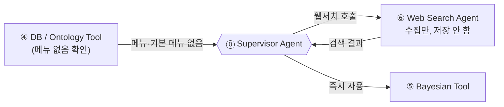
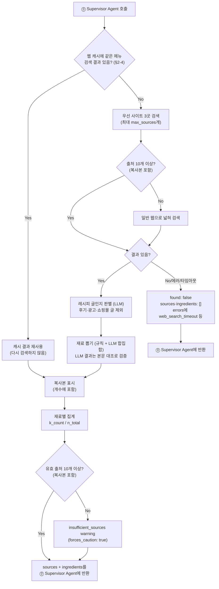

# ⑥ Web Search Agent 스펙

담당: 정유진
상태: 초안 (미확정 항목은 §5 참조)
상위 문서: `caution-multi-agent-architecture.md`, `caution-db-schema.md`

---

## 0. ⑥ 결과의 성격 — soft evidence

⑥이 웹에서 모은 결과는 **soft evidence**(사람이 확인하지 않은 미검증 정보)다.

| 항목 | 내용 |
|---|---|
| 판정에 쓰는 법 | ⑤ 확률 계산에 바로 쓴다. 판정은 CAUTION까지이고, DANGER/SAFE는 사장님 확인값으로만 나온다 (⑧ §3, PPT 8쪽 6) |
| DB에 올리는 법 | **관리자 승인 후에만** 정식 메뉴로 등록한다 (§2-4). 원본 기록(`web_search_cache`)은 검토 없이 저장한다 |
| 위험을 낮추는 데 쓰는가 | 쓰지 않는다. 웹 레시피에 재료가 없어도 "없음"의 근거가 되지 않는다 (`caution-db-schema.md` §6) |

이유: 기계가 혼자 추측한 데이터를 사람 검토 없이 공유 DB에 흘려보내면, 크롤링 하나가 잘못돼도 그 메뉴를 스캔하는 모든 사용자의 확률이 조용히 오염된다.

**⑥은 저장 권한이 전혀 없다.**

---

## 1. 전체 흐름에서 ⑥의 위치



- **⑥ Web Search Agent**: DB에 없는 메뉴를 웹에서 조사만 한다. **DB에 아무것도 쓰지 않고, 저장 명령도 만들지 않는다.** 검색 결과(출처별 `sources`, 재료별 집계 `ingredients`)만 반환한다.

> Agent·Tool끼리 직접 호출하지 않는다. ④의 결과를 보고 ⑥을 부를지는 ⓪ Supervisor가 정하고, ⑥의 결과도 ⓪을 거쳐 다음 단계로 간다 (⓪ §0).

> ⑥이 Agent인 이유: 검색 전략(검색어)과 근거 검토를 **판단**해야 하므로 LLM 추론 노드다 (`docs/ppt-baseline.md` 7쪽 "Agent는 판단하고 Tool은 수행한다").

---

## 2. 입력 / 출력

입출력 JSON은 ⓪ §1(공통 모델)·§4-5를 기준으로 한다. 아래는 같은 내용을 옮긴 것이다.

### 2-1. 입력 — `WebSearchRequest` (⓪ Supervisor Agent로부터)

```json
{
  "context": {
    "schema_version": "1.0",
    "trace_id": "0199a2f0-0000-7000-8000-000000000001",
    "scan_session_id": "scan-123",
    "store_id": 123456,
    "call_scope": "item",
    "item_id": "scan-123:0"
  },
  "menu": {
    "menu_id": null,
    "normalized_menu_name": "마라탕",
    "locale_hint": "ko"
  },
  "max_sources": 10,
  "warnings": [],
  "errors": []
}
```

| 필드 | 설명 |
|---|---|
| `context` | 요청 공통 정보 (⓪ §1-2 `NodeContext`: `store_id`, `trace_id`, `item_id` 등). `context.store_id`는 로그·추적용이며 `web_search_cache` 자체는 가게와 무관하다. ⑥은 `context`를 수정하지 않고 그대로 반환 |
| `menu.menu_id` | DB에 없는 메뉴라 항상 `null` |
| `menu.normalized_menu_name` | 검색할 메뉴명 (②가 정규화한 이름) |
| `menu.locale_hint` | 메뉴판 언어 (예: `ko`). 검색어를 만들 때 참고 |
| `max_sources` | 최대로 모을 출처 수. `10` (§2-3) |
| `warnings` / `errors` | 앞 단계에서 넘어온 신호. ⑥은 그대로 보존하고 자기 신호를 덧붙임 |

**호출 조건**: ④가 `exists_in_db: false`이면서 `base_menu_id: null`을 반환한 경우에만 호출된다 (⓪ §4-5). 즉 메뉴도 없고 기본 메뉴도 찾지 못한 경우다. 차돌된장찌개처럼 기본 메뉴(된장찌개)를 찾은 변형 메뉴는 웹서치가 아니라 ④의 변형 경로로 간다.

### 2-2. 출력 — `WebSearchResponse` (⓪ Supervisor Agent에게 반환)

```json
{
  "context": {
    "schema_version": "1.0",
    "trace_id": "0199a2f0-0000-7000-8000-000000000001",
    "scan_session_id": "scan-123",
    "store_id": 123456,
    "call_scope": "item",
    "item_id": "scan-123:0"
  },
  "menu": {
    "menu_id": null,
    "normalized_menu_name": "마라탕"
  },
  "found": true,
  "sources": [
    {
      "source_url": "https://example.com/recipe/mala-tang",
      "title": "마라탕 레시피",
      "fetched_at": "2026-10-08T03:00:00Z",
      "reliability_weight": null,
      "evidence": {
        "evidence_id": "web:https://example.com/recipe/mala-tang",
        "evidence_class": "soft",
        "source_type": "web_search",
        "source_ref": "https://example.com/recipe/mala-tang",
        "verification_status": "pending_review",
        "reliability_weight": null,
        "observed_at": "2026-10-08T03:00:00Z"
      },
      "ingredients": [
        {
          "ingredient_id": null,
          "canonical_name": "소고기"
        }
      ]
    }
  ],
  "ingredients": [
    {
      "ingredient": {
        "ingredient_id": null,
        "canonical_name": "소고기"
      },
      "constraint_tags": ["is_beef"],
      "source": "web_search",
      "depth": 0,
      "k_count": 4,
      "n_total": 6,
      "anomaly_locked": false,
      "evidence_refs": ["web:https://example.com/recipe/mala-tang"]
    }
  ],
  "warnings": [],
  "errors": []
}
```

| 필드 | 설명 |
|---|---|
| `context` / `menu` | 입력 값을 그대로 반환 (`menu.locale_hint`는 제외) |
| `found` | 쓸 수 있는 출처를 하나라도 찾았는지. `false`면 `sources`와 `ingredients`는 모두 `[]` |
| `sources[]` | **출처별 원본.** 출처마다 `source_url`, `title`(페이지 제목), `fetched_at`(가져온 시각), `evidence`(근거 정보), `ingredients`(그 출처에서 뽑은 재료 목록) |
| `sources[].evidence` | 근거 (⓪ §1-2 `EvidenceRef`). 웹서치는 항상 `evidence_class: soft`(미검증), `source_type: web_search`, `verification_status: pending_review`(관리자 검토 대기) |
| `sources[].reliability_weight` | 출처 신뢰도(0~1). **⑥은 계산하지 않고 `null`로 보낸다** (#194) |
| `ingredients[]` | **재료별 집계.** 같은 재료를 표준 이름으로 묶어 출처 수를 센 결과. ⑤ 확률 계산의 입력이 된다 |
| `ingredients[].k_count` | 그 재료가 나온 출처 수 (복사본 포함, §2-3) |
| `ingredients[].n_total` | 유효한 출처 수 (복사본 포함, §2-3). 한 메뉴의 모든 재료가 같은 값을 가진다 |
| `ingredients[].source` | 항상 `web_search` |
| `ingredients[].depth` | 재료를 펼친 깊이. 웹에서 뽑은 재료는 펼치기 전이라 `0` |
| `ingredients[].constraint_tags` | ⑥은 항상 `[]`로 보낸다. 표준 재료 매핑과 태그는 ④가 붙인다 (결정, 2026-10-10, ④ §2-7) |
| `ingredients[].anomaly_locked` | 항상 `false` (사장님 답변이 아니므로 anomaly 대상 아님) |
| `ingredients[].evidence_refs` | 그 재료가 나온 출처의 `evidence_id` 목록 |
| `warnings` / `errors` | 입력 신호를 보존하고 ⑥의 신호를 덧붙임 (§3-2) |

- **개수 세기는 병합·선택이 아니다.** `ingredients[]`는 "어느 출처를 믿을지" 고르지 않고 모든 유효 출처를 그대로 센다. 출처를 골라내거나 합치는 일은 ⑥이 하지 않는다 (§5 미확정).
- 원본은 `sources`에 그대로 남고, `ingredients[].evidence_refs`가 원본 출처를 가리킨다.

### 2-3. 수집 개수와 중복 허용 (결정)

| 항목 | 값 |
|---|---|
| 최대 출처 수 | **10개** (`max_sources`) |
| 최소 출처 수 | **10개 (복사본 포함)**. 10개 미만이면 결과는 반환하되 `insufficient_sources` warning(`forces_caution: true`)을 붙인다 (2026-10-10 회의) |
| 중복 | **허용한다 (결정, 2026-10-10 회의).** 재료 구성이 같은 복사본도 각각 1개로 센다. `k_count`·`n_total`은 복사본을 포함한 개수 |

**근거 1 — 팀 크롤링 데이터 시뮬레이션** (`crawling/wtable_normalized.csv`, 2026-10-08)

레시피가 30개 이상인 메뉴 11개(불고기, 삼겹살, 육개장, 떡만두국, 후라이드치킨, 김밥, 콩나물무침, 떡볶이, 오징어 순대, 간장게장, 양념게장)에서 메뉴마다 전체 레시피를 정답으로 보고, n개만 무작위로 뽑는 것을 500번씩 반복했다.

| 뽑은 레시피 수 | 핵심 재료 포착률 (레시피 절반 이상에 나오는 재료) | 20% 이상 나오는 재료 포착률 |
|---|---|---|
| 3 | 94.9% | 76.7% |
| **5** | **99.0%** | 89.2% |
| 7 | 99.8% | 94.7% |
| **10** | **100%** | **98.1%** |
| 15 | 100% | 99.6% |
| 20 | 100% | 99.9% |

- 10개면 핵심 재료를 100%, 다섯 번에 한 번 나오는 재료도 98% 잡고, 그 이후로는 거의 늘지 않는다 → 최소·최대 10개

**최소 10개로 정한 이유 (2026-10-10 회의)**: 웹 근거만 있는 메뉴는 판정이 어차피 CAUTION이라(⑧ §3), 확률 정확도보다 **재료를 놓치지 않는 것**이 중요하다. 10개면 레시피 30% 이상에 나오는 재료를 95% 넘게 잡는다 (95% 신뢰 기준). 크롤링 대상 메뉴 76개 모두 레시피가 37개 이상 있어(가장 적은 메뉴: 약과 37개, 경단·부대찌개 51개) 10개를 모으기 어렵지 않다. 우선 사이트 3곳을 먼저 집계하므로 복사본을 포함해 센다.

**근거 2 — 놓칠 확률 공식**: 비율 p로 나오는 재료를 출처 n개에서 한 번도 못 볼 확률은 (1−p)^n이다. 절반에 나오는 재료는 10개면 0.1%, 30%에 나오는 재료는 10개면 약 3% 놓친다. 다섯 번에 한 번 나오는 재료는 10개면 11% 놓친다. 시뮬레이션 결과와 맞는다.

**근거 3 — 3의 법칙(rule of three)**: n개 중 0번 나왔을 때 실제 비율의 95% 상한은 약 3/n이다. 10개 레시피에 소고기가 한 번도 없어도 "소고기 확률 30% 미만"까지만 말할 수 있다. 웹 결과로는 "없다"고 확신할 수 없으므로, 웹 데이터로 위험을 낮추지 않는다는 원칙(§0)과 맞는다. ([BMJ Quality & Safety](https://qualitysafety.bmj.com/content/22/12/1042))

**근거 4 — 검색 결과 품질**: 검색 클릭의 대부분은 첫 페이지(상위 10개)에 몰리고 10위 클릭률은 약 2.5%다. 10개를 넘기면 레시피가 아닌 글이 섞일 가능성이 커진다. ([Search Engine Journal](https://www.searchenginejournal.com/google-first-page-stats/374516/))

**중복을 허용하는 이유 (2026-10-10 회의)**: 많이 퍼진 레시피는 그만큼 많은 사람이 실제로 해 먹는 레시피라, 개수에 그 인기를 반영한다. 팀 크롤링 데이터(만개의레시피)에서 재료 구성이 완전히 같은 레시피는 4.8%뿐이라 영향도 작다.

**주의와 보완**: 블로그 여러 곳이 같은 레시피를 퍼 가면 레시피가 사실상 1개인데 개수가 늘어, 근거가 충분하다고 착각할 수 있다. 복사본에 없는 재료는 확률이 낮게 나와 FN으로 이어질 수 있다 ([Recipe1M](https://im2recipe.csail.mit.edu/im2recipe.pdf)). 그래서 **DB 승격 개수(30개)는 재료 구성이 서로 다른 레시피 수로 판단**한다. 복사본만으로 승격 기준을 채우지 못하게 하기 위함이다. 실시간 최소 개수(10개)는 우선 사이트 3곳을 먼저 집계하므로 복사본을 포함해 센다 (2026-10-10 회의). 웹 근거만 있는 메뉴는 어차피 CAUTION 이상이라 판정이 SAFE로 새지는 않는다.

**한계**: 사이트 1곳·메뉴 11개 실험이고, 집밥 레시피라 식당 레시피와 다를 수 있다.

### 2-3-1. 우선 검색 사이트 (결정)

아래 3개 레시피 사이트를 **우선** 검색한다.

| 사이트 | 도메인 |
|---|---|
| 만개의레시피 | `10000recipe.com` |
| 우리의식탁 | `wtable.co.kr` |
| 새미네부엌 | `semie.cooking` |

**근거**
- **재료가 목록으로 정리돼 있어 재료를 덜 놓친다.** 레시피 사이트는 재료를 따로 목록으로 적는다 (크롤러도 이 목록만 가져온다, `crawling/README.md`). 블로그·후기는 재료가 본문에 흩어져 있거나 양념을 빠뜨리는 경우가 많다. 맛집 후기·광고·쇼핑몰 글도 애초에 들어오지 않는다.
- **규모가 크거나 전문가가 만든 레시피다.**

| 사이트 | 규모 | 출처 |
|---|---|---|
| 만개의레시피 | 레시피 20만여 개, "1,000만 이용자" | [앱스토어 소개](https://apps.apple.com/kr/app/id494190282) |
| 우리의식탁 | 요리연구가·푸드스타일리스트가 만든 레시피 2,000여 개 + 커뮤니티 레시피 매달 1,000여 개, "200만 유저" | [메트로신문 2023-09](https://www.metroseoul.co.kr/article/20230921500119), [앱스토어 소개](https://apps.apple.com/kr/app/id1090371750) |
| 새미네부엌 | 샘표 우리맛 연구팀이 10년 이상 연구한 요리 500여 가지 | [세계일보 2024-08](https://www.segye.com/newsView/20240820518713) |

> 수치는 각 사이트의 자체 소개나 보도 기준이며, 최신 값은 사이트에서 다시 확인해야 한다. 만개의레시피는 규모, 우리의식탁·새미네부엌은 전문가가 만든 레시피라는 점이 강점이다.

**우선 사이트에서 레시피가 부족할 때 (결정)**
- 우선 사이트 3곳에서 모은 출처가 **10개 미만**(복사본 포함)이면 **일반 웹으로 넓혀** `max_sources`(10개)까지 채운다.
- 일반 웹으로 넓혀도 10개 미만이면 `insufficient_sources` warning을 붙인다 (§2-3).

### 2-4. 웹 캐시 재사용과 DB 승격 (결정)

DB에 없는 메뉴는 **없음 → 웹 캐시 → DB** 세 단계를 거친다.

| 단계 | 상태 | 판정 (⑧) | 다음 단계로 가는 조건 |
|---|---|---|---|
| **없음** | DB에도 `web_search_cache`에도 없음 | CAUTION (`evidence_basis: unknown`) | ⑥ 웹서치 실행 → 결과가 `web_search_cache`에 저장됨 |
| **웹 캐시** | 웹서치 결과가 쌓이는 중 | CAUTION + 확률 (`evidence_basis: estimated`) | 재료 구성이 서로 다른 레시피 **30개 이상** → 관리자 승격 검토 대상 |
| **DB** | 관리자가 승인해 `menus`/`recipe_ingredients`에 정식 등록 | 사장님 확인값이 없으면 CAUTION + 확률, 있으면 DANGER/SAFE (⑧ §3, PPT 8쪽 6) | — |

**웹 캐시 재사용**
- `web_search_cache`는 가게와 무관하다. 다른 사용자·다른 가게에서 같은 메뉴를 검색한 결과도 재사용한다. 웹 결과는 원래 "일반 레시피"라 누가 검색했든 의미가 같고, 가게별 정보는 사장님 확인값(③)으로 따로 다룬다.
- 같은 메뉴가 다시 나오면 다시 검색하지 않고 캐시를 쓴다. 속도와 비용만 달라지고 판정은 그대로다 (CAUTION).

**DB 승격**
- **조건: 재료 구성이 서로 다른 레시피 30개 이상 + 관리자 승인** (2026-10-10 회의 후 20개 → 30개). 웹 데이터는 soft evidence(미검증 정보)라 관리자 승인 없이는 DB에 올리지 않는다 (§0).
- 30개 근거: 열 번에 한 번 나오는 재료까지 95% 확률로 한 번 이상 잡는다(`(1−0.1)^30 ≈ 0.04`). 확률 수치의 95% 오차도 약 ±18%p로 줄어, DB prior로 쓸 만해진다. 20개면 다섯 번에 한 번 나오는 재료는 99.9% 잡지만 열 번에 한 번 나오는 재료는 88%만 잡는다. 지금 DB의 크롤링 데이터는 메뉴당 레시피가 최소 37개다.
- ⑥은 승격을 결정하거나 저장하지 않는다. 승인·반려는 관리자가 한다.
- DB에 올라가도 사장님 확인값이 없으면 판정은 CAUTION이다. 대신 매번 웹서치를 하지 않아 빨라지고, ④가 재료를 끝까지 펼치고(예: 액젓 → 생선) 변형 메뉴를 연결해 재료를 덜 놓친다.

**30개를 채우는 방법**
- 같은 검색을 반복하면 상위 결과가 거의 같아 서로 다른 레시피가 잘 늘지 않는다.
- 그래서 실시간 판정은 상위 10개(`max_sources`)로 하고, 같은 메뉴가 다시 웹서치 경로로 나오면 백그라운드에서 다음 순위 출처나 다른 사이트를 추가로 모아 캐시를 채운다.

---

### 2-5. 시간 제한 (결정)

사용자는 식당에서 결과를 기다리고 있다. ⑥은 메뉴 하나당 **최대 7초** 안에 끝낸다.

| 구간 | 최대 시간 |
|---|---|
| 검색 API 호출 1회 | 3초 |
| LLM 호출 1회 (레시피 판별, 재료 뽑기) | 3초. 넘기면 규칙(재료 사전) 결과만 쓴다 (§3-0) |
| **⑥ 전체 (메뉴 하나)** | **7초** |

**근거**: 스캔 전체 응답 목표는 30초다 (`ai_ocr/README.md` "30초 SLA"). OCR이 약 16초를 쓰면 판정 쪽에 약 12초가 남고, 그 안에서 ④⑤와 ⑧ 문장 생성도 돌아야 한다. 메뉴별로 병렬 처리하므로 ⑥에는 메뉴 하나당 7초를 쓴다. 같은 메뉴를 다시 검색할 때는 캐시를 써서 거의 즉시 끝난다 (§2-4).

**7초를 넘기면**
- 그때까지 모은 레시피가 있으면 **모은 만큼으로 결과를 낸다.** `warnings`에 `web_search_deadline_exceeded`(`forces_caution: true`)를 붙인다. 판정은 어차피 CAUTION이라 위험이 늘지 않고, 재료 정보를 하나라도 더 넘길 수 있다. 10개 미만이면 `insufficient_sources`도 함께 붙는다.
- 하나도 못 모았으면 `found: false`와 `web_search_timeout` 오류를 낸다.

> 이 7초는 백엔드 2-phase 제안의 판정(judge) 단계 타임아웃 안에 들어간다. 판정 단계 전체 값은 ⓪·백엔드와 함께 정한다.

### 2-6. 승격 검토 자료 (결정)

메뉴가 DB 승격 검토 대상이 되면(§2-4), ⑥은 관리자가 볼 **검토 자료**를 만든다. ⑥은 자료만 만들고, 화면과 승인 처리는 하지 않는다.

**⑥이 만드는 것**

| 항목 | 내용 |
|---|---|
| 묶음 요약 | 메뉴 이름, 서로 다른 레시피 수, 재료별 등장 수 (예: 소고기 15/22) |
| 레시피별 목록 | 레시피마다 제목, 링크, 뽑힌 재료 |
| 검토 필요 문구 | 아래 규칙에 걸린 항목을 읽기 쉬운 문장으로 정리 (예: "땅콩은 레시피 22개 중 3개에만 나와서 확인이 필요해요") |

**검토 필요 문구 — 이유는 규칙, 문장은 LLM**
- 검토가 필요한 **이유는 코드가 아래 규칙으로 뽑는다.** LLM이 이유까지 정하면 매번 다르게 말하거나 중요한 경고를 빠뜨릴 수 있다.
- LLM은 뽑힌 이유를 **읽기 쉬운 문장으로만** 바꾼다. LLM이 실패하면 규칙 이름을 그대로 보여준다.

| 분류 | # | 규칙 | 기준 (초기값) | 왜 필요한가 |
|---|---|---|---|---|
| **A. 같은 음식이 맞나** | 1 | 일반 웹 출처 포함 | 우선 검색 사이트(§2-3-1)가 아닌 도메인의 출처가 1개 이상 | 후기·광고가 섞였을 수 있다 |
| | 2 | 레시피 제목이 메뉴명과 다름 | 제목에 메뉴명이 없는 레시피 | 다른 음식(예: 마라탕 ↔ 마라샹궈)이 섞였을 수 있다 |
| | 3 | 레시피끼리 재료가 너무 다름 | 레시피 절반 이상에 나오는 재료가 3개 미만 | 서로 다른 음식이 섞였다는 신호다 |
| **B. 재료가 제대로 뽑혔나** | 4 | 드물게 나온 재료 | 레시피 1~2개에만 나온 재료 | 잘못 뽑혔거나 특이한 레시피의 재료일 수 있다 |
| | 6 | LLM만 찾은 재료 | 규칙(재료 사전)은 못 찾고 LLM만 찾은 재료 | 지어낸 재료인지 확인한다 |
| | 7 | 표준 재료 매핑 실패 | 표준 재료로 맞추지 못한 재료 | 태그가 없어 위험을 놓칠 수 있다. **C에도 함께 표시한다** |
| **C. 위험 재료를 놓치지 않았나** | 5 | 위험 태그 재료가 일부에만 나옴 | 알레르기·종교·채식 태그가 붙은 재료가 레시피 절반 미만에 나옴 | 넣으면 과잉 경고, 빼면 FN이라 사람 판단이 필요하다 |

- 검토 문구는 A → B → C 순서로 보여준다. 이 묶음이 맞는 음식인지 먼저 보고, 재료를 정리한 뒤, 위험 재료를 마지막에 확인하는 순서다.
- 규칙 1은 출처 링크의 도메인으로 판단한다. ⑥ 출력에 별도 표시 필드는 두지 않는다.
- 기준 숫자는 초기값이며, 실제 검토 결과를 보고 조정한다.

**⑥ 범위 밖 — 관리자 화면과 승인 처리 (⑦·백엔드·프론트에 전달)**

최소 기능은 다음과 같다.
- 묶음 요약을 기본으로 보고, 레시피를 하나씩 펼쳐 볼 수 있다.
- 검토 필요 문구는 화면 맨 아래에 보여준다.
- **전체 승인:** 포함된 레시피 전부로 DB에 등록한다.
- **레시피별 승인:** 레시피마다 포함/제외를 고르고, 제외한 레시피를 뺀 뒤 재료 개수를 다시 세어 등록한다.
- **반려:** 등록하지 않는다. 웹 캐시는 그대로 남는다.
- 관리자는 재료를 직접 고치지 않는다. 레시피를 넣고 빼는 것만 한다. 그래서 위험 재료를 임의로 지우는 일이 생기지 않는다.

---

## 3. 처리 로직



0. `web_search_cache`에 같은 메뉴의 검색 결과가 있으면 다시 검색하지 않고 그 결과를 쓴다 (§2-4). 다른 사용자·다른 가게의 검색 결과도 재사용한다. 캐시를 ⑥이 확인할지, 백엔드가 2-phase 번들로 넘겨줄지는 §5 미확정.
1. 캐시가 없으면 `menu.normalized_menu_name`으로 우선 검색 사이트 3곳(§2-3-1)에서 검색한다 (최대 `max_sources`개). 모은 출처가 10개 미만(복사본 포함)이면 일반 웹으로 넓힌다. 실패·타임아웃이면 바로 `found: false`.
2. **(LLM)** 검색된 글마다 레시피 글인지 판별한다. 맛집 후기·광고·쇼핑몰 글은 제외한다.
2-1. **(규칙 + LLM)** 레시피 글에서 재료를 뽑는다. 규칙(재료 사전)과 LLM이 각각 뽑고, **둘 중 한쪽이라도 찾은 재료는 모두 남긴다** (§3-0).
2-2. 출처마다 `source_url`, `title`, `fetched_at`, 재료 목록을 정리하고 `evidence`를 붙인다. **저장 명령은 만들지 않는다.**
3. 재료 구성이 같은 레시피는 복사본으로 보고 1개만 남긴다 (§2-3).
4. 같은 재료를 표준 이름으로 묶어 `k_count`(나온 출처 수)와 `n_total`(유효 출처 수)을 센다.
5. 유효 출처가 10개 미만(복사본 포함)이면 `insufficient_sources` warning을 붙인다. 결과는 버리지 않고 반환한다.
6. `sources`와 `ingredients`를 ⓪ Supervisor Agent에 반환한다. 저장은 ⑥의 일이 아니다.

**fallback**: 웹서치도 실패하면 "정보 없음"(`NO_INFORMATION`) 상태로 CAUTION 이상 처리 — SAFE로 떨어뜨리지 않는다 (FN-minimization 원칙, `docs/ppt-baseline.md` 8쪽 "4 정보 부족→보수적 판정").

### 3-0. LLM이 맡는 일과 코드가 맡는 일

PPT 7·8쪽은 ⑥을 "검색 전략 수립·근거 검토"를 하는 Agent로 정의한다. LLM은 **문맥을 읽어야 하는 판단**에만 쓰고, 정해진 규칙대로 하면 되는 일은 코드가 맡는다. LLM을 많이 쓸수록 느려지고 결과가 매번 달라질 수 있기 때문이다. 모델·프롬프트·재시도 같은 공통 규칙은 `agent-implementation-guide.md` §5를 따른다.

| 단계 | 담당 | 이유 |
|---|---|---|
| 캐시 확인 | 코드 | 정해진 조회 |
| 검색어 만들기 | 코드 (템플릿) | 한글 메뉴는 "{메뉴} 레시피" 같은 템플릿으로 충분하다. |
| 검색 실행, 시간 제한, 우선 사이트 검사 | 코드 | 정해진 절차 (§2-3-1) |
| **레시피 글인지 판별** | **LLM** | 맛집 후기·광고·쇼핑몰 글을 걸러내는 건 문맥 판단이다. 단어("재료", "레시피") 포함 여부만으로는 후기도 통과한다 |
| **재료 뽑기** | **규칙 + LLM** | 규칙(재료 사전)은 아는 재료를 빠르고 일정하게 잡고, LLM은 사전에 없는 재료를 추가로 잡는다. 둘의 **합집합**을 쓴다 |
| LLM 결과 검증 | 코드 | 실제 검색 결과에 없는 URL은 버린다. LLM만 찾은 재료는 **본문에 실제로 있을 때만** 남긴다 (지어낸 재료 방지) |
| 승격 검토 문구 (§2-6) | 이유는 코드(규칙), 문장은 LLM | 이유까지 LLM이 정하면 중요한 경고를 빠뜨릴 수 있다 |
| 표준 재료 이름으로 맞추기 | 코드 (재료 사전) | 매핑되지 않은 재료는 warning을 붙인다 |
| 복사본 표시, 개수 세기, 10개 미만 경고 | 코드 | 정해진 규칙 (§2-3) |

**재료 뽑기 — 규칙 + LLM 합집합**
- **합집합을 쓰는 이유:** 둘 다 찾은 재료만 남기면 한쪽이 놓친 재료가 사라져 FN이 생긴다.
- **LLM이 실패·시간 초과해도** 규칙 결과는 남는다. 재료가 통째로 사라지지 않는다.
- **LLM만 찾은 재료**는 본문에 그 단어가 있어야 남긴다. 표준 재료 매핑은 ④가 하며, 매핑되지 않으면 ④가 `unmapped_constraint_tags` warning(`forces_caution: true`)을 붙인다 (④ §2-7). 태그 없이 넘어가면 ⑧이 SAFE를 낼 수 있기 때문이다.

### 3-1. ⑥이 하지 않는 것

| 하지 않음 | 담당 |
|---|---|
| DB 저장, 저장 명령 생성 (`web_search_cache`, 정식 메뉴 등록) | ⑥ 범위 밖 |
| 여러 후보 중 어느 걸 믿을지 병합/선택 | ⑥ 범위 밖 (§5 미확정) |
| 출처 신뢰도(`reliability_weight`) 계산 | ⑥ 범위 밖 (#194) |
| 확률 계산 | ⑤ Bayesian Tool |
| 재호출/재시도 여부 판단 | ⓪ Supervisor Agent |
| DANGER/CAUTION/SAFE 판정 | ⑧ Decision Policy / XAI Agent |

### 3-2. 예외 처리

| 상황 | 처리 |
|---|---|
| 검색 실패, 또는 7초 안에 레시피를 하나도 못 모음 | `found: false`, `sources: []`, `ingredients: []`. `errors`에 `web_search_timeout`(`retryable: true`, `fallback: no_information`)을 넣는다. 재시도 여부는 ⓪이 정한다 |
| 7초를 넘겼지만 모은 레시피가 있음 | 모은 만큼으로 결과를 반환하고 `warnings`에 `web_search_deadline_exceeded`(`forces_caution: true`)를 붙인다 (§2-5) |
| 유효 출처 10개 미만 (복사본 포함) | 결과는 그대로 반환하고 `warnings`에 `insufficient_sources`(`forces_caution: true`)를 붙인다. ⑧은 이 경고가 있으면 SAFE를 내지 않는다 |
| 재료 구성이 같은 레시피 여러 개 | 1개로 센다. 원본은 `sources`에 남긴다 |
| 재료를 하나도 뽑지 못한 출처 | 유효 출처로 세지 않는다 |
| LLM 호출 실패·시간 초과 | 규칙(재료 사전)으로 뽑은 결과만 반환하고 `warnings`에 `web_llm_extraction_failed`(`forces_caution: true`)를 붙인다. 레시피 판별을 못 했으므로 모든 글을 후보로 둔다 |
| LLM이 뽑은 재료가 본문에 없음 | 버린다 (지어낸 재료 방지) |
| LLM만 찾은 재료가 표준 재료로 매핑되지 않음 | 재료는 남긴다. 매핑은 ④가 하며, 실패하면 ④가 `unmapped_constraint_tags` warning(`forces_caution: true`)을 붙인다 |

오류 형식 예시 (⓪ §1-2 `NodeError`):

```json
{
  "code": "web_search_timeout",
  "node": "web_search",
  "item_id": "scan-123:0",
  "message": "웹 검색 시간이 초과되었습니다.",
  "retryable": true,
  "fallback": "no_information"
}
```

---

## 4. 테스트 케이스

| # | 입력 | 기대 동작 | 검증 포인트 |
|---|---|---|---|
| 1 | 웹서치 성공 (마라탕) | `found: true` + `sources` + `ingredients` 반환 | ⑥ 출력에 저장 명령이 없을 것. `menus`/`recipe_ingredients`는 미반영일 것 |
| 2 | 웹서치 실패/타임아웃 | `found: false`, `sources: []`, `ingredients: []`, `errors`에 `web_search_timeout` | ⑧이 "완전 정보 없음" 경로로 감 |
| 3 | 출처 6개 중 4개에 소고기 | 소고기 `k_count: 4`, `n_total: 6` | 재료별 개수가 맞을 것 |
| 4 | 출처 10개 중 3개가 재료 구성이 같은 복사본 | `n_total: 10`, 최소 개수 충족 | 복사본도 개수에 넣을 것 |
| 5 | 유효 출처 8개 (복사본 포함) | 결과 반환 + `insufficient_sources` warning(`forces_caution: true`) | 결과를 버리지 않고, SAFE를 막는 신호를 보낼 것 |
| 6 | 정상 결과 | 모든 `sources[].reliability_weight`가 `null` | ⑥이 출처 신뢰도를 계산하지 않을 것 |
| 7 | 검색 결과에 맛집 후기 글 섞임 | 후기 글은 유효 출처에서 제외 | LLM 레시피 판별이 동작할 것 |
| 8 | 재료 사전에 없는 재료(예: 마라소스)가 본문에 있음 | LLM이 찾아 결과에 포함 | 규칙만으로 놓치는 재료가 남을 것 |
| 9 | LLM이 본문에 없는 재료를 반환 | 그 재료는 버림 | 지어낸 재료가 결과에 들어가지 않을 것 |
| 10 | LLM 시간 초과 | 규칙 결과만 반환 + `web_llm_extraction_failed` warning | 재료가 통째로 사라지지 않을 것 |
| 11 | 우선 사이트 레시피 3개 | 일반 웹으로 넓혀 최대 10개까지 채움 | 레시피가 부족하면 일반 웹으로 넓힐 것 |
| 12 | 우선 사이트 레시피 10개 | 일반 웹 검색 안 함 | 우선 사이트만으로 충분하면 넓히지 않을 것 |
| 13 | 7초까지 레시피 3개만 모음 | 3개로 결과 반환 + `web_search_deadline_exceeded` + `insufficient_sources` warning | 시간 초과여도 모은 결과를 버리지 않을 것 |
| 14 | 7초까지 레시피 0개 | `found: false` + `web_search_timeout` | 정보 없음 경로로 갈 것 |
| 15 | 승격 검토 대상 메뉴, 땅콩(`is_peanut`)이 22개 중 3개에만 나옴 | 검토 문구 C에 땅콩 표시 | 위험 태그 재료가 검토 문구에서 빠지지 않을 것 |
| 16 | 검토 문구 생성 중 LLM 실패 | 규칙 이름을 그대로 문구로 표시 | 검토 이유가 사라지지 않을 것 |

---

## 5. 미확정 항목 (팀 확인 대기)

- [x] **수집 개수·중복** — 최소 10개(복사본 포함), 최대 10개. 복사본도 개수에 포함 (2026-10-10 회의, §2-3)
- [x] **관리자 확인 방식** — 묶음 요약 기본 + 레시피별 포함·제외, 검토 필요 문구(이유는 규칙, 문장은 LLM), 관리자는 재료를 직접 고치지 않음 (§2-6)
- [ ] **웹 결과와 기존 DB 값이 다를 때 우선순위** (#170)
- [x] **웹 캐시 재사용과 DB 승격 기준** — 다른 사용자의 캐시도 재사용, 재료 구성이 서로 다른 레시피 30개 이상 + 관리자 승인 시 DB 승격 (2026-10-10, §2-4)
- [ ] **메뉴판 1장당 여러 unknown 메뉴가 나올 때 ⑥ 호출 배치 전략** — 동시에 몇 개까지 돌릴지, 전체 시간 제한, 시간 안에 못 끝난 메뉴 처리 (`caution-multi-agent-architecture.md` 5번 섹션과 동일 이슈)
- [x] **LLM이 맡는 부분과 코드가 맡는 부분 구분** — LLM은 레시피 글 판별과 재료 뽑기(규칙과 합집합)에만 쓰고 나머지는 코드 (§3-0)
- [x] **검색할 사이트 범위** — 만개의레시피·우리의식탁·새미네부엌 3곳을 우선 검색 (§2-3-1)
- [x] **우선 사이트에서 레시피가 부족할 때** — 10개 미만(복사본 포함)이면 일반 웹으로 넓힌다 (§2-3-1)
- [x] **⑥ 시간 제한** — 메뉴 하나당 7초 (검색 API 3초, LLM 3초). 넘기면 모은 만큼 반환 (§2-5). 2-phase 판정 단계 전체 타임아웃은 ⓪·백엔드와 함께 정한다
- [ ] **웹 캐시 세부** — 캐시를 며칠까지 재사용할지, 캐시 확인 주체(⑥ / 백엔드가 2-phase 번들로 전달), 백그라운드 추가 수집을 시작하는 기준(같은 메뉴가 몇 번 나오면), 20개를 누가 세서 관리자 승격 검토로 넘길지
- [x] **출처 신뢰도 가중치를 ⑥에서 어디까지 판단할지** — ⑥은 계산하지 않고 `reliability_weight: null`로 보낸다 (2026-10-06, #194)
- [x] **재료 태그(`constraint_tags`)를 누가 붙일지** — ④가 모두 붙인다. 웹 재료를 표준 재료로 매핑하는 일도 ④가 한다 (2026-10-10, ④ §2-7). PPT 7쪽이 위험 속성 매핑을 ④의 역할로 정의한 것과 같다
- [ ] **⓪ 문서 반영 요청 (외부 의존)** — ⓪ §4-5 예시는 `reliability_weight: 0.5`를 ⑥이 채우는 것처럼 되어 있고, 같은 값이 `sources[]`와 `evidence`에 두 번 들어간다. `null` 허용과 한 곳으로 합치기를 ⓪ 담당자에게 요청. `insufficient_sources` warning, `n_total`이 중복 제거 후 개수라는 점도 ⓪에 반영 요청
