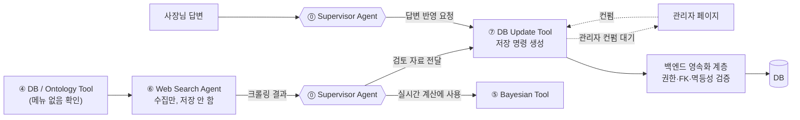
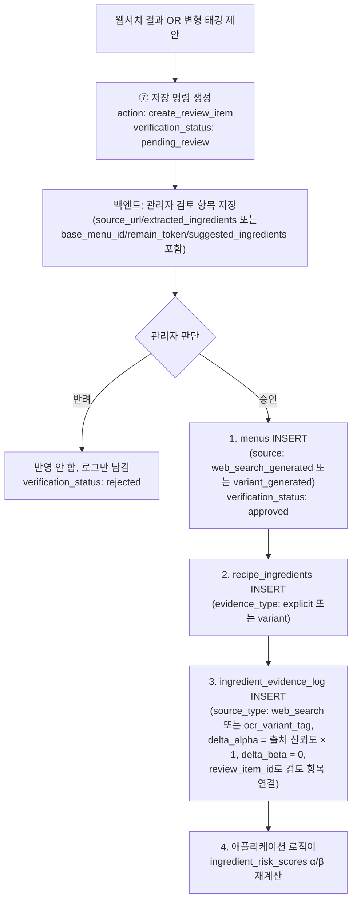
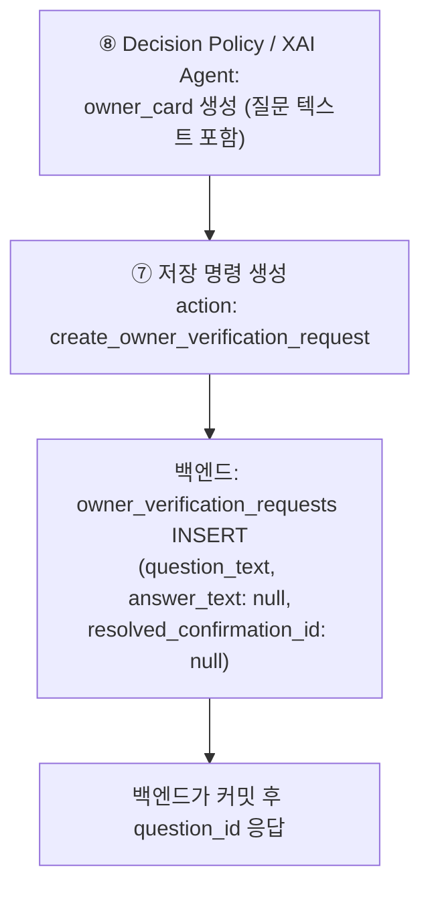
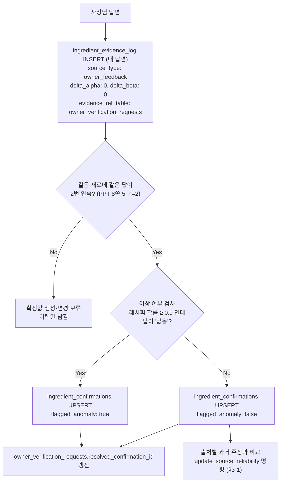

# ⑦ DB Update Tool 스펙

담당: 윤지
상태: 초안 (미확정 항목은 §8 참조)
상위 문서: `caution-multi-agent-architecture.md`, `caution-db-schema.md`
짝 문서: [`6-agent-websearch.md`](6-agent-websearch.md) (⑥ Web Search Agent) — ⑦이 받는 soft evidence를 수집하는 쪽

---

## 0. 역할 범위

⑦은 새롭게 확보된 근거를 **출처·신뢰도·검증 상태와 함께 저장하도록 하는 저장 명령 Tool**이다. Hard Evidence와 Soft Evidence를 분리해, 관리자 검토가 필요한 명령과 사장님 답변 반영 명령을 구분해 만든다.

⑦은 DB 자격 증명을 갖지 않는다. 출력은 백엔드에 대한 **명령**이고, 권한·FK·멱등성 검증과 실제 저장은 백엔드가 한다.

| 하지 않음 | 담당 |
|---|---|
| 웹 크롤링 | ⑥ Web Search Agent |
| 확률 계산 | ⑤ Bayesian Tool |
| DANGER/CAUTION/SAFE 판정 | ⑧ Decision Policy / XAI Agent |
| 사장님 질문 문구 생성 | ⑧ Decision Policy / XAI Agent |
| 관리자 승인/반려 판단 자체 | 관리자 (사람) |
| 물리 DB 쓰기와 트랜잭션 | 백엔드 영속화 계층 |
| `ingredient_risk_scores` 직접 UPDATE | 누구도 하지 않음. `ingredient_evidence_log` INSERT 후 애플리케이션 로직이 재계산 |
| `menu_ingredient_cache` 저장 명령 | ④ (§4) |

### 0-1. 설계 원칙

- **soft evidence는 사람 승인 전에는 DB에 들어가지 않는다.** 웹 검색 결과와 런타임 변형 제안은 관리자 검토 항목으로만 만든다.
- **이력은 지우지 않는다.** 확정 테이블은 최신값으로 덮어써도, 증거 로그에는 매 답변을 새 행으로 남긴다.
- **모든 명령에 출처와 검증 상태를 붙인다** (§3).
- **저장과 신뢰 판단을 분리한다.** ⑦은 이상 답변 표시를 붙여 저장할 뿐, 그 값을 믿을지는 ③ 이후 단계가 정한다.
- **명령은 멱등이어야 한다.** 같은 명령이 두 번 와도 한 번만 반영되도록 `idempotency_key`를 붙이고, Supervisor는 ⑦ 명령을 자동 재시도하지 않는다 (⓪ §6-1).
- **외부 경계는 Pydantic 모델로 검증한다** (⓪ §1-3).

> ⑦이 Tool인 이유: 증거 종류에 따라 정해진 저장 명령을 **수행**하는 실행 노드이고, 무엇을 믿을지에 대한 판단은 하지 않는다 (`docs/ppt-baseline.md` 7쪽 "Agent는 판단하고 Tool은 수행한다").

### 0-2. 기준 문서 대응

[`ppt-baseline.md`](ppt-baseline.md)의 ⑦ 관련 내용과 이 문서의 대응 위치다. 이 표의 항목이 빠지면 이 문서가 틀린 것이다.

| PPT 표현 | 이 문서 |
|---|---|
| 7쪽: 새롭게 확보된 근거를 출처·신뢰도·검증 상태와 함께 저장 (`Provenance`, `근거 저장`) | §3 출처·검증 상태 관리, §3-1 출처 신뢰도 계산, §2 |
| 7쪽: Hard Evidence와 Soft Evidence를 분리 관리 (`신뢰도 분리`) | §0-3, §2-1, §2-3 |
| 8쪽 5: 웹 검색·변형 후보 → 관리자 검토·승인 → DB Update Tool | §2-1 |
| 8쪽 5: 사장님 확인 정보 → 최소 n회 이상 시 기록·이상 여부 검사 → DB Update Tool | §2-3 |
| 8쪽 6: 사장님 확인 n건↑이면 확정, n개월마다 재확인 | §2-3 (재확인 기간은 단체 논의 #202) |

### 0-3. 증거 신뢰도 계층 (⑥⑦ 공통 전제)

⑥과 ⑦은 "웹서치 결과 → 관리자 컨펌 → DB 반영"이라는 하나의 파이프라인을 나눠 맡는다. 두 문서의 공통 축은 **증거 신뢰도 계층**이다.

| 구분 | 예시 | 처리 주체 | 반영 시점 |
|---|---|---|---|
| **soft evidence** | 웹서치 크롤링 결과, ④의 변형 태깅 제안 | ⑥ → ⑦ → 백엔드 | **관리자 컨펌 후에만** DB 반영 |
| **hard evidence** | 사장님 답변 | ⑦ → 백엔드 | 답변 이력은 **즉시** 기록. 확정값(`ingredient_confirmations`)은 같은 재료에 **같은 답이 2번 연속** 들어오고 이상 여부 검사를 거친 뒤 생기거나 바뀐다 (PPT 8쪽 5·6, §2-3) |

이 구분이 왜 필요한가: `caution-db-schema.md` §6 원칙 — "웹서치 캐시 데이터는 실제 식당 레시피로 간주하지 않고, danger 판정을 낮추는 데 쓰지 않음". 기계가 혼자 추측한 데이터를 사람 검토 없이 공유 DB(`ingredient_risk_scores`)에 자동으로 흘려보내면, 크롤링 하나가 잘못돼도 그 가게를 스캔하는 모든 이후 사용자의 확률이 조용히 오염된다. 사장님 답변은 사람이 직접 확인해준 것이라 관리자 검토는 거치지 않지만, PPT 기준에 따라 여러 번의 확인(같은 답 2번 연속)과 이상 여부 검사를 거쳐 확정값이 된다.

> PPT의 n은 **2**로 정했다 (2026-10-06, #193). ⑥ §0은 이 표를 복사해 둔 것이므로 함께 맞춰야 한다.

### 0-4. ⑥ ↔ ⑦ 역할 분담



- **⑥ Web Search Agent**: DB에 없는 메뉴를 크롤링으로 조사만 함. 상세는 [`6-agent-websearch.md`](6-agent-websearch.md).
- **⑦ DB Update Tool**: 증거 종류에 따라 관리자 검토 명령과 답변 반영 명령을 구분해 만든다. 웹 경로에서는 Supervisor가 ⑦ 명령을 만든 뒤 ⑤를 호출한다 (⓪ §2).

---

## 1. 입력 / 출력 스펙

### 1-1. 입력 (⓪ Supervisor Agent로부터, 4가지 트리거)

모든 트리거는 ⓪ §1-3 공통 호출 문맥(`context`)을 함께 받는다.

| 트리거 | 필드 | 신뢰도 |
|---|---|---|
| 웹서치 결과 | `{context, menu_name, candidates}` (⑥ 출력 그대로) | soft |
| ④의 변형 태깅 제안 | `{context, base_menu_id, remain_token, suggested_ingredients}` | soft |
| ⑧의 질문 생성 요청(`owner_card`) | `{context, menu_id, ingredient_id, question}` (⑧ `owner_card` 그대로) | 신규 질문 |
| 사장님 답변 | `{context, menu_id, ingredient_id, present, question_id}` | hard |

```json
{
  "context": {
    "schema_version": "1.0",
    "trace_id": "0199...",
    "scan_session_id": "scan-123",
    "store_id": 123456,
    "item_id": "scan-123:0"
  },
  "base_menu_id": "str",
  "remain_token": "차돌",
  "suggested_ingredients": ["소고기"]
}
```

- ④의 `variant_origin: runtime_tagged` 결과는 ④ 출력의 `variant_suggestion`(`base_menu_id`, `remain_token`, `suggested_ingredients`)을 그대로 받는다. `db_registered` 변형은 이미 컨펌된 데이터라 ⑦ 대상이 아니다 (④ §5-2).
- 사장님 답변은 스캔 흐름 밖에서 들어온다. `context.scan_session_id`는 원래 질문이 생긴 스캔(`owner_verification_requests.scan_session_id`)을 쓰고, `item_id`는 `null`이다. ⓪ 공통 문맥 규칙과 맞는지 확인이 필요하다 (§8).
- ⑧ `owner_card.question`은 6개 언어 객체(`ko`, `en`, `ja`, `zh-Hans`, `zh-Hant`, `es`)다. 스키마의 `owner_verification_requests.question_text`는 text 한 칸이라, 어느 언어를 어떤 형태로 저장할지 정해야 한다 (§8).
- 확인 정보는 **사장님 답변만** 다룬다. 관광객이 직접 알려주는 재료 정보(③의 `user_hard`)는 수집 경로가 없어 트리거를 두지 않는다 (③ 결정, 2026-10-09). 손님이 소통 카드로 물어본 결과도 사장님 답변으로 들어온다.

### 1-2. 출력 (⓪ Supervisor Agent에게 반환)

모든 출력은 같은 형태의 **저장 명령**이다. 저장 완료 응답이 아니며, 백엔드가 성공적으로 커밋한 뒤 생성 ID(예: `question_id`)와 최종 상태를 응답한다.

| 트리거 | `action` |
|---|---|
| 웹서치 결과 / 변형 태깅 제안 | `create_review_item` |
| ⑧ 질문 생성 요청 | `create_owner_verification_request` |
| 사장님 답변 | `record_owner_answer` (이력 기록 + 같은 답 2번 연속이면 확정값 upsert, §2-3) |
| 사장님 확정값이 생기거나 바뀜 | `update_source_reliability` (출처별 맞춘 수·비교 수 갱신, §3-1) |
| ⑥ 웹서치 결과 원본 | `save_web_search_cache` (관리자 게이트 없이 원본 기록, §4) |

- 모든 명령은 `idempotency_key`를 가진다. 백엔드는 `ai_command_receipts`(`action` + `idempotency_key`가 PK)에 먼저 기록하고, 이미 있으면 다시 실행하지 않는다 (§3-2). 위 6종이 `ai_command_receipts.action`의 허용값이다.

```json
{
  "context": {
    "schema_version": "1.0",
    "trace_id": "0199...",
    "scan_session_id": "scan-123",
    "store_id": 123456,
    "item_id": null
  },
  "action": "record_owner_answer",
  "idempotency_key": "str",
  "payload": {
    "store_id": 123456,
    "menu_id": 101,
    "ingredient_id": 212,
    "present": false,
    "question_id": "uuid",
    "flagged_anomaly": false,
    "provenance": {
      "source_type": "owner_feedback",
      "evidence_ref_table": "owner_verification_requests",
      "evidence_ref_id": "str",
      "verification_status": "owner_confirmed",
      "reliability_weight": null
    }
  }
}
```

- `context`는 입력 값을 수정하지 않고 그대로 반환한다 (⓪ §4).
- 메뉴·재료 ID는 DB와 같은 정수(BIGINT)다. 질문 ID(`owner_verification_requests.id`)는 UUID다 (백엔드 ERD V10).
- 스캔 중에 만든 명령은 Supervisor 최종 응답의 `persistence_commands`로 백엔드에 전달된다 (⓪ §1-2).

---

## 2. 처리 로직

### 2-1. soft evidence 처리 (관리자 컨펌 게이트)



**soft 증거의 δ 값 (결정, 2026-10-10):** 승인된 웹·변형 근거는 "이 재료가 있다"는 근거 1건이다. ⑦은 기록할 때 그 출처의 현재 신뢰도를 곱해 `delta_alpha = 신뢰도 × 1`, `delta_beta = 0`으로 넣는다. `ingredient_risk_scores`에는 출처별로 나뉘지 않은 합계만 남으므로, 신뢰도는 기록 시점에 곱해야 한다 (⑤ §3-3). 후보 목록에 없다고 β를 더하지 않는 이유는 큐레이션 레시피와 같다. 목록에 없다고 안 들어간다는 뜻이 아니다.

**순서가 고정인 이유**: `menus` → `recipe_ingredients` → `ingredient_evidence_log` 순서를 지키지 않으면 FK가 끊긴다 (`caution-db-schema.md` §7-3, §7-5). `ingredient_risk_scores`는 이 로그 재계산 결과로만 갱신되고 **직접 UPDATE는 절대 금지**.

**관리자 페이지에 뭐가 보이는가** (§8에서 UI 세부는 미확정이지만 최소 노출 데이터):
- 웹서치 건: 메뉴명, 후보 URL별 추출 재료 목록, 크롤링 시각
- 변형 태깅 건: 원본 메뉴명, remain 토큰, 제안된 재료

### 2-2. 질문 생성 처리 (`owner_verification_requests` 최초 INSERT)



- **질문 내용(무엇을 물을지)은 ⑧이 만들고, 저장 명령은 ⑦이 만들고, 실제 저장은 백엔드가 한다** — "판정/설명은 ⑧, 저장 명령은 ⑦, 물리 쓰기는 백엔드"라는 역할 분리를 따름.
- 백엔드가 이 단계에서 발급한 `question_id`가 이후 "사장님 답변" 트리거(§1-1)에서 그대로 쓰인다 — 답변 처리는 질문이 이미 존재한다고 전제하므로, 이 단계가 빠지면 사장님 답변을 저장할 대상 행 자체가 없다.

### 2-3. hard evidence 처리 (이력 즉시 기록, 확정은 같은 답 2번 연속)



- **확정 조건 (결정, 2026-10-06, #193)**: 같은 재료에 **같은 답이 2번 연속** 들어와야 확정값이 생긴다. 이미 확정값이 있을 때도 **다른 답이 2번 연속** 들어와야 바뀐다. PPT 8쪽 5의 "최소 n회 이상"에서 n=2다. 한 번 잘못 누른 답(오조작)은 2번 연속 조건에 걸러진다.
- 확정값이 아직 없는 동안 ③은 해당 재료를 미확인으로 본다. 그동안 ⑤의 확률 계산과 ⑧의 CAUTION 판정이 유지되어 SAFE로 새지 않는다.
- 확정값이 있는데 다른 답이 1번만 들어오면 **기존 확정값을 그대로 쓴다.** 다른 답이 2번 연속 들어왔을 때 바꾼다 (결정, 2026-10-06, #193).
- **확정값 유효기간 (결정, AGENTS.md):** 사장님 확정값은 확정 시각(`ingredient_confirmations.confirmed_at`)부터 **3개월** 동안만 확정 정보로 쓴다. 3개월이 지나면 ③이 override하지 않고, 그 재료는 ⑤ 확률 계산으로 간다. 확정값을 지우지는 않으며 ⑤가 prior 보정에 쓴다 (⑤ §1-1). 만료된 재료는 ⑧이 다시 질문을 만들 수 있다. 재확인을 앞당기는 다른 계기(메뉴 구성 변경 등)는 #202에서 정한다.
- `ingredient_confirmations`는 UNIQUE `(store_id, menu_id, ingredient_id)` — 확정 조건(같은 답 2번 연속)을 만족하면 **upsert(덮어씀)**. 이 테이블은 항상 "현재값 스냅샷" 1행만 유지하고, 과거 답변은 남기지 않는다.
- **답변 이력은 `ingredient_evidence_log`에 별도로 남긴다.** upsert와 별개로, 매 답변마다 `source_type: owner_feedback`, `evidence_ref_table: owner_verification_requests`(해당 질문 행 참조)로 **새 행을 추가**한다 — 이 테이블은 절대 덮어쓰지 않으므로, "사장님이 같은 질문에 답을 몇 번 바꿨는지" 같은 이상 패턴을 나중에 여기서 확인할 수 있다. `delta_alpha`/`delta_beta`는 확정 답변이 확률 계산을 거치지 않으므로 `0`으로 기록 — 재계산 로직에 영향 없이 순수 이력 기록 용도.
- `flagged_anomaly=true`여도 **⑦은 저장 명령만 만듦, "그대로 신뢰할지"는 ⑦의 책임이 아님.** AGENTS.md 확정 정책에 따라 anomaly 재료는 override가 거부된다. ③이 `override_eligible: false`로 반환하고, Supervisor가 `anomaly_locked: true`를 붙여 ⑤ 확률 계산으로 보내며, ⑧은 **확률 값과 무관하게 CAUTION 이상을 강제**한다 (③ §1-6, ⑤ §1-4). 저장(⑦)과 신뢰 판단(③ 이후)의 책임을 분리한 것.
- **이상 답변 기준 (결정, 2026-10-06, #193)**: 레시피상 그 재료가 들어갈 확률(⑤ `posterior_mean`)이 **0.9 이상**인데 답이 **"없음"**이면 `flagged_anomaly: true`를 붙인다. **"있음" 답변은 이상 답변으로 보지 않는다.** "있음"을 믿는 것은 더 조심하는 쪽이라 위험을 놓치지 않고, "있음"에 표시를 붙이면 override가 거부돼 DANGER 근거가 CAUTION으로 내려가기 때문이다.
- 답변 처리 완료 시 `owner_verification_requests.resolved_confirmation_id`를 방금 만든 confirmation 행으로 갱신 — ⑧이 생성한 질문과 실제 반영 결과를 연결하기 위함.

---

## 3. 출처·검증 상태 관리 (Provenance)

PPT 7쪽 "출처·신뢰도·검증 상태와 함께 저장"을 모든 명령의 `payload.provenance`로 표현한다.

| 필드 | 값 | 의미 |
|---|---|---|
| `source_type` | `web_search` \| `ocr_variant_tag` \| `owner_feedback` | 출처. `ingredient_evidence_log.source_type`과 같은 값. 관광객 피드백은 출처로 쓰지 않는다 (③ 결정) |
| `evidence_ref_table` / `evidence_ref_id` | `web_search_cache` / `menu_analyses` / `owner_verification_requests` | 원본 근거 행 |
| `verification_status` | `pending_review` → `approved` \| `rejected` (soft), `owner_confirmed` (hard) | 검증 상태 |
| `reliability_weight` | float, 0~1 | 이 근거를 낸 출처의 현재 신뢰도. 가장 믿을 만하면 1. 계산은 §3-1, 사용은 ⑤ §2-3. 아직 비교 기록이 없는 출처는 0.5 |

- ④ `runtime_tagged` 변형 제안은 `source_type: ocr_variant_tag`로 기록한다.
- 저장 위치 (백엔드 ERD V9·V10 기준): `verification_status`는 `knowledge_review_items.status`(`pending` / `approved` / `rejected`)와 `ingredient_confirmations.source`(`owner_confirmed`)에 있다. `reliability_weight`는 증거 행에 따로 두지 않고 `delta_alpha`에 곱해 넣으며, 출처별 누적값은 `source_reliability`에 둔다 (§3-1).

### 3-1. 출처 신뢰도 계산 (결정, 2026-10-06, #194)

출처 신뢰도는 **"이 출처가 말한 재료 정보가 사장님 확정값과 얼마나 잘 맞았나"** 를 0~1 숫자로 나타낸다. 잘 맞추면 올라가고, 틀리면 내려간다. PPT 9쪽 5의 출처 신뢰도 추적(Dawid-Skene 응용)을 이 방식으로 구현한다.

```
신뢰도(출처) = (맞춘 수 + 1) / (비교한 수 + 2)
```

| 비교 기록 | 신뢰도 | 뜻 |
|---|---|---|
| 0건 중 0건 | 0.50 | 아직 모름. 반만 믿음 |
| 10건 중 9건 맞춤 | 0.83 | 꽤 믿을 만함 |
| 62건 중 62건 맞춤 | 0.98 | 거의 항상 맞음 |
| 62건 중 0건 맞춤 | 0.02 | 거의 항상 틀림 |

**무엇을 비교하나**

- **정답:** 사장님 확정값이다. 같은 답이 2번 연속 들어와 확정된 값만 쓰고, 이상 답변 표시(`flagged_anomaly`)가 붙은 확정값은 쓰지 않는다.
- **출처의 주장:** 같은 가게·메뉴·재료에 대해 그 출처가 앞서 남긴 정보다 (`ingredient_evidence_log`).
  - 웹 검색(`web_search`): 후보 재료 목록에 그 재료가 있으면 "있음" 주장이다. 목록에 없다고 "없음"으로 보지는 않는다.
  - 크롤링 코퍼스(`corpus:semie` / `corpus:wtable` / `corpus:10000recipe`): 사이트마다 따로 센다. 그 사이트 레시피상 확률(`(k+1)/(n+2)`)이 0.5 이상이면 "있음", 미만이면 "없음" 주장이다.
  - 큐레이션 레시피(`curated`): 목록에 있으면 "있음" 주장이다. 목록에 없다고 "없음"으로 보지는 않는다.
- **맞춤:** 출처의 주장과 사장님 확정값이 같으면 맞춘 것이다.
- 같은 출처의 같은 가게·메뉴·재료 주장은 한 번만 센다.

**언제 갱신하나**

1. 사장님 답변으로 확정값이 새로 생기거나 바뀌면(§2-3), ⑦은 그 재료에 대해 출처별 과거 주장을 확정값과 비교한다.
2. 출처별 "비교한 수 +1, 맞췄으면 맞춘 수 +1" 증가분을 `update_source_reliability` 명령으로 만든다.
3. 백엔드가 출처별 누적값을 `source_reliability`에 저장하고 신뢰도를 다시 계산한다. ⑦은 DB에 직접 쓰지 않는다.
4. ⑤는 계산할 때마다 최신 신뢰도를 읽어 쓴다.

**저장 테이블 `source_reliability` (백엔드에 생성 요청, 2026-10-10)**

| 컬럼 | 타입 | 설명 |
|---|---|---|
| `source_type` | VARCHAR, PK | 출처. `corpus:10000recipe`, `curated`, `web_search`, `ocr_variant_tag` 등 |
| `agree_count` | INTEGER, 기본 0 | 사장님 확정값과 맞은 수 |
| `compared_count` | INTEGER, 기본 0 | 비교한 수 (`agree_count` 이하) |
| `reliability` | NUMERIC, GENERATED | `(agree_count + 1) / (compared_count + 2)` |
| `last_evidence_id` | BIGINT, FK → `ingredient_evidence_log.id`, NULL 허용 | 마지막으로 반영한 증거 |
| `updated_at` | TIMESTAMPTZ | 갱신 시각 |

**가게를 넘는 범위**

신뢰도는 가게별이 아니라 **출처 종류별** 값이다. 여러 가게의 사장님 확정값으로 함께 배운다. 다른 가게의 확정값 자체는 이 가게 확률에 쓰지 않고(가게 스코프 원칙), "어느 출처가 믿을 만한가"만 공유한다.

**PPT 9쪽 숫자와의 관계**

PPT 표는 1.000에서 시작해 1을 넘을 수 있는 다른 눈금이다 (web_crawl 1.946, partner_api 0.000). 이 문서는 가장 높은 값을 1로 두는 0~1 눈금을 쓴다. PPT 결과를 이 눈금으로 옮기면 web_crawl은 1에 가깝고 partner_api는 0에 가깝다. 계속 맞추는 출처는 오르고 계속 틀리는 출처는 0으로 떨어진다는 성질은 같다. PPT는 정답 없이 출처끼리 비교하는 EM 방식이었지만, 여기서는 사장님 확정값을 정답으로 쓸 수 있어 단순 비율로 계산한다.

### 3-2. 저장 명령별 SQL (백엔드가 실행)

⑦은 아래 SQL을 실행하지 않는다. 명령(`action` + `payload`)만 만들고, 백엔드가 같은 트랜잭션 안에서 실행한다. 백엔드 ERD(V9·V10) 기준 PostgreSQL 예시다.

**공통 — 멱등 영수증**

```sql
INSERT INTO ai_command_receipts (action, idempotency_key, store_id, request_hash, result)
VALUES (:action, :idempotency_key, :store_id, :request_hash, :result)
ON CONFLICT (action, idempotency_key) DO NOTHING
RETURNING action;   -- 반환 행이 없으면 이미 처리한 명령 → 아래를 실행하지 않음
```

**`create_owner_verification_request`**

```sql
INSERT INTO owner_verification_requests (id, store_id, scan_session_id, menu_id, ingredient_id, question_text, status)
VALUES (:id, :store_id, :scan_session_id, :menu_id, :ingredient_id, :question_text, 'pending')
ON CONFLICT DO NOTHING;
```

**`record_owner_answer`** — 이력 기록, 같은 답 2번 연속이면 확정 (§2-3)

```sql
UPDATE owner_verification_requests
SET status = 'answered', answer = :answer, answered_at = now()
WHERE id = :question_id AND status = 'pending';

INSERT INTO ingredient_evidence_log (store_id, menu_id, ingredient_id, source_type, delta_alpha, delta_beta, owner_verification_request_id)
VALUES (:store_id, :menu_id, :ingredient_id, 'owner_feedback', 0, 0, :question_id);

-- 최근 답변 2개 (unknown 제외). 두 값이 같을 때만 아래 upsert
SELECT answer FROM owner_verification_requests
WHERE store_id = :store_id AND menu_id = :menu_id AND ingredient_id = :ingredient_id
  AND status = 'answered' AND answer IN ('present', 'absent')
ORDER BY answered_at DESC LIMIT 2;

INSERT INTO ingredient_confirmations (store_id, menu_id, ingredient_id, present, source, flagged_anomaly, confirmed_at)
VALUES (:store_id, :menu_id, :ingredient_id, :present, 'owner_confirmed', :flagged_anomaly, now())
ON CONFLICT (store_id, menu_id, ingredient_id)
DO UPDATE SET present = EXCLUDED.present, flagged_anomaly = EXCLUDED.flagged_anomaly,
              confirmed_at = EXCLUDED.confirmed_at, updated_at = now()
RETURNING id;   -- → owner_verification_requests.resolved_confirmation_id에 기록
```

**`create_review_item` 승인 후 soft 증거 반영** — 로그 INSERT 후 재계산 (직접 UPDATE 금지)

```sql
INSERT INTO ingredient_evidence_log (store_id, menu_id, ingredient_id, source_type, delta_alpha, delta_beta, review_item_id)
VALUES (:store_id, :menu_id, :ingredient_id, :source_type, :reliability * 1, 0, :review_item_id);

INSERT INTO ingredient_risk_scores (store_id, menu_id, ingredient_id, delta_alpha_sum, delta_beta_sum, evidence_count, last_evidence_id)
SELECT store_id, menu_id, ingredient_id, SUM(delta_alpha), SUM(delta_beta), COUNT(*), MAX(id)
FROM ingredient_evidence_log
WHERE store_id = :store_id AND menu_id = :menu_id AND ingredient_id = :ingredient_id
  AND source_type <> 'owner_feedback'                 -- 사장님 답변 이력(δ=0)은 확률에 안 씀
GROUP BY store_id, menu_id, ingredient_id
ON CONFLICT (store_id, menu_id, ingredient_id)
DO UPDATE SET delta_alpha_sum = EXCLUDED.delta_alpha_sum, delta_beta_sum = EXCLUDED.delta_beta_sum,
              evidence_count = EXCLUDED.evidence_count, last_evidence_id = EXCLUDED.last_evidence_id,
              updated_at = now();
```

**`update_source_reliability`**

```sql
INSERT INTO source_reliability (source_type, agree_count, compared_count, last_evidence_id, updated_at)
VALUES (:source_type, :agree, 1, :evidence_id, now())          -- :agree = 맞으면 1, 틀리면 0
ON CONFLICT (source_type)
DO UPDATE SET agree_count      = source_reliability.agree_count + EXCLUDED.agree_count,
              compared_count   = source_reliability.compared_count + 1,
              last_evidence_id = EXCLUDED.last_evidence_id,
              updated_at       = now();
```

**`save_web_search_cache`**

```sql
INSERT INTO web_search_cache (normalized_menu_name, original_menu_name, search_status, payload, searched_at, expires_at)
VALUES (normalize_food_name(:menu_name), :menu_name, :search_status, :payload, :searched_at, :expires_at)
ON CONFLICT (normalized_menu_name)
DO UPDATE SET search_status = EXCLUDED.search_status, payload = EXCLUDED.payload,
              searched_at = EXCLUDED.searched_at, expires_at = EXCLUDED.expires_at, updated_at = now();
```

---

## 4. 쓰기 책임 경계 — `menu_ingredient_cache`는 ⑦을 거치지 않음

AGENTS.md 기준 역할 분리는 다음과 같다.

- **물리 DB 쓰기는 백엔드만 수행한다.** ⑦을 포함한 AI 노드는 DB 자격 증명을 갖지 않는다.
- **저장 명령은 ⑦만 만든다.** `menus`/`recipe_ingredients`/`ingredient_evidence_log`/`ingredient_confirmations`/`owner_verification_requests`가 대상이다. `ingredient_risk_scores`는 명령 대상도 아니며 재계산으로만 갱신된다.
- **AGENTS.md가 정한 예외는 `menu_ingredient_cache` 하나다** (`caution-db-schema.md` §6). ④가 ⑦을 거치지 않고 저장 명령을 직접 만든다. ④가 이미 계산한 재귀 확장 결과를 저장만 하는 파생 캐시이지, 새로운 증거·사실이 아니기 때문에 관리자 컨펌 게이트가 필요 없다는 게 근거다. 이 경우에도 물리 쓰기는 백엔드가 한다 (④ §0).
- **`web_search_cache` 저장 명령은 ⑦이 만든다 (결정, #208).** ⑥은 검색만 하고, 원본 기록 명령 `save_web_search_cache`는 ⑦이 만든다. 원본 로그라 관리자 게이트 없이 바로 저장한다. 아래는 정리 전 기록이다.
- *(정리 전)* **`web_search_cache`는 정리가 필요하다.** ⑥ §3은 ⑥이 검색 결과마다 `web_search_cache` 저장 명령을 직접 만들고 백엔드가 관리자 게이트 없이 즉시 저장한다고 적는다. 근거는 "원본 로그이지 확률에 영향을 주는 데이터가 아니다"이다. 이는 AGENTS.md 예외 목록(④ 캐시 하나)에 없는 두 번째 예외다. ⑦의 검토 명령은 `evidence_ref_table: web_search_cache`로 이 행을 가리키므로 검토 전에 캐시 행이 먼저 있어야 한다. 예외로 인정할지, ⑦이 이 명령도 만들지 정해야 한다 (§8).

---

## 5. Supervisor와의 계약

| ⑦이 받는 것 | 보장 사항 |
|---|---|
| soft evidence 트리거 | Supervisor가 스캔 처리 중에 호출한다(⓪ §2 웹 경로). ⑦은 DB에 접근하지 않고 명령만 만들므로 빠르게 끝나며, 명령은 Supervisor 최종 응답의 `persistence_commands`로 백엔드에 전달된다. **관리자 컨펌과 DB 반영은 사용자 응답과 분리**되어 응답을 기다리게 하지 않는다 |
| hard evidence 트리거 | 사장님이 질문에 답변을 제출한 시점에 호출, 즉시 완료 응답 기대 |

| ⑦이 돌려주는 것 | 백엔드의 후속 처리 |
|---|---|
| soft evidence `action: create_review_item` | 멱등 검증 후 검토 항목 저장. 사용자 분석 응답과 분리 |
| `action: create_owner_verification_request` | 질문 행 저장 후 `question_id` 응답 |
| hard evidence `action: record_owner_answer` | 권한·FK 검증 후 트랜잭션 저장. 이력 기록은 항상, 확정값 upsert는 같은 답 2번 연속일 때. 커밋 성공 뒤에만 반영 완료 응답 |
| `action: update_source_reliability` | 출처별 맞춘 수·비교한 수 누적 후 신뢰도 재계산 (⑦ §3-1) |

**⑦이 직접 호출하지 않는 것**: 어떤 Agent·Tool도 직접 호출하지 않는다. 명령을 만들어 Supervisor에 반환하고 종료한다.

---

## 6. 예외 처리

| 상황 | 처리 |
|---|---|
| `context.store_id` 누락/0 이하 | `StoreIdRequiredError`. 명령을 만들지 않음 |
| 관리자가 오랫동안 컨펌 안 함 | review item은 대기 상태 유지, DB 미반영 (SLA 미확정, §8) |
| 웹서치 후보가 여러 개고 서로 재료 목록이 다름 | 전부 관리자에게 노출, 병합 규칙은 관리자 판단 또는 별도 규칙 필요 (§8) |
| 같은 메뉴에 대해 웹서치 제안과 변형 태깅 제안이 동시에 옴 | 각각 독립된 review item으로 취급 (병합하지 않음) |
| 기존 확정값과 다른 답변이 옴 | 같은 새 답이 2번 연속이면 덮어씀. 1번이면 이력만 기록하고 기존 확정값을 유지. `ingredient_evidence_log`에는 매번 새 행이 남아 변경 이력은 보존됨 |
| 확정값 없이 답이 1번만 옴 | 이력만 기록, 확정값 생성 보류. ③은 미확인으로 계속 취급 |
| 같은 명령이 두 번 전달됨 | 같은 `idempotency_key`로 백엔드가 한 번만 반영 |

오류는 ⓪ §6-1 공통 오류 모델(`code`, `node`, `item_id`, `retryable`, `fallback`)로 Supervisor에 반환한다. ⑦ 저장 명령은 Supervisor가 자동 재시도하지 않는다 (⓪ §6-1).

---

## 7. 테스트 케이스

| # | 입력 | 기대 동작 | 검증 포인트 |
|---|---|---|---|
| 1 | 관리자가 웹서치 제안 승인 | 백엔드가 `menus`→`recipe_ingredients`→`ingredient_evidence_log` 순서로 INSERT | FK 순서 위반 시 트랜잭션 전체 실패 |
| 2 | 관리자가 제안 반려 | DB 변경 없음 | `ingredient_risk_scores` 그대로 |
| 3 | 사장님 같은 답 2번 연속 (돈까스 + "돼지고기 있음") | ⑦이 `record_owner_answer` 명령 생성, 백엔드가 이력 기록 후 `ingredient_confirmations` UPSERT | 커밋 후 다음 조회부터 확정값 반환 |
| 3-b | 사장님 답변 1번만 | 이력만 기록 | `ingredient_confirmations` 변경 없음, ③은 미확인 유지 |
| 3-c | "있음", "없음" 번갈아 답변 | 2번 연속 조건 불충족 | 확정값 생성되지 않음 |
| 3-d | 확정값 "없음" + 새 답 "있음" 1번 | 기존 확정값 유지 | 2번째 "있음"이 오면 그때 바뀔 것 |
| 4-b | 레시피 확률 0.95 + "없음" | `flagged_anomaly: true` | 0.9 이상 "없음"이면 표시 |
| 4-c | 레시피 확률 0.95 + "있음" | `flagged_anomaly: false` | "있음"은 이상 답변이 아님 |
| 4 | 사장님 이상 답변 (돈까스 + "돼지고기 없음") | `flagged_anomaly: true`로 저장, ③이 `override_eligible: false` 반환 | **확률 값과 무관하게** ⑧에서 CAUTION 이상 유지될 것 |
| 5 | 변형 태깅 제안 승인 | `base_menu_id`로 연결된 새 `menus` 행 생성, 원본 메뉴 risk score 불변 | 원본과 변형의 evidence가 안 섞일 것 |
| 6 | ⑧ 질문 생성 요청 | `create_owner_verification_request` 명령만 반환 | ⑦ 출력에 `question_id`·저장 완료 표시가 없을 것 (백엔드가 발급) |
| 7 | 모든 명령 | `payload.provenance` 포함 | `source_type`·`verification_status`가 빠지지 않을 것 |
| 8 | 같은 명령 2회 전달 | 한 번만 반영 | `idempotency_key`가 같을 것 |
| 9 | 정상 호출 | 출력 `context`가 입력과 동일 | `store_id`·`trace_id`를 수정하지 않을 것 |
| 10 | 비교 기록 없는 새 출처 | 신뢰도 0.5 | (0+1)/(0+2) |
| 11 | 웹 검색이 "있음", 사장님 확정 "있음" | 웹 검색 비교 +1, 맞춤 +1 | `update_source_reliability` 명령만 만들고 DB에 직접 쓰지 않을 것 |
| 12 | 이상 답변 표시가 붙은 확정값 | 신뢰도 비교에 쓰지 않음 | 출처 신뢰도가 바뀌지 않을 것 |

> 웹서치 수집 단계(성공/타임아웃)의 테스트 케이스는 [`6-agent-websearch.md`](6-agent-websearch.md) §4에 있다.

---

## 8. 미확정 항목 (팀 확인 대기)

- [ ] **10개 후보의 병합/선택 규칙** — 관리자가 10개를 하나씩 다 보고 고르는지, 자동으로 합치는 로직(예: 다수결로 겹치는 재료만 채택)이 필요한지. 후보 수가 많아진 만큼 관리자 리뷰 부담을 어떻게 줄일지도 함께 결정 필요 (`caution-multi-agent-architecture.md` 5번 섹션과 동일 이슈). ⑥과 공통 항목
- [ ] **관리자 컨펌 SLA** — 검토 대기가 얼마나 길어질 수 있는지, 오래 방치된 review item을 어떻게 표시할지
- [x] **사장님 오조작(버튼 잘못 누름) 대비** — 따로 재확인 UI를 두지 않고, 같은 답 2번 연속 조건으로 한 번의 실수를 거른다 (2026-10-06, #193)
- [x] **`ingredient_confirmations` 재답변 시 이력 보존 여부** — 확정 테이블은 최신 1행만 두고, 이력은 `ingredient_evidence_log`에 매 답변마다 남긴다. `caution-db-schema.md` §3과 본문 §2-3에 이미 정해진 내용이라 정리함
- [x] **사장님 확인 최소 건수 n** — n=2, 같은 답 2번 연속 (2026-10-06, #193, §2-3)
- [x] **모순 답변 대기 중 처리** — 다른 답이 2번 연속 올 때까지 기존 확정값 유지 (2026-10-06, #193)
- [x] **확정값 유효기간** — 3개월. 만료되면 override하지 않고 지우지도 않음 (AGENTS.md, §2-3). 재확인을 앞당기는 계기는 #202에서 계속 논의
- [x] **anomaly 판정 기준** — 레시피 확률 0.9 이상 + "없음"이면 표시, "있음"은 대상 아님 (2026-10-06, #193, §2-3). ③ §6(#168)에도 같은 결정 전달 필요
- [x] **사용자 피드백 트리거** — 두지 않는다. 확인 정보는 사장님 답변만 다룬다 (③ 결정, 2026-10-09)
- [x] **`reliability_weight` 계산 위치** — ⑦이 사장님 확정값과 비교해 계산 명령을 만들고, ⑤가 사용한다. 0~1 범위 (2026-10-06, §3-1, #194). ⑥ 담당자에게 공유 필요 (⑥ §5, #125, #171)
- [ ] **출처 신뢰도 세부** — 시작값 0.5가 적절한지, "있음"과 "없음" 정확도를 따로 볼지("없음"을 틀리는 쪽이 더 위험), 최소 몇 건 비교 후 쓸지
- [ ] **사장님 답변의 공통 문맥** — 스캔 흐름 밖에서 오는 답변에 `item_id: null`을 허용할지, ⓪ §1-3 규칙과 함께 확정
- [x] **`web_search_cache` 저장 명령 주체** — ⑦이 `save_web_search_cache`로 만든다 (#208, §4)
- [x] **soft 증거의 신뢰도 반영 위치** — ⑦이 기록할 때 `delta_alpha = 신뢰도 × 1`, `delta_beta = 0` (2026-10-10, §2-1)
- [x] **멱등성** — `ai_command_receipts`, 허용 action 6종 (2026-10-10, §1-2, §3-2)
- [ ] **사장님 질문 저장 언어** — ⑧의 6개 언어 질문 중 무엇을 `question_text`에 저장할지 (⑧ 담당자, 스키마 문서와 함께)
- [ ] **스키마 보완 요청 (외부 의존)** — 백엔드에 `source_reliability` 테이블 생성과 `ai_command_receipts.action` 6종 확장을 요청함 (2026-10-10). 반영되면 `caution-db-schema.md` v4에 맞춤 (#47)
- [ ] **⑥ §0 동기화 (외부 의존)** — ⑥ 문서의 §0 표가 이 문서 §0-3과 같아야 함. hard evidence 반영 시점 문구

---

## 9. 구현 계획 (GitHub Backlog / Iteration)

아래 항목은 2026-10-06에 GitHub 이슈로 등록했다. 제목 옆 번호가 이슈 번호이고, 문서 작업은 #73, 구현 작업은 #61의 하위 이슈다. **진행 상황과 결정 내용은 이슈에서 관리한다.** 아래 본문은 등록 당시 초안이다.

### Iteration 1 — 문서와 계약 확정 (10/13까지)

#### `[DOCS] ⑦ DB Update - 사장님 답변 확정 조건과 anomaly 기준 확정` (#193)

**작업 내용**

사장님 답변이 몇 건 쌓여야 확정값이 되는지, 무엇을 이상한 답변으로 보는지, 사용자 피드백을 어떻게 받는지 정한다.

**배경**

PPT는 사장님 확인이 n건 이상일 때 확정한다고 제출했다 (n=2로 결정, 2026-10-06). 이상 답변 기준이 없으면 "돈가스에 돼지고기 없음" 같은 답변이 그대로 확정되어 위험 메뉴가 SAFE로 판정될 수 있다.

**세부 작업**

- [ ] 최소 확인 건수 n과 재확인 주기 결정 (③ #168과 함께)
- [ ] anomaly 판정 임계값과 `present: true` 포함 여부 결정
- [ ] 사용자 피드백 트리거와 신뢰도 등급 결정
- [ ] 사장님 오조작 대비 방안 정리
- [ ] 사장님 답변의 공통 문맥(`item_id: null`) 허용 여부를 ⓪ 담당자와 확정

**관련 서비스**

- [ ] ai_ocr
- [x] ai_result
- [ ] ai_ruleengine
- [ ] ai_web_search_agent
- [ ] crawling
- [x] 공통 (app.py, README, 인프라)

**참고**

- 상위 이슈 #73, ③ 미확정 #168
- `docs/ppt-baseline.md` 8쪽 5·6

#### `[DOCS] ⑦ DB Update - 출처·검증 상태 필드와 스키마 보완 요청 정리` (#194)

**작업 내용**

모든 저장 명령에 붙는 출처·검증 상태·신뢰도 필드를 확정하고, 이를 담을 컬럼을 스키마 문서에 요청한다.

**배경**

PPT 7쪽은 ⑦이 근거를 "출처·신뢰도·검증 상태와 함께 저장"한다고 정의했지만, 현재 스키마에는 검증 상태와 신뢰도를 담을 곳이 없다.

**세부 작업**

- [ ] `verification_status` 값과 전이 규칙 확정
- [ ] `reliability_weight` 계산 위치 결정 (⑤·⑥과 함께)
- [ ] 스키마 문서에 컬럼 추가 요청 (#47)
- [ ] 웹 후보 병합 규칙과 관리자 컨펌 SLA 결정 (⑥과 함께)
- [ ] ⑥ §0 표와 문구 동기화 요청

**관련 서비스**

- [ ] ai_ocr
- [ ] ai_result
- [ ] ai_ruleengine
- [x] ai_web_search_agent
- [ ] crawling
- [x] 공통 (app.py, README, 인프라)

**참고**

- 상위 이슈 #73, DB 테이블 정의 #47
- `docs/caution-db-schema.md` §3

### Iteration 2 — 핵심 구현

#### `[FEAT] ⑦ DB Update - 저장 명령 모델과 soft evidence 검토 명령 구현` (#195)

**작업 내용**

공통 명령 형태(`context`, `action`, `idempotency_key`, `payload.provenance`)를 모델로 만들고, 웹 검색·변형 제안을 관리자 검토 명령으로 바꾸는 로직을 구현한다.

**배경**

soft evidence가 사람 승인 없이 DB에 들어가면 한 번의 잘못된 크롤링이 이후 모든 사용자의 확률을 오염시킨다. 명령 형태를 고정해 이 경로를 막아야 한다.

**세부 작업**

- [ ] 저장 명령 Pydantic 모델과 `context` 검증 구현
- [ ] `idempotency_key` 생성 규칙 구현
- [ ] `create_review_item` 명령 생성 구현 (웹서치·변형 제안)
- [ ] `verification_status: pending_review` 부여
- [ ] DB 쓰기 코드가 없음을 확인하는 테스트 작성

**관련 서비스**

- [ ] ai_ocr
- [ ] ai_result
- [ ] ai_ruleengine
- [x] ai_web_search_agent
- [ ] crawling
- [x] 공통 (app.py, README, 인프라)

**참고**

- 상위 이슈 #61

#### `[FEAT] ⑦ DB Update - 질문 생성·사장님 답변 명령 구현` (#196)

**작업 내용**

⑧의 질문을 저장하는 명령과, 사장님 답변을 이력·확정값으로 나눠 반영하는 명령을 구현한다.

**배경**

답변 이력은 매번 남기고 확정값은 같은 답이 2번 연속일 때만 반영해야 PPT 기준과 맞는다. 이상 답변 표시도 이 단계에서 붙는다.

**세부 작업**

- [ ] `create_owner_verification_request` 명령 구현
- [ ] `record_owner_answer` 명령 구현 (이력 기록 + 같은 답 2번 연속이면 확정)
- [ ] `update_source_reliability` 명령 구현 (§3-1)
- [ ] anomaly 검사와 `flagged_anomaly` 부여 구현
- [ ] `resolved_confirmation_id` 연결 정보 포함
- [ ] §7 테스트 케이스 3·3-b·4·6 작성

**관련 서비스**

- [ ] ai_ocr
- [x] ai_result
- [ ] ai_ruleengine
- [ ] ai_web_search_agent
- [ ] crawling
- [x] 공통 (app.py, README, 인프라)

**참고**

- 상위 이슈 #61, ⑧ owner_card 계약 #136

### Iteration 3 — 연동

#### `[FEAT] ⑦ DB Update - Supervisor·백엔드 저장 계약 연결` (#197)

**작업 내용**

⑦ 명령이 Supervisor의 `persistence_commands`를 거쳐 백엔드 저장 API까지 이어지도록 연결한다.

**배경**

현재 AI 저장소에는 스키마 테이블을 담는 DB가 없고, 실제 저장은 백엔드가 한다. 명령 형태와 백엔드 API 계약이 맞아야 저장이 동작한다.

**세부 작업**

- [ ] Supervisor adapter 연결과 `context` 그대로 반환
- [ ] 백엔드 저장 API 명세 확인 및 명령 형태 맞추기 (#82, #83)
- [ ] 사장님 답변 진입 경로(스캔 흐름 밖) 연결
- [ ] 연동 테스트는 가짜 백엔드로 작성

**관련 서비스**

- [ ] ai_ocr
- [x] ai_result
- [ ] ai_ruleengine
- [x] ai_web_search_agent
- [ ] crawling
- [x] 공통 (app.py, README, 인프라)

**참고**

- 상위 이슈 #61, Supervisor 연동 #155, DB 연동 #82

### Iteration 4 — QA

#### `[CHORE] ⑦ DB Update - 시나리오 QA 및 회귀 검증` (#198)

**작업 내용**

§7 테스트 케이스와 soft·hard 두 경로를 끝까지 검증한다.

**배경**

검토 전 데이터가 DB에 들어가거나, 이상 답변이 확정값으로 새는 경로가 하나라도 있으면 FN으로 이어진다.

**세부 작업**

- [ ] §7 테스트 케이스 전체 통과
- [ ] 승인·반려·대기 각 상태에서 DB 변경 여부 검증
- [ ] 2번 연속 전 답변·이상 답변이 SAFE로 이어지지 않는지 통합 검증
- [ ] 중복 명령 멱등성 검증

**관련 서비스**

- [ ] ai_ocr
- [x] ai_result
- [ ] ai_ruleengine
- [x] ai_web_search_agent
- [ ] crawling
- [x] 공통 (app.py, README, 인프라)

**참고**

- 상위 이슈 #61
- 북극성 지표: FN 최소화, F2 기준

---

## 10. 확정된 결정 (변경 금지)

AGENTS.md "변경 금지 — 팀 확정 결정" 중 ⑦에 해당하는 항목이다.

- **물리 DB 쓰기는 백엔드만 수행한다.** ⑦은 저장할 명령과 근거를 반환할 뿐이고, 권한·FK·멱등성 검증과 트랜잭션은 백엔드 몫이다
- **`ingredient_risk_scores`는 직접 UPDATE 금지.** 항상 `ingredient_evidence_log` INSERT → 재계산 순서
- **`menu_ingredient_cache` 쓰기는 ④가 수행한다** (파생 캐시이므로 ⑦ 승인 대상 아님)
- **anomaly 판정된 재료는 override를 거부하고 CAUTION 이상을 강제 유지한다**
