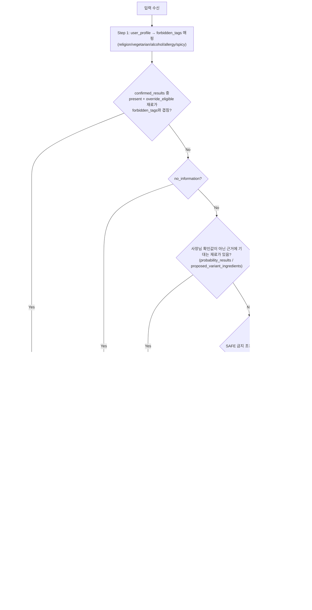

# ⑧ Decision Policy / XAI Agent 스펙

담당: 정유진
상태: 초안 (미확정 항목은 §8 참조)
상위 문서: `caution-multi-agent-architecture.md`, `caution-db-schema.md`

---

## 0. 역할 범위

두 가지 책임을 가진다.

1. **판정**: 확정값(hard evidence)과 확률(soft evidence)을 사용자 개인의 알레르기·식이 제약과 대조해 DANGER/CAUTION/SAFE를 결정
2. **설명**: 판정 근거를 사람이 이해할 수 있는 문장으로 바꾸고, 정보가 부족한 재료에 대해 사장님에게 물어볼 질문을 만듦

판정 로직과 설명 로직을 분리하지 않고 ⑧ 하나에 묶은 이유는 반대로 **"둘 다 사용자 프로필과 재료 데이터를 같은 순간에 대조해야" 자연스럽기 때문**이다. 대신 ⑧을 확률 계산(⑤)이나 하드 오버라이드 조회(③)로부터는 분리해둬서, 판정 기준이나 문구·언어가 바뀔 때 이 문서/⑧만 고치면 되게 했다.

---

## 1. 입력 / 출력 스펙

입출력 JSON은 ⓪ §1(공통 모델)·§4-7을 기준으로 한다. 아래는 같은 내용을 옮긴 것이다.

### 입력 — `DecisionRequest` (Supervisor가 취합해서 전달)

```json
{
  "context": {
    "schema_version": "1.0",
    "trace_id": "0199a2f0-0000-7000-8000-000000000001",
    "scan_session_id": "scan-123",
    "store_id": 123456,
    "call_scope": "item",
    "item_id": "scan-123:0"
  },
  "menu": {
    "menu_id": "menu-001",
    "normalized_menu_name": "김치찌개"
  },
  "confirmed_results": [
    {
      "ingredient": {
        "ingredient_id": "ingredient-001",
        "canonical_name": "돼지고기"
      },
      "constraint_tags": ["is_pork"],
      "status": "present",
      "override_eligible": true,
      "evidence_refs": ["evidence-001"]
    }
  ],
  "probability_results": [
    {
      "ingredient": {
        "ingredient_id": "ingredient-010",
        "canonical_name": "액젓"
      },
      "constraint_tags": ["is_fish"],
      "posterior_mean": 0.62,
      "confidence": 0.55,
      "prior_source": "store",
      "anomaly_locked": false,
      "evidence_refs": ["recipe:menu-001:ingredient-010"]
    }
  ],
  "proposed_variant_ingredients": [
    {
      "ingredient": {
        "ingredient_id": "ingredient-020",
        "canonical_name": "소고기"
      },
      "constraint_tags": ["is_beef"],
      "source": "variant_suggested",
      "evidence_refs": ["runtime:scan-123:0:ocr_variant_tag:0"]
    }
  ],
  "no_information": false,
  "information_status": "complete",
  "user_profile": {
    "religion_type": "halal",
    "is_vegetarian": false,
    "vegetarian_type": null,
    "no_alcohol": false,
    "allergies": ["is_fish"],
    "no_spicy": false
  },
  "locale": "ko",
  "warnings": [],
  "errors": []
}
```

| 필드 | 타입 | 출처 | 설명 |
|---|---|---|---|
| `context` | object | ⓪ | 요청 공통 정보 (⓪ §1-2 `NodeContext`: `store_id`, `trace_id`, `item_id` 등). ⑧은 수정하지 않고 그대로 반환 |
| `menu` | object | ⓪ | `{menu_id, normalized_menu_name}`. 판정 대상 메뉴 |
| `confirmed_results` | `ConfirmedResult[]` | ③ Exact Feedback Tool | hard evidence. 재료별 `status` 3값과 `override_eligible`을 담은 목록. 없으면 `[]`. 형식은 아래 참고 |
| `probability_results` | `ProbabilityResult[]` | ⑤ Bayesian Tool | soft evidence. 재료별 확률 목록. 없으면 `[]`. 형식은 아래 참고 |
| `proposed_variant_ingredients` | `ProposedVariantIngredient[]` | ④ 변형 태깅 | **DB 미반영 제안.** DB에 없는 변형 메뉴에서 ④가 추정한 재료 목록. 없으면 `[]`. 형식은 아래 참고 |
| `no_information` | bool | ④/⑥ | 메뉴/재료 정보 자체가 없을 때 true (엣지 케이스 4) |
| `information_status` | `complete` / `partial` / `none` | ⓪ | 판정에 필요한 정보가 얼마나 모였는지. 앞 단계 조회·계산이 일부 실패하면 `partial`(예: ⑤ 계산 실패), 없으면 `none`. **`complete`가 아니면 SAFE 금지** |
| `user_profile` | object | `user_profiles` | `religion_type`, `is_vegetarian`, `vegetarian_type`, `no_alcohol`, `allergies`, `no_spicy` |
| `locale` | string | ⓪ | 사용자 화면 언어 (예: `ko`). 메시지는 6개 언어를 모두 만든다 (§4) |
| `warnings` / `errors` | array | ⓪ | 앞 단계(③④⑤ 등)가 남긴 신호. ⑧은 그대로 보존하고 자기 신호를 덧붙인다 |

#### `confirmed_results` 항목 형식 (⓪ §4-7과 동일)

| 필드 | 뜻 |
|---|---|
| `ingredient` | 확인된 재료. `ingredient_id`와 표준 이름 |
| `constraint_tags` | 이 재료가 걸리는 제한 태그 (예: 돼지고기 → `is_pork`). `forbidden_tags`와 비교하는 기준 |
| `status` | `present`(있다고 확인) / `absent`(없다고 확인) / `unknown`(아직 확인 안 됨) |
| `override_eligible` | 이 확인값으로 판정을 덮어써도 되는지. anomaly(통계적으로 이상한 답변)이거나 3개월이 지난 확인값이면 `false` |
| `evidence_refs` | 근거 ID 목록 |

- **`status`는 3값을 유지한다. `true/false` 2값으로 축약하지 않는다** (AGENTS.md 확정). 2값이면 "없다고 확인됨"과 "아직 안 물어봄"이 구분되지 않아, 안 물어본 재료가 "없음"으로 읽혀 SAFE가 될 수 있다 (FN).
- hard evidence로 쓰는 것은 **`override_eligible: true`이고 `status`가 `present` 또는 `absent`인 항목뿐**이다.
- `status: unknown`은 "없음"으로 취급하지 않는다. 확인값이 없는 것과 같다.
- `override_eligible: false`인 항목은 hard evidence로 쓰지 않는다. 이 재료는 ③이 ⑤로 넘겼으므로 `probability_results`의 확률로 판정한다.

#### `probability_results` 항목 형식 (⓪ §4-7과 동일)

| 필드 | 뜻 |
|---|---|
| `ingredient` | 재료. `ingredient_id`와 표준 이름 |
| `constraint_tags` | 이 재료가 걸리는 제한 태그 |
| `posterior_mean` | 이 가게에서 이 재료가 들어갈 확률 (0~1) |
| `confidence` | ⑤가 계산한 근거 충분도 (0~1). 아래 출력의 `evidence_basis`(confirmed/estimated/unknown)와는 별개다 |
| `prior_source` | 사전확률을 가져온 단계: `store` / `cluster` / `global` / `uninformative` |
| `anomaly_locked` | ③이 override를 거부한 이상 답변 재료인지. `true`면 확률값과 무관하게 CAUTION 이상 강제 (§2-1) |
| `evidence_refs` | 근거 ID 목록 |

#### `proposed_variant_ingredients` 항목 형식 (⓪ §4-7과 동일)

| 필드 | 뜻 |
|---|---|
| `ingredient` | ④가 추정한 재료. 예: 트러플된장찌개 → 기본 메뉴 된장찌개 + 남은 글자 "트러플"을 재료로 매핑 (④ §1-3) |
| `constraint_tags` | 이 재료가 걸리는 제한 태그 |
| `source` | `variant_suggested` — 런타임 추정 제안. DB에 저장되지 않았고 근거 개수도 0 (`k_count=0, n_total=0`, ④ §1-5) |
| `evidence_refs` | 근거 ID 목록 |

- 추정일 뿐이므로 확정 재료와 같은 신뢰도로 다루지 않는다. 사용자 제한과 겹치면 **최소 CAUTION, DANGER 확정 근거로 쓰지 않는다** (§2-1 5단계).

### 출력 — `DecisionResponse` (Supervisor에게 반환)

```json
{
  "context": {
    "schema_version": "1.0",
    "trace_id": "0199a2f0-0000-7000-8000-000000000001",
    "scan_session_id": "scan-123",
    "store_id": 123456,
    "call_scope": "item",
    "item_id": "scan-123:0"
  },
  "menu": {
    "menu_id": "menu-001",
    "normalized_menu_name": "김치찌개"
  },
  "risk_level": "danger",
  "evidence_basis": "confirmed",
  "information_status": "complete",
  "risk_ingredients": [
    {
      "ingredient": {
        "ingredient_id": "ingredient-001",
        "canonical_name": "돼지고기"
      },
      "constraint_tags": ["is_pork"],
      "matched_tags": ["is_pork"],
      "status": "present",
      "posterior_mean": null,
      "anomaly_locked": false,
      "evidence_refs": ["evidence-001"]
    }
  ],
  "matched_tags": ["is_pork"],
  "evidence_refs": ["evidence-001"],
  "message": {
    "ko": "돼지고기 성분이 포함되어 있어요.",
    "en": "This menu contains pork.",
    "ja": "このメニューには豚肉が含まれています。",
    "zh_hans": "这道菜含有猪肉成分。",
    "zh_hant": "這道菜含有豬肉成分。",
    "es": "Este plato contiene cerdo."
  },
  "owner_card": null,
  "warnings": [],
  "errors": []
}
```

| 필드 | 설명 |
|---|---|
| `context` / `menu` | 입력 값을 그대로 반환 |
| `risk_level` | `danger` / `caution` / `safe` |
| `evidence_basis` | 판정 근거 종류: `confirmed`(사장님 확인값) / `estimated`(확률 추정) / `unknown`(근거 부족) |
| `information_status` | `complete` / `partial` / `none`. 입력 값을 반영하며, `complete`가 아니면 `risk_level`은 `safe`가 될 수 없다 |
| `risk_ingredients[]` | 위험 재료 목록. 재료마다 `constraint_tags`(재료의 전체 제한 태그), `matched_tags`(그중 이 사용자와 실제로 겹친 태그), `status`(확인값이면 3값, 확률 근거면 `unknown`), `posterior_mean`(확률 근거일 때 값, 확인값이면 `null`), `anomaly_locked`, `evidence_refs` |
| `matched_tags` | 모든 위험 재료에서 사용자 제한과 겹친 태그를 중복 제거한 목록 (예전 이름 `hits`) |
| `evidence_refs` | 판정에 쓴 근거 ID 전체를 중복 제거한 목록. 위험 재료가 없는 SAFE 판정도 "없음" 확인 근거가 있으면 남긴다 |
| `message` | 6개 언어 문구. 키는 `ko`, `en`, `ja`, `zh_hans`, `zh_hant`, `es` (§4) |
| `owner_card` | 사장님 질문 카드. 질문이 필요 없으면 `null`. 형식은 아래 참고 |
| `warnings` / `errors` | 입력 신호를 보존하고 ⑧의 신호를 덧붙임 |

`evidence_basis` 필드가 핵심이다 — 같은 `risk_level: danger`라도 **확정값 기반인지 확률 추정 기반인지**를 사용자에게 다른 톤으로 전달해야 한다 (§4 참고).

> 이름: 원래 `confidence`였으나 ⑤가 계산하는 0~1 숫자 `confidence`(재료별 근거 충분도)와 이름이 겹쳐 `evidence_basis`(판정 근거 종류)로 바꿨다 (2026-10-08). 값은 그대로 `confirmed | estimated | unknown`이다.

#### `owner_card` 형식 (⓪ §4-7과 동일)

```json
{
  "menu_id": "menu-001",
  "ingredient": {
    "ingredient_id": "ingredient-010",
    "canonical_name": "액젓"
  },
  "question": {
    "ko": "이 메뉴에 액젓이 들어가나요?",
    "en": "Does this menu contain fish sauce?",
    "ja": "このメニューに魚醤は入っていますか？",
    "zh_hans": "这道菜含鱼露吗？",
    "zh_hant": "這道菜含魚露嗎？",
    "es": "¿Este plato contiene salsa de pescado?"
  },
  "reason_codes": ["low_confidence"],
  "evidence_refs": ["evidence-010"]
}
```

| 필드 | 설명 |
|---|---|
| `menu_id` | 질문 대상 메뉴 |
| `ingredient` | 물어볼 재료 |
| `question` | 6개 언어 질문 문구 |
| `reason_codes` | 왜 묻는지 (예: `low_confidence` — 확률 근거가 부족함) |
| `evidence_refs` | 질문을 만들게 한 근거 ID |

---

## 2. 처리 로직



### 2-1. Step별 설명

1. **forbidden_tags 매핑**: `religion_type`(halal→is_pork/is_alcohol 등), `vegetarian_type`, `no_alcohol`, `allergies`, `no_spicy`를 하나의 금지 태그 집합으로 변환.
2. **hard evidence 우선 체크**: `confirmed_results` 중 `status: present`이고 `override_eligible: true`인 재료의 `constraint_tags`가 forbidden_tags와 겹치면 다른 계산 없이 즉시 `danger` + `evidence_basis: confirmed`. `status: absent`이고 `override_eligible: true`인 재료는 확률과 무관하게 "없음"으로 확정한다. `unknown`이나 `override_eligible: false`인 항목은 이 단계에서 쓰지 않는다.
3. **정보 없음 우선순위**: hard evidence로 안 걸렸어도 `no_information: true`면 확률 계산 자체를 건너뛰고 `caution` 이상 강제 (엣지 케이스 4와 동일 원칙).
3-1. **anomaly_locked 강제**: `probability_results`에서 `anomaly_locked: true`인 재료는 posterior_mean이 아무리 낮게 나와도 `caution` 이상으로 강제하고 `evidence_basis: estimated`로 표시 — ③이 override를 거부한 이상 답변이 확률 계산을 거치며 조용히 SAFE로 새는 것을 막기 위함(이 값이 ④를 거쳐 여기까지 끊기지 않고 와야 함).
3-2. **정보 부족 시 SAFE 금지**: `information_status`가 `partial` 또는 `none`이면 확률이 낮게 나와도 `safe`를 내지 않고 `caution` 이상으로 둔다. 앞 단계 조회·계산이 일부 실패한 상태에서 남은 재료만 보고 SAFE를 내면 빠진 재료를 놓친다 (FN).
3-3. **앞 단계 경고 시 SAFE 금지**: 입력 `warnings` 중 `forces_caution: true`가 하나라도 있으면 `safe`를 내지 않고 `caution` 이상으로 둔다. 앞 단계가 문제를 발견했다는 신호다 (예: ③ 재료 태그 조회 실패 `constraint_tags_lookup_failed`, ④ 순환 참조 `cycle_detected`, ⑥ 태그 매핑 실패 `unmapped_constraint_tags`). 예를 들어 ③이 태그 조회에 실패해 돼지고기에 `is_pork`가 안 붙으면, 이 단계가 없을 때 할랄 사용자에게 SAFE가 나갈 수 있다 (FN).
4. **확정값이 없는 재료는 CAUTION**: `probability_results`나 `proposed_variant_ingredients`에 재료가 하나라도 있으면(사장님 확인값이 아닌 근거에 기대는 재료) `risk_level: caution`, `evidence_basis: estimated`로 둔다. 확률이 아무리 높거나 낮아도 확률만으로 DANGER/SAFE를 내지 않는다 (§3, PPT 8쪽 6). 금지 태그와 겹치는 재료는 `risk_ingredients`에 `posterior_mean`(확률 수치)과 함께 담아 사용자에게 보여준다.
4-1. **SAFE는 사장님 확인값으로만**: 판정에 쓴 재료가 모두 사장님 확인값(`override_eligible: true`)이고, 금지 태그와 겹치는 `present` 재료가 없고, §2-2의 SAFE 금지 조건에 하나도 해당하지 않을 때만 `risk_level: safe`, `evidence_basis: confirmed`다.
5. **변형 제안 반영**: `proposed_variant_ingredients`가 있으면 확정 재료와 **절대 같은 신뢰도로 취급하지 않는다** — 최소 caution 처리하고, 문구도 추정형으로만 생성 (danger 확정 근거로 쓰지 않음).
6. **메시지 생성**: `evidence_basis`에 따라 확정형/추정형 문구 템플릿 분기 (§4).
7. **사장님 질문 생성**: 확정도 안 되고 확률도 애매한 재료 중 사용자 태그와 관련 있는 것 하나를 골라 `owner_card` 생성.

### 2-2. SAFE 금지 조건 (⓪ §4-7과 동일)

아래 중 하나라도 해당하면 확률이 아무리 낮아도 `risk_level`을 `safe`로 내지 않는다.

| 조건 | 뜻 | 처리 단계 |
|---|---|---|
| `no_information: true` | 메뉴·재료 정보 자체가 없음 | 3 |
| `probability_results`에 `anomaly_locked: true` 재료 존재 | ③이 override를 거부한 이상 답변 재료 | 3-1 |
| `information_status`가 `partial` 또는 `none` | 앞 단계 조회·계산이 일부 또는 전부 실패 | 3-2 |
| `warnings`에 `forces_caution: true` 존재 | 앞 단계가 "SAFE 금지" 신호를 보냄 | 3-3 |
| `probability_results` 또는 `proposed_variant_ingredients`가 비어 있지 않음 | 사장님 확인값이 아닌 근거(확률·변형 추정)에 기대는 재료가 있음 | 4 |

---

## 3. 판정 기준 — DANGER/SAFE는 사장님 확인값으로만 (PPT 8쪽 6)

제출 PPT 8쪽 "6 최종판단 기준"을 따른다 (`ppt-baseline.md`).

> - Hard Evidence 있음 (사장님 확인 n건↑) → DANGER/SAFE 확정, n개월마다 재확인
> - Hard Evidence 없음 → DANGER/SAFE 판정 불가, CAUTION + 확률 수치까지 제공

| 근거 | `risk_level` | `evidence_basis` |
|---|---|---|
| 사장님 확인값(`override_eligible: true`)으로 금지 태그 재료가 `present` | `danger` | `confirmed` |
| 판정에 쓴 재료가 모두 사장님 확인값이고 금지 태그 재료가 없으며, SAFE 금지 조건(§2-2)에 해당하지 않음 | `safe` | `confirmed` |
| 확률·변형 추정에 기대는 재료가 있음 | `caution` + 금지 태그와 겹치는 재료의 확률 수치 | `estimated` |
| 정보 자체가 없음 (`no_information`) | `caution` | `unknown` |

- **확률(`posterior_mean`)은 판정 기준선이 아니다.** 확률이 0.95여도 DANGER가 아니고, 0.01이어도 SAFE가 아니다. 확률은 사용자에게 보여줄 수치와 사장님 질문(`owner_card`) 우선순위에 쓴다.
- 따라서 확률을 DANGER/CAUTION/SAFE로 나누는 컷오프(F2 최적화)는 `risk_level` 판정에 쓰지 않는다.

---

## 4. 다국어 메시지 정책

6개 언어를 지원하기로 확정: `ko`(한국어), `en`(영어), `ja`(일본어), `zh_hans`(중국어 간체), `zh_hant`(중국어 번체), `es`(스페인어). JSON 키는 ⓪ 규칙(snake_case)을 따른다.

**확정형 vs 추정형 톤 구분이 핵심 설계 포인트다**:

| evidence_basis | 문구 톤 | 예시 (ko) |
|---|---|---|
| `confirmed` | 단정형 | "돼지고기 성분이 포함되어 있어요." |
| `estimated` | 추정형, 확률 뉘앙스 포함 | "돼지고기가 들어있을 가능성이 있어요." |
| `unknown` | 정보 부족 명시 | "이 메뉴에 대한 정보가 부족해 안전을 확인할 수 없어요." |

이 구분을 안 하면 확률 추정치를 확정 사실처럼 전달하게 되어, 사용자가 과신하거나(추정을 확정으로 오해) 반대로 신뢰를 잃을(나중에 틀렸을 때) 위험이 있다.

---

## 5. Supervisor와의 계약

| ⑧이 받는 것 | 보장 사항 |
|---|---|
| `confirmed_results`/`probability_results` | Supervisor가 ③/⑤ 호출을 마친 뒤에만 전달 — 부분적으로만 채워질 수 있음(둘 다 없을 수도 있음, 그 경우 `no_information` 처리) |
| `user_profile` | 온보딩 단계에서 필수로 수집되므로 항상 존재함이 보장됨 (비로그인/미입력 케이스 없음) |

| ⑧이 돌려주는 것 | Supervisor의 후속 판단 |
|---|---|
| `owner_card != null` | Supervisor가 ⑦에 전달 → ⑦이 저장 명령 생성 → **백엔드가 `owner_verification_requests`에 INSERT**. XAI와 ⑦은 DB 자격 증명을 갖지 않음 |
| `risk_level` | 최종 사용자 응답에 그대로 포함, 추가 라우팅 없음 (파이프라인의 마지막 단계) |

---

## 6. 예외 처리

| 상황 | 처리 |
|---|---|
| `confirmed_results`와 `probability_results`가 동시에 같은 재료를 다르게 판정 | `override_eligible: true`인 `confirmed_results`(hard evidence)가 우선. `override_eligible: false`면 확률 쪽을 따른다 |
| `confirmed_results`에 `status: unknown` 항목이 있음 | "없음"으로 읽지 않는다. 확인값이 없는 재료로 처리 |
| `proposed_variant_ingredients`만 있고 나머지는 다 없음 | caution으로 처리하되 `evidence_basis: estimated`, danger로 격상 금지 |
| 사용자 태그와 무관한 재료만 애매함 | `owner_card` 생성 안 함 — 관련 없는 질문으로 사장님 피로도 유발 방지 |

---

## 7. 테스트 케이스

| # | 입력 | 기대 출력 | 검증 포인트 |
|---|---|---|---|
| 1 | 할랄 사용자 + `confirmed_results`: 돼지고기 `status: present`, `constraint_tags: [is_pork]`, `override_eligible: true` | `danger`, `evidence_basis: confirmed` | 확정형 문구 사용 |
| 2 | 비건 사용자 + `probability_results`: 우유(`is_milk`) `posterior_mean: 0.3` | `caution`, `evidence_basis: estimated`, `risk_ingredients`에 우유 확률 0.3 포함 | 확률만으로 SAFE를 내지 않을 것, 추정형 문구 |
| 3 | `no_information: true` | `caution` 이상 강제 | FN-minimization 원칙 위반 없을 것 |
| 4 | `proposed_variant_ingredients`만 있음(차돌된장찌개, 소고기 제안) + 채식 사용자 | `caution`, `evidence_basis: estimated` | `danger`로 절대 확정 짓지 않을 것 |
| 5 | 알레르기 태그와 무관한 애매 재료만 존재 | `owner_card: null` | 불필요한 사장님 질문 생성 안 할 것 |
| 6 | `confirmed_results`(`override_eligible: true`)와 `probability_results`가 상반 | `confirmed_results` 값이 이김 | hard evidence 우선순위 확인 |
| 7 | 할랄 사용자 + `confirmed_results`: 돼지고기 `status: unknown` | 돼지고기를 "없음"으로 처리하지 않음 | `unknown`이 SAFE 근거가 되지 않을 것 (3값 검증) |
| 8 | 할랄 사용자 + `confirmed_results`: 돼지고기 `status: absent`, `override_eligible: false` + `probability_results`: 돼지고기 0.8 | 확률 쪽으로 판정 (`caution` 이상) | override 불가 확인값이 확률을 덮지 않을 것 |
| 9 | `information_status: partial` + 남은 재료 확률이 모두 낮음 | `caution` 이상, 출력 `information_status: partial` | 정보가 빠진 상태에서 SAFE가 나오지 않을 것 |
| 10 | 할랄 사용자 + 돼지고기 `constraint_tags: []` + 입력 `warnings`에 `constraint_tags_lookup_failed`(`forces_caution: true`) | `caution` 이상, 입력 warning을 출력에 보존 | 태그가 빠져도 SAFE가 나오지 않을 것 |
| 11 | 할랄 사용자 + `probability_results`: 돼지고기 `posterior_mean: 0.95`만 있음 | `caution`, `evidence_basis: estimated`, 확률 0.95 표시 | 확률만으로 DANGER를 내지 않을 것 (PPT 8쪽 6) |
| 12 | 할랄 사용자 + `confirmed_results`만 있음: 모든 재료 사장님 확인, 돼지고기 `absent`(`override_eligible: true`) + `probability_results: []` + SAFE 금지 조건 없음 | `safe`, `evidence_basis: confirmed` | SAFE는 사장님 확인값으로만 나올 것 |

---

## 8. 미확정 항목 (팀 확인 대기)

- [x] **DANGER/CAUTION/SAFE 컷오프** — 확률 컷오프로 판정하지 않는다. DANGER/SAFE는 사장님 확인값으로만, 확정값이 없으면 CAUTION + 확률 수치 (PPT 8쪽 6, §3)
- [x] **컷오프 계산/보관 주체** — 확률 컷오프가 없으므로 해당 없음 (§3)
