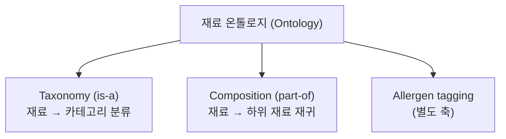
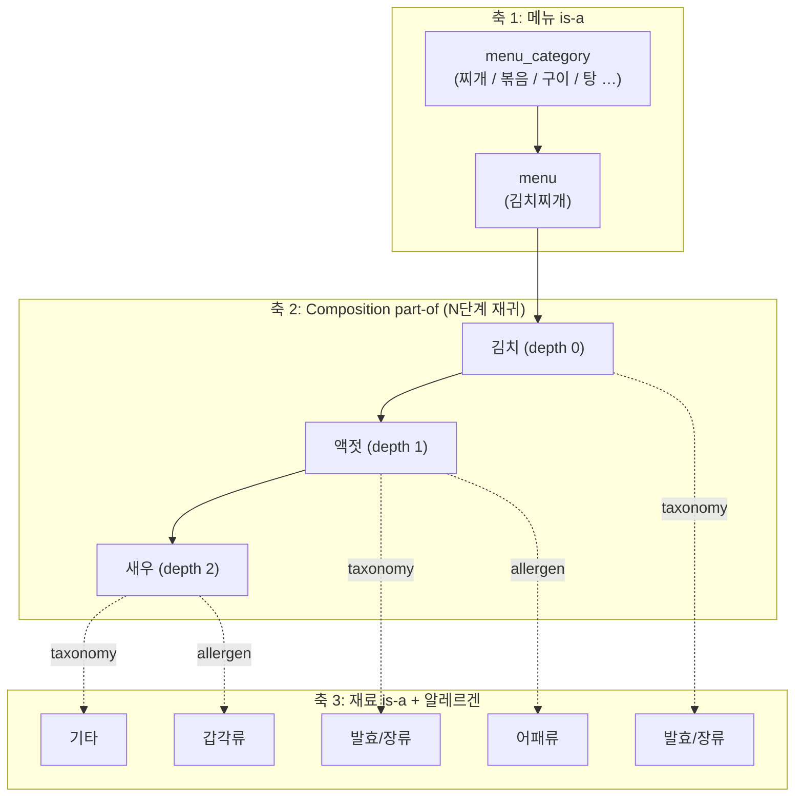
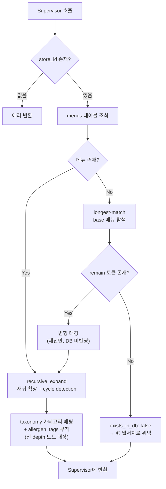

# ④ DB/온톨로지 조회 + 재귀 확장 + 변형 태깅 에이전트

담당: 윤지
상태: 초안 (미확정 항목은 §8 참조)
상위 문서: `catoin-multi-agent-architecture.md`

---

## 0. 용어 정의 (Ontology vs Taxonomy)

이 문서에서 두 용어는 **다른 것**을 가리킨다. 혼용 금지.

| 용어 | 관계 | 질문 | 예시 | 구현 필드 |
|---|---|---|---|---|
| **Taxonomy** | `is-a` | "이건 무슨 종류인가?" | 액젓 **is-a** 발효/장류 | `taxonomy` |
| **Ontology** | taxonomy + `part-of` 등 | "이건 무엇으로 이루어지는가?" | 김치찌개 **has** 김치 **has** 액젓 | `hidden` + `taxonomy` |

- **Taxonomy는 Ontology의 부분집합이다.** Taxonomy는 계층 분류 트리 하나뿐이고, 여기에 `part-of` 같은 다른 관계가 추가되면 Ontology가 된다.
- `hidden_rules.py`는 두 관계를 모두 담고 있으므로 **재료 온톨로지(ingredient ontology)** 가 정확한 명칭이다.
  - 7개 카테고리 분류 부분만 지칭할 때 → "taxonomy 분류"
  - 재귀 확장 부분을 지칭할 때 → "composition(part-of) 기반 재귀 확장"



---

## 1. 3축 구조

이 에이전트가 다루는 데이터는 **선형 계층이 아니라 3개의 독립 축**이다.



### 각 축의 설계 원칙

**축 1 — 메뉴 taxonomy (`menu_category`)**
- 찌개 / 볶음 / 구이 / 탕 / 면 등 조리법 기반 상위 분류.
- **용도**: ⑤ Bayesian 에이전트가 해당 store의 prior가 없을 때 **유사 메뉴 클러스터 prior로 fallback** 하는 근거가 된다. 이 축이 없으면 전역 prior로 바로 떨어짐.

**축 2 — Composition (`part-of`, 재귀)**
- **depth를 고정하지 않는다.** 김치찌개 → 김치 → 액젓 → 새우처럼 깊이가 가변이다.
- 각 노드에 `depth` 값을 기록한다. depth 0(직접 재료)과 depth 3(3단계 하위 재료)을 동일 확률로 취급하면 안 되기 때문 (⑤에서 감쇠 적용 여부 결정, §8 참조).
- 순환 참조 탐지(cycle detection)는 `recursive_expand.py`에 이미 구현되어 있다.

**축 3 — 재료 taxonomy + 알레르겐 (독립 축)**
- taxonomy 카테고리는 **재귀의 모든 노드에 붙는다.** depth 0이든 depth 3이든 전부 카테고리를 가진다. 축 2와 독립적이기 때문.
- **알레르겐은 taxonomy 카테고리가 아니라 별개 축이다.** 밀가루/새우/땅콩은 재료(ingredient)이지 카테고리가 아니다. taxonomy에 끼워넣으면 분류 체계가 무너진다 → `allergen_tags` 배열로 분리.

---

## 2. Taxonomy 카테고리 (개정)

`hidden_rules.py` 기존 7개 카테고리에서 **교차오염 카테고리를 제외**한다.

| 카테고리 | 비고 |
|---|---|
| 발효/장류 | 유지 |
| 소스 | 유지 |
| 육수 | 유지 |
| 양념 | 유지 |
| 고명/견과 | 유지 |
| 유지류 | 유지 |
| 기타 | 신설 (재배치 잔여 재료 수용) |
| ~~교차오염~~ | **제외** (§3 참조) |

기존 교차오염 소속 31개 재료 처리:
- 실제로 다른 카테고리(소스/양념/유지류 등)에 속하는 재료 → 해당 카테고리로 **이동**
- 두부·밀가루 등 일반 재료 → 카테고리는 `기타`, 위험 정보는 `allergen_tags`로 이관
- 재배치 상세 매핑표: **작성 대기** (§8)

---

## 3. 모델 범위 선언 (Scope)

> 본 모델은 **레시피 구성 기반 재료 추론**만을 범위로 한다.
> 조리 과정의 교차오염(공유 기름·도마·불판) 및 제조 공정 오염(가공식품 설비 공유)은 **가게 단위로 관측 불가능**하므로 모델 범위에서 제외한다.
> 해당 위험은 확률 모델이 아닌 **사장님 질문 생성 경로(⑧ XAI)** 로 위임한다.

**근거**: FN-minimization이 북극성 지표이지만, 관측 불가능한 변수를 확률 모델에 강제로 포함하면 근거 없는 추정치가 들어가 노이즈가 증가하고 판정 신뢰도(calibration)가 오히려 저하된다. 관측 불가능한 위험은 **확률로 추정하는 대신 직접 질의**하는 경로로 처리하는 것이 정확도와 설명가능성 모두에서 우위다.

---

## 4. 입력 / 출력 스펙

### 입력 (Supervisor로부터)

| 필드 | 타입 | 필수 | 설명 |
|---|---|---|---|
| `store_id` | string | **필수** | 없으면 즉시 에러 반환. 전역 조회 금지 |
| `normalized_menu_name` | string | 필수 | ② 정규화 에이전트 출력 |
| `unconfirmed_only` | bool | 필수 | ③ Exact에서 미확인된 재료만 처리할지 여부 |
| `confirmed_ingredients` | string[] | 선택 | ③에서 이미 확인된 재료 (중복 확장 방지) |

### 출력 (Supervisor에게 반환)

```json
{
  "store_id": "str",
  "menu_id": "str | null",
  "base_menu_id": "str | null",
  "menu_category": "찌개 | 볶음 | ...",
  "exists_in_db": true,
  "is_variant": false,
  "ingredients": [
    {
      "name": "액젓",
      "taxonomy_category": "발효/장류",
      "allergen_tags": ["어패류"],
      "depth": 1,
      "parent": "김치",
      "source": "expanded"
    }
  ],
  "variant_suggestion": {
    "base_menu": "된장찌개",
    "remain_token": "차돌",
    "suggested_ingredients": ["소고기"]
  },
  "unmapped_token": "str | null"
}
```

**`source` 필드 값 (⑤ Bayesian이 이 값으로 prior를 다르게 준다)**

| 값 | 의미 | ⑤에서의 취급 |
|---|---|---|
| `recipe` | DB `recipe_ingredients`에 명시된 직접 재료 | 확정 재료 prior |
| `expanded` | 재귀 확장으로 도출된 하위 재료 | depth 고려 prior |
| `variant_suggested` | 변형 태깅으로 제안된 재료 (DB 미반영) | **낮은 신뢰도 prior** |

> ⚠️ 제안된 변형 재료를 확정 재료와 동일한 신뢰도로 처리하면 **FN 발생 지점**이 된다. `source` 구분은 선택이 아니라 필수다.

---

## 5. 처리 로직



### 5-1. 기본 조회 + 재귀 확장
1. `store_id` 검증 → 없으면 즉시 에러 (전역 prior 오염 방지)
2. `menus` / `recipe_ingredients` 조회
3. `recursive_expand.py` 로직으로 `part-of` 재귀 확장, cycle detection 적용
4. 모든 노드에 `depth`, `parent` 기록

### 5-2. 변형 태깅
1. longest-match로 등록된 기본 메뉴 탐색 (`"차돌된장찌개"` → base=`"된장찌개"`)
2. 남은 토큰(remain) 추출 (`"차돌"`)
3. remain을 재료로 매핑 → `variant_suggested`로 태깅
4. **DB에 쓰지 않는다.** ⑤ Bayesian이 메모리에서 즉시 사용
5. 실제 DB 반영 시엔 원본 메뉴 row를 재사용하지 않고, `base_menu_id`로 원본을 참조하는 **새 `menus` 행**(`source: variant_generated`)을 생성 → 원본 메뉴의 확률과 섞이지 않도록. 이 INSERT는 **⑦ DB 업데이트 에이전트가 관리자 컨펌 후** 처리

### 5-3. 카테고리 태깅
- 확장된 **전 노드**에 taxonomy 카테고리 매핑 (depth 무관)
- 알레르겐 재료에 `allergen_tags` 부착

### 5-4. 함수 시그니처

```python
def query_ontology(
    store_id: str,                          # 필수. None이면 StoreIdRequiredError
    normalized_menu_name: str,
    unconfirmed_only: bool = True,
    confirmed_ingredients: list[str] | None = None,
) -> OntologyResult:
    """④ DB/온톨로지 조회 + 재귀 확장 + 변형 태깅 진입점."""


def recursive_expand(
    ingredient: str,
    depth: int = 0,
    visited: set[str] | None = None,         # cycle detection
    max_depth: int | None = None,            # 미확정 §8
) -> list[IngredientNode]:
    """part-of 관계 재귀 확장. visited로 순환 차단."""


def tag_variant(
    menu_name: str,
) -> VariantSuggestion | None:
    """longest-match로 base/remain 분리 → 변형 재료 제안.
    DB 쓰기 금지. 반환값은 메모리 전달용."""


def attach_taxonomy(
    nodes: list[IngredientNode],
) -> list[IngredientNode]:
    """전 depth 노드에 taxonomy_category + allergen_tags 부착."""
```

의사코드 (메인 흐름):

```
if store_id is None: raise StoreIdRequiredError

menu = db.find_menu(store_id, normalized_menu_name)

if menu is None:
    variant = tag_variant(normalized_menu_name)
    if variant is None:
        return OntologyResult(exists_in_db=False)   # → Supervisor가 ⑥ 웹서치 판단
    menu = variant.base_menu
    extra = variant.suggested_ingredients           # source=variant_suggested

seeds = db.get_recipe_ingredients(menu.id)
if unconfirmed_only:
    seeds = [s for s in seeds if s not in confirmed_ingredients]

nodes = []
for s in seeds + extra:
    nodes += recursive_expand(s, depth=0, visited=set())

return OntologyResult(ingredients=attach_taxonomy(nodes), ...)
```

---

## 6. Supervisor와의 계약 (Contract)

**호출 조건**: ③ Exact 피드백 에이전트가 미확인 재료를 1개 이상 반환한 경우에만 Supervisor가 호출한다. 전부 확인된 경우 이 에이전트는 스킵된다.

**Supervisor → ④ (받는 것)**

| 필드 | 보장 사항 |
|---|---|
| `store_id` | Supervisor가 가게 식별을 완료한 뒤 발급/조회한 값. **null 불가** |
| `normalized_menu_name` | ② 정규화 에이전트를 이미 거친 값. ④는 재정규화하지 않음 |
| `confirmed_ingredients` | ③의 출력에서 확인여부=true인 재료만 |

**④ → Supervisor (돌려주는 것)**

| 필드 | Supervisor의 후속 판단 |
|---|---|
| `exists_in_db: false` | → ⑥ 웹서치 에이전트 호출 |
| `exists_in_db: true` | → ⑤ Bayesian 에이전트 호출 |
| `variant_suggestion != null` | → ⑤에 즉시 전달 **+** ⑦에 관리자 검토 자료로 전달 |
| `ingredients[].source` | → ⑤가 prior 신뢰도를 차등 적용하는 근거 |

**④가 직접 호출하지 않는 것**: 다른 어떤 에이전트도 직접 호출하지 않는다. 웹서치 호출 여부, DB 반영 여부, 판정 모두 Supervisor가 결정한다. ④는 조회·확장·태깅 후 결과만 반환하고 종료한다.

### 6-1. 케이스별 관여 범위

원본 아키텍처 문서의 시나리오 중 ④가 관여하는 지점.

| 케이스 | ④의 동작 | 반환 |
|---|---|---|
| **1) DB 존재 + 사장님 피드백 없음** | 전체 재료 재귀 확장 | `exists_in_db: true`, 전 재료 `source: recipe/expanded` |
| **2) DB 존재 + 피드백 일부 존재** | `confirmed_ingredients` 제외한 **나머지 재료만** 확장 | 부분 재료 리스트. 확인된 재료 재확장 금지 |
| **2-b) 피드백 전부 존재** | **호출되지 않음** (Supervisor가 스킵) | — |
| **3) 변형 메뉴 (차돌된장찌개)** | longest-match → remain 태깅 → 제안 | `variant_suggestion` 채움, **DB INSERT 없음** |
| **4) DB에 없는 unknown 메뉴** | 조회 실패 확인까지만 | `exists_in_db: false`. ⑥ 웹서치는 ④가 호출하지 않음 |
| **5) 웹서치까지 실패 (엣지)** | **관여 없음** | 4번에서 이미 종료. 이후는 ⑧ XAI가 CAUTION 이상 강제 유지 |

### 6-2. 예외 처리

| 상황 | 처리 |
|---|---|
| `store_id` 누락/null | `StoreIdRequiredError` 즉시 발생. **전역 조회 fallback 금지** |
| 순환 참조 (A→B→A) | `visited` set으로 차단, 경고 로그, 이미 확장된 노드까지 반환 |
| 재귀 깊이 과다 | `max_depth` 미확정 (§8). 임시로 경고 로그 후 계속 확장 |
| longest-match 성공, remain 매핑 실패 (`"우리집된장찌개"`) | base 메뉴로 처리 + remain은 무시, `unmapped_token` 필드에 기록 |
| taxonomy 미등록 재료 | `기타` 카테고리 부여. **드롭 금지** — 재료 누락은 FN 직결 |
| `recipe_ingredients` 빈 배열 | `exists_in_db: true`지만 재료 0개 → Supervisor에 경고 플래그. ⑧에서 CAUTION 이상 유지 |

### 6-3. 이 에이전트가 하지 않는 것

| 하지 않음 | 담당 |
|---|---|
| DB 쓰기 (INSERT/UPDATE) | ⑦ DB 업데이트 (관리자 컨펌 후) |
| 재료 존재 확률 계산 | ⑤ Bayesian |
| DANGER/CAUTION/SAFE 판정 | ⑧ XAI |
| 웹서치 호출 여부 결정 | ① Supervisor |
| 조리 중 교차오염 추정 | 모델 범위 외 (§3) |

---

## 7. 테스트 케이스

| # | 입력 | 기대 동작 | 검증 포인트 |
|---|---|---|---|
| 1 | `김치찌개` (DB 존재) | 재귀 확장 → 김치(d0) → 액젓(d1) → 새우(d2) | depth 기록, 전 노드 taxonomy 부착, 새우에 갑각류 알레르겐 태그 |
| 2 | `차돌된장찌개` (변형) | base=된장찌개 + remain=차돌 → `variant_suggested` | **DB INSERT가 발생하지 않을 것**, `base_menu_id` 세팅됨 |
| 3 | `듣도보도못한메뉴` | `exists_in_db: false` 반환 | 웹서치 호출을 이 에이전트가 직접 하지 않을 것 |
| 4 | `store_id` 누락 | 즉시 에러 | 전역 조회로 fallback 하지 않을 것 |
| 5 | 순환 참조 재료 | cycle detection 작동, 무한루프 없음 | 확장 종료 및 경고 로그 |
| 6 | ③에서 일부 재료 확인됨 | 미확인 재료만 확장 | `confirmed_ingredients` 중복 확장 안 함 |
| 7 | `우리집된장찌개` | base=된장찌개, remain 매핑 실패 | `unmapped_token`에 기록, 에러 없이 진행 |
| 8 | taxonomy 미등록 재료 포함 | `기타` 카테고리 부여 | 재료가 드롭되지 않을 것 |

---

## 8. 미확정 항목 (팀 확인 대기)

- [ ] **교차오염 31개 재료 재배치 매핑표** — 어느 재료가 어느 카테고리로 이동하는지 확정 필요
- [ ] **depth 감쇠(decay) 적용 여부** — depth가 깊을수록 존재 확률을 낮출지, 낮춘다면 감쇠 함수 형태. ⑤ Bayesian 스펙과 연동 결정 필요
- [ ] **`max_depth` 상한값** — 재귀 깊이 제한을 둘지, 둔다면 몇 단계까지
- [ ] **`menu_category` 분류 체계** — 찌개/볶음/구이 외 전체 카테고리 목록 및 `menus.csv` 76개 항목 매핑. **menus.csv가 단일 카테고리라면 축 1의 클러스터 fallback 자체가 무효화되므로 우선 확인 필요**
- [ ] **`variant_suggested` 재료의 prior 값** — 확정 재료 대비 얼마나 낮출지 (⑤에서 결정)
