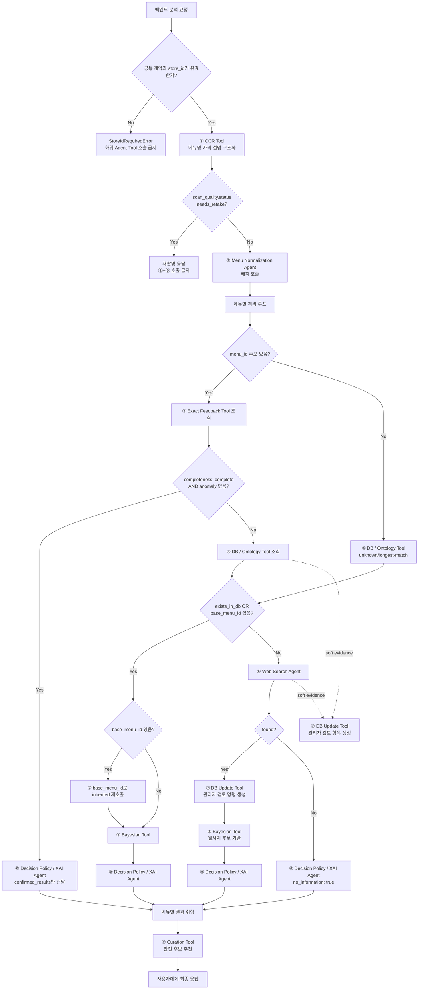

# ⓪ Supervisor Agent 스펙

담당: 박다은
상태: 구현 기준안 (입출력 계약 확정, 정책 미확정 항목은 §8 참조)
상위 문서: `caution-multi-agent-architecture.md`, `caution-db-schema.md`

---

## 0. 역할 범위

Supervisor는 사용자 스캔 요청의 **유일한 진입점**이며, ① OCR Tool 호출부터 ⑨ Curation Tool 결과 취합까지 전체 파이프라인을 오케스트레이션한다.

핵심 책임은 세 가지다.

1. **백엔드가 확정한 `store_id` 검증과 스코프 강제**
2. **하위 Agent·Tool 호출 순서 결정과 결과 취합**
3. **요청 상태·근거·오류·실행 로그의 중앙 관리**

모든 하위 Agent·Tool은 Supervisor의 호출을 받아서만 동작하고, 결과도 Supervisor에게만 반환한다. Agent·Tool 간 직접 호출은 금지한다.

| 하지 않음 | 담당 |
|---|---|
| OCR 자체 수행 | ① OCR Tool |
| 메뉴명 문자열 정제 | ② |
| 확정 재료 조회 | ③ |
| 재료 확장/변형 태깅 | ④ |
| 확률 계산 | ⑤ |
| 웹 크롤링 | ⑥ |
| 물리 DB 쓰기/트랜잭션 | 백엔드 영속화 계층 |
| 저장 명령 생성 | ⑦ |
| 최종 위험 문구 생성 | ⑧ |

### 0-1. 중앙집중형 구조를 쓰는 이유

`store_id`가 빠지면 가게별 확정값과 prior가 전역으로 섞인다. 이 경우 다른 식당의 사장님 답변이나 웹서치 기반 추정이 현재 식당의 위험도에 영향을 줄 수 있어 FN(false negative) 위험이 커진다.

→ Supervisor는 모든 하위 호출에 `store_id`를 필수로 실어 보내고, `store_id`가 없거나 유효하지 않은 요청은 ①~⑨를 호출하지 않는다.

### 0-2. 구현 프레임워크 — LangChain + LangGraph

Supervisor는 **LangGraph `StateGraph`로 전체 실행 순서를 만들고, LLM이 필요한 Agent 내부에서만 LangChain을 사용**한다. 두 라이브러리는 같은 일을 중복해서 하는 것이 아니다.

| 구성 요소 | 쉬운 설명 | 이 프로젝트에서 하는 일 |
|---|---|---|
| LangGraph | 업무 순서표와 진행 상황판 | ①~⑨ 호출 순서, 조건 분기, 메뉴별 병렬 처리, 결과 합치기, 실패 우회 |
| `StateGraph` | LangGraph로 만드는 실제 상태 기반 워크플로 | 각 node가 공용 state를 읽고 자기 결과만 반환하도록 강제 |
| LangChain | LLM을 정해진 입력·출력으로 호출하는 도구 | ② 정규화 보조, ⑥ 검색 판단·추출, ⑧ 설명 문구 생성 |
| Pydantic | JSON 출입구 검사기 | §1·§4의 필드, 타입, enum, null 허용 여부 검증 |
| 일반 Python/API adapter | LLM이 필요 없는 실행 코드 | ①·③·④·⑤·⑦·⑨ 연결 |

쉽게 비유하면 **LangGraph가 공장 컨베이어 벨트**, **각 node가 작업대**, **state가 작업 중인 제품에 붙은 기록지**, **LangChain은 일부 작업대에서만 쓰는 언어 해석 장비**다. Supervisor 자체가 거대한 LLM Agent가 되는 구조가 아니다.

#### 0-2-1. 왜 Supervisor를 자유형 LLM Agent로 만들지 않는가

Supervisor에게 "다음 Tool을 알아서 선택하라"고 맡기면 같은 입력도 실행 경로가 달라질 수 있고, `store_id`, 3-State, `anomaly_locked`, 근거 ID가 중간에 빠질 수 있다. 이 프로젝트는 FN 최소화가 우선이므로 호출 순서를 코드로 고정한다.

- 분기 판단은 `if`와 conditional edge가 담당한다.
- LLM은 graph의 다음 node 이름을 만들 수 없다.
- LLM은 `store_id`, 위험도 threshold, hard evidence 우선순위를 바꿀 수 없다.
- LLM 결과는 Pydantic 검증을 통과한 뒤에만 state에 들어간다.
- 검증 실패·timeout 시 미리 정한 보수적 fallback으로 이동한다.

#### 0-2-2. LangChain을 쓰는 곳과 쓰지 않는 곳

| 번호 | 구현 방식 | LangChain 사용 | 이유 |
|---|---|---|---|
| ① OCR Tool | 기존 OCR Python/API adapter | 사용하지 않음 | 이미지 OCR 실행은 정해진 절차 |
| ② Normalization Agent | 규칙·사전 우선 + 제한적 구조화 LLM | 필요할 때만 사용 | 다국어·오탈자·복수 후보의 문맥 판단 |
| ③ Exact Feedback Tool | DB read adapter | 사용하지 않음 | 확정값 조회는 결정론적이어야 함 |
| ④ DB/Ontology Tool | DB 조회·재귀 확장 함수 | 사용하지 않음 | 온톨로지 관계를 임의 생성하면 안 됨 |
| ⑤ Bayesian Tool | 수식 기반 Python 함수 | 사용하지 않음 | 같은 입력은 같은 확률을 내야 함 |
| ⑥ Web Search Agent | 검색 전략·추출에 구조화 LLM + 검색 provider | 사용 | 검색어 구성과 문서 속 재료 추출에 언어 판단 필요 |
| ⑦ DB Update Tool | 저장 명령 builder | 사용하지 않음 | 권한·근거·명령 형식은 고정 규칙 |
| ⑧ Decision/XAI Agent | 위험 판정은 정책 함수, 다국어 설명만 구조화 LLM 가능 | 제한적으로 사용 | LLM이 SAFE/DANGER를 임의 결정하면 안 됨 |
| ⑨ Curation Tool | 검증 인덱스 검색·점수 정렬 | 기본적으로 사용하지 않음 | 승인된 데이터와 정렬식만 사용 |

⑧에서 가장 중요한 경계는 **판정과 문장 생성을 분리**하는 것이다. `risk_level`, `matched_tags`, `evidence_basis`는 Python 정책 함수가 만들고, LangChain은 이 확정 결과를 자연어 문장으로 표현할 때만 사용할 수 있다. LLM이 반환한 문장이 판정 JSON을 다시 덮어쓸 수 없다.

#### 0-2-3. 구현 시 고정할 원칙

- graph는 애플리케이션 시작 시 한 번 `compile()`하고 요청마다 다시 만들지 않는다.
- FastAPI 경계에서는 동기 `invoke()`가 아니라 비동기 `ainvoke()`를 사용한다.
- graph node는 `async def node(state, runtime) -> dict` 형태로 만들고 **전체 state가 아니라 변경 필드만** 반환한다.
- 외부 API·DB·LLM client는 node 안에서 매번 생성하지 않고 FastAPI lifespan에서 만든 뒤 adapter에 주입한다.
- `store_id`, `trace_id`, `scan_session_id`, `schema_version`은 LangGraph run-scoped context의 immutable 값으로 둔다.
- `call_scope`와 `item_id`는 각 node가 공통 context에서 호출 대상에 맞게 조립한다.
- 여러 메뉴의 결과는 reducer로 모으고, 최종 출력 전에 `source_index`로 다시 정렬한다. 병렬 완료 순서를 사용자 출력 순서로 사용하지 않는다.
- 초기 버전은 `compile(checkpointer=False)` 또는 checkpointer 없이 요청 단위 휘발성 state로 실행한다. checkpoint 도입은 §8 결정 뒤에 한다.
- 라이브러리 도입 전 `langgraph`, `langchain`, `langchain-core`, 사용하는 모델 provider 패키지(예: `langchain-openai`)의 **정확한 호환 버전**을 #76에서 고정한다. 특히 현재 `openai==3.8.0`과 provider 패키지의 호환성을 함께 확인한다. 현재 `requirements.txt`에는 LangChain/LangGraph 의존성이 없으므로 승인 전 설치했다고 가정하지 않는다.

이 문서의 코드 예시는 LangGraph 1.x 공개 API인 `StateGraph`, `context_schema`, reducer, conditional edge, `Send`, `compile()`, `ainvoke()`를 기준으로 한다. 정확한 pin을 정한 뒤 import와 인자 이름을 해당 버전에서 한 번 더 확인한다.

### 0-3. 입출력 계약의 기준 문서

**①~⑨ Agent·Tool과 Supervisor 사이의 wire JSON은 이 문서 §1·§4를 단일 기준으로 사용한다.** 개별 Agent·Tool 문서는 각 노드의 내부 처리 로직과 도메인 규칙을 설명하지만, 필드명·타입·필수 여부가 이 문서와 다르면 이 문서에 맞춰 수정한다.

- 모든 노드는 §1-2의 `context`, `warnings`, `errors` 형식을 공통으로 사용한다.
- 내부 구현의 클래스명이나 DB 컬럼명이 달라도 경계에서는 이 문서의 JSON으로 변환한다.
- 새 필드가 필요하면 개별 문서만 먼저 바꾸지 않고 이 문서의 계약과 `schema_version`을 함께 변경한다.
- 예시 JSON도 계약으로 취급한다. `"str | null"`처럼 설명용 union 문자열을 실제 값으로 보내지 않는다.
- 요청의 `warnings`·`errors`에는 해당 branch에서 앞 단계가 만든 신호를 한 번씩 넣는다. 응답은 이를 그대로 보존하고 현재 노드 신호를 append한다. Supervisor는 `(code, node, item_id)` 기준으로 중복 제거한다.

---

## 1. 입력 / 출력 스펙

### 1-1. JSON 공통 규칙

- 필드명은 `snake_case`, enum 값은 소문자 `snake_case`를 사용한다.
- 시간은 UTC ISO-8601 문자열을 사용한다. 예: `2026-10-08T03:00:00Z`.
- ID는 문자열로 통일하되 `store_id`만 DB `BIGINT`와 맞추기 위해 양의 정수를 사용한다.
- 목록은 값이 없을 때 `[]`, 객체형 결과가 없을 때 `null`을 사용한다. 목록에 `null`을 넣지 않는다.
- 0~1 점수는 JSON number이며 범위를 벗어나면 validation error다.
- 재료 상태는 `present | absent | unknown`만 허용한다. boolean으로 축약하지 않는다.
- 모든 노드 요청·응답은 `context`, `warnings`, `errors`를 포함한다.
- 노드는 입력 `context`를 수정하지 않고 그대로 반환한다.
- §4의 객체는 **closed schema**로 구현한다. 예시에 나온 필드는 모두 필수이며, 값이 없어도 생략하지 않고 예시에 따라 `null` 또는 `[]`를 보낸다. 정의되지 않은 추가 필드는 거부한다.
- `null`은 예시나 설명에서 명시적으로 허용한 필드에만 사용할 수 있다. 새 필드·enum·null 허용 여부를 바꾸면 `schema_version`과 이 문서를 먼저 변경한다.

### 1-2. 공통 모델

#### `NodeContext`

```json
{
  "schema_version": "1.0",
  "trace_id": "0199a2f0-0000-7000-8000-000000000001",
  "scan_session_id": "scan-123",
  "store_id": 123456,
  "call_scope": "item",
  "item_id": "scan-123:0"
}
```

| 필드 | 타입 | 규칙 |
|---|---|---|
| `schema_version` | string | 초기값 `1.0`. breaking change는 major 증가 |
| `trace_id` | UUID string | 요청 전체에서 동일. 없으면 Supervisor가 최초 1회 발급 |
| `scan_session_id` | string | 요청 전체에서 동일 |
| `store_id` | integer | 양수 필수. 백엔드가 존재·활성 검증을 마친 값 |
| `call_scope` | `scan | item | out_of_band` | 메뉴판 배치, 메뉴 단위, 스캔 외 피드백 호출 구분 |
| `item_id` | string \| null | `item`이면 필수, `scan`·`out_of_band`이면 null 허용 |

#### `IngredientRef`

```json
{
  "ingredient_id": "ingredient-001",
  "canonical_name": "돼지고기"
}
```

`ingredient_id`는 표준 재료이면 필수다. 웹에서 처음 발견했거나 아직 매핑하지 못한 후보만 `null`을 허용하며 `canonical_name`은 항상 필수다.

#### `constraint_tags`

재료가 사용자 제한과 충돌하는지를 판정하기 위한 `is_*` 표준 태그 배열이다. 예: `is_pork`, `is_fish`, `is_beef`, `is_alcohol`, `is_spicy`. authoritative vocabulary는 `ingredients.tag`와 ④ 온톨로지 데이터이며 ③·④·⑤·⑥·⑧ 사이에서 이름을 바꾸지 않는다. 값이 없으면 `[]`이지만 표준 재료의 태그 조회 자체가 실패한 경우에는 빈 배열만 반환하지 않고 warning을 함께 보낸다.

#### `EvidenceRef`

```json
{
  "evidence_id": "evidence-001",
  "evidence_class": "hard",
  "source_type": "owner_feedback",
  "source_ref": "owner_verification_requests:question-001",
  "verification_status": "owner_confirmed",
  "reliability_weight": 1.0,
  "observed_at": "2026-10-08T03:00:00Z"
}
```

- `evidence_class`: `hard | soft`
- `source_type`: `owner_feedback | user_feedback | recipe | expanded | web_search | ocr_variant_tag | ocr_text_hint`
- `verification_status`: `owner_confirmed | approved | pending_review | rejected | inferred`
- DB PK가 아직 없는 런타임 근거도 `evidence_id`를 생략하거나 null로 두지 않는다. 생성 노드가 `runtime:{scan_session_id}:{item_id}:{source_type}:{ordinal}` 형식의 run-local ID를 발급하고, 백엔드가 저장 후 DB ID와의 매핑을 관리한다.

#### `NodeWarning`

```json
{
  "code": "cycle_detected",
  "node": "ontology",
  "item_id": "scan-123:0",
  "message": "재료 확장 중 순환 참조를 차단했습니다.",
  "forces_caution": true
}
```

#### `NodeError`

```json
{
  "code": "web_search_timeout",
  "node": "web_search",
  "item_id": "scan-123:0",
  "message": "웹 검색 시간이 초과되었습니다.",
  "retryable": true,
  "fallback": "no_information"
}
```

### 1-3. Supervisor 입력 — `AnalyzeRequest`

| 필드 | 타입 | 필수 | 설명 |
|---|---|---|---|
| `schema_version` | string | 필수 | API 계약 버전 |
| `trace_id` | UUID string \| null | 선택 | null이면 Supervisor가 발급 |
| `scan_session_id` | string | 필수 | 백엔드가 발급한 스캔 ID |
| `store_id` | integer | 필수 | 백엔드가 검증한 양의 정수 가게 ID |
| `image` | object | 필수 | OCR 입력 이미지 참조 |
| `user_profile` | object | 필수 | 식단·알레르기 프로필 |
| `locale` | string | 선택 | 기본값 `ko` |
| `curation` | object | 선택 | 추천 개수 등 ⑨ 옵션 |

```json
{
  "schema_version": "1.0",
  "trace_id": "0199a2f0-0000-7000-8000-000000000001",
  "scan_session_id": "scan-123",
  "store_id": 123456,
  "image": {
    "source": "camera",
    "storage_key": "scans/.../menu.jpg",
    "image_url": null,
    "version_id": null,
    "expected_etag": null
  },
  "user_profile": {
    "religion_type": "halal",
    "is_vegetarian": false,
    "vegetarian_type": null,
    "no_alcohol": false,
    "allergies": [],
    "no_spicy": false
  },
  "locale": "ko",
  "curation": {
    "limit": 5
  }
}
```

기존 `/v1/ocr`, `/v1/ruleengine`, `/v1/result`는 전환 기간의 호환 API로 유지하고, Supervisor 단일 진입점은 `/v1/analyze`로 추가하는 안을 우선 검토한다.

- `image.source`는 `camera | upload`다. `storage_key`와 `image_url` 중 하나 이상은 null이 아니어야 한다. `version_id`와 `expected_etag`는 저장소가 제공하지 않으면 `null`이다.
- `user_profile.religion_type`은 `halal | kosher | hindu | null`, `vegetarian_type`은 `vegan | lacto | ovo | lacto_ovo | pesco | null`이다. `allergies`는 ④가 반환하는 `is_*` 표준 태그 배열이며 중복을 허용하지 않는다.
- `locale`은 `ko | en | ja | zh_hans | zh_hant | es`, 기본값은 `ko`다.
- `curation.limit`은 1~20 정수, 기본값은 5다.

### 1-4. Supervisor 출력 — `AnalyzeResponse`

```json
{
  "schema_version": "1.0",
  "trace_id": "0199a2f0-0000-7000-8000-000000000001",
  "scan_session_id": "scan-123",
  "store_id": 123456,
  "scan_quality": {
    "status": "usable",
    "score": 0.94,
    "reasons": [],
    "retake_suggestions": []
  },
  "items": [
    {
      "item_id": "scan-123:0",
      "source_index": 0,
      "status": "completed",
      "raw_menu_name": "■김치 찌개",
      "normalized_menu_name": "김치찌개",
      "display_name": "김치 찌개",
      "description": null,
      "price_text": "8,000원",
      "price_options": [],
      "menu_id": "menu-001",
      "route": "exact_only",
      "information_status": "complete",
      "risk_level": "danger",
      "evidence_basis": "confirmed",
      "risk_ingredients": [
        {
          "ingredient": {
            "ingredient_id": "ingredient-001",
            "canonical_name": "돼지고기"
          },
          "constraint_tags": ["is_pork"],
          "matched_tags": ["is_pork"],
          "status": "present",
          "posterior_mean": null,
          "anomaly_locked": false,
          "evidence_refs": ["evidence-001"]
        }
      ],
      "matched_tags": ["is_pork"],
      "evidence_refs": ["evidence-001"],
      "message": {
        "ko": "돼지고기 성분이 포함되어 있어요.",
        "en": "This menu contains pork.",
        "ja": "このメニューには豚肉が含まれています。",
        "zh_hans": "这道菜含有猪肉成分。",
        "zh_hant": "這道菜含有豬肉成分。",
        "es": "Este plato contiene cerdo."
      },
      "owner_card": null,
      "warnings": [],
      "errors": []
    },
    {
      "item_id": "scan-123:1",
      "source_index": 1,
      "status": "completed",
      "raw_menu_name": "비빔밥",
      "normalized_menu_name": "비빔밥",
      "display_name": "비빔밥",
      "description": null,
      "price_text": "9,000원",
      "price_options": [],
      "menu_id": "menu-002",
      "route": "exact_only",
      "information_status": "complete",
      "risk_level": "safe",
      "evidence_basis": "confirmed",
      "risk_ingredients": [],
      "matched_tags": [],
      "evidence_refs": ["evidence-010"],
      "message": {
        "ko": "확인된 제한 재료가 없어요.",
        "en": "No restricted ingredients were confirmed.",
        "ja": "制限対象の食材は確認されませんでした。",
        "zh_hans": "未确认含有限制食材。",
        "zh_hant": "未確認含有限制食材。",
        "es": "No se confirmaron ingredientes restringidos."
      },
      "owner_card": null,
      "warnings": [],
      "errors": []
    }
  ],
  "evidence": [
    {
      "evidence_id": "evidence-001",
      "evidence_class": "hard",
      "source_type": "owner_feedback",
      "source_ref": "ingredient_confirmations:confirmation-001",
      "verification_status": "owner_confirmed",
      "reliability_weight": 1.0,
      "observed_at": "2026-10-08T03:00:00Z"
    },
    {
      "evidence_id": "evidence-010",
      "evidence_class": "hard",
      "source_type": "owner_feedback",
      "source_ref": "ingredient_confirmations:confirmation-010",
      "verification_status": "owner_confirmed",
      "reliability_weight": 1.0,
      "observed_at": "2026-10-08T03:00:00Z"
    }
  ],
  "recommendations": [
    {
      "rank": 1,
      "item_id": "scan-123:1",
      "menu_id": "menu-002",
      "menu_name": "비빔밥",
      "score": 0.91,
      "reason_codes": ["safe_confirmed"],
      "culture_contents": [],
      "sponsored": false
    }
  ],
  "persistence_commands": [],
  "warnings": [],
  "errors": []
}
```

JSON의 `store_id`는 문자열이 아니라 정수다. DB `BIGINT` ↔ Java `Long` ↔ Python `int`로 대응하며, AI는 받은 값을 변경하거나 새로 발급하지 않는다.

`information_status`는 `complete | partial | none`이다. `partial` 또는 `none`인 항목은 ⑧ 정책상 SAFE가 될 수 없다.

- `scan_quality.status`는 `usable | low_confidence | needs_retake`, `score`는 0~1이다.
- `items[].status`는 `completed | partial_failed | failed`, `route`는 §5의 다섯 값 중 하나다.
- `items[].description`, `items[].price_text`, `items[].menu_id`, `items[].owner_card`는 결과가 없을 때 `null`이다.
- `items[].evidence_refs`와 내부 `risk_ingredients[].evidence_refs`의 모든 ID는 최상위 `evidence`에 존재해야 한다. 참조되지 않는 근거는 최종 응답에서 제외한다.
- `persistence_commands`는 ⑦ 응답의 `commands`를 수정 없이 누적한 배열이다.

---

## 2. 처리 로직



### 2-1. 기본 순서

1. 요청의 schema와 백엔드가 확정한 `store_id`가 양의 정수인지 검증한다.
2. 백엔드가 전달한 사용자 프로필과 이미지 참조를 state에 보존한다.
3. ①을 호출해 메뉴명·가격·설명을 구조화하고 항목마다 안정적인 `item_id`를 부여한다.
4. `scan_quality.status: needs_retake`면 ②~⑨를 호출하지 않고 `items: []`, `recommendations: []`, 재촬영 안내를 반환한다. `low_confidence`면 각 item에 `forces_caution: true` warning을 넣고 계속한다.
5. OCR 메뉴 항목을 ②에 **배치로** 전달한다.
6. 정규화 결과의 후보를 기준으로 `menu_id`가 안정적으로 잡히는지 확인한다.
7. `menu_id`가 있으면 ③을 먼저 호출한다.
8. ③이 `completeness: complete`이고 anomaly가 없으면 ④⑤를 스킵하고 ⑧로 직행한다.
9. 일부/전부 미확인이라면 ④를 호출한다.
10. `menu_id`가 없으면 ③을 호출하지 않고 ④의 unknown/longest-match 경로로 보낸다.
11. ④가 exact DB 메뉴를 찾았거나 `base_menu_id`를 찾으면 ⑤를 호출한다. 변형 메뉴이고 `base_menu_id`가 있으면 ③을 inherited scope로 한 번 더 호출한 뒤 ⑤에 prior 보정용으로 전달한다.
12. ④가 exact 메뉴와 base 메뉴를 모두 못 찾으면 ⑥을 호출한다.
13. ⑥이 근거를 찾으면 실시간 계산에는 사용하되 ⑦이 관리자 검토 명령을 만들고, ⑤→⑧ 순으로 진행한다.
14. ⑥도 실패하면 ⑤를 호출하지 않고 ⑧에 `no_information: true`를 전달한다.
15. ⑧ 결과를 메뉴판 단위로 취합한 뒤 ⑨를 호출한다. ⑨는 판정 결과를 변경할 수 없다.
16. 판정, 근거, 위험 재료, 확인 질문, 추천, 저장 명령, 오류를 최종 응답으로 반환한다.

### 2-2. 배치 처리 원칙

②는 메뉴판 1장 단위로 배치 호출한다. ③④⑤⑧은 메뉴별 호출을 기본으로 하되, 구현에서 같은 타입의 호출을 배치로 최적화할 수 있다.

웹서치(⑥)는 DB에 없는 메뉴에만 호출한다. OCR 결과 전체에 대해 무조건 웹서치를 돌리지 않는다.

LangGraph 구현에서는 메뉴 항목을 fan-out해 독립 처리한 뒤 `item_id`와 OCR 순서로 collect한다. 병렬 처리는 같은 메뉴의 상태를 공유하지 않으며, 한 항목의 실패가 다른 항목을 취소하지 않게 한다.

### 2-3. StateGraph 상태 모델

실행 중 바뀌면 안 되는 ID는 state 바깥의 run-scoped context에 둔다.

```json
{
  "schema_version": "1.0",
  "trace_id": "0199a2f0-0000-7000-8000-000000000001",
  "scan_session_id": "scan-123",
  "store_id": 123456
}
```

Scan Graph의 누적 state는 다음 모양이다.

```json
{
  "image": {
    "source": "camera",
    "storage_key": "scans/.../menu.jpg",
    "image_url": null,
    "version_id": null,
    "expected_etag": null
  },
  "user_profile": {},
  "locale": "ko",
  "curation_options": {
    "limit": 5
  },
  "ocr_response": null,
  "normalization_response": null,
  "item_updates": [],
  "ordered_items": [],
  "evidence": {},
  "recommendations": [],
  "persistence_commands": [],
  "warnings": [],
  "errors": []
}
```

- `image`, `locale`, `curation_options`는 요청에서 최종 응답까지 보존한다.
- `ocr_response.scan_quality`는 재촬영 여부와 사용자 안내에 사용한다.
- `item_updates`는 병렬 Item Graph가 reducer로 append하는 channel이다.
- `ordered_items`는 collect 후 `source_index` 순서로 정렬된 최종 메뉴 배열이다.
- `evidence`는 `evidence_id`를 키로 중복 제거한 근거 레지스트리다. 각 노드의 `evidence_refs`는 반드시 이 레지스트리에 존재하는 ID만 가리킨다.
- 각 node는 자신의 결과 필드만 갱신하며 이전 근거를 삭제하거나 재해석하지 않는다.
- `status`와 `route`는 각 `ItemResult` 안에서 §1-4의 enum을 사용한다.

### 2-4. Graph를 두 층으로 나누는 방법

메뉴판 전체와 메뉴 하나의 처리를 한 graph에 모두 넣으면 state와 분기선이 지나치게 복잡해진다. 구현은 다음 두 층으로 나눈다.

```text
Scan Graph — 메뉴판 1장 전체
  입력 검증 → ① OCR → 품질 분기 → ② 정규화
             → 메뉴별 Item Graph 병렬 실행
             → 결과 취합 → ⑨ 큐레이션 → 최종 응답

Item Graph — 메뉴 하나
  ③ Exact → ④ Ontology → ⑤ Bayesian / ⑥ Web Search
           → 필요 시 ⑦ 저장 명령 → ⑧ Decision
           → 필요 시 ⑦ 사장님 질문 저장 명령
```

- **Scan Graph**는 이미지·사용자 프로필·OCR 순서·최종 추천을 소유한다.
- **Item Graph**는 반드시 메뉴 하나만 처리한다. 다른 메뉴 state를 읽거나 수정하지 않는다.
- Item Graph의 최종 출력은 하나의 `ItemResult`다.
- Scan Graph는 여러 `ItemResult`를 reducer로 모은 뒤 `source_index` 순으로 정렬한다.
- Item Graph 안에서 Agent·Tool을 직접 서로 호출하지 않는다. 각 node가 adapter를 호출하고 다음 node는 state에 저장된 결과를 읽는다.

이렇게 나누면 메뉴 10개가 있어도 같은 Item Graph를 10번 병렬 실행할 수 있고, 한 메뉴가 실패해도 나머지 9개 결과를 유지할 수 있다.

### 2-5. 생성할 디렉터리와 파일

프레임워크 승인 후 다음 구조를 기준으로 구현한다. 이름이 달라지더라도 책임 경계는 유지한다.

```text
ai_supervisor/
├── __init__.py
├── service.py             # AnalyzeRequest → graph.ainvoke → AnalyzeResponse
├── graph.py               # Scan Graph 조립·compile
├── item_graph.py          # Item Graph 조립·compile
├── state.py               # RunContext, SupervisorState, ItemState, reducer
├── routers.py             # 부작용 없는 조건 분기 함수
├── nodes.py               # Scan Graph node
├── item_nodes.py          # Item Graph node
├── adapters.py            # ①~⑨ adapter Protocol과 의존성 컨테이너
├── contracts/
│   ├── common.py          # NodeContext, IngredientRef, EvidenceRef, warning/error
│   ├── supervisor.py      # AnalyzeRequest / AnalyzeResponse
│   └── nodes.py           # §4의 ①~⑨ Request / Response Pydantic 모델
└── chains/
    ├── normalization.py   # ②의 제한적 구조화 LLM chain
    ├── web_search.py      # ⑥의 검색 판단·추출 chain
    └── xai_message.py     # ⑧의 판정 후 다국어 문장 chain

tests/
├── supervisor/
│   ├── test_contracts.py
│   ├── test_routers.py
│   ├── test_item_graph.py
│   ├── test_scan_graph.py
│   └── fakes.py           # 실제 DB·OCR·검색·LLM을 호출하지 않는 fake adapter
```

기존 `ai_ocr`, `ai_ruleengine`, `ai_web_search_agent`, `ai_result` 코드를 `ai_supervisor`로 복사하지 않는다. `ai_supervisor/adapters.py`가 기존 모듈을 §4 JSON으로 변환해 호출한다. 각 기존 모듈의 내부 로직은 해당 담당자가 유지한다.

### 2-6. 경계 모델과 내부 state를 분리한다

외부 JSON에는 Pydantic을, graph 내부 누적 state에는 `TypedDict`를 사용한다.

- Pydantic: 잘못된 API 입력이나 노드 응답을 즉시 거부하기 좋다.
- `TypedDict`: LangGraph node가 변경한 일부 필드만 반환하고 reducer를 붙이기 쉽다.
- Pydantic 모델은 `extra="forbid"`로 §1의 closed schema를 강제한다.
- wire JSON을 임의 dict로 넘기지 않는다. adapter 입구와 출구에서 항상 Pydantic 검증을 한다.

```python
from __future__ import annotations

import operator
from dataclasses import dataclass
from typing import Annotated
from typing_extensions import TypedDict

from ai_supervisor.contracts.supervisor import AnalyzeRequest, AnalyzeResponse
from ai_supervisor.contracts.nodes import OcrResponse, NormalizationResponse


@dataclass(frozen=True)
class RunContext:
    """한 번의 graph 실행 동안 절대 바뀌지 않는 값."""

    schema_version: str
    trace_id: str
    scan_session_id: str
    store_id: int


class SupervisorInput(TypedDict):
    image: ImageRef
    user_profile: UserProfile
    locale: str
    curation_options: CurationOptions


class SupervisorOutput(TypedDict):
    response: AnalyzeResponse


class SupervisorState(TypedDict, total=False):
    image: ImageRef
    user_profile: UserProfile
    locale: str
    curation_options: CurationOptions
    ocr_response: OcrResponse
    normalization_response: NormalizationResponse
    item_updates: Annotated[list[ItemResult], operator.add]
    ordered_items: list[ItemResult]
    evidence: dict[str, EvidenceRef]
    persistence_commands: list[PersistenceCommand]
    warnings: list[NodeWarning]
    errors: list[NodeError]
    recommendations: list[Recommendation]
    response: AnalyzeResponse


class ItemTask(TypedDict):
    item: NormalizedItem
    user_profile: UserProfile
    locale: str


class ItemOutput(TypedDict):
    item_result: ItemResult


class ItemState(TypedDict, total=False):
    item: NormalizedItem
    user_profile: UserProfile
    locale: str
    route: str
    exact_response: ExactFeedbackResponse
    inherited_response: ExactFeedbackResponse
    ontology_response: OntologyResponse
    bayesian_response: BayesianResponse
    web_response: WebSearchResponse
    decision_response: DecisionResponse
    commands: Annotated[list[PersistenceCommand], operator.add]
    item_result: ItemResult
```

API의 `AnalyzeRequest`를 graph에 그대로 넣지 않고, ID 네 개는 `RunContext`로 옮기고 나머지 image/profile/locale/curation만 `SupervisorInput`에 넣는다. 따라서 `RunContext`가 `schema_version`, `trace_id`, `scan_session_id`, `store_id`의 유일한 정본이다. 각 node는 다음 helper로 §1의 `NodeContext`를 만든다.

```python
def make_node_context(
    run: RunContext,
    *,
    call_scope: str,
    item_id: str | None,
) -> NodeContext:
    return NodeContext(
        schema_version=run.schema_version,
        trace_id=run.trace_id,
        scan_session_id=run.scan_session_id,
        store_id=run.store_id,
        call_scope=call_scope,
        item_id=item_id,
    )
```

`RunContext`는 frozen dataclass라 node가 값을 바꾸려 하면 코드 단계에서 실패한다. 최종 응답의 네 ID도 state가 아니라 `RunContext`에서 다시 복사한다.

### 2-7. Adapter와 의존성 주입

Graph node는 기존 모듈의 함수명이나 HTTP 주소를 직접 알지 않는다. 번호별 adapter만 호출한다.

```python
from dataclasses import dataclass
from typing import Protocol


class OcrAdapter(Protocol):
    async def run(self, request: OcrRequest) -> OcrResponse: ...


class NormalizationAdapter(Protocol):
    async def run(self, request: NormalizationRequest) -> NormalizationResponse: ...


# 같은 방식으로 Exact, Ontology, Bayesian, WebSearch,
# DbUpdate, Decision, Curation adapter를 선언한다.


@dataclass(frozen=True)
class SupervisorDeps:
    ocr: OcrAdapter
    normalization: NormalizationAdapter
    exact: ExactAdapter
    ontology: OntologyAdapter
    bayesian: BayesianAdapter
    web_search: WebSearchAdapter
    db_update: DbUpdateAdapter
    decision: DecisionAdapter
    curation: CurationAdapter
```

운영에서는 실제 adapter를 넣고 테스트에서는 fake adapter를 넣는다. 이 방식이면 graph 테스트가 실제 CLOVA, DB, 검색 API, LLM 비용에 의존하지 않는다.

Adapter의 공통 실행 순서는 다음과 같다.

1. state와 `RunContext`로 §4 Request 모델을 만든다.
2. `model_dump(mode="json")` 결과를 기존 Python 함수 또는 HTTP API에 전달한다.
3. 받은 dict를 §4 Response Pydantic 모델로 검증한다.
4. 응답 `context`가 요청 `context`와 같은지 검사한다.
5. `evidence_refs`, 3-State, `constraint_tags`, `anomaly_locked` 보존 여부를 검사한다.
6. 검증을 통과한 모델만 node가 state update로 반환한다.

### 2-8. Node 함수 규칙

모든 node는 가능한 한 다음 모양을 따른다.

```python
from langgraph.runtime import Runtime


async def ocr_node(
    state: SupervisorState,
    runtime: Runtime[RunContext],
) -> dict:
    request = OcrRequest(
        context=make_node_context(
            runtime.context,
            call_scope="scan",
            item_id=None,
        ),
        image=state["image"],
        warnings=[],
        errors=[],
    )
    response = await deps.ocr.run(request)
    return {"ocr_response": response}
```

Node 작성 시 다음을 금지한다.

- 입력 `state`를 직접 수정하기
- 전체 state를 복사해서 반환하기
- node 안에서 다음 node를 직접 호출하기
- node 안에서 `store_id`나 `item_id`를 새로 만들기
- Pydantic 검증 전의 dict를 state에 넣기
- 예상하지 못한 예외를 빈 배열이나 SAFE 결과로 숨기기

Node는 자신이 소유한 필드만 반환한다. 다음 실행 위치는 edge 또는 router가 결정한다.

### 2-9. Router 함수 규칙

Router는 외부 API를 호출하지 않는 순수 함수다. 같은 state에는 항상 같은 node 이름을 반환해야 한다.

```python
from typing import Literal


def route_after_ocr(
    state: SupervisorState,
) -> Literal["normalize", "finalize_retake"]:
    status = state["ocr_response"].scan_quality.status
    if status == "needs_retake":
        return "finalize_retake"
    return "normalize"


def route_after_exact(
    state: ItemState,
) -> Literal["decision", "ontology"]:
    exact = state["exact_response"]
    has_anomaly = any(
        confirmation.flagged_anomaly
        or not confirmation.override_eligible
        for confirmation in exact.confirmations
    )
    if exact.completeness == "complete" and not has_anomaly:
        return "decision"
    return "ontology"


def route_after_ontology(
    state: ItemState,
) -> Literal["variant_review", "exact_inherited", "bayesian", "web_search"]:
    menu = state["ontology_response"].menu
    if menu.variant_origin == "runtime_tagged":
        return "variant_review"
    if menu.base_menu_id is not None:
        return "exact_inherited"
    if menu.exists_in_db:
        return "bayesian"
    return "web_search"


def route_to_curation(
    state: SupervisorState,
) -> Literal["curation", "finalize"]:
    has_safe_candidate = any(
        item.risk_level == "safe" and item.information_status == "complete"
        for item in state.get("ordered_items", [])
    )
    return "curation" if has_safe_candidate else "finalize"
```

Router에서 LLM을 호출하거나 자연어를 파싱하지 않는다. 분기 조건은 §4 응답의 enum·boolean·null 여부만 사용한다.

### 2-10. 메뉴 fan-out과 결과 collect

②가 메뉴 여러 개를 반환하면 LangGraph의 `Send`로 같은 `analyze_item` node에 각각 보낸다.

```python
from langgraph.types import Send


def fan_out_items(state: SupervisorState) -> str | list[Send]:
    items = state["normalization_response"].items
    if not items:
        return "collect_items"

    return [
        Send(
            "analyze_item",
            {
                "item": item,
                "user_profile": state["user_profile"],
                "locale": state["locale"],
            },
        )
        for item in items
    ]


async def analyze_item_node(
    task: ItemTask,
    runtime: Runtime[RunContext],
) -> dict:
    result = await item_graph.ainvoke(task, context=runtime.context)
    return {"item_updates": [result["item_result"]]}
```

`item_updates`에는 `operator.add` reducer를 붙인다. reducer는 병렬 완료 순서대로 값을 모을 수 있으므로 `collect_items`에서 반드시 정렬한다.

```python
async def collect_items_node(state: SupervisorState) -> dict:
    ordered = sorted(state.get("item_updates", []), key=lambda x: x.source_index)
    evidence = deduplicate_evidence(ordered)
    commands = deduplicate_commands(ordered)
    warnings = deduplicate_signals(ordered, field="warnings")
    errors = deduplicate_signals(ordered, field="errors")
    return {
        "ordered_items": ordered,
        "evidence": evidence,
        "persistence_commands": commands,
        "warnings": warnings,
        "errors": errors,
    }
```

동일한 list 필드에 reducer로 누적한 뒤 다시 같은 필드를 정렬 결과로 덮어쓰면 reducer가 한 번 더 append할 수 있다. 그래서 위 코드처럼 `item_updates`와 `ordered_items`라는 **누적 channel과 최종 channel을 분리**한다.

### 2-11. Item Graph의 node와 edge

| 현재 node | 조건 | 다음 node | state에 저장할 결과 |
|---|---|---|---|
| `prepare_item` | `menu_id != null` | `exact` | item 상태 초기화 |
| `prepare_item` | `menu_id == null` | `ontology` | item 상태 초기화 |
| `exact` | complete + anomaly 없음 | `decision` | `ExactFeedbackResponse` |
| `exact` | partial/unknown/anomaly | `ontology` | `ExactFeedbackResponse` |
| `ontology` | runtime 변형 | `variant_review` | `OntologyResponse` |
| `ontology` | `base_menu_id != null` | `exact_inherited` | `OntologyResponse` |
| `ontology` | exact/base DB 근거 있음 | `bayesian` | `OntologyResponse` |
| `ontology` | exact/base 모두 없음 | `web_search` | `OntologyResponse` |
| `variant_review` | 항상 | `exact_inherited` | ⑦ 검토 command |
| `exact_inherited` | 항상 | `bayesian` | inherited confirmation |
| `web_search` | `found: true` | `web_review` | `WebSearchResponse` |
| `web_search` | `found: false` | `decision_no_information` | `WebSearchResponse` |
| `web_review` | 항상 | `bayesian` | ⑦ 검토 command |
| `bayesian` | 항상 | `decision` | `BayesianResponse` |
| `decision*` | `owner_card != null` | `owner_request` | `DecisionResponse` |
| `decision*` | `owner_card == null` | `finish_item` | `DecisionResponse` |
| `owner_request` | 항상 | `finish_item` | ⑦ 질문 저장 command |

`variant_review`, `web_review`, `owner_request`는 모두 ⑦ adapter를 사용하지만 graph node 이름을 분리한다. 그래야 trace만 보고도 어떤 이유로 저장 명령이 만들어졌는지 알 수 있다.

`decision_no_information`은 별도 판정 구현이 아니다. 같은 ⑧ adapter를 호출하되 `no_information: true`, `information_status: none`으로 Request를 만드는 node다.

```python
def build_item_graph(deps: SupervisorDeps):
    builder = StateGraph(
        ItemState,
        context_schema=RunContext,
        input_schema=ItemTask,
        output_schema=ItemOutput,
    )

    builder.add_node("prepare_item", prepare_item_node)
    builder.add_node("exact", make_exact_node(deps, scope="exact"))
    builder.add_node("ontology", make_ontology_node(deps))
    builder.add_node("variant_review", make_variant_review_node(deps))
    builder.add_node("exact_inherited", make_exact_node(deps, scope="inherited"))
    builder.add_node("bayesian", make_bayesian_node(deps))
    builder.add_node("web_search", make_web_search_node(deps))
    builder.add_node("web_review", make_web_review_node(deps))
    builder.add_node("decision", make_decision_node(deps, no_information=False))
    builder.add_node(
        "decision_no_information",
        make_decision_node(deps, no_information=True),
    )
    builder.add_node("owner_request", make_owner_request_node(deps))
    builder.add_node("finish_item", finish_item_node)

    builder.add_edge(START, "prepare_item")
    builder.add_conditional_edges(
        "prepare_item",
        route_item_start,
        {"exact": "exact", "ontology": "ontology"},
    )
    builder.add_conditional_edges(
        "exact",
        route_after_exact,
        {"decision": "decision", "ontology": "ontology"},
    )
    builder.add_conditional_edges(
        "ontology",
        route_after_ontology,
        {
            "variant_review": "variant_review",
            "exact_inherited": "exact_inherited",
            "bayesian": "bayesian",
            "web_search": "web_search",
        },
    )
    builder.add_edge("variant_review", "exact_inherited")
    builder.add_edge("exact_inherited", "bayesian")
    builder.add_conditional_edges(
        "web_search",
        route_after_web_search,
        {
            "web_review": "web_review",
            "decision_no_information": "decision_no_information",
        },
    )
    builder.add_edge("web_review", "bayesian")
    builder.add_edge("bayesian", "decision")
    builder.add_conditional_edges(
        "decision",
        route_after_decision,
        {"owner_request": "owner_request", "finish_item": "finish_item"},
    )
    builder.add_conditional_edges(
        "decision_no_information",
        route_after_decision,
        {"owner_request": "owner_request", "finish_item": "finish_item"},
    )
    builder.add_edge("owner_request", "finish_item")
    builder.add_edge("finish_item", END)

    return builder.compile(checkpointer=False, name="caution_item")
```

`variant_review → exact_inherited`는 runtime 변형에 `base_menu_id`가 있다는 §4-3 계약을 전제로 한다. invariant가 깨져 `base_menu_id`가 null이면 억지로 ③을 호출하지 말고 `information_status: partial` error를 만든 뒤 `bayesian` 또는 보수적 ⑧ 경로로 보내는 방어 코드를 node에 둔다.

### 2-12. Scan Graph 조립 코드 골격

아래 코드는 구현자가 시작할 최소 골격이다. node 본문은 위 규칙과 §4 계약에 맞춰 채운다.

```python
from langgraph.graph import END, START, StateGraph


def build_supervisor_graph(deps: SupervisorDeps):
    item_graph = build_item_graph(deps)

    builder = StateGraph(
        SupervisorState,
        context_schema=RunContext,
        input_schema=SupervisorInput,
        output_schema=SupervisorOutput,
    )

    builder.add_node("ocr", make_ocr_node(deps))
    builder.add_node("finalize_retake", finalize_retake_node)
    builder.add_node("normalize", make_normalize_node(deps))
    builder.add_node(
        "analyze_item",
        make_analyze_item_node(item_graph),
        input_schema=ItemTask,
    )
    builder.add_node("collect_items", collect_items_node)
    builder.add_node("curation", make_curation_node(deps))
    builder.add_node("finalize", finalize_node)

    builder.add_edge(START, "ocr")
    builder.add_conditional_edges(
        "ocr",
        route_after_ocr,
        {
            "normalize": "normalize",
            "finalize_retake": "finalize_retake",
        },
    )
    builder.add_edge("finalize_retake", END)
    builder.add_conditional_edges(
        "normalize",
        fan_out_items,
        ["analyze_item", "collect_items"],
    )
    builder.add_edge("analyze_item", "collect_items")
    builder.add_conditional_edges(
        "collect_items",
        route_to_curation,
        {"curation": "curation", "finalize": "finalize"},
    )
    builder.add_edge("curation", "finalize")
    builder.add_edge("finalize", END)

    return builder.compile(checkpointer=False, name="caution_supervisor")
```

정확한 LangGraph pin에서 `compile(checkpointer=False)` 지원 형태가 다르면 checkpointer 인자를 생략한다. 초기 구현의 요구사항은 **영속 checkpoint를 사용하지 않는 것**이다.

### 2-13. LangChain chain 구현 방식

②·⑥·⑧에서 공통으로 `prompt → chat model → Pydantic 구조화 출력` 형태를 사용한다. 자유 텍스트를 받은 뒤 `json.loads()`로 억지 파싱하지 않는다.

```python
from langchain.chat_models import init_chat_model
from langchain_core.prompts import ChatPromptTemplate
from pydantic import BaseModel, ConfigDict, Field


class NormalizationLLMOutput(BaseModel):
    model_config = ConfigDict(extra="forbid")

    selected_menu_id: str | None
    normalized_menu_name: str
    confidence: float = Field(ge=0.0, le=1.0)
    reason_codes: list[str]


def build_normalization_chain(settings):
    prompt = ChatPromptTemplate.from_messages(
        [
            ("system", settings.normalization_system_prompt),
            ("human", "OCR 원문: {raw_name}\n허용 후보: {candidates}"),
        ]
    )
    model = init_chat_model(
        settings.normalization_model,
        temperature=0,
        timeout=settings.llm_timeout_seconds,
    )
    structured_model = model.with_structured_output(NormalizationLLMOutput)
    return prompt | structured_model
```

②에서는 LLM에 전체 메뉴 DB를 주지 않고 규칙 기반으로 만든 후보만 준다. 반환된 `selected_menu_id`가 후보 목록에 없으면 폐기한다. confidence가 threshold보다 낮으면 `normalized`로 확정하지 않고 `ambiguous` 또는 `unmatched`로 보존한다.

⑥에서는 chain이 검색어와 추출 후보를 만들 수 있지만, URL 접근·timeout·허용 도메인·출처 수 계산은 provider와 Python 코드가 담당한다. LLM이 만든 출처 URL을 실제 검색 결과와 대조하지 못하면 폐기한다.

⑧에서는 다음 순서를 지킨다.

1. Python 정책 함수가 hard evidence, 확률, 태그, 사용자 프로필로 `risk_level`, `evidence_basis`, `matched_tags`, `risk_ingredients`를 확정한다.
2. 확정된 판정 JSON을 변경 불가능한 입력으로 message chain에 전달한다.
3. message chain은 6개 언어 문장만 반환한다.
4. 구조화 출력 실패 시 LLM을 다시 판정에 사용하지 않고 `risk_level + evidence_basis`별 고정 템플릿을 사용한다.

Supervisor 구현에서는 `create_agent()`나 ReAct loop를 사용하지 않는다. 이 프로젝트의 ②·⑥·⑧은 도구를 자율 선택하는 범용 Agent가 아니라, 입력과 출력이 고정된 **한 번의 구조화 chain**이기 때문이다.

### 2-14. FastAPI 연결

FastAPI endpoint는 graph 구조를 알 필요가 없고 `SupervisorService`만 호출한다.

```python
class SupervisorService:
    def __init__(self, graph):
        self._graph = graph

    async def analyze(self, request: AnalyzeRequest) -> AnalyzeResponse:
        trace_id = request.trace_id or create_uuid7()
        run_context = RunContext(
            schema_version=request.schema_version,
            trace_id=str(trace_id),
            scan_session_id=request.scan_session_id,
            store_id=request.store_id,
        )
        result = await self._graph.ainvoke(
            {
                "image": request.image,
                "user_profile": request.user_profile,
                "locale": request.locale,
                "curation_options": request.curation,
            },
            context=run_context,
        )
        return AnalyzeResponse.model_validate(result["response"])
```

```python
@app.post("/v1/analyze", response_model=AnalyzeResponse)
async def analyze_menu(
    request: AnalyzeRequest,
    service: SupervisorService = Depends(get_supervisor_service),
) -> AnalyzeResponse:
    return await service.analyze(request)
```

graph와 실제 adapter client는 FastAPI lifespan에서 한 번 만든다. 요청마다 graph를 compile하거나 LLM/HTTP client를 새로 만들지 않는다.

### 2-15. Timeout·retry·fallback 구현 위치

| node | 자동 retry | timeout 후 fallback |
|---|---|---|
| ① OCR | 읽기 요청에 한해 최대 1회 재시도 | `needs_retake` 또는 OCR error 응답 |
| ② Normalization | LLM transient error 1회 | 규칙 기반 후보·원문 보존 |
| ③ Exact | DB read transient error 1회 | ④ heavy path |
| ④ Ontology | DB read transient error 1회 | partial + ⑥/⑧ 보수 경로 |
| ⑤ Bayesian | 재시도 없음 | unknown + partial |
| ⑥ Web Search | provider transient error 1회 | `found: false`, `no_information: true` |
| ⑦ DB Update | Supervisor 자동 재시도 금지 | 판정 유지 + command 생성 error |
| ⑧ Decision | 정책 함수 재시도 없음, 문장 LLM 1회 | 보수 판정 유지 + 고정 문장 템플릿 |
| ⑨ Curation | 검색 read 1회 | `recommendations: []` |

SDK·adapter·graph 세 계층이 동시에 재시도하지 않는다. 실제 재시도 책임은 adapter 한 곳에만 둔다. 예상한 timeout·validation 오류는 `NodeError`로 변환하고, 프로그래밍 오류나 invariant 위반은 숨기지 말고 요청 전체를 실패시켜 로그에서 바로 발견할 수 있게 한다.

### 2-16. 이 설계대로 구현됐는지 확인하는 기준

- `build_supervisor_graph(fake_deps)`가 외부 서비스 없이 compile된다.
- `graph.get_graph()`에서 Scan Graph의 node와 edge를 확인할 수 있다.
- router 단위 테스트가 모든 반환 node 이름을 검증한다.
- 메뉴 3개를 서로 다른 지연시간으로 처리해도 최종 `items`가 `source_index` 순서다.
- 한 Item Graph가 timeout이어도 다른 Item Graph 결과가 사라지지 않는다.
- ②·⑥·⑧ LLM이 schema 밖 필드를 반환하면 Pydantic validation으로 거부된다.
- LLM을 전부 실패시키는 fake를 넣어도 SAFE 쪽으로 fallback하지 않는다.
- node 전후의 `store_id`, `trace_id`, `scan_session_id`가 동일하다.
- `evidence_refs`가 evidence registry에 없는 ID를 가리키면 finalize가 응답을 만들지 않는다.
- 같은 ⑦ operation을 두 번 생성해도 `idempotency_key`가 같다.

### 2-17. 구현 참고 자료

- [LangGraph `StateGraph` 공식 API](https://reference.langchain.com/python/langgraph/graph/state/StateGraph)
- [LangGraph graph module과 START/END](https://reference.langchain.com/python/langgraph/graph)
- [LangGraph `compile()`과 checkpointer](https://reference.langchain.com/python/langgraph/graph/state/StateGraph/compile)
- [LangChain·LangGraph 학습 경로](https://docs.langchain.com/oss/python/learn)

---

## 3. 가게 컨텍스트 계약

### 3-1. 책임 경계

| 주체 | 책임 |
|---|---|
| 백엔드 | GPS 동의/입력 처리, 공공데이터 후보 조회, Kakao fallback, 사용자 선택, 기존 공공데이터 가게 매칭, `scan_sessions` 연결 및 스냅샷 저장 |
| AI Supervisor | 전달받은 `store_id` 형식 검증, 동일 값을 ①~⑨ 호출에 전파, 분석 결과에 그대로 반환 |

백엔드는 AI 호출 전에 `stores.id`의 존재와 `status='active'`를 검증한다. AI는 가게 마스터 DB를 조회·생성·수정하지 않는다. 가게가 선택되지 않은 요청은 백엔드가 거절하므로 AI에는 GPS, 검색어, 가게 후보 목록 계약을 두지 않는다.

### 3-2. 타입 계약

| 경계 | 타입 |
|---|---|
| PostgreSQL | `BIGINT` |
| Spring Boot | `Long` |
| JSON | number (정수) |
| Python | `int` |

`null`, 문자열 숫자(`"123"`), 0, 음수는 모두 `StoreIdRequiredError` 대상이다. 이 검증은 다른 가게의 데이터로 fallback하는 것보다 요청을 실패시키는 편이 안전하다는 FN 최소화 원칙을 따른다.

---

## 4. 하위 Agent·Tool 호출 계약

각 요청·응답은 §1-2의 공통 모델을 사용한다. 아래 JSON이 ①~⑨ 경계의 canonical wire contract다.

- 모든 응답은 입력 `context`를 그대로 반환한다.
- `warnings`와 `errors`는 항상 배열로 존재한다.
- `ingredient`, `name`, 재료명 문자열만 단독으로 보내는 형식은 사용하지 않고 `IngredientRef`로 통일한다.
- Supervisor는 한 노드의 응답을 다음 노드 요청으로 조합하지만 근거·경고·식별자를 삭제하지 않는다.
- `evidence` 객체를 만든 ①·③·④·⑥ 응답과 ④의 `variant_suggestion`을 받는 즉시 Supervisor가 state의 evidence registry에 등록한다. 이후 `evidence_refs`는 등록된 ID만 사용한다.

### 4-0. ① OCR Tool

#### 요청 — `OcrRequest`

```json
{
  "context": {
    "schema_version": "1.0",
    "trace_id": "0199a2f0-0000-7000-8000-000000000001",
    "scan_session_id": "scan-123",
    "store_id": 123456,
    "call_scope": "scan",
    "item_id": null
  },
  "image": {
    "source": "camera",
    "storage_key": "scans/menu.jpg",
    "image_url": null,
    "version_id": null,
    "expected_etag": null
  },
  "warnings": [],
  "errors": []
}
```

#### 응답 — `OcrResponse`

```json
{
  "context": {
    "schema_version": "1.0",
    "trace_id": "0199a2f0-0000-7000-8000-000000000001",
    "scan_session_id": "scan-123",
    "store_id": 123456,
    "call_scope": "scan",
    "item_id": null
  },
  "scan_quality": {
    "status": "usable",
    "score": 0.94,
    "reasons": [],
    "retake_suggestions": []
  },
  "items": [
    {
      "item_id": "scan-123:0",
      "source_index": 0,
      "raw_menu_name": "■ 김치 찌개",
      "description": null,
      "price_text": "8,000원",
      "price_options": [],
      "ocr_confidence": 0.93,
      "locale_hint": "ko",
      "risk_tag_observations": [
        {
          "tag": "is_spicy",
          "confidence": 0.78,
          "evidence": {
            "evidence_id": "ocr:scan-123:0:is_spicy",
            "evidence_class": "soft",
            "source_type": "ocr_text_hint",
            "source_ref": "scan-123:0",
            "verification_status": "inferred",
            "reliability_weight": 0.4,
            "observed_at": "2026-10-08T03:00:00Z"
          }
        }
      ]
    }
  ],
  "warnings": [],
  "errors": []
}
```

Supervisor의 OCR adapter가 기존 OCR 출력의 `menu_name_ko`, `description_ko`, `price_text`, `price_options`, `display_order`, `scan_quality`, `is_spicy`를 위 형식으로 변환한다. 기존 품질 점수가 0~100이면 0~1로 나눠 변환한다. `item_id`는 `scan_session_id:source_index`로 한 번만 발급한다. OCR은 메뉴명을 의미적으로 정규화하지 않는다.

`price_options` 원소는 `{ "label": string, "price_text": string, "inferred": boolean }`이다. 설명이나 가격을 읽지 못하면 각각 `description: null`, `price_text: null`로 반환한다. `risk_tag_observations`에는 **긍정적으로 감지한 태그만** 넣으며 감지하지 못한 것을 `absent` 근거로 만들지 않는다. 현재 허용 태그는 `is_spicy`이고, 이 값은 soft evidence이므로 단독으로 DANGER 확정에 사용하지 않는다.

### 4-1. ② Menu Normalization Agent

#### 요청 — `NormalizationRequest`

```json
{
  "context": {
    "schema_version": "1.0",
    "trace_id": "0199a2f0-0000-7000-8000-000000000001",
    "scan_session_id": "scan-123",
    "store_id": 123456,
    "call_scope": "scan",
    "item_id": null
  },
  "items": [
    {
      "item_id": "scan-123:0",
      "raw_menu_name": "■ 김치 찌개 2인",
      "description": null,
      "ocr_confidence": 0.93,
      "locale_hint": "ko",
      "risk_tag_observations": []
    }
  ],
  "warnings": [],
  "errors": []
}
```

#### 응답 — `NormalizationResponse`

```json
{
  "context": {
    "schema_version": "1.0",
    "trace_id": "0199a2f0-0000-7000-8000-000000000001",
    "scan_session_id": "scan-123",
    "store_id": 123456,
    "call_scope": "scan",
    "item_id": null
  },
  "items": [
    {
      "item_id": "scan-123:0",
      "raw_menu_name": "■ 김치 찌개 2인",
      "normalized_menu_name": "김치찌개",
      "display_name": "김치 찌개 2인",
      "options": ["2인"],
      "residual_tokens": [],
      "risk_tag_observations": [],
      "normalization_status": "normalized",
      "selected_candidate": {
        "menu_id": "menu-001",
        "canonical_name": "김치찌개",
        "score": 0.97,
        "match_type": "canonical"
      },
      "match_candidates": [
        {
          "menu_id": "menu-001",
          "canonical_name": "김치찌개",
          "score": 0.97,
          "match_type": "canonical"
        }
      ]
    }
  ],
  "warnings": [],
  "errors": []
}
```

`normalization_status`는 `normalized | ambiguous | unmatched | invalid`다. `normalized`일 때만 `selected_candidate`를 채운다. 나머지는 `null`이며 후보는 `match_candidates`에 보존한다.

`match_type`은 `canonical | spacing | synonym | ocr_correction | fuzzy | llm_context | unmatched`, `score`는 0~1이다. `match_candidates`는 score 내림차순이며 동점이면 `menu_id` 오름차순으로 정렬한다.

Supervisor는 ②가 반환한 `raw_menu_name`과 `normalized_menu_name`의 매핑을 유지한다. 최종 응답에서 사용자가 본 메뉴명과 내부 매칭 결과를 연결해야 하기 때문이다. ②는 `risk_tag_observations`를 해석하거나 수정하지 않고 입력 그대로 반환한다.

### 4-2. ③ Exact Feedback Tool

#### 요청 — `ExactFeedbackRequest`

```json
{
  "context": {
    "schema_version": "1.0",
    "trace_id": "0199a2f0-0000-7000-8000-000000000001",
    "scan_session_id": "scan-123",
    "store_id": 123456,
    "call_scope": "item",
    "item_id": "scan-123:0"
  },
  "menu": {
    "menu_id": "menu-001",
    "normalized_menu_name": "김치찌개"
  },
  "scope_hint": "exact",
  "warnings": [],
  "errors": []
}
```

#### 응답 — `ExactFeedbackResponse`

```json
{
  "context": {
    "schema_version": "1.0",
    "trace_id": "0199a2f0-0000-7000-8000-000000000001",
    "scan_session_id": "scan-123",
    "store_id": 123456,
    "call_scope": "item",
    "item_id": "scan-123:0"
  },
  "menu_id": "menu-001",
  "confirmation_scope": "exact",
  "completeness": "partial",
  "confirmations": [
    {
      "ingredient": {
        "ingredient_id": "ingredient-001",
        "canonical_name": "돼지고기"
      },
      "constraint_tags": ["is_pork"],
      "status": "present",
      "evidence": {
        "evidence_id": "evidence-001",
        "evidence_class": "hard",
        "source_type": "owner_feedback",
        "source_ref": "ingredient_confirmations:confirmation-001",
        "verification_status": "owner_confirmed",
        "reliability_weight": 1.0,
        "observed_at": "2026-10-08T03:00:00Z"
      },
      "flagged_anomaly": false,
      "override_eligible": true,
      "conflict": false,
      "superseded": false
    }
  ],
  "warnings": [],
  "errors": []
}
```

`scope_hint`와 `confirmation_scope`는 `exact | inherited`, `completeness`는 `complete | partial | unknown`이다. `status`는 3-State를 유지한다. ③은 확정값 조회 시 표준 재료의 `ingredients.tag`도 함께 조회해 `constraint_tags`로 반환한다. 따라서 exact-only 경로도 ④ 없이 ⑧에서 사용자 제한과 대조할 수 있다.

첫 번째 호출은 대상 `menu_id`가 안정적으로 식별된 경우에만 `scope_hint="exact"`로 전달한다. `menu_id`가 없으면 ③을 호출하지 않는다.

두 번째 호출은 ④가 `base_menu_id`를 반환한 경우에만 `scope_hint="inherited"`로 호출한다. inherited 결과는 override가 아니라 ⑤ prior 보정용이다.

### 4-3. ④ DB / Ontology Tool

#### 요청 — `OntologyRequest`

```json
{
  "context": {
    "schema_version": "1.0",
    "trace_id": "0199a2f0-0000-7000-8000-000000000001",
    "scan_session_id": "scan-123",
    "store_id": 123456,
    "call_scope": "item",
    "item_id": "scan-123:0"
  },
  "menu": {
    "menu_id": null,
    "normalized_menu_name": "차돌김치찌개",
    "match_candidates": [],
    "residual_tokens": ["차돌"]
  },
  "unconfirmed_only": true,
  "confirmed_ingredients": [],
  "anomaly_locked_ingredients": [],
  "warnings": [],
  "errors": []
}
```

#### 응답 — `OntologyResponse`

```json
{
  "context": {
    "schema_version": "1.0",
    "trace_id": "0199a2f0-0000-7000-8000-000000000001",
    "scan_session_id": "scan-123",
    "store_id": 123456,
    "call_scope": "item",
    "item_id": "scan-123:0"
  },
  "menu": {
    "menu_id": null,
    "base_menu_id": "menu-001",
    "remain_token": "차돌",
    "menu_category": "찌개",
    "exists_in_db": false,
    "is_variant": true,
    "variant_origin": "runtime_tagged"
  },
  "ingredients": [
    {
      "ingredient": {
        "ingredient_id": "ingredient-010",
        "canonical_name": "액젓"
      },
      "taxonomy_category": "발효_장류",
      "allergen_tags": ["is_fish"],
      "dietary_tags": [],
      "constraint_tags": ["is_fish"],
      "depth": 1,
      "parent_ingredient": {
        "ingredient_id": "ingredient-009",
        "canonical_name": "김치"
      },
      "source": "expanded",
      "k_count": 41,
      "n_total": 57,
      "anomaly_locked": false,
      "evidence_refs": ["recipe:menu-001:ingredient-010"]
    }
  ],
  "evidence": [
    {
      "evidence_id": "recipe:menu-001:ingredient-010",
      "evidence_class": "soft",
      "source_type": "expanded",
      "source_ref": "recipe_ingredients:menu-001:ingredient-009",
      "verification_status": "approved",
      "reliability_weight": 0.8,
      "observed_at": "2026-10-08T03:00:00Z"
    }
  ],
  "variant_suggestion": {
    "base_menu_id": "menu-001",
    "remain_token": "차돌",
    "suggested_ingredients": [
      {
        "ingredient": {
          "ingredient_id": "ingredient-020",
          "canonical_name": "소고기"
        },
        "constraint_tags": ["is_beef"]
      }
    ],
    "evidence": {
      "evidence_id": "runtime:scan-123:0:ocr_variant_tag:0",
      "evidence_class": "soft",
      "source_type": "ocr_variant_tag",
      "source_ref": "scan-123:0:차돌",
      "verification_status": "pending_review",
      "reliability_weight": 0.3,
      "observed_at": "2026-10-08T03:00:00Z"
    }
  },
  "unmapped_tokens": [],
  "warnings": [],
  "errors": []
}
```

`exists_in_db`는 **현재 메뉴 자체의 exact row 존재 여부**다. `false`여도 `base_menu_id`가 있으면 신규 runtime 변형이므로 웹서치하지 않고 base recipe 확장 → 필요시 ③ inherited → ⑤로 진행한다. 웹서치는 `exists_in_db: false`이면서 `base_menu_id: null`일 때만 호출한다.

`variant_origin`은 `db_registered | runtime_tagged | null`, 재료 `source`는 `recipe | expanded | variant_suggested | web_search`다. `variant_suggestion`은 `variant_origin: runtime_tagged`일 때 위 객체이고, 그 외에는 `null`이다. `evidence`에는 `ingredients[].evidence_refs`가 참조하는 모든 `EvidenceRef`를 넣는다. `constraint_tags`는 `allergen_tags`와 `dietary_tags`를 합치고 중복 제거한 `is_*` 표준 태그 배열이다.

③의 출력 중 `status != unknown` AND `override_eligible: true`인 재료만 `confirmed_ingredients`로 전달한다.

`override_eligible: false`인 anomaly 재료는 누락하면 안 된다. Supervisor는 이 재료를 ⑤ 계산 대상에 남겨 `anomaly_locked`가 ⑧까지 전달되게 해야 한다.

### 4-4. ⑤ Bayesian Tool

#### 요청 — `BayesianRequest`

```json
{
  "context": {
    "schema_version": "1.0",
    "trace_id": "0199a2f0-0000-7000-8000-000000000001",
    "scan_session_id": "scan-123",
    "store_id": 123456,
    "call_scope": "item",
    "item_id": "scan-123:0"
  },
  "menu_category": "찌개",
  "ingredients": [
    {
      "ingredient": {
        "ingredient_id": "ingredient-010",
        "canonical_name": "액젓"
      },
      "constraint_tags": ["is_fish"],
      "source": "expanded",
      "depth": 1,
      "k_count": 41,
      "n_total": 57,
      "anomaly_locked": false,
      "evidence_refs": ["recipe:menu-001:ingredient-010"]
    }
  ],
  "inherited_confirmations": [
    {
      "ingredient": {
        "ingredient_id": "ingredient-030",
        "canonical_name": "대두"
      },
      "constraint_tags": ["is_soy"],
      "status": "present",
      "evidence_refs": ["evidence-030"]
    }
  ],
  "warnings": [],
  "errors": []
}
```

#### 응답 — `BayesianResponse`

```json
{
  "context": {
    "schema_version": "1.0",
    "trace_id": "0199a2f0-0000-7000-8000-000000000001",
    "scan_session_id": "scan-123",
    "store_id": 123456,
    "call_scope": "item",
    "item_id": "scan-123:0"
  },
  "probabilities": [
    {
      "ingredient": {
        "ingredient_id": "ingredient-010",
        "canonical_name": "액젓"
      },
      "constraint_tags": ["is_fish"],
      "posterior_mean": 0.62,
      "alpha_post": 42.0,
      "beta_post": 17.0,
      "prior_source": "store",
      "source": "expanded",
      "depth": 1,
      "confidence": 0.55,
      "anomaly_locked": false,
      "evidence_refs": ["recipe:menu-001:ingredient-010"]
    }
  ],
  "warnings": [],
  "errors": []
}
```

`prior_source`는 `store | cluster | global | uninformative`다. `inherited_confirmations`는 base 메뉴에서 조회된 ③ 결과 중 `status != unknown`인 값이며 현재 메뉴의 hard override가 아니라 prior 보정에만 사용한다. ⑤에는 확정 override 대상이 아닌 재료만 전달한다. ⑤는 `constraint_tags`, `anomaly_locked`, `evidence_refs`를 계산하거나 수정하지 않고 입력 그대로 각 probability에 복사한다. ⑤의 결과는 최종 판정이 아니며 ⑧이 사용자 프로필과 정책을 적용해 해석한다.

### 4-5. ⑥ Web Search Agent

#### 요청 — `WebSearchRequest`

```json
{
  "context": {
    "schema_version": "1.0",
    "trace_id": "0199a2f0-0000-7000-8000-000000000001",
    "scan_session_id": "scan-123",
    "store_id": 123456,
    "call_scope": "item",
    "item_id": "scan-123:0"
  },
  "menu": {
    "menu_id": null,
    "normalized_menu_name": "마라탕",
    "locale_hint": "ko"
  },
  "max_sources": 10,
  "warnings": [],
  "errors": []
}
```

#### 응답 — `WebSearchResponse`

```json
{
  "context": {
    "schema_version": "1.0",
    "trace_id": "0199a2f0-0000-7000-8000-000000000001",
    "scan_session_id": "scan-123",
    "store_id": 123456,
    "call_scope": "item",
    "item_id": "scan-123:0"
  },
  "menu": {
    "menu_id": null,
    "normalized_menu_name": "마라탕"
  },
  "found": true,
  "sources": [
    {
      "source_url": "https://example.com/recipe/mala-tang",
      "title": "마라탕 레시피",
      "fetched_at": "2026-10-08T03:00:00Z",
      "reliability_weight": 0.5,
      "evidence": {
        "evidence_id": "web:https://example.com/recipe/mala-tang",
        "evidence_class": "soft",
        "source_type": "web_search",
        "source_ref": "https://example.com/recipe/mala-tang",
        "verification_status": "pending_review",
        "reliability_weight": 0.5,
        "observed_at": "2026-10-08T03:00:00Z"
      },
      "ingredients": [
        {
          "ingredient_id": null,
          "canonical_name": "소고기"
        }
      ]
    }
  ],
  "ingredients": [
    {
      "ingredient": {
        "ingredient_id": null,
        "canonical_name": "소고기"
      },
      "constraint_tags": ["is_beef"],
      "source": "web_search",
      "depth": 0,
      "k_count": 1,
      "n_total": 1,
      "anomaly_locked": false,
      "evidence_refs": ["web:https://example.com/recipe/mala-tang"]
    }
  ],
  "warnings": [],
  "errors": []
}
```

⑥이 동일 재료명을 표준명 기준으로 묶어 `k_count`(해당 재료가 나온 유효 출처 수)와 `n_total`(유효 출처 수)을 계산한다. 원본 출처별 결과와 `EvidenceRef`는 `sources`에 보존하고, 집계 재료의 `evidence_refs`가 해당 ID를 가리킨다. 표준 재료에 매핑되면 `constraint_tags`를 채우고, 매핑하지 못하면 빈 배열과 `unmapped_constraint_tags` warning을 반환해 ⑧이 SAFE를 막게 한다. `found: false`이면 `sources`와 `ingredients`는 모두 빈 배열이다.

④가 `exists_in_db: false`이면서 `base_menu_id: null`을 반환한 경우에만 호출한다. ⑥ 결과는 실시간 ⑤ 계산에는 사용할 수 있지만 DB에 자동 반영하지 않는다.

### 4-6. ⑦ DB Update Tool

#### 요청 — `DbUpdateRequest`

```json
{
  "context": {
    "schema_version": "1.0",
    "trace_id": "0199a2f0-0000-7000-8000-000000000001",
    "scan_session_id": "scan-123",
    "store_id": 123456,
    "call_scope": "item",
    "item_id": "scan-123:0"
  },
  "operations": [
    {
      "operation_id": "operation-001",
      "operation_type": "create_review_item",
      "payload": {
        "review_origin": "web_search",
        "menu": {
          "menu_id": null,
          "normalized_menu_name": "마라탕"
        },
        "web_sources": [
          {
            "source_url": "https://example.com/recipe/mala-tang",
            "title": "마라탕 레시피",
            "fetched_at": "2026-10-08T03:00:00Z",
            "ingredients": [
              {
                "ingredient_id": null,
                "canonical_name": "소고기"
              }
            ],
            "evidence": {
              "evidence_id": "web:https://example.com/recipe/mala-tang",
              "evidence_class": "soft",
              "source_type": "web_search",
              "source_ref": "https://example.com/recipe/mala-tang",
              "verification_status": "pending_review",
              "reliability_weight": 0.5,
              "observed_at": "2026-10-08T03:00:00Z"
            }
          }
        ],
        "variant_suggestion": null
      }
    }
  ],
  "warnings": [],
  "errors": []
}
```

`operation_type`은 다음 네 값만 허용한다.

- `create_review_item`: 웹서치·런타임 변형 soft evidence 검토 요청
- `create_owner_verification_request`: ⑧의 `owner_card` 저장 요청
- `record_owner_answer`: 사장님 답변 기록·확정값 갱신 요청
- `update_source_reliability`: 출처별 신뢰도 갱신 요청

`payload`는 `operation_type`별로 다음 closed schema 중 하나를 사용한다. 서로 다른 타입의 payload 필드를 섞지 않는다. 아래 최상위 네 key는 타입별 payload를 한 번에 보여주기 위한 문서용 라벨이며 실제 wire JSON에는 보내지 않는다.

```json
{
  "create_review_item": {
    "review_origin": "web_search",
    "menu": {
      "menu_id": null,
      "normalized_menu_name": "마라탕"
    },
    "web_sources": [
      {
        "source_url": "https://example.com/recipe/mala-tang",
        "title": "마라탕 레시피",
        "fetched_at": "2026-10-08T03:00:00Z",
        "ingredients": [
          {
            "ingredient_id": null,
            "canonical_name": "소고기"
          }
        ],
        "evidence": {
          "evidence_id": "web:https://example.com/recipe/mala-tang",
          "evidence_class": "soft",
          "source_type": "web_search",
          "source_ref": "https://example.com/recipe/mala-tang",
          "verification_status": "pending_review",
          "reliability_weight": 0.5,
          "observed_at": "2026-10-08T03:00:00Z"
        }
      }
    ],
    "variant_suggestion": null
  },
  "create_owner_verification_request": {
    "menu_id": "menu-001",
    "ingredient": {
      "ingredient_id": "ingredient-010",
      "canonical_name": "액젓"
    },
    "question": {
      "ko": "이 메뉴에 액젓이 들어가나요?",
      "en": "Does this menu contain fish sauce?",
      "ja": "このメニューに魚醤は入っていますか？",
      "zh_hans": "这道菜含鱼露吗？",
      "zh_hant": "這道菜含魚露嗎？",
      "es": "¿Este plato contiene salsa de pescado?"
    },
    "reason_codes": ["low_confidence"],
    "evidence_refs": ["evidence-010"]
  },
  "record_owner_answer": {
    "menu_id": "menu-001",
    "ingredient": {
      "ingredient_id": "ingredient-010",
      "canonical_name": "액젓"
    },
    "question_id": "question-001",
    "present": true,
    "answered_at": "2026-10-08T03:10:00Z"
  },
  "update_source_reliability": {
    "source_type": "web_search",
    "source_key": "example.com",
    "correct_count_delta": 1,
    "comparison_count_delta": 1,
    "trigger_evidence_ref": "evidence-001"
  }
}
```

- `create_review_item.review_origin`은 `web_search | variant_suggestion`이다. `web_search`이면 `web_sources`가 비어 있지 않고 `variant_suggestion`은 `null`; `variant_suggestion`이면 `web_sources: []`이고 ④가 반환한 `variant_suggestion` 객체를 그대로 넣는다.
- `record_owner_answer.present`만 사장님이 답한 yes/no 사실이므로 boolean을 쓴다. 재료 판정 상태로 변환된 뒤에는 반드시 `present | absent | unknown`을 사용한다.
- `update_source_reliability`의 두 delta는 0 이상의 정수이며 `correct_count_delta <= comparison_count_delta`여야 한다.
- 스캔 중 생긴 작업은 원래 `item` context를 사용한다. 사장님 답변처럼 스캔 흐름 밖에서 들어오는 작업은 `call_scope: out_of_band`, `item_id: null`로 별도 요청한다.

⑦이 command에 추가하는 `provenance`는 다음 closed schema다.

```json
{
  "origin_node": "web_search",
  "source_type": "web_search",
  "evidence_class": "soft",
  "verification_status": "pending_review",
  "reliability_weight": 0.5,
  "evidence_refs": ["web:https://example.com/recipe/mala-tang"]
}
```

- `origin_node`: `ontology | web_search | decision | external_owner_answer | db_update`
- `source_type`: `web_search | ocr_variant_tag | decision_policy | owner_feedback | system`
- `evidence_class`: `hard | soft | null`. 아직 답변이 없는 질문이나 집계 명령은 `null`이다.
- `verification_status`: `pending_review | pending_answer | owner_confirmed | approved | rejected`
- `reliability_weight`: 0~1 또는 아직 산정하지 않은 경우 `null`
- `evidence_refs`: 명령을 만들게 한 기존 근거 ID 목록. 백엔드가 저장 과정에서 새로 발급할 근거 ID는 미리 만들지 않는다.

operation별 provenance 고정값은 다음과 같다.

| `action` | `origin_node` | `source_type` | `evidence_class` | `verification_status` |
|---|---|---|---|---|
| `create_review_item`(웹) | `web_search` | `web_search` | `soft` | `pending_review` |
| `create_review_item`(변형) | `ontology` | `ocr_variant_tag` | `soft` | `pending_review` |
| `create_owner_verification_request` | `decision` | `decision_policy` | `null` | `pending_answer` |
| `record_owner_answer` | `external_owner_answer` | `owner_feedback` | `hard` | `owner_confirmed` |
| `update_source_reliability` | `db_update` | `system` | `null` | `approved` |

#### 응답 — `DbUpdateResponse`

```json
{
  "context": {
    "schema_version": "1.0",
    "trace_id": "0199a2f0-0000-7000-8000-000000000001",
    "scan_session_id": "scan-123",
    "store_id": 123456,
    "call_scope": "item",
    "item_id": "scan-123:0"
  },
  "commands": [
    {
      "command_id": "command-001",
      "operation_id": "operation-001",
      "action": "create_review_item",
      "idempotency_key": "trace:item:operation-001",
      "payload": {
        "review_origin": "web_search",
        "menu": {
          "menu_id": null,
          "normalized_menu_name": "마라탕"
        },
        "web_sources": [
          {
            "source_url": "https://example.com/recipe/mala-tang",
            "title": "마라탕 레시피",
            "fetched_at": "2026-10-08T03:00:00Z",
            "ingredients": [
              {
                "ingredient_id": null,
                "canonical_name": "소고기"
              }
            ],
            "evidence": {
              "evidence_id": "web:https://example.com/recipe/mala-tang",
              "evidence_class": "soft",
              "source_type": "web_search",
              "source_ref": "https://example.com/recipe/mala-tang",
              "verification_status": "pending_review",
              "reliability_weight": 0.5,
              "observed_at": "2026-10-08T03:00:00Z"
            }
          }
        ],
        "variant_suggestion": null,
        "provenance": {
          "origin_node": "web_search",
          "source_type": "web_search",
          "evidence_class": "soft",
          "verification_status": "pending_review",
          "reliability_weight": 0.5,
          "evidence_refs": ["web:https://example.com/recipe/mala-tang"]
        }
      }
    }
  ],
  "warnings": [],
  "errors": []
}
```

각 command의 `action`은 입력 `operation_type`과 같고 `operation_id`를 보존한다. `idempotency_key`는 같은 operation에 대해 항상 같은 값이어야 한다. command `payload`는 해당 입력 payload의 모든 필드를 보존하고 위 `provenance` 객체 하나를 추가한 형태다.

soft evidence는 관리자 검토 명령까지만 만들고, hard evidence는 백엔드가 검증할 기록 명령을 만든다. ⑦은 저장 완료를 가장하지 않으며 실제 쓰기는 백엔드가 권한·FK·멱등성을 검증한 뒤 수행한다. 응답 `commands`는 Supervisor의 `persistence_commands`에 그대로 누적한다.

### 4-7. ⑧ Decision Policy / XAI Agent

#### 요청 — `DecisionRequest`

```json
{
  "context": {
    "schema_version": "1.0",
    "trace_id": "0199a2f0-0000-7000-8000-000000000001",
    "scan_session_id": "scan-123",
    "store_id": 123456,
    "call_scope": "item",
    "item_id": "scan-123:0"
  },
  "menu": {
    "menu_id": "menu-001",
    "normalized_menu_name": "김치찌개"
  },
  "confirmed_results": [
    {
      "ingredient": {
        "ingredient_id": "ingredient-001",
        "canonical_name": "돼지고기"
      },
      "constraint_tags": ["is_pork"],
      "status": "present",
      "override_eligible": true,
      "evidence_refs": ["evidence-001"]
    }
  ],
  "probability_results": [
    {
      "ingredient": {
        "ingredient_id": "ingredient-010",
        "canonical_name": "액젓"
      },
      "constraint_tags": ["is_fish"],
      "posterior_mean": 0.62,
      "confidence": 0.55,
      "prior_source": "store",
      "anomaly_locked": false,
      "evidence_refs": ["recipe:menu-001:ingredient-010"]
    }
  ],
  "proposed_variant_ingredients": [
    {
      "ingredient": {
        "ingredient_id": "ingredient-020",
        "canonical_name": "소고기"
      },
      "constraint_tags": ["is_beef"],
      "source": "variant_suggested",
      "evidence_refs": ["runtime:scan-123:0:ocr_variant_tag:0"]
    }
  ],
  "risk_tag_observations": [
    {
      "tag": "is_spicy",
      "confidence": 0.78,
      "evidence_refs": ["ocr:scan-123:0:is_spicy"]
    }
  ],
  "no_information": false,
  "information_status": "complete",
  "user_profile": {
    "religion_type": "halal",
    "is_vegetarian": false,
    "vegetarian_type": null,
    "no_alcohol": false,
    "allergies": ["is_fish"],
    "no_spicy": false
  },
  "locale": "ko",
  "warnings": [],
  "errors": []
}
```

#### 응답 — `DecisionResponse`

```json
{
  "context": {
    "schema_version": "1.0",
    "trace_id": "0199a2f0-0000-7000-8000-000000000001",
    "scan_session_id": "scan-123",
    "store_id": 123456,
    "call_scope": "item",
    "item_id": "scan-123:0"
  },
  "menu": {
    "menu_id": "menu-001",
    "normalized_menu_name": "김치찌개"
  },
  "risk_level": "danger",
  "evidence_basis": "confirmed",
  "information_status": "complete",
  "risk_ingredients": [
    {
      "ingredient": {
        "ingredient_id": "ingredient-001",
        "canonical_name": "돼지고기"
      },
      "constraint_tags": ["is_pork"],
      "matched_tags": ["is_pork"],
      "status": "present",
      "posterior_mean": null,
      "anomaly_locked": false,
      "evidence_refs": ["evidence-001"]
    }
  ],
  "matched_tags": ["is_pork"],
  "evidence_refs": ["evidence-001"],
  "message": {
    "ko": "돼지고기 성분이 포함되어 있어요.",
    "en": "This menu contains pork.",
    "ja": "このメニューには豚肉が含まれています。",
    "zh_hans": "这道菜含有猪肉成分。",
    "zh_hant": "這道菜含有豬肉成分。",
    "es": "Este plato contiene cerdo."
  },
  "owner_card": null,
  "warnings": [],
  "errors": []
}
```

`risk_level`은 `danger | caution | safe`, 출력 `evidence_basis`는 `confirmed | estimated | unknown`, `information_status`는 `complete | partial | none`이다.

`constraint_tags`는 해당 재료가 가진 전체 제한 태그, `matched_tags`는 그중 현재 `user_profile`과 실제로 충돌한 태그다. 최상위 `matched_tags`는 모든 위험 재료와 `risk_tag_observations`에서 충돌한 태그를 중복 제거한 목록이다. ⑧은 이름 문자열로 위험을 추측하지 않고 이 태그들로 판정한다.

`evidence_refs`는 판정에 사용한 `confirmed_results`, `probability_results`, `proposed_variant_ingredients`, `risk_tag_observations`의 근거 ID를 중복 제거한 목록이다. 위험 재료가 없는 SAFE 판정도 부재 확정 근거가 있으면 이 목록에 보존한다.

`owner_card`는 질문이 필요 없으면 `null`, 필요하면 다음 closed schema다.

```json
{
  "menu_id": "menu-001",
  "ingredient": {
    "ingredient_id": "ingredient-010",
    "canonical_name": "액젓"
  },
  "question": {
    "ko": "이 메뉴에 액젓이 들어가나요?",
    "en": "Does this menu contain fish sauce?",
    "ja": "このメニューに魚醤は入っていますか？",
    "zh_hans": "这道菜含鱼露吗？",
    "zh_hant": "這道菜含魚露嗎？",
    "es": "¿Este plato contiene salsa de pescado?"
  },
  "reason_codes": ["low_confidence"],
  "evidence_refs": ["evidence-010"]
}
```

`probability_results`의 `anomaly_locked`는 ③이 override 거부한 재료가 ④를 거쳐 ⑤까지 온 값을 그대로 옮긴다. Supervisor나 ⑧이 이 값을 제거하지 않는다.

③의 3-State는 `confirmed_results[].status`로 그대로 전달하며 boolean으로 축약하지 않는다. ④·⑤의 `warnings`도 요청 `warnings`에 누적한다. `forces_caution: true`, `no_information: true`, `information_status != complete`, `anomaly_locked: true` 중 하나라도 있으면 SAFE를 허용하지 않는다.

`risk_tag_observations`는 사용자 프로필의 대응 제한(`no_spicy` 등)과 겹칠 때 CAUTION 근거로만 사용한다. hard evidence가 아니므로 이것만으로 DANGER를 확정하지 않으며, ⑧은 필요하면 `owner_card`를 만든다.

### 4-8. ⑨ Curation Tool

#### 요청 — `CurationRequest`

```json
{
  "context": {
    "schema_version": "1.0",
    "trace_id": "0199a2f0-0000-7000-8000-000000000001",
    "scan_session_id": "scan-123",
    "store_id": 123456,
    "call_scope": "scan",
    "item_id": null
  },
  "decision_results": [
    {
      "item_id": "scan-123:1",
      "menu_id": "menu-002",
      "normalized_menu_name": "비빔밥",
      "risk_level": "safe",
      "evidence_basis": "confirmed",
      "information_status": "complete",
      "risk_ingredients": [],
      "matched_tags": [],
      "evidence_refs": ["evidence-010"]
    }
  ],
  "user_profile": {
    "religion_type": "halal",
    "is_vegetarian": false,
    "vegetarian_type": null,
    "no_alcohol": false,
    "allergies": [],
    "no_spicy": false
  },
  "locale": "ko",
  "limit": 5,
  "warnings": [],
  "errors": []
}
```

`decision_results[].evidence_refs`는 해당 ⑧ 결과의 최상위 `evidence_refs`를 그대로 전달한다. `risk_level: safe`이면서 `information_status: complete`인 항목만 추천 후보로 전달한다.

#### 응답 — `CurationResponse`

```json
{
  "context": {
    "schema_version": "1.0",
    "trace_id": "0199a2f0-0000-7000-8000-000000000001",
    "scan_session_id": "scan-123",
    "store_id": 123456,
    "call_scope": "scan",
    "item_id": null
  },
  "recommendations": [
    {
      "rank": 1,
      "item_id": "scan-123:1",
      "menu_id": "menu-002",
      "menu_name": "비빔밥",
      "score": 0.91,
      "reason_codes": ["safe_confirmed", "profile_match"],
      "culture_contents": [
        {
          "content_id": "culture-101",
          "title": "비빔밥의 구성과 먹는 방법",
          "summary": "검증된 인덱스에서 가져온 요약",
          "source_id": "curation-source-11"
        }
      ],
      "sponsored": false
    }
  ],
  "warnings": [],
  "errors": []
}
```

⑨는 추천 순서와 문화 콘텐츠만 반환하며 기존 판정·근거·위험 재료를 수정할 수 없다. ⑨ 실패는 안전 판정 응답을 막지 않고 추천 빈 배열로 처리한다.

`reason_codes`의 초기 허용값은 `safe_confirmed | profile_match | culture_match`, `score`는 0~1이다. `culture_contents`의 네 필드(`content_id`, `title`, `summary`, `source_id`)는 모두 필수 문자열이다. 같은 score는 `source_index`가 작은 후보, 그다음 `menu_id` 오름차순으로 정렬한다.

---

## 5. 라우팅 규칙

| 상황 | route | 호출 경로 |
|---|---|---|
| 모든 관련 재료가 exact로 확인됨 | `exact_only` | ③ → ⑧ |
| DB 메뉴 + 미확인 재료 있음 | `db_bayes` | ③ → ④ → ⑤ → ⑧ |
| DB 등록/런타임 변형 메뉴 | `db_variant_bayes` | ③ → ④ → 필요시 ③ inherited → ⑤ → ⑧ |
| DB에 없고 웹서치 성공 | `web_bayes` | ④ → ⑥ → ⑤ → ⑧ |
| DB에도 없고 웹서치 실패 | `no_information` | ④ → ⑥ → ⑧ |

`no_information` 경로에서는 SAFE 판정을 허용하지 않는다. ⑧이 CAUTION 이상을 유지하도록 `no_information: true`를 반드시 전달한다.

---

## 6. 예외 처리

### 6-1. 공통 오류 모델

```json
{
  "code": "web_search_timeout",
  "node": "web_search",
  "item_id": "scan-123:0",
  "message": "웹 검색 시간이 초과되었습니다.",
  "retryable": true,
  "fallback": "no_information"
}
```

- 읽기 전용이고 멱등인 호출만 제한적으로 재시도한다.
- 입력 검증 실패와 ⑦ 저장 명령은 Supervisor가 자동 재시도하지 않는다.
- `trace_id`, `item_id`, node, route, latency를 구조화 로그로 남긴다.
- 사용자 프로필과 원문 메뉴는 로그에 그대로 남기지 않고 마스킹·요약 정책을 적용한다.

| 상황 | 처리 |
|---|---|
| `store_id` 누락·null·문자열·0 이하 | `store_id_required`, ①~⑨ 호출 금지 |
| ② Menu Normalization Agent 실패 | 원본 메뉴명을 보존하고 ④ longest-match/unknown 경로로 넘김 |
| ③ 조회 에러 | 해당 메뉴는 ④⑤⑧ heavy path로 보내되 로그 남김 |
| ④ cycle 감지 | `forces_caution: true` warning과 확장 가능한 재료를 ⑤·⑧에 전달 |
| ④ 치명적 조회 실패 | `information_status: partial`, ⑥ 또는 ⑧ 보수 경로 |
| ⑤ 계산 실패 | 해당 재료를 `unknown`, `information_status: partial`로 ⑧에 전달 |
| ⑥ timeout/error | `found: false`, `no_information: true` |
| ⑦ 명령 생성 실패 | 판정은 반환하되 저장 명령 누락을 error에 기록, 자동 재시도 금지 |
| ⑧ 판정 실패 | 해당 메뉴 `partial_failed`, SAFE 금지, 사용자 확인 필요 fallback |
| ⑨ timeout/error | 추천 빈 배열, 기존 판정 결과는 정상 반환 |
| 일부 메뉴만 실패 | 실패 메뉴는 CAUTION 이상, 나머지 메뉴는 정상 결과 반환 |

---

## 7. 테스트 케이스

| # | 입력 | 기대 동작 | 검증 포인트 |
|---|---|---|---|
| 1 | 양의 정수 `store_id` + 이미지 | ①→② 배치 호출 후 메뉴별 라우팅 | 모든 하위 호출과 응답에 같은 `store_id` 포함 |
| 2 | `store_id` 누락/문자열/0 이하 | 즉시 검증 실패 | 모든 하위 호출 없음 |
| 3 | Exact complete 메뉴 | ④⑤ 스킵, ⑧ 직행 | confirmed 기반 판정 |
| 4 | Exact 일부 확인 | 확인 재료 제외, 미확인 재료만 ④⑤ | 부분 확인 유지 |
| 5 | `flagged_anomaly` 포함 | override 금지, ⑤와 ⑧까지 anomaly 신호 유지 | SAFE로 내려가지 않음 |
| 6 | 차돌된장찌개 런타임 변형 | ④ variant_suggested → ⑤ scale 0.5 → ⑧ caution 가능 | DB 자동 INSERT 없음 |
| 7 | unknown 메뉴 + 웹서치 실패 | ⑧에 `no_information: true` | CAUTION 이상 |
| 8 | 웹서치 성공 | ⑤에 즉시 사용, ⑦에는 관리자 검토 항목 생성 | risk score 직접 업데이트 없음 |
| 9 | 메뉴 3개 중 1개 timeout | 2개 정상 + 1개 보수적 부분 응답 | 전체 요청 실패 없음, 순서 유지 |
| 10 | ⑨ Curation 실패 | 판정 결과 정상 반환 + 추천 빈 배열 | 판정 결과 변경 없음 |
| 11 | OCR `needs_retake` | ②~⑨ 미호출 + 재촬영 응답 | 불량 OCR 텍스트로 SAFE 판정하지 않음 |
| 12 | exact `present` 돼지고기 + halal 프로필 | `constraint_tags: [is_pork]` 대조 후 DANGER | ④를 건너뛰어도 제한 태그 손실 없음 |
| 13 | ④ 재료가 ⑤를 통과 | `constraint_tags`·`anomaly_locked`·`evidence_refs` 동일 | ⑧ 입력까지 메타데이터 손실 없음 |

---

## 8. 미확정 항목 (팀 확인 대기)

- [x] 가게 검색·선택·기존 공공데이터 매칭은 백엔드 책임, Supervisor는 확정된 `store_id`만 입력받음
- [ ] LangChain 생태계 + LangGraph `StateGraph` 사용 최종 승인 (#76과 함께 결정)
- [ ] 신규 `/v1/analyze` 추가 및 기존 3개 API 호환 기간
- [ ] 메뉴판 1장 기준 ③④⑤⑧ 호출의 실제 배치 API 형태와 동시성 제한
- [ ] 일부 메뉴 에러 발생 시 사용자 응답에서 메뉴별 오류를 어떤 문구로 보여줄지
- [ ] DANGER/CAUTION/SAFE threshold를 Supervisor가 들고 있을지, ⑧ Decision Policy / XAI Agent가 들고 있을지
- [ ] LangGraph checkpoint 사용 여부와 state 보존 기간
- [x] 공통 재료 식별자, `constraint_tags`, EvidenceRef registry, warning/error, ⑧ 입력의 3-State 계약 — §1·§4로 확정

---

## 9. 구현 계획 (GitHub Backlog / Iteration)

아래 항목은 GitHub Issue 등록 시 각각 하나의 Sub-issue로 만든다. 문서 작업은 #67, 구현 작업은 #55, 공통 프레임워크 결정은 #76에 연결한다.

### Iteration 1 — 문서와 계약 확정 (10/13까지)

#### `[DOCS] Supervisor LangGraph 오케스트레이션 설계 확정`

**작업 내용**

PPT의 Hub & Spoke 흐름을 LangGraph 상태 그래프로 확정하고 Supervisor 책임과 호출 경계를 문서화한다.

**배경**

현재 API가 단계별로 분리되어 있어 전체 상태·근거·오류를 한 요청으로 추적할 수 없고, 현재 문서는 OCR이 Supervisor 밖에서 실행되는 것으로 적혀 있어 기준 문서와 충돌한다.

**세부 작업**

- [x] state/context/input/output 스키마 확정
- [x] ①~⑨ node와 conditional edge 확정
- [x] LLM Agent와 결정론적 Tool 경계 확정
- [x] fan-out/collect와 ⑦ 명령 흐름 확정
- [ ] `/v1/analyze` 및 기존 API 전환 방식 확정

**관련 서비스**

- [x] ai_ocr
- [x] ai_result
- [x] ai_ruleengine
- [x] ai_web_search_agent
- [ ] crawling
- [x] 공통 (app.py, README, 인프라)

**참고**

- 상위 이슈 #67, 구현 이슈 #55, 공통 이슈 #76
- `docs/ppt-baseline.md`, `docs/caution-multi-agent-architecture.md`

#### `[DOCS] Agent·Tool 공통 데이터 계약 및 오류 규격 정의`

**작업 내용**

Supervisor와 ①~⑨ 사이의 공통 문맥, 메뉴·재료 식별자, 입출력, 오류, 근거 전달 규격을 Pydantic 모델 기준으로 정의한다.

**배경**

문서별 필드명이 다르고 3-State·`anomaly_locked`·출처가 중간 단계에서 손실될 가능성이 있어 병렬 구현 전에 계약 고정이 필요하다.

**세부 작업**

- [x] `RequestContext`와 `item_id` 규칙 정의
- [x] ①~⑨ 요청·응답 모델 표 작성
- [x] 재료 식별자와 3-State 계약 통일
- [x] evidence/provenance와 공통 오류 모델 정의
- [ ] schema version 변경 규칙 및 담당자 리뷰

**관련 서비스**

- [x] ai_ocr
- [x] ai_result
- [x] ai_ruleengine
- [x] ai_web_search_agent
- [x] crawling
- [x] 공통 (app.py, README, 인프라)

**참고**

- 상위 이슈 #67, #76
- 구현 이슈 #55~#62, #78

### Iteration 2 — Supervisor 골격 구현

#### `[FEAT] Supervisor StateGraph 기반 구조와 단일 진입점 구현`

**작업 내용**

확정된 계약을 기반으로 Supervisor 기본 그래프, 입력 검증, ①·② adapter와 `/v1/analyze`를 구현한다.

**배경**

전체 Agent·Tool을 순차 연결하기 전에 빈 adapter로도 실행 가능한 공통 골격과 호환 API가 필요하다.

**세부 작업**

- [ ] LangChain/LangGraph 버전 검토·고정
- [ ] graph/state/models/adapters 구조 생성
- [ ] 공통 Pydantic 모델과 입력 검증 구현
- [ ] ①·② adapter, item state 초기화 구현
- [ ] `/v1/analyze`와 기존 API 호환 처리
- [ ] 정상·잘못된 store_id·빈 OCR 결과 테스트

**관련 서비스**

- [x] ai_ocr
- [ ] ai_result
- [x] ai_ruleengine
- [ ] ai_web_search_agent
- [ ] crawling
- [x] 공통 (app.py, README, 인프라)

**참고**

- 상위 이슈 #55
- 선행: Iteration 1의 Supervisor 설계·공통 계약

### Iteration 3 — 전체 연동과 운영 안정화

#### `[FEAT] Supervisor 조건부 라우팅과 Agent·Tool adapter 연동`

**작업 내용**

③~⑨ adapter와 전체 조건부 경로를 연결하고 근거 손실 없이 최종 응답을 취합한다.

**배경**

필요한 노드만 선택 호출해야 hard evidence 우선순위를 지키고 비용·지연을 제한할 수 있다.

**세부 작업**

- [ ] ③ exact/inherited 및 complete 조기 종료 구현
- [ ] ④·⑤ DB/variant/bayesian 경로 구현
- [ ] ⑥·⑦ web evidence와 검토 명령 경로 구현
- [ ] ⑧ 근거 취합과 ⑨ 후처리 연결
- [ ] 다섯 route 및 `anomaly_locked` 통합 테스트

**관련 서비스**

- [ ] ai_ocr
- [x] ai_result
- [x] ai_ruleengine
- [x] ai_web_search_agent
- [ ] crawling
- [x] 공통 (app.py, README, 인프라)

**참고**

- 상위 이슈 #55
- 관련 이슈 #57~#62, #78

#### `[FEAT] Supervisor 배치·부분 실패·재시도·추적 기능 구현`

**작업 내용**

여러 메뉴를 안전하게 fan-out하고 일부 실패에도 보수적 부분 응답을 반환하는 운영 제어를 구현한다.

**배경**

외부 API 지연이나 메뉴 한 건의 실패가 전체 응답 실패 또는 잘못된 SAFE 판정으로 이어지면 안 된다.

**세부 작업**

- [ ] fan-out/collect와 순서 보존 구현
- [ ] node별 timeout·전체 deadline·멱등 재시도 구현
- [ ] 부분 실패 및 fallback 구현
- [ ] 구조화 로그와 민감정보 마스킹 구현
- [ ] 부하·timeout·부분 실패 통합 테스트

**관련 서비스**

- [x] ai_ocr
- [x] ai_result
- [x] ai_ruleengine
- [x] ai_web_search_agent
- [ ] crawling
- [x] 공통 (app.py, README, 인프라)

**참고**

- 상위 이슈 #55
- `app.py`의 기존 OCR 시간 예산

### Iteration 4 — QA

#### `[CHORE] Supervisor 전체 시나리오 QA 및 회귀 검증`

**작업 내용**

정상·경계·실패 경로를 계약 기반으로 검증하고 FN 위험, 상태 손실, 기존 API 회귀를 수정한다.

**배경**

단위 테스트만으로는 Agent·Tool 사이의 context 손실과 잘못된 fallback을 확인하기 어렵다.

**세부 작업**

- [ ] 다섯 route end-to-end 검증
- [ ] store/trace/item context 유지 검증
- [ ] no_information·timeout이 SAFE가 되지 않는지 검증
- [ ] 일부 실패와 기존 API 회귀 검증
- [ ] 응답 시간·호출 횟수 측정 및 치명 결함 재검증

**관련 서비스**

- [x] ai_ocr
- [x] ai_result
- [x] ai_ruleengine
- [x] ai_web_search_agent
- [x] crawling
- [x] 공통 (app.py, README, 인프라)

**참고**

- 상위 이슈 #55
- 북극성 지표: FN 최소화, F2 기준
