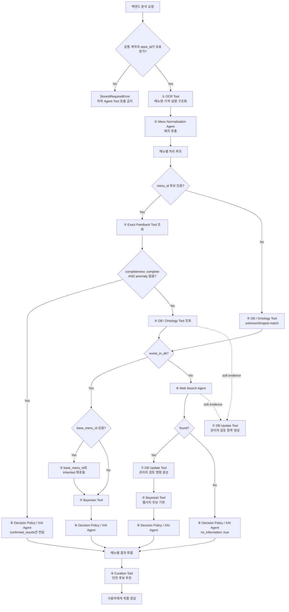

# ⓪ Supervisor Agent 스펙

담당: 박다은
상태: 초안 (미확정 항목은 §8 참조)
상위 문서: `caution-multi-agent-architecture.md`, `caution-db-schema.md`

---

## 0. 역할 범위

Supervisor는 사용자 스캔 요청의 **유일한 진입점**이며, ① OCR Tool 호출부터 ⑨ Curation Tool 결과 취합까지 전체 파이프라인을 오케스트레이션한다.

핵심 책임은 두 가지다.

1. **백엔드가 확정한 `store_id` 검증과 스코프 강제**
2. **하위 Agent·Tool 호출 순서 결정과 결과 취합**
3. **요청 상태·근거·오류·실행 로그의 중앙 관리**

모든 하위 Agent·Tool은 Supervisor의 호출을 받아서만 동작하고, 결과도 Supervisor에게만 반환한다. Agent·Tool 간 직접 호출은 금지한다.

| 하지 않음 | 담당 |
|---|---|
| OCR 자체 수행 | ① OCR Tool |
| 메뉴명 문자열 정제 | ② |
| 확정 재료 조회 | ③ |
| 재료 확장/변형 태깅 | ④ |
| 확률 계산 | ⑤ |
| 웹 크롤링 | ⑥ |
| 물리 DB 쓰기/트랜잭션 | 백엔드 영속화 계층 |
| 저장 명령 생성 | ⑦ |
| 최종 위험 문구 생성 | ⑧ |

### 0-1. 중앙집중형 구조를 쓰는 이유

`store_id`가 빠지면 가게별 확정값과 prior가 전역으로 섞인다. 이 경우 다른 식당의 사장님 답변이나 웹서치 기반 추정이 현재 식당의 위험도에 영향을 줄 수 있어 FN(false negative) 위험이 커진다.

→ Supervisor는 모든 하위 호출에 `store_id`를 필수로 실어 보내고, `store_id`가 없거나 유효하지 않은 요청은 ①~⑨를 호출하지 않는다.

### 0-2. 구현 프레임워크 — 제안 (팀 승인 필요)

Supervisor는 **LangChain 생태계 + LangGraph `StateGraph`**로 구현한다.

- 라우팅은 LLM에게 자유롭게 맡기지 않고 명시적인 conditional edge로 구현한다.
- LLM 추론은 ②·⑥·⑧처럼 판단이 필요한 Agent 내부로 제한한다.
- ①·③·④·⑤·⑦·⑨ Tool은 결정론적 Python 함수 또는 API adapter로 연결한다.
- 각 graph node는 공용 state를 읽고 자신이 담당하는 필드만 갱신한다.
- `store_id` 등 실행 중 바뀌면 안 되는 값은 run-scoped context로 분리한다.
- 초기 버전은 요청 단위 휘발성 state를 사용한다. 영속 checkpoint는 개인정보 보존 기간과 재실행 요구가 확정된 뒤 도입한다.

이 구조는 Supervisor가 판단 결과를 직접 만들지 않고 **정해진 정책에 따라 호출과 상태 전이만 통제**하도록 한다.

---

## 1. 입력 / 출력 스펙

### 1-1. 입력

| 필드 | 타입 | 필수 | 설명 |
|---|---|---|---|
| `schema_version` | string | 필수 | Agent·Tool 계약 버전. 초기값 `1.0` |
| `trace_id` | UUID string | 필수 | 전체 요청 추적 ID. 백엔드가 발급하거나 미지정 시 Supervisor가 1회 발급 |
| `scan_session_id` | string | 필수 | 메뉴판 스캔 세션 id |
| `store_id` | integer | **필수** | 백엔드가 검색·선택·존재/활성 검증을 마친 가게 ID. 양수만 허용 |
| `image` | object | 필수 | ① OCR Tool에 전달할 `source`, `storage_key`, `image_url`, `version_id`, `expected_etag` |
| `user_profile` | object | 필수 | 백엔드가 조회·확정한 식단 프로필. AI가 `user_id`로 재조회하지 않음 |
| `locale` | string | 선택 | 사용자 응답 언어. 기본값 `ko` |

```json
{
  "schema_version": "1.0",
  "trace_id": "0199...",
  "scan_session_id": "scan-123",
  "store_id": 123456,
  "image": {
    "source": "camera",
    "storage_key": "scans/.../menu.jpg",
    "image_url": null,
    "version_id": null,
    "expected_etag": null
  },
  "user_profile": {
    "religion_type": null,
    "is_vegetarian": false,
    "vegetarian_type": null,
    "no_alcohol": false,
    "allergies": [],
    "no_spicy": false
  },
  "locale": "ko"
}
```

기존 `/v1/ocr`, `/v1/ruleengine`, `/v1/result`는 전환 기간의 호환 API로 유지하고, Supervisor 단일 진입점은 `/v1/analyze`로 추가하는 안을 우선 검토한다.

### 1-2. 출력

```json
{
  "schema_version": "1.0",
  "trace_id": "0199...",
  "scan_session_id": "str",
  "store_id": 123456,
  "items": [
    {
      "item_id": "scan-123:0",
      "status": "completed",
      "raw_menu_name": "■김치 찌개",
      "normalized_menu_name": "김치찌개",
      "menu_id": "str | null",
      "route": "exact_only | db_bayes | db_variant_bayes | web_bayes | no_information",
      "risk_level": "danger | caution | safe",
      "confidence": "confirmed | estimated | unknown",
      "message": {
        "ko": "돼지고기 성분이 포함되어 있어요.",
        "en": "This menu contains pork."
      },
      "owner_card": null
    }
  ],
  "recommendations": [],
  "persistence_commands": [],
  "errors": []
}
```

JSON의 `store_id`는 문자열이 아니라 정수다. DB `BIGINT` ↔ Java `Long` ↔ Python `int`로 대응하며, AI는 받은 값을 변경하거나 새로 발급하지 않는다.

### 1-3. 공통 호출 문맥

모든 Agent·Tool 호출에는 아래 문맥을 포함한다.

```json
{
  "schema_version": "1.0",
  "trace_id": "0199...",
  "scan_session_id": "scan-123",
  "store_id": 123456,
  "item_id": "scan-123:0"
}
```

- `item_id`는 ① OCR Tool 출력 순서에 따라 생성하고 최종 응답까지 변경하지 않는다.
- 메뉴판 단위 호출은 `item_id`를 생략할 수 있지만 메뉴 단위 호출은 필수다.
- 모든 외부 경계는 Pydantic 모델로 검증한다.
- `schema_version`의 breaking change는 major를 올리고, 신규 선택 필드는 minor 변경으로 관리한다.
- 재료 공통 식별자는 `ingredient_id`와 `canonical_name`을 함께 사용한다. 웹 신규 후보만 `ingredient_id: null`을 허용한다.

---

## 2. 처리 로직



### 2-1. 기본 순서

1. 요청의 schema와 백엔드가 확정한 `store_id`가 양의 정수인지 검증한다.
2. 백엔드가 전달한 사용자 프로필과 이미지 참조를 state에 보존한다.
3. ①을 호출해 메뉴명·가격·설명을 구조화하고 항목마다 안정적인 `item_id`를 부여한다.
4. OCR 메뉴 항목을 ②에 **배치로** 전달한다.
5. 정규화 결과의 후보를 기준으로 `menu_id`가 안정적으로 잡히는지 확인한다.
6. `menu_id`가 있으면 ③을 먼저 호출한다.
7. ③이 `completeness: complete`이고 anomaly가 없으면 ④⑤를 스킵하고 ⑧로 직행한다.
8. 일부/전부 미확인이라면 ④를 호출한다.
9. `menu_id`가 없으면 ③을 호출하지 않고 ④의 unknown/longest-match 경로로 보낸다.
10. ④가 DB 메뉴를 찾으면 ⑤를 호출한다. 변형 메뉴이고 `base_menu_id`가 있으면 ③을 inherited scope로 한 번 더 호출한 뒤 ⑤에 prior 보정용으로 전달한다.
11. ④가 메뉴를 못 찾으면 ⑥을 호출한다.
12. ⑥이 근거를 찾으면 실시간 계산에는 사용하되 ⑦이 관리자 검토 명령을 만들고, ⑤→⑧ 순으로 진행한다.
13. ⑥도 실패하면 ⑤를 호출하지 않고 ⑧에 `no_information: true`를 전달한다.
14. ⑧ 결과를 메뉴판 단위로 취합한 뒤 ⑨를 호출한다. ⑨는 판정 결과를 변경할 수 없다.
15. 판정, 근거, 위험 재료, 확인 질문, 추천, 저장 명령, 오류를 최종 응답으로 반환한다.

### 2-2. 배치 처리 원칙

②는 메뉴판 1장 단위로 배치 호출한다. ③④⑤⑧은 메뉴별 호출을 기본으로 하되, 구현에서 같은 타입의 호출을 배치로 최적화할 수 있다.

웹서치(⑥)는 DB에 없는 메뉴에만 호출한다. OCR 결과 전체에 대해 무조건 웹서치를 돌리지 않는다.

LangGraph 구현에서는 메뉴 항목을 fan-out해 독립 처리한 뒤 `item_id`와 OCR 순서로 collect한다. 병렬 처리는 같은 메뉴의 상태를 공유하지 않으며, 한 항목의 실패가 다른 항목을 취소하지 않게 한다.

### 2-3. StateGraph 상태 모델

```json
{
  "context": {
    "schema_version": "1.0",
    "trace_id": "0199...",
    "scan_session_id": "scan-123",
    "store_id": 123456
  },
  "user_profile": {},
  "items": {
    "scan-123:0": {
      "status": "pending",
      "route": null,
      "ocr": null,
      "normalization": null,
      "exact": null,
      "ontology": null,
      "bayesian": null,
      "web_search": null,
      "decision": null,
      "errors": []
    }
  },
  "recommendations": [],
  "persistence_commands": [],
  "errors": []
}
```

- `status`: `pending | running | completed | partial_failed | failed`
- `route`: `exact_only | db_bayes | db_variant_bayes | web_bayes | no_information`
- 각 node는 자신의 결과 필드만 갱신하며 이전 근거를 삭제하거나 재해석하지 않는다.
- reducer는 `item_id`를 키로 결과를 병합하고 입력 순서를 별도 보존한다.

---

## 3. 가게 컨텍스트 계약

### 3-1. 책임 경계

| 주체 | 책임 |
|---|---|
| 백엔드 | GPS 동의/입력 처리, 공공데이터 후보 조회, Kakao fallback, 사용자 선택, 기존 공공데이터 가게 매칭, `scan_sessions` 연결 및 스냅샷 저장 |
| AI Supervisor | 전달받은 `store_id` 형식 검증, 동일 값을 ①~⑨ 호출에 전파, 분석 결과에 그대로 반환 |

백엔드는 AI 호출 전에 `stores.id`의 존재와 `status='active'`를 검증한다. AI는 가게 마스터 DB를 조회·생성·수정하지 않는다. 가게가 선택되지 않은 요청은 백엔드가 거절하므로 AI에는 GPS, 검색어, 가게 후보 목록 계약을 두지 않는다.

### 3-2. 타입 계약

| 경계 | 타입 |
|---|---|
| PostgreSQL | `BIGINT` |
| Spring Boot | `Long` |
| JSON | number (정수) |
| Python | `int` |

`null`, 문자열 숫자(`"123"`), 0, 음수는 모두 `StoreIdRequiredError` 대상이다. 이 검증은 다른 가게의 데이터로 fallback하는 것보다 요청을 실패시키는 편이 안전하다는 FN 최소화 원칙을 따른다.

---

## 4. 하위 Agent·Tool 호출 계약

각 호출은 §1-3의 공통 문맥을 포함한다. 하위 Agent·Tool은 `store_id`, `scan_session_id`, `item_id`를 수정하지 않고 결과에 그대로 반환해야 한다. 현재 각 문서에서 `ingredient`, `ingredient_id`, `name`으로 혼용되는 재료 키는 공통 계약 확정 시 `ingredient_id + canonical_name`으로 통일한다.

### 4-0. ① OCR Tool

| 전달 | 반환 |
|---|---|
| 이미지 참조 + 공통 문맥 | 원본 순서가 보존된 OCR 메뉴 항목 배열 |

OCR 항목에는 최소 `item_id`, `raw_menu_name`, `description`, `price`, `ocr_confidence`가 포함된다. OCR은 메뉴명을 의미적으로 정규화하지 않는다.

### 4-1. ② Menu Normalization Agent

| 전달 | 반환 |
|---|---|
| OCR 항목 배열 + 공통 문맥 | `item_id`가 보존된 `normalized_items[]` |

Supervisor는 ②가 반환한 `raw_menu_name`과 `normalized_menu_name`의 매핑을 유지한다. 최종 응답에서 사용자가 본 메뉴명과 내부 매칭 결과를 연결해야 하기 때문이다.

### 4-2. ③ Exact Feedback Tool

첫 번째 호출은 대상 `menu_id`가 안정적으로 식별된 경우에만 `scope_hint="exact"`로 전달한다. `menu_id`가 없으면 ③을 호출하지 않는다.

두 번째 호출은 ④가 `base_menu_id`를 반환한 경우에만 `scope_hint="inherited"`로 호출한다. inherited 결과는 override가 아니라 ⑤ prior 보정용이다.

### 4-3. ④ DB / Ontology Tool

③의 출력 중 `status != unknown` AND `override_eligible: true`인 재료만 `confirmed_ingredients`로 전달한다.

`override_eligible: false`인 anomaly 재료는 누락하면 안 된다. Supervisor는 이 재료를 ⑤ 계산 대상에 남겨 `anomaly_locked`가 ⑧까지 전달되게 해야 한다.

### 4-4. ⑤ Bayesian Tool

⑤에는 확정 override 대상이 아닌 재료만 전달한다. ⑤의 결과는 절대 최종 판정이 아니며, ⑧이 사용자 프로필과 threshold를 적용해 해석한다.

### 4-5. ⑥ Web Search Agent

④가 `exists_in_db: false`를 반환한 경우에만 호출한다. ⑥ 결과는 실시간 판정에는 사용할 수 있지만 DB에 자동 반영하지 않는다.

### 4-6. ⑦ DB Update Tool

soft evidence(웹서치, 런타임 변형 태깅)는 관리자 검토 항목 생성 명령까지만 만든다. hard evidence(사장님 답변)는 `ingredient_confirmations` 반영 명령을 만든다. 실제 쓰기는 백엔드가 권한·FK·멱등성을 검증한 뒤 수행한다.

### 4-7. ⑧ Decision Policy / XAI Agent

Supervisor는 ③/⑤/⑥ 결과와 사용자 프로필을 취합해서 전달한다.

```json
{
  "confirmed_results": {},
  "probability_results": {
    "<ingredient_id>": {"posterior_mean": 0.0, "confidence": 0.0, "prior_source": "store | cluster | global | uninformative", "anomaly_locked": false}
  },
  "proposed_variant_ingredients": {},
  "no_information": false,
  "user_profile": {}
}
```

`probability_results`의 `anomaly_locked`는 ③이 override 거부한 재료가 ④를 거쳐 ⑤까지 온 값을 **그대로 옮겨 담은 것**이다 — Supervisor가 새로 계산하거나 재판단하지 않는다. 이 값이 있어야 ⑧이 확률과 무관하게 CAUTION 이상을 강제할 수 있다.

③의 3-State를 boolean으로 조기에 축약하면 `absent`와 `unknown`을 구분할 수 없다. Supervisor state에서는 `present | absent | unknown`을 유지하고, ⑧의 최종 계약도 같은 구조로 맞추는 안을 관련 담당자와 확정한다.

### 4-8. ⑨ Curation Tool

⑧의 메뉴별 `risk_level`, 근거, 사용자 프로필을 메뉴판 단위로 전달한다. ⑨는 추천 순서와 문화 콘텐츠만 반환하며 기존 판정·근거·위험 재료를 수정할 수 없다. ⑨ 실패는 안전 판정 응답을 막지 않고 추천 빈 배열로 처리한다.

---

## 5. 라우팅 규칙

| 상황 | route | 호출 경로 |
|---|---|---|
| 모든 관련 재료가 exact로 확인됨 | `exact_only` | ③ → ⑧ |
| DB 메뉴 + 미확인 재료 있음 | `db_bayes` | ③ → ④ → ⑤ → ⑧ |
| DB 등록/런타임 변형 메뉴 | `db_variant_bayes` | ③ → ④ → 필요시 ③ inherited → ⑤ → ⑧ |
| DB에 없고 웹서치 성공 | `web_bayes` | ④ → ⑥ → ⑤ → ⑧ |
| DB에도 없고 웹서치 실패 | `no_information` | ④ → ⑥ → ⑧ |

`no_information` 경로에서는 SAFE 판정을 허용하지 않는다. ⑧이 CAUTION 이상을 유지하도록 `no_information: true`를 반드시 전달한다.

---

## 6. 예외 처리

### 6-1. 공통 오류 모델

```json
{
  "code": "WEB_SEARCH_TIMEOUT",
  "node": "web_search",
  "item_id": "scan-123:0",
  "message": "웹 검색 시간이 초과되었습니다.",
  "retryable": true,
  "fallback": "no_information"
}
```

- 읽기 전용이고 멱등인 호출만 제한적으로 재시도한다.
- 입력 검증 실패와 ⑦ 저장 명령은 Supervisor가 자동 재시도하지 않는다.
- `trace_id`, `item_id`, node, route, latency를 구조화 로그로 남긴다.
- 사용자 프로필과 원문 메뉴는 로그에 그대로 남기지 않고 마스킹·요약 정책을 적용한다.

| 상황 | 처리 |
|---|---|
| `store_id` 누락·null·문자열·0 이하 | `StoreIdRequiredError`, ③④⑤⑥⑦⑧ 호출 금지 |
| ② Menu Normalization Agent 실패 | 원본 메뉴명을 보존하고 ④ longest-match/unknown 경로로 넘김 |
| ③ 조회 에러 | 해당 메뉴는 ④⑤⑧ heavy path로 보내되 로그 남김 |
| ④ cycle/error | 확장 실패 재료는 낮은 `confidence`(0~1 숫자, ⑤ §1-2)로 ⑤ 또는 ⑧에 전달 |
| ⑥ timeout/error | `found: false`, `no_information: true` |
| ⑨ timeout/error | 추천 빈 배열, 기존 판정 결과는 정상 반환 |
| 일부 메뉴만 실패 | 실패 메뉴는 CAUTION 이상, 나머지 메뉴는 정상 결과 반환 |

---

## 7. 테스트 케이스

| # | 입력 | 기대 동작 | 검증 포인트 |
|---|---|---|---|
| 1 | 양의 정수 `store_id` + 이미지 | ①→② 배치 호출 후 메뉴별 라우팅 | 모든 하위 호출과 응답에 같은 `store_id` 포함 |
| 2 | `store_id` 누락/문자열/0 이하 | 즉시 검증 실패 | 모든 하위 호출 없음 |
| 3 | Exact complete 메뉴 | ④⑤ 스킵, ⑧ 직행 | confirmed 기반 판정 |
| 4 | Exact 일부 확인 | 확인 재료 제외, 미확인 재료만 ④⑤ | 부분 확인 유지 |
| 5 | `flagged_anomaly` 포함 | override 금지, ⑤와 ⑧까지 anomaly 신호 유지 | SAFE로 내려가지 않음 |
| 6 | 차돌된장찌개 런타임 변형 | ④ variant_suggested → ⑤ scale 0.5 → ⑧ caution 가능 | DB 자동 INSERT 없음 |
| 7 | unknown 메뉴 + 웹서치 실패 | ⑧에 `no_information: true` | CAUTION 이상 |
| 8 | 웹서치 성공 | ⑤에 즉시 사용, ⑦에는 관리자 검토 항목 생성 | risk score 직접 업데이트 없음 |
| 9 | 메뉴 3개 중 1개 timeout | 2개 정상 + 1개 보수적 부분 응답 | 전체 요청 실패 없음, 순서 유지 |
| 10 | ⑨ Curation 실패 | 판정 결과 정상 반환 + 추천 빈 배열 | 판정 결과 변경 없음 |

---

## 8. 미확정 항목 (팀 확인 대기)

- [x] 가게 검색·선택·기존 공공데이터 매칭은 백엔드 책임, Supervisor는 확정된 `store_id`만 입력받음
- [ ] LangChain 생태계 + LangGraph `StateGraph` 사용 최종 승인 (#76과 함께 결정)
- [ ] 신규 `/v1/analyze` 추가 및 기존 3개 API 호환 기간
- [ ] 메뉴판 1장 기준 ③④⑤⑧ 호출의 실제 배치 API 형태와 동시성 제한
- [ ] 일부 메뉴 에러 발생 시 사용자 응답에서 메뉴별 오류를 어떤 문구로 보여줄지
- [ ] DANGER/CAUTION/SAFE threshold를 Supervisor가 들고 있을지, ⑧ Decision Policy / XAI Agent가 들고 있을지
- [ ] LangGraph checkpoint 사용 여부와 state 보존 기간
- [ ] 공통 재료 식별자와 ⑧ 입력에서 3-State를 유지하는 계약

---

## 9. 구현 계획 (GitHub Backlog / Iteration)

아래 항목은 GitHub Issue 등록 시 각각 하나의 Sub-issue로 만든다. 문서 작업은 #67, 구현 작업은 #55, 공통 프레임워크 결정은 #76에 연결한다.

### Iteration 1 — 문서와 계약 확정 (10/13까지)

#### `[DOCS] Supervisor LangGraph 오케스트레이션 설계 확정`

**작업 내용**

PPT의 Hub & Spoke 흐름을 LangGraph 상태 그래프로 확정하고 Supervisor 책임과 호출 경계를 문서화한다.

**배경**

현재 API가 단계별로 분리되어 있어 전체 상태·근거·오류를 한 요청으로 추적할 수 없고, 현재 문서는 OCR이 Supervisor 밖에서 실행되는 것으로 적혀 있어 기준 문서와 충돌한다.

**세부 작업**

- [ ] state/context/input/output 스키마 확정
- [ ] ①~⑨ node와 conditional edge 확정
- [ ] LLM Agent와 결정론적 Tool 경계 확정
- [ ] fan-out/collect와 ⑦ 비동기 명령 흐름 확정
- [ ] `/v1/analyze` 및 기존 API 전환 방식 확정

**관련 서비스**

- [x] ai_ocr
- [x] ai_result
- [x] ai_ruleengine
- [x] ai_web_search_agent
- [ ] crawling
- [x] 공통 (app.py, README, 인프라)

**참고**

- 상위 이슈 #67, 구현 이슈 #55, 공통 이슈 #76
- `docs/ppt-baseline.md`, `docs/caution-multi-agent-architecture.md`

#### `[DOCS] Agent·Tool 공통 데이터 계약 및 오류 규격 정의`

**작업 내용**

Supervisor와 ①~⑨ 사이의 공통 문맥, 메뉴·재료 식별자, 입출력, 오류, 근거 전달 규격을 Pydantic 모델 기준으로 정의한다.

**배경**

문서별 필드명이 다르고 3-State·`anomaly_locked`·출처가 중간 단계에서 손실될 가능성이 있어 병렬 구현 전에 계약 고정이 필요하다.

**세부 작업**

- [ ] `RequestContext`와 `item_id` 규칙 정의
- [ ] ①~⑨ 요청·응답 모델 표 작성
- [ ] 재료 식별자와 3-State 계약 통일
- [ ] evidence/provenance와 공통 오류 모델 정의
- [ ] schema version 변경 규칙 및 담당자 리뷰

**관련 서비스**

- [x] ai_ocr
- [x] ai_result
- [x] ai_ruleengine
- [x] ai_web_search_agent
- [x] crawling
- [x] 공통 (app.py, README, 인프라)

**참고**

- 상위 이슈 #67, #76
- 구현 이슈 #55~#62, #78

### Iteration 2 — Supervisor 골격 구현

#### `[FEAT] Supervisor StateGraph 기반 구조와 단일 진입점 구현`

**작업 내용**

확정된 계약을 기반으로 Supervisor 기본 그래프, 입력 검증, ①·② adapter와 `/v1/analyze`를 구현한다.

**배경**

전체 Agent·Tool을 순차 연결하기 전에 빈 adapter로도 실행 가능한 공통 골격과 호환 API가 필요하다.

**세부 작업**

- [ ] LangChain/LangGraph 버전 검토·고정
- [ ] graph/state/models/adapters 구조 생성
- [ ] 공통 Pydantic 모델과 입력 검증 구현
- [ ] ①·② adapter, item state 초기화 구현
- [ ] `/v1/analyze`와 기존 API 호환 처리
- [ ] 정상·잘못된 store_id·빈 OCR 결과 테스트

**관련 서비스**

- [x] ai_ocr
- [ ] ai_result
- [x] ai_ruleengine
- [ ] ai_web_search_agent
- [ ] crawling
- [x] 공통 (app.py, README, 인프라)

**참고**

- 상위 이슈 #55
- 선행: Iteration 1의 Supervisor 설계·공통 계약

### Iteration 3 — 전체 연동과 운영 안정화

#### `[FEAT] Supervisor 조건부 라우팅과 Agent·Tool adapter 연동`

**작업 내용**

③~⑨ adapter와 전체 조건부 경로를 연결하고 근거 손실 없이 최종 응답을 취합한다.

**배경**

필요한 노드만 선택 호출해야 hard evidence 우선순위를 지키고 비용·지연을 제한할 수 있다.

**세부 작업**

- [ ] ③ exact/inherited 및 complete 조기 종료 구현
- [ ] ④·⑤ DB/variant/bayesian 경로 구현
- [ ] ⑥·⑦ web evidence와 검토 명령 경로 구현
- [ ] ⑧ 근거 취합과 ⑨ 후처리 연결
- [ ] 다섯 route 및 `anomaly_locked` 통합 테스트

**관련 서비스**

- [ ] ai_ocr
- [x] ai_result
- [x] ai_ruleengine
- [x] ai_web_search_agent
- [ ] crawling
- [x] 공통 (app.py, README, 인프라)

**참고**

- 상위 이슈 #55
- 관련 이슈 #57~#62, #78

#### `[FEAT] Supervisor 배치·부분 실패·재시도·추적 기능 구현`

**작업 내용**

여러 메뉴를 안전하게 fan-out하고 일부 실패에도 보수적 부분 응답을 반환하는 운영 제어를 구현한다.

**배경**

외부 API 지연이나 메뉴 한 건의 실패가 전체 응답 실패 또는 잘못된 SAFE 판정으로 이어지면 안 된다.

**세부 작업**

- [ ] fan-out/collect와 순서 보존 구현
- [ ] node별 timeout·전체 deadline·멱등 재시도 구현
- [ ] 부분 실패 및 fallback 구현
- [ ] 구조화 로그와 민감정보 마스킹 구현
- [ ] 부하·timeout·부분 실패 통합 테스트

**관련 서비스**

- [x] ai_ocr
- [x] ai_result
- [x] ai_ruleengine
- [x] ai_web_search_agent
- [ ] crawling
- [x] 공통 (app.py, README, 인프라)

**참고**

- 상위 이슈 #55
- `app.py`의 기존 OCR 시간 예산

### Iteration 4 — QA

#### `[CHORE] Supervisor 전체 시나리오 QA 및 회귀 검증`

**작업 내용**

정상·경계·실패 경로를 계약 기반으로 검증하고 FN 위험, 상태 손실, 기존 API 회귀를 수정한다.

**배경**

단위 테스트만으로는 Agent·Tool 사이의 context 손실과 잘못된 fallback을 확인하기 어렵다.

**세부 작업**

- [ ] 다섯 route end-to-end 검증
- [ ] store/trace/item context 유지 검증
- [ ] no_information·timeout이 SAFE가 되지 않는지 검증
- [ ] 일부 실패와 기존 API 회귀 검증
- [ ] 응답 시간·호출 횟수 측정 및 치명 결함 재검증

**관련 서비스**

- [x] ai_ocr
- [x] ai_result
- [x] ai_ruleengine
- [x] ai_web_search_agent
- [x] crawling
- [x] 공통 (app.py, README, 인프라)

**참고**

- 상위 이슈 #55
- 북극성 지표: FN 최소화, F2 기준
