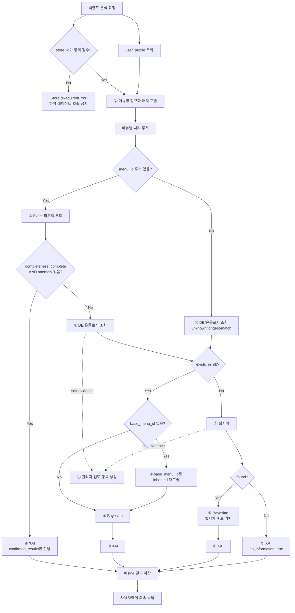

# ① Supervisor 에이전트 스펙

담당: 박다은
상태: 초안 (미확정 항목은 §8 참조)
상위 문서: `catoin-multi-agent-architecture.md`, `catoin-db-schema.md`

---

## 0. 역할 범위

Supervisor는 사용자 스캔 요청의 **유일한 진입점**이며, OCR 이후부터 최종 응답까지 전체 파이프라인을 오케스트레이션한다.

핵심 책임은 두 가지다.

1. **백엔드가 확정한 `store_id` 검증과 스코프 강제**
2. **하위 에이전트 호출 순서 결정과 결과 취합**

모든 하위 에이전트는 Supervisor의 호출을 받아서만 동작하고, 결과도 Supervisor에게만 반환한다. 에이전트 간 직접 호출은 금지한다.

| 하지 않음 | 담당 |
|---|---|
| OCR 자체 수행 | OCR 모듈/서비스 |
| 메뉴명 문자열 정제 | ② |
| 확정 재료 조회 | ③ |
| 재료 확장/변형 태깅 | ④ |
| 확률 계산 | ⑤ |
| 웹 크롤링 | ⑥ |
| 물리 DB 쓰기/트랜잭션 | 백엔드 영속화 계층 |
| 저장 명령 생성 | ⑦ |
| 최종 위험 문구 생성 | ⑧ |

### 0-1. 중앙집중형 구조를 쓰는 이유

`store_id`가 빠지면 가게별 확정값과 prior가 전역으로 섞인다. 이 경우 다른 식당의 사장님 답변이나 웹서치 기반 추정이 현재 식당의 위험도에 영향을 줄 수 있어 FN(false negative) 위험이 커진다.

→ Supervisor는 모든 하위 호출에 `store_id`를 필수로 실어 보내고, `store_id`가 없는 요청은 heavy path로 보내지 않는다.

---

## 1. 입력 / 출력 스펙

### 1-1. 입력

| 필드 | 타입 | 필수 | 설명 |
|---|---|---|---|
| `scan_session_id` | string | 필수 | 메뉴판 스캔 세션 id |
| `user_id` | string | 필수 | 사용자 프로필 조회용 |
| `ocr_menu_names` | string[] | 필수 | OCR이 추출한 원본 메뉴명 리스트 |
| `store_id` | integer | **필수** | 백엔드가 검색·선택·존재/활성 검증을 마친 가게 ID. 양수만 허용 |

### 1-2. 출력

```json
{
  "scan_session_id": "str",
  "store_id": 123456,
  "items": [
    {
      "raw_menu_name": "■김치 찌개",
      "normalized_menu_name": "김치찌개",
      "menu_id": "str | null",
      "route": "exact_only | db_bayes | db_variant_bayes | web_bayes | no_information",
      "risk_level": "danger | caution | safe",
      "confidence": "confirmed | estimated | unknown",
      "message": {
        "ko": "돼지고기 성분이 포함되어 있어요.",
        "en": "This menu contains pork."
      },
      "owner_card": null
    }
  ]
}
```

JSON의 `store_id`는 문자열이 아니라 정수다. DB `BIGINT` ↔ Java `Long` ↔ Python `int`로 대응하며, AI는 받은 값을 변경하거나 새로 발급하지 않는다.

---

## 2. 처리 로직



### 2-1. 기본 순서

1. 사용자 프로필을 조회해 ⑧에 넘길 `user_profile`을 준비한다.
2. 백엔드가 확정한 `store_id`가 양의 정수인지 검증한다.
3. OCR 메뉴명 리스트를 ②에 **배치로** 전달한다.
4. 정규화 결과의 후보를 기준으로 `menu_id`가 안정적으로 잡히는지 확인한다.
5. `menu_id`가 있으면 ③을 먼저 호출한다.
6. ③이 `completeness: complete`를 반환하면 ④⑤를 스킵하고 ⑧로 직행한다.
7. 일부/전부 미확인이라면 ④를 호출한다.
8. `menu_id`가 없으면 ③을 호출하지 않고 ④의 unknown/longest-match 경로로 보낸다.
9. ④가 DB 메뉴를 찾으면 ⑤를 호출한다. 변형 메뉴이고 `base_menu_id`가 있으면 ③을 inherited scope로 한 번 더 호출한 뒤 ⑤에 prior 보정용으로 전달한다.
10. ④가 메뉴를 못 찾으면 ⑥을 호출한다.
11. ⑥도 실패하면 ⑤를 호출하지 않고 ⑧에 `no_information: true`를 전달한다.
12. ⑧ 결과를 메뉴판 단위로 취합해 사용자에게 반환한다.

### 2-2. 배치 처리 원칙

②는 메뉴판 1장 단위로 배치 호출한다. ③④⑤⑧은 메뉴별 호출을 기본으로 하되, 구현에서 같은 타입의 호출을 배치로 최적화할 수 있다.

웹서치(⑥)는 DB에 없는 메뉴에만 호출한다. OCR 결과 전체에 대해 무조건 웹서치를 돌리지 않는다.

---

## 3. 가게 컨텍스트 계약

### 3-1. 책임 경계

| 주체 | 책임 |
|---|---|
| 백엔드 | GPS 동의/입력 처리, 공공데이터 후보 조회, Kakao fallback, 사용자 선택, 기존 공공데이터 가게 매칭, `scan_sessions` 연결 및 스냅샷 저장 |
| AI Supervisor | 전달받은 `store_id` 형식 검증, 동일 값을 ③~⑧ 호출에 전파, 분석 결과에 그대로 반환 |

백엔드는 AI 호출 전에 `stores.id`의 존재와 `status='active'`를 검증한다. AI는 가게 마스터 DB를 조회·생성·수정하지 않는다. 가게가 선택되지 않은 요청은 백엔드가 거절하므로 AI에는 GPS, 검색어, 가게 후보 목록 계약을 두지 않는다.

### 3-2. 타입 계약

| 경계 | 타입 |
|---|---|
| PostgreSQL | `BIGINT` |
| Spring Boot | `Long` |
| JSON | number (정수) |
| Python | `int` |

`null`, 문자열 숫자(`"123"`), 0, 음수는 모두 `StoreIdRequiredError` 대상이다. 이 검증은 다른 가게의 데이터로 fallback하는 것보다 요청을 실패시키는 편이 안전하다는 FN 최소화 원칙을 따른다.

---

## 4. 하위 에이전트 호출 계약

### 4-1. ② 메뉴명 정규화

| 전달 | 반환 |
|---|---|
| `ocr_menu_names[]` | `normalized_items[]` |

Supervisor는 ②가 반환한 `raw_menu_name`과 `normalized_menu_name`의 매핑을 유지한다. 최종 응답에서 사용자가 본 메뉴명과 내부 매칭 결과를 연결해야 하기 때문이다.

### 4-2. ③ Exact 피드백

첫 번째 호출은 대상 `menu_id`가 안정적으로 식별된 경우에만 `scope_hint="exact"`로 전달한다. `menu_id`가 없으면 ③을 호출하지 않는다.

두 번째 호출은 ④가 `base_menu_id`를 반환한 경우에만 `scope_hint="inherited"`로 호출한다. inherited 결과는 override가 아니라 ⑤ prior 보정용이다.

### 4-3. ④ DB/온톨로지

③의 출력 중 `status != unknown` AND `override_eligible: true`인 재료만 `confirmed_ingredients`로 전달한다.

`override_eligible: false`인 anomaly 재료는 누락하면 안 된다. Supervisor는 이 재료를 ⑤ 계산 대상에 남겨 `anomaly_locked`가 ⑧까지 전달되게 해야 한다.

### 4-4. ⑤ Bayesian

⑤에는 확정 override 대상이 아닌 재료만 전달한다. ⑤의 결과는 절대 최종 판정이 아니며, ⑧이 사용자 프로필과 threshold를 적용해 해석한다.

### 4-5. ⑥ 웹서치

④가 `exists_in_db: false`를 반환한 경우에만 호출한다. ⑥ 결과는 실시간 판정에는 사용할 수 있지만 DB에 자동 반영하지 않는다.

### 4-6. ⑦ DB 업데이트 요청

soft evidence(웹서치, 런타임 변형 태깅)는 관리자 검토 항목 생성 명령까지만 만든다. hard evidence(사장님 답변)는 `ingredient_confirmations` 반영 명령을 만든다. 실제 쓰기는 백엔드가 권한·FK·멱등성을 검증한 뒤 수행한다.

### 4-7. ⑧ XAI

Supervisor는 ③/⑤/⑥ 결과와 사용자 프로필을 취합해서 전달한다.

```json
{
  "confirmed_results": {},
  "probability_results": {
    "<ingredient_id>": {"posterior_mean": 0.0, "anomaly_locked": false}
  },
  "proposed_variant_ingredients": {},
  "no_information": false,
  "user_profile": {}
}
```

`probability_results`의 `anomaly_locked`는 ③이 override 거부한 재료가 ④를 거쳐 ⑤까지 온 값을 **그대로 옮겨 담은 것**이다 — Supervisor가 새로 계산하거나 재판단하지 않는다. 이 값이 있어야 ⑧이 확률과 무관하게 CAUTION 이상을 강제할 수 있다.

---

## 5. 라우팅 규칙

| 상황 | route | 호출 경로 |
|---|---|---|
| 모든 관련 재료가 exact로 확인됨 | `exact_only` | ③ → ⑧ |
| DB 메뉴 + 미확인 재료 있음 | `db_bayes` | ③ → ④ → ⑤ → ⑧ |
| DB 등록/런타임 변형 메뉴 | `db_variant_bayes` | ③ → ④ → 필요시 ③ inherited → ⑤ → ⑧ |
| DB에 없고 웹서치 성공 | `web_bayes` | ④ → ⑥ → ⑤ → ⑧ |
| DB에도 없고 웹서치 실패 | `no_information` | ④ → ⑥ → ⑧ |

`no_information` 경로에서는 SAFE 판정을 허용하지 않는다. ⑧이 CAUTION 이상을 유지하도록 `no_information: true`를 반드시 전달한다.

---

## 6. 예외 처리

| 상황 | 처리 |
|---|---|
| `store_id` 누락·null·문자열·0 이하 | `StoreIdRequiredError`, ③④⑤⑥⑦⑧ 호출 금지 |
| ② 정규화 실패 | 원본 메뉴명을 보존하고 ④ longest-match/unknown 경로로 넘김 |
| ③ 조회 에러 | 해당 메뉴는 ④⑤⑧ heavy path로 보내되 로그 남김 |
| ④ cycle/error | 확장 실패 재료는 `confidence: low`로 ⑤ 또는 ⑧에 전달 |
| ⑥ timeout/error | `found: false`, `no_information: true` |
| 일부 메뉴만 실패 | 실패 메뉴는 CAUTION 이상, 나머지 메뉴는 정상 결과 반환 |

---

## 7. 테스트 케이스

| # | 입력 | 기대 동작 | 검증 포인트 |
|---|---|---|---|
| 1 | 양의 정수 `store_id` + OCR 메뉴 3개 | ② 배치 호출 후 메뉴별 라우팅 | 모든 하위 호출과 응답에 같은 `store_id` 포함 |
| 2 | `store_id` 누락/문자열/0 이하 | 즉시 검증 실패 | 모든 하위 호출 없음 |
| 3 | Exact complete 메뉴 | ④⑤ 스킵, ⑧ 직행 | confirmed 기반 판정 |
| 4 | Exact 일부 확인 | 확인 재료 제외, 미확인 재료만 ④⑤ | 부분 확인 유지 |
| 5 | `flagged_anomaly` 포함 | override 금지, ⑤와 ⑧까지 anomaly 신호 유지 | SAFE로 내려가지 않음 |
| 6 | 차돌된장찌개 런타임 변형 | ④ variant_suggested → ⑤ scale 0.5 → ⑧ caution 가능 | DB 자동 INSERT 없음 |
| 7 | unknown 메뉴 + 웹서치 실패 | ⑧에 `no_information: true` | CAUTION 이상 |
| 8 | 웹서치 성공 | ⑤에 즉시 사용, ⑦에는 관리자 검토 항목 생성 | risk score 직접 업데이트 없음 |

---

## 8. 미확정 항목 (팀 확인 대기)

- [x] 가게 검색·선택·기존 공공데이터 매칭은 백엔드 책임, Supervisor는 확정된 `store_id`만 입력받음
- [ ] 메뉴판 1장 기준 ③④⑤⑧ 호출의 실제 배치 API 형태
- [ ] 일부 메뉴 에러 발생 시 사용자 응답에서 메뉴별 오류를 어떤 문구로 보여줄지
- [ ] DANGER/CAUTION/SAFE threshold를 Supervisor가 들고 있을지, ⑧ XAI가 들고 있을지
