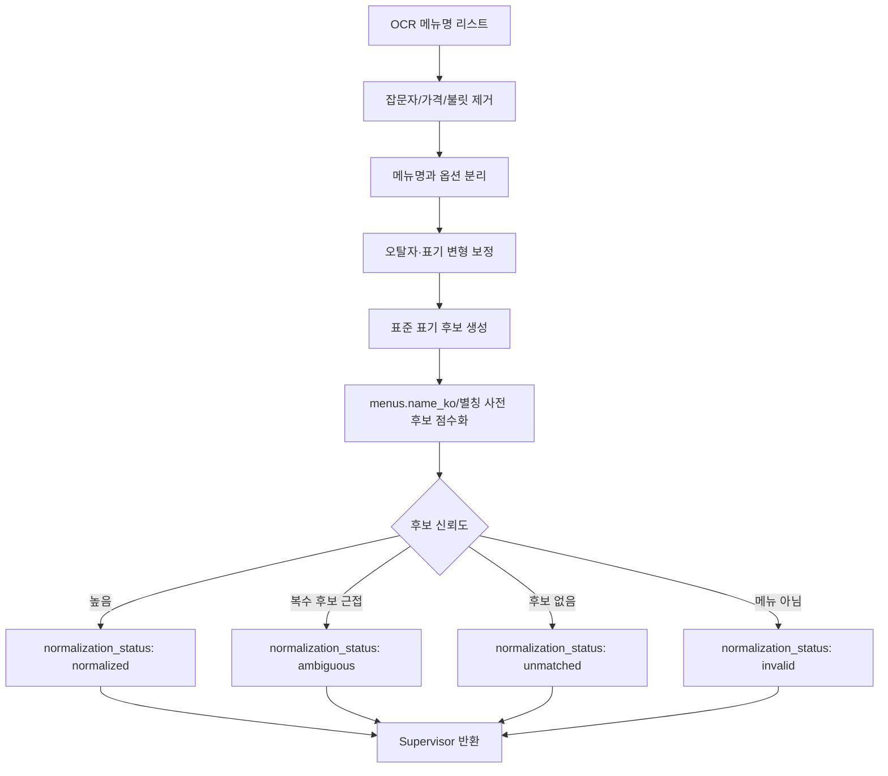

# ② 메뉴명 정규화 에이전트 스펙

담당: 박다은
상태: 초안 (미확정 항목은 §8 참조)
상위 문서: `catoin-multi-agent-architecture.md`, `catoin-db-schema.md`

---

## 0. 역할 범위

②는 OCR이 추출한 원본 메뉴명을 DB 매칭에 적합한 형태로 정제하는 **전처리 전용 에이전트**다.

핵심 목표는 `menus.name_ko`와 매칭 가능한 후보를 만들되, 불확실한 추측을 확정 사실처럼 만들지 않는 것이다. 정규화는 매칭 가능성을 높이는 단계이지, 메뉴 존재 여부를 판정하는 단계가 아니다.

| 하지 않음 | 담당 |
|---|---|
| 가게 식별 | ① Supervisor |
| DB/온톨로지 조회 | ④ |
| 변형 메뉴의 remain 토큰 해석 | ④ |
| 재료 추론 | ④/⑤/⑥ |
| 최종 위험 판정 | ⑧ |
| DB 쓰기 | ⑦ |

### 0-1. 설계 원칙

- 입력 순서를 유지한다. 메뉴판의 표시 순서가 사용자 응답 UI와 연결되기 때문이다.
- 원본 문자열을 버리지 않는다. 정규화 실패나 검수 시 OCR 원문이 필요하다.
- 옵션과 메뉴명을 분리하되, 옵션을 완전히 폐기하지 않는다.
- 과한 의미 추론을 하지 않는다. "차돌된장찌개"를 "된장찌개"로 확정하지 않고, ④가 변형 태깅할 수 있도록 후보와 토큰을 남긴다.

---

## 1. 입력 / 출력 스펙

### 1-1. 입력 (Supervisor로부터 배치 수신)

| 필드 | 타입 | 필수 | 설명 |
|---|---|---|---|
| `items` | string[] | 필수 | OCR 원본 메뉴명 리스트 |
| `store_id` | string \| null | 선택 | 매장별 별칭 사전이 있을 때만 사용 |
| `locale_hint` | string \| null | 선택 | OCR 언어/사용자 언어 힌트 |

`store_id`는 선택 필드다. ②는 가게별 사전이 없어도 동작해야 하며, `store_id`가 없다는 이유로 실패하면 안 된다.

### 1-2. 출력 (Supervisor에게 반환)

```json
{
  "items": [
    {
      "raw_menu_name": "■ 김치 찌개 2인",
      "normalized_menu_name": "김치찌개",
      "display_name": "김치 찌개 2인",
      "options": ["2인"],
      "match_candidates": [
        {
          "name_ko": "김치찌개",
          "score": 0.97,
          "match_type": "canonical"
        }
      ],
      "normalization_status": "normalized",
      "warnings": []
    }
  ]
}
```

### 1-3. `normalization_status`

| 값 | 의미 | Supervisor 동작 |
|---|---|---|
| `normalized` | 대표 정규명이 안정적으로 생성됨 | ③/④에 `normalized_menu_name` 전달 |
| `ambiguous` | 후보가 여러 개거나 score가 근접함 | ④에 후보 목록까지 전달 |
| `unmatched` | 의미 있는 후보를 만들지 못함 | 원본 기반 unknown 경로 허용 |
| `invalid` | 메뉴명이 아닌 잡문자/가격/헤더로 판단 | 기본적으로 분석 대상에서 제외 |

---

## 2. 처리 로직



### 2-1. 정제 단계

| 단계 | 예시 | 결과 |
|---|---|---|
| OCR 잡문자 제거 | `"■김치찌개–"` | `"김치찌개"` |
| 가격 제거 | `"김치찌개 8,000"` | `"김치찌개"` |
| 공백 정규화 | `"김치 찌개"` | `"김치찌개"` |
| 표기 통일 | `"돈까스"` | `"돈가스"` |
| 옵션 분리 | `"부대찌개 2인"` | 메뉴 `"부대찌개"`, 옵션 `["2인"]` |
| 크기 분리 | `"냉면 곱빼기"` | 메뉴 `"냉면"`, 옵션 `["곱빼기"]` |

### 2-2. 제거/분리 대상

| 유형 | 예시 | 처리 |
|---|---|---|
| 가격 | `8000`, `8,000원`, `₩8,000` | 제거 |
| 수량/인분 | `1인`, `2인분`, `소`, `중`, `대` | `options`로 분리 |
| 조리 옵션 | `순한맛`, `매운맛`, `곱빼기` | `options`로 분리 |
| 메뉴판 장식 | `■`, `★`, `-`, `•` | 제거 |
| 섹션 헤더 | `식사류`, `추천메뉴`, `주류` | `invalid` 가능 |

옵션 중 재료 의미가 강한 토큰은 제거하지 않는다. 예를 들어 "치즈 추가", "차돌 추가"는 알레르기/식이 위험과 연결될 수 있으므로 `options`와 `residual_tokens` 성격으로 남겨 ④가 해석할 수 있게 한다.

---

## 3. 매칭 후보 생성

②는 최종 하나의 정규명을 반환하되, 내부적으로는 후보 목록을 같이 제공한다.

```json
{
  "raw_menu_name": "돈까스",
  "normalized_menu_name": "돈가스",
  "match_candidates": [
    {
      "name_ko": "돈가스",
      "score": 0.96,
      "match_type": "synonym"
    }
  ]
}
```

### 3-1. `match_type`

| 값 | 의미 |
|---|---|
| `canonical` | DB 대표명과 직접 일치 |
| `spacing` | 띄어쓰기만 다른 경우 |
| `synonym` | 사전 기반 표기 통일 |
| `ocr_correction` | OCR 오탈자 보정 |
| `fuzzy` | 편집거리/유사도 기반 후보 |
| `unmatched` | 후보 없음 |

### 3-2. ambiguous 처리

후보 1위와 2위 점수 차이가 작으면 `ambiguous`로 반환한다.

```json
{
  "raw_menu_name": "갈비",
  "normalized_menu_name": "갈비",
  "normalization_status": "ambiguous",
  "match_candidates": [
    {"name_ko": "갈비구이", "score": 0.78, "match_type": "fuzzy"},
    {"name_ko": "갈비찜", "score": 0.75, "match_type": "fuzzy"}
  ],
  "warnings": ["multiple_close_candidates"]
}
```

Supervisor는 ambiguous 결과를 실패로 처리하지 않는다. ④에 후보 목록을 전달해 메뉴 category, longest-match, 변형 태깅과 함께 다음 판단을 하게 한다.

---

## 4. 변형 메뉴와의 경계

②는 변형 메뉴를 확정하지 않는다.

| 입력 | ② 출력 | ④에서 할 일 |
|---|---|---|
| `차돌된장찌개` | `차돌된장찌개`, 후보 `된장찌개` 가능 | longest-match로 base=`된장찌개`, remain=`차돌` 판정 |
| `해물순두부` | `해물순두부`, 후보 `순두부찌개` 가능 | remain 토큰 `해물` 해석 |
| `치즈김치볶음밥` | `치즈김치볶음밥`, 후보 `김치볶음밥` 가능 | `치즈`를 변형 재료로 제안 |

정규화 단계에서 remain 토큰을 잘라 버리면 ④가 변형 재료를 태깅할 근거가 사라진다. 따라서 ②는 "대표 후보가 있음"까지만 표시하고, 변형 확정은 ④에 맡긴다.

---

## 5. Supervisor와의 계약

| ②가 받는 것 | 보장 사항 |
|---|---|
| `items` | OCR이 추출한 원본 순서 그대로 |
| `store_id` | 있을 수도, 없을 수도 있음 |

| ②가 돌려주는 것 | Supervisor의 후속 판단 |
|---|---|
| `normalization_status: normalized` | ③/④에 `normalized_menu_name` 전달 |
| `ambiguous` | ④에 `match_candidates`까지 전달 |
| `unmatched` | ④ unknown/longest-match 경로로 전달 |
| `invalid` | 기본 분석 대상에서 제외하되, UI에는 필요시 숨김/낮은 우선순위 표시 |

②는 어떤 경우에도 ③④⑤⑥⑦⑧을 직접 호출하지 않는다.

---

## 6. 예외 처리

| 상황 | 처리 |
|---|---|
| 빈 문자열 | `invalid`, warning `empty_string` |
| 가격만 있는 문자열 | `invalid`, warning `price_only` |
| 한 글자 메뉴명 | 후보가 명확하지 않으면 `ambiguous` 또는 `unmatched` |
| 외국어 메뉴명 | 한식 메뉴 사전에 있으면 후보 생성, 없으면 `unmatched` |
| OCR confidence 낮음 | warning에 `low_ocr_confidence` 표시 |
| 후보 score 낮음 | `unmatched`로 두고 ④/⑥ 경로 허용 |

---

## 7. 테스트 케이스

| # | 입력 | 기대 출력 | 검증 포인트 |
|---|---|---|---|
| 1 | `["■김치 찌개– 8,000"]` | `김치찌개`, 옵션 없음 | 잡문자/가격/공백 제거 |
| 2 | `["돈까스"]` | `돈가스`, `match_type: synonym` | 표기 통일 |
| 3 | `["부대찌개 2인"]` | `부대찌개`, 옵션 `["2인"]` | 옵션 분리 |
| 4 | `["차돌된장찌개"]` | 원문 의미 보존, 후보 `된장찌개` 가능 | 변형 토큰 삭제 금지 |
| 5 | `["갈비"]` | `ambiguous` | 갈비구이/갈비찜 등 복수 후보 유지 |
| 6 | `["식사류"]` | `invalid` | 메뉴 섹션 헤더 제외 |
| 7 | `["마라샹궈"]` | `unmatched` 또는 후보 낮은 점수 | ④/⑥ unknown 경로 가능 |

---

## 8. 미확정 항목 (팀 확인 대기)

- [ ] 표기 통일 사전의 소유 주체: ② 내부 파일인지 DB 테이블인지
- [ ] fuzzy match score threshold와 ambiguous 판정 기준
- [ ] 매장별 별칭 사전을 둘 경우 `store_id` 없는 초기 호출에서 어떻게 fallback할지
- [ ] 외국어 메뉴명 번역을 ②에 포함할지, 별도 번역 단계로 둘지
- [ ] 옵션 중 재료 의미가 있는 토큰(`치즈 추가`, `차돌 추가`)을 ④에 전달하는 필드명
