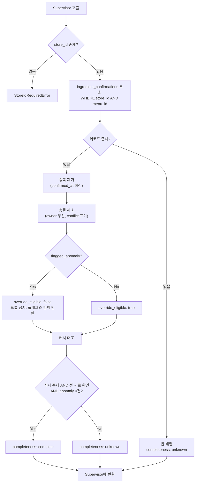

# ③ Exact 피드백 에이전트 (재료 단위 확인 조회)

담당: 윤지 / 상태: v3 (확정) / 상위 문서: `catoin-multi-agent-architecture.md`

---

## 0. 역할 범위

**③은 순수 조회기다. 판단하지 않는다.**

- 하는 것: `store_id + menu_id`로 `ingredient_confirmations` 조회 → 재료 단위 확인 맵 반환
- 설계 원칙: **메뉴 단위 이분법 금지.** 부분 확인을 반드시 지원한다.

| 하지 않음 | 담당 |
|---|---|
| 재료 확장 / 변형 판정 | ④ |
| 전부·일부 판단 후 라우팅 | ① Supervisor |
| 사용자 알레르기 태그 매칭 | ⑧ XAI |
| 확률 계산 | ⑤ |
| DB 쓰기 | ⑦ |

### 0-1. 순서 문제와 해결

③은 ④보다 먼저 실행되므로 **그 메뉴의 전체 재료 목록(분모)을 모른다.** 따라서 "전부 확인됨"을 ③이 단독 판정할 수 없다.

→ **③은 보유한 확인 레코드만 반환한다.** 완전성은 `menu_ingredient_cache`(④가 과거 확장 결과를 저장한 테이블)가 있을 때만 `complete`로 표기하고, 없으면 `unknown`으로 반환해 Supervisor가 ④를 호출하게 한다.

---

## 1. 입력 / 출력 스펙

### 1-1. 입력 (Supervisor로부터)

| 필드 | 타입 | 필수 | 설명 |
|---|---|---|---|
| `store_id` | integer | **필수** | 양수만 허용. null이면 즉시 에러. 전역 조회 금지 |
| `menu_id` | string | 필수 | 조회 대상 메뉴. 변형/base 구분 없이 이 값 하나만 봄 |
| `scope_hint` | `"exact" \| "inherited"` | 필수 | 반환 레코드에 붙일 라벨. ③은 이 값을 **해석하지 않고** 그대로 반환 |

### 1-2. 출력 (Supervisor에게 반환)

```json
{
  "store_id": 123456,
  "menu_id": "str",
  "confirmation_scope": "exact",
  "completeness": "unknown",
  "confirmations": [
    {
      "ingredient": "돼지고기",
      "status": "present",
      "evidence_type": "owner",
      "flagged_anomaly": false,
      "override_eligible": true,
      "conflict": false,
      "superseded": false,
      "confirmed_at": "2026-09-01T00:00:00Z"
    }
  ]
}
```

### 1-3. `status` — 3값 필수 (2값 금지)

| 값 | 의미 |
|---|---|
| `present` | 들어있다고 확인됨 |
| `absent` | 없다고 확인됨 |
| `unknown` | 아직 확인 안 됨 (레코드 없음과 동일 취급) |

> ⚠️ `true/false` 2값으로 설계하면 **"없다고 확인됨"과 "아직 안 물어봄"이 구분되지 않는다.** 전자는 override 대상, 후자는 확률 계산 대상 — 정반대 처리다.

### 1-4. `evidence_type`

| 값 | 성격 | 후속 처리 |
|---|---|---|
| `owner` | 사장님 확인 (hard evidence) | override 후보 |
| `user_hard` | 과거 사용자 hard evidence | override 후보 (신뢰 가중 검토, §6) |

### 1-5. `confirmation_scope`

| 값 | 의미 | Supervisor의 사용법 |
|---|---|---|
| `exact` | 이 menu_id에 직접 확인됨 | **override** — ⑤ 스킵 가능 (단 `override_eligible: true`일 때만) |
| `inherited` | base 메뉴에서 상속 | **prior로만** ⑤에 전달. **스킵 금지** |

### 1-6. `override_eligible` — anomaly 정책 반영 (확정)

**정책 확정**: FN-minimization 원칙에 따라, base rate와 명백히 모순되는 확인값은 override 대상에서 제외한다. (예: 돈까스에 `돼지고기: absent`)

| 조건 | `override_eligible` | Supervisor 동작 |
|---|---|---|
| `flagged_anomaly: false` AND `scope: exact` | `true` | override 적용, ⑤ 스킵 가능 |
| `flagged_anomaly: true` | **`false`** | **override 거부 → 해당 재료를 ⑤로 전달**, ⑧에서 CAUTION 이상 강제 유지 |
| `scope: inherited` | `false` | 항상 prior 보정용 |

> ⚠️ **anomaly 재료를 "무시"하면 안 된다.** 재료 자체가 리스트에서 사라지면 확률 계산도 안 되고 판정에서도 빠져 **FN이 발생한다.** 반드시 ⑤로 넘겨 확률을 계산하게 하고, 결과를 CAUTION 이상으로 유지한다.

---

## 2. 처리 로직



### 2-1. 함수 시그니처

```python
def query_exact_confirmations(
    store_id: int,                                  # 필수·양수. None/0 이하 → StoreIdRequiredError
    menu_id: str,
    scope_hint: Literal["exact", "inherited"] = "exact",
) -> ExactResult:
    """store_id+menu_id 스코프의 재료 단위 확인 레코드를 조회해 그대로 반환.
    판단·확장·라우팅 없음."""


def check_completeness(
    confirmations: list[Confirmation],
    store_id: int,
    menu_id: str,
) -> Literal["complete", "unknown"]:
    """menu_ingredient_cache가 있고, 전 재료가 확인됐고, anomaly가 0건일 때만 complete.
    캐시가 없으면 항상 unknown (④ 호출 유도)."""


def resolve_override_eligibility(c: Confirmation, scope: str) -> bool:
    """anomaly이거나 inherited 스코프면 False.
    False인 재료는 드롭하지 않고 ⑤로 전달한다."""
```

### 2-2. 의사코드

```
if store_id is None:
    raise StoreIdRequiredError

rows = db.query("ingredient_confirmations",
                store_id=store_id,          # 스코프 필수
                menu_id=menu_id)

confirmations = [to_confirmation(r) for r in rows]   # anomaly 포함, 드롭 금지
confirmations = dedupe_latest(confirmations)         # 중복 시 confirmed_at 최신 채택
confirmations = resolve_conflict(confirmations)      # owner 우선 + conflict 표기

for c in confirmations:
    c.override_eligible = resolve_override_eligibility(c, scope_hint)

cached = db.get_menu_ingredient_cache(store_id, menu_id)
completeness = (
    "complete"
    if cached
       and all(c.status != "unknown" for c in cover(cached, confirmations))
       and all(not c.flagged_anomaly for c in confirmations)
    else "unknown"
)

return ExactResult(
    confirmations       = confirmations,
    confirmation_scope  = scope_hint,
    completeness        = completeness,
)
```

> **`complete` 조건에 anomaly 0건이 포함되는 이유**: anomaly는 "확인은 됐지만 믿을 수 없는 확인"이다. 이를 `complete`로 처리하면 ④⑤가 스킵되고 모순된 값이 그대로 판정에 반영된다.

---

## 3. Supervisor와의 계약 (Contract)

**호출 시점**: ② 정규화 직후, ④보다 **먼저**. 가벼운 경로 조기 종료를 위해.

### 3-1. 호출 횟수: 최대 2회 — ③은 자신이 몇 번째 호출인지 모른다

| 회차 | 인자 | 시점 | 결과 사용 |
|---|---|---|---|
| 1차 | `menu_id`=대상 메뉴, `scope_hint="exact"` | ④ 이전 | `complete`면 ④⑤ 스킵하고 ⑧ 직행 |
| 2차 | `menu_id`=`base_menu_id`, `scope_hint="inherited"` | ④가 `base_menu_id`를 반환한 **이후** | ⑤에 **prior로만** 전달 |

> 2차 호출이 필요한 이유: `base_menu_id`는 ④가 DB 컬럼을 읽거나 longest-match로 판별한 결과다. ③에 변형 판정을 넣으면 순서 모순이 발생하므로, 상속은 **Supervisor의 재호출**로 처리한다.

### 3-2. 상속 범위: `base_menu_id` 단일 메뉴만 (확정)

형제 변형(해물된장찌개 등)은 상속 대상이 **아니다.**

- base(된장찌개)는 변형(차돌된장찌개)의 **부분집합**이므로 상속 근거가 성립한다.
- 형제(해물된장찌개)는 부분집합 관계가 아니다. 해물된장찌개의 `새우: present`가 차돌된장찌개로 넘어오면 오판이다.
- 형제 상속을 하려면 "공통 재료 vs 변형 고유 재료" 필터가 필요한데, 그것은 사실상 base를 다시 계산하는 것이다.

### 3-3. ③ → Supervisor 반환값별 후속 판단

| 반환 | Supervisor 동작 |
|---|---|
| `completeness: complete` | ④⑤ 스킵 → ⑧ 직행 |
| `confirmations` 일부 존재 | ④ 호출 시 `confirmed_ingredients`에 **`status != unknown` AND `override_eligible: true`** 인 재료만 전달 |
| `confirmations` 빈 배열 | ④ 호출 (`confirmed_ingredients=[]`) |
| `override_eligible: false` 포함 | 해당 재료를 override에서 제외하고 **⑤ 계산 대상에 포함** |
| `confirmation_scope: inherited` | **override 금지.** ⑤에 `inherited_confirmations`로 전달 |

**③이 직접 호출하지 않는 것**: 어떤 에이전트도 호출하지 않는다. 조회 후 반환하고 종료.

---

## 4. 케이스별 관여 범위 / 예외

### 4-1. 원본 시나리오별 동작

| 케이스 | ③의 동작 | 반환 |
|---|---|---|
| **1) DB 존재 + 피드백 없음** | 조회 → 레코드 없음 | 빈 배열, `unknown` |
| **2) DB 존재 + 피드백 일부** | 해당 재료만 반환 | 부분 맵, `unknown` |
| **2-b) 피드백 전부 (anomaly 없음)** | 캐시 대조 후 완전 확인 | `complete` → ④⑤ 스킵 |
| **2-c) 피드백 전부 (anomaly 포함)** | 캐시 대조하되 `complete` 불가 | `unknown` → ④⑤ 정상 진행 |
| **3) 변형 메뉴** | 1차: 변형 menu_id / 2차: `base_menu_id` | `exact` + `inherited` 2건 |
| **4) DB에 없는 unknown 메뉴** | 메뉴 자체 없음 → 빈 배열 | `unknown`. 에러 아님 |
| **5) 웹서치까지 실패 (엣지)** | **관여 없음** | 4번에서 이미 종료 |

### 4-2. 예외 처리

| 상황 | 처리 |
|---|---|
| `store_id` 누락/null | `StoreIdRequiredError`. **전역 조회 fallback 금지** |
| `menu_id`가 DB에 없음 | 빈 배열 + `unknown` 반환. 예외 발생시키지 않음 |
| `flagged_anomaly: true` | **드롭 금지.** `override_eligible: false`로 표기해 반환 → ⑤ 계산 대상 |
| 동일 재료 중복 레코드 | `confirmed_at` 최신 1건 채택, 나머지 `superseded: true` |
| `owner` vs `user_hard` 상충 | `owner` 우선. `conflict: true`로 표기해 ⑧에 전달 |
| `menu_ingredient_cache` 없음 | `completeness: unknown` 강제 → ④ 호출 유도 |
| 2차 호출인데 `base_menu_id`가 null | Supervisor가 호출하지 않음. 도달 시 빈 배열 반환 |
| 캐시와 실제 재료 목록 불일치 | 캐시 무효로 간주 → `unknown` 반환 (안전 방향) |

---

## 5. 테스트 케이스

| # | 입력 | 기대 동작 | 검증 포인트 |
|---|---|---|---|
| 1 | 확인 레코드 0건 | 빈 배열 + `unknown` | 에러 발생하지 않을 것 |
| 2 | 5개 중 2개만 확인 | 2건 반환 + `unknown` | **메뉴 단위 이분법 없을 것** (부분 확인 지원) |
| 3 | `status: absent` 레코드 | `absent`로 반환 | `unknown`과 구분될 것 (3값 검증) |
| 4 | 차돌된장찌개 1차 호출 | 빈 배열 + `scope: exact` | base 정보를 ③이 스스로 끌어오지 않을 것 |
| 5 | 된장찌개 2차 호출 | `scope: inherited`, `override_eligible: false` | Supervisor가 override로 쓰지 않을 것 |
| 6 | `store_id` 누락 | 즉시 에러 | 전역 fallback 없을 것 |
| 7 | 돈까스 `돼지고기: absent` (anomaly) | `override_eligible: false` + 재료 유지 | **드롭도 자동채택도 하지 않을 것**, ⑤로 전달될 것 |
| 8 | 전 재료 확인 + anomaly 1건 | `completeness: unknown` | anomaly가 `complete`를 막을 것 |
| 9 | `owner: absent` + `user_hard: present` | owner 채택 + `conflict: true` | 충돌 은폐하지 않을 것 |
| 10 | 캐시 존재 + 전 재료 확인 + anomaly 0 | `complete` | ④⑤ 스킵 경로 작동할 것 |
| 11 | 동일 재료 레코드 3건 | 최신 1건 + `superseded: true` 2건 | 중복 집계되지 않을 것 |

---

## 6. 미확정 항목 (팀 확인 대기)

- [ ] **`user_hard` 신뢰 가중** — 사장님(`owner`)과 동일 가중을 줄지, 계층적 신뢰 가중(Dawid & Skene 계열)을 학습할지
- [ ] **확인 정보 유효기간** — 6개월 전 확인을 현재도 유효로 볼지. 레시피 변경 가능성. 대회 범위상 과할 수 있으나 명시 시 설계 깊이로 평가 가능
- [ ] **`menu_ingredient_cache` 스키마** — 생성 결정됨. 컬럼 정의 및 무효화(invalidation) 시점 확정 필요 (④ 재확장 시 갱신, 온톨로지 변경 시 전체 무효화)
- [ ] **anomaly 판정 기준** — `flagged_anomaly`를 무엇으로 판정할지. 현재는 "base rate와 극단적으로 어긋남"으로만 기술됨. 임계값 정의 필요

## 7. 확정된 결정 (변경 금지)

- **anomaly 정책**: override 거부, CAUTION 이상 강제 유지 (FN-minimization 우선) — 팀 확정
- **상속 범위**: `base_menu_id` 단일 메뉴만. 형제 변형 제외
- **`status` 3값**: `present` / `absent` / `unknown`
- **`menu_ingredient_cache`**: 생성하기로 확정
