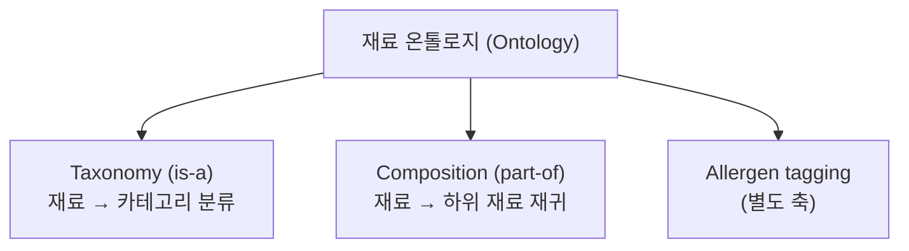
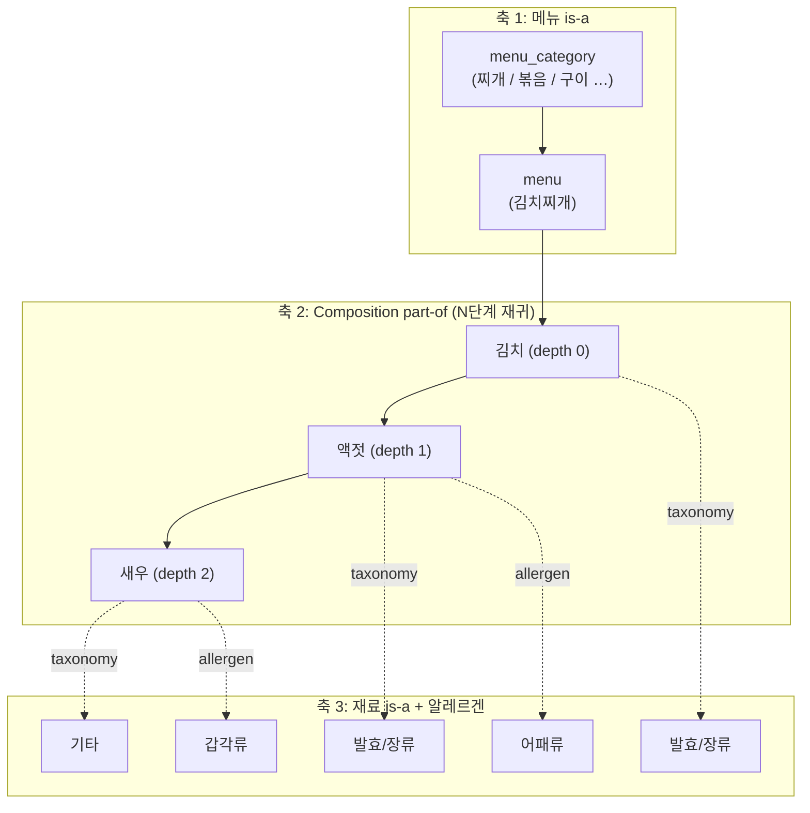
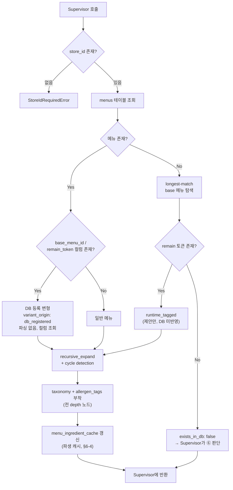

# ④ DB/온톨로지 조회 + 재귀 확장 + 변형 태깅 에이전트

담당: 윤지 / 상태: v3 (확정) / 상위 문서: `catoin-multi-agent-architecture.md`

---

## 0. 용어 정의 (Ontology vs Taxonomy)

이 문서에서 두 용어는 **다른 것**을 가리킨다. 혼용 금지.

| 용어 | 관계 | 질문 | 예시 | 구현 필드 |
|---|---|---|---|---|
| **Taxonomy** | `is-a` | "이건 무슨 종류인가?" | 액젓 **is-a** 발효/장류 | `taxonomy` |
| **Ontology** | taxonomy + `part-of` 등 | "이건 무엇으로 이루어지는가?" | 김치찌개 **has** 김치 **has** 액젓 | `hidden` + `taxonomy` |

- **Taxonomy는 Ontology의 부분집합이다.** Taxonomy는 계층 분류 트리 하나뿐이고, 여기에 `part-of` 같은 다른 관계가 추가되면 Ontology가 된다.
- `hidden_rules.py`는 두 관계를 모두 담고 있으므로 **재료 온톨로지(ingredient ontology)** 가 정확한 명칭이다.
  - 7개 카테고리 분류 부분만 지칭할 때 → "taxonomy 분류"
  - 재귀 확장 부분을 지칭할 때 → "composition(part-of) 기반 재귀 확장"



---

## 1. 3축 구조

이 에이전트가 다루는 데이터는 **선형 계층이 아니라 3개의 독립 축**이다.



### 1-1. 축 1 — 메뉴 taxonomy (`menu_category`)

- 찌개 / 볶음 / 구이 / 탕 / 면 등 조리법 기반 상위 분류.
- `menus.csv` 76개 항목은 **다중 카테고리로 구성됨** (확인 완료).
- **용도**: ⑤ Bayesian이 store prior 부재 시 **동일 `menu_category` 클러스터 prior로 fallback** 하는 근거. 이 축이 유효하므로 `store → cluster → global` 3단계 fallback이 성립한다.

### 1-2. 축 2 — Composition (`part-of`, 재귀)

- **depth를 고정하지 않는다.** 김치찌개 → 김치 → 액젓 → 새우처럼 깊이가 가변이다.
- 각 노드에 `depth` 값을 기록한다. depth 0(직접 재료)과 depth 3(3단계 하위)을 동일 확률로 취급하면 안 되기 때문 (⑤ 감쇠, §8).
- 순환 참조 탐지(cycle detection)는 `recursive_expand.py`에 구현되어 있다.

### 1-3. 축 3 — 재료 taxonomy + 알레르겐 (독립 축)

- taxonomy 카테고리는 **재귀의 모든 노드에 붙는다.** depth 0이든 depth 3이든 전부 카테고리를 가진다. 축 2와 독립이기 때문.
- **알레르겐은 taxonomy 카테고리가 아니라 별개 축이다.** 밀가루/새우/땅콩은 재료(ingredient)이지 카테고리가 아니다. taxonomy에 끼워넣으면 분류 체계가 무너진다 → `allergen_tags` 배열로 분리.

---

## 2. Taxonomy 카테고리 (개정)

`hidden_rules.py` 기존 7개 카테고리에서 **교차오염 카테고리를 제외**한다.

| 카테고리 | 비고 |
|---|---|
| 발효/장류 | 유지 |
| 소스 | 유지 |
| 육수 | 유지 |
| 양념 | 유지 |
| 고명/견과 | 유지 |
| 유지류 | 유지 |
| 기타 | 신설 (재배치 잔여 재료 수용) |
| ~~교차오염~~ | **제외** (§3) |

기존 교차오염 소속 31개 재료 처리:
- 실제로 다른 카테고리(소스/양념/유지류 등)에 속하는 재료 → 해당 카테고리로 **이동**
- 두부·밀가루 등 일반 재료 → 카테고리는 `기타`, 위험 정보는 `allergen_tags`로 이관
- **재배치 상세 매핑표: 작성 대기 (§8)**

---

## 3. 모델 범위 선언 (Scope)

> 본 모델은 **레시피 구성 기반 재료 추론**만을 범위로 한다.
> 조리 과정의 교차오염(공유 기름·도마·불판) 및 제조 공정 오염(가공식품 설비 공유)은 **가게 단위로 관측 불가능**하므로 모델 범위에서 제외한다.
> 해당 위험은 확률 모델이 아닌 **사장님 질문 생성 경로(⑧ XAI)** 로 위임한다.

**근거**: FN-minimization이 북극성 지표이지만, 관측 불가능한 변수를 확률 모델에 강제로 포함하면 근거 없는 추정치가 들어가 노이즈가 증가하고 판정 신뢰도(calibration)가 오히려 저하된다. 관측 불가능한 위험은 **확률로 추정하는 대신 직접 질의**하는 경로로 처리하는 것이 정확도와 설명가능성 모두에서 우위다.

---

## 4. 입력 / 출력 스펙

### 4-1. 입력 (Supervisor로부터)

| 필드 | 타입 | 필수 | 설명 |
|---|---|---|---|
| `store_id` | string | **필수** | null이면 즉시 에러. 전역 조회 금지 |
| `normalized_menu_name` | string | 필수 | ② 정규화 출력. ④는 재정규화하지 않음 |
| `unconfirmed_only` | bool | 필수 | 미확인 재료만 처리할지 |
| `confirmed_ingredients` | string[] | 선택 | ③ 출력 중 `status != unknown` **AND** `override_eligible: true` 인 재료만 |

> ⚠️ `override_eligible: false`인 재료(anomaly)는 `confirmed_ingredients`에 **포함되지 않는다.** 확장 대상에 남아 ⑤로 넘어가야 CAUTION 판정이 가능하다.
> Supervisor는 이런 재료를 미확인 재료 목록에 섞어 넣을 때 **`anomaly_locked: true`를 함께 전달**한다. ④는 이 값을 가공하거나 재판단하지 않고 **그대로 보존**해서 출력의 해당 재료 노드에 실어 반환해야 한다 (아래 §4-2 `ingredients[].anomaly_locked` 참고) — 이 값이 ④에서 끊기면 ⑤/⑧까지 전달이 안 돼 CAUTION 강제가 무력화된다.

### 4-2. 출력 (Supervisor에게 반환)

```json
{
  "store_id": "str",
  "menu_id": "str | null",
  "base_menu_id": "str | null",
  "remain_token": "str | null",
  "menu_category": "찌개 | 볶음 | 구이 | ...",
  "exists_in_db": true,
  "is_variant": true,
  "variant_origin": "db_registered",
  "ingredients": [
    {
      "name": "액젓",
      "taxonomy_category": "발효/장류",
      "allergen_tags": ["어패류"],
      "depth": 1,
      "parent": "김치",
      "source": "expanded",
      "k_count": 41,
      "n_total": 57,
      "anomaly_locked": false
    }
  ],
  "variant_suggestion": null,
  "unmapped_token": null
}
```

### 4-3. `variant_origin` — 변형의 출처 (⑤ 신뢰도 차등의 핵심)

| 값 | 의미 | 재료 `source` | ⑤ scale |
|---|---|---|---|
| `db_registered` | `menus`에 `base_menu_id` / `remain_token` 컬럼으로 **이미 등록된 변형**. 관리자 컨펌 완료 | `recipe` | **1.0** |
| `runtime_tagged` | DB에 없어 런타임 longest-match로 **추정한 신규 변형** | `variant_suggested` | **0.5** |
| `null` | 변형 아님 | — | — |

> ⚠️ 두 경우를 같게 취급하면 안 된다. `db_registered`는 사람이 컨펌한 확정 데이터이므로 신뢰도를 낮추지 않는다. 신뢰도 하향은 `runtime_tagged`에만 적용한다.

### 4-4. `source` 필드 (⑤가 prior를 차등 적용하는 근거)

| 값 | 의미 | ⑤에서의 취급 |
|---|---|---|
| `recipe` | `recipe_ingredients`에 명시된 직접 재료 (**DB 등록 변형 재료 포함**) | 확정 prior, scale 1.0 |
| `expanded` | 재귀 확장으로 도출된 하위 재료 | depth 감쇠 적용 (§8) |
| `variant_suggested` | 런타임 태깅 제안 (DB 미반영) | **scale 0.5** |

### 4-5. `k_count` / `n_total` 제공 책임

⑤의 Beta-Binomial 계산(`α = k_count + 1`, `β = (n_total − k_count) + 1`)에 필요한 관측값은 **④가 재료별로 함께 반환한다.**

- `k_count`: 해당 메뉴의 레시피 중 그 재료가 등장한 횟수
- `n_total`: 해당 메뉴의 전체 레시피 수
- 값이 없으면 `k_count=0, n_total=0`으로 반환 → ⑤가 `confidence: low` 처리

---

## 5. 처리 로직



### 5-1. 기본 조회 + 재귀 확장

1. `store_id` 검증 → 없으면 즉시 에러 (전역 prior 오염 방지)
2. `menus` / `recipe_ingredients` 조회
3. `recursive_expand.py` 로직으로 `part-of` 재귀 확장, cycle detection 적용
4. 전 노드에 `depth`, `parent`, `k_count`, `n_total` 기록

### 5-2. 변형 처리 — **DB 조회 우선, 파싱은 fallback**

**(A) DB에 등록된 변형 (`db_registered`)**

- `menus` 테이블에 `base_menu_id`, `remain_token`이 **컬럼으로 이미 존재한다.**
  (예: `name_ko="차돌된장찌개"`, `base_menu_id`→된장찌개, `remain_token="차돌"`)
- **문자열 파싱을 수행하지 않는다.** 컬럼을 그대로 읽는다.
- 이 변형의 재료는 관리자 컨펌을 거쳤으므로 `source: recipe` — **신뢰도 하향 대상이 아니다.**

**(B) DB에 없는 신규 변형 (`runtime_tagged`)**

- 메뉴가 `menus`에 없을 때**만** longest-match 실행 → base / remain 분리
- remain을 재료로 매핑 → `variant_suggested` 태깅
- **DB에 쓰지 않는다.** ⑤가 메모리에서 즉시 사용
- DB 반영 시엔 원본 row 재사용 금지. `base_menu_id`로 원본을 참조하는 **새 `menus` 행**(`source: variant_generated`) 생성 → 원본 메뉴 확률과 섞이지 않도록. 이 INSERT는 **⑦이 관리자 컨펌 후** 처리

### 5-3. 카테고리 태깅

- 확장된 **전 노드**에 taxonomy 카테고리 매핑 (depth 무관)
- 알레르겐 재료에 `allergen_tags` 부착

### 5-4. 함수 시그니처

```python
def query_ontology(
    store_id: str,                          # 필수. None → StoreIdRequiredError
    normalized_menu_name: str,
    unconfirmed_only: bool = True,
    confirmed_ingredients: list[str] | None = None,
) -> OntologyResult:
    """④ 진입점. DB 조회 → 변형 판별 → 재귀 확장 → 태깅 → 캐시 갱신."""


def resolve_variant(menu_row: MenuRow | None, menu_name: str) -> VariantInfo:
    """변형 판별. DB 컬럼(base_menu_id / remain_token) 우선.
    menu_row가 None일 때만 longest-match fallback."""


def recursive_expand(
    ingredient: str,
    depth: int = 0,
    visited: set[str] | None = None,         # cycle detection
    max_depth: int | None = None,            # 미확정 §8
) -> list[IngredientNode]:
    """part-of 관계 재귀 확장. visited로 순환 차단."""


def attach_taxonomy(nodes: list[IngredientNode]) -> list[IngredientNode]:
    """전 depth 노드에 taxonomy_category + allergen_tags 부착.
    미등록 재료는 '기타' 부여. 드롭 금지."""


def update_ingredient_cache(
    store_id: str, menu_id: str, nodes: list[IngredientNode]
) -> None:
    """menu_ingredient_cache 갱신. 파생 캐시이며 도메인 데이터가 아니다 (§6-4)."""
```

### 5-5. 의사코드

```
if store_id is None:
    raise StoreIdRequiredError

menu  = db.find_menu(store_id, normalized_menu_name)
extra = []

if menu is not None:
    if menu.base_menu_id is not None:          # (A) DB 등록 변형
        variant_origin = "db_registered"       # 파싱 없음, 컬럼 조회
    else:
        variant_origin = None
else:                                          # (B) 신규 변형 추정
    v = longest_match(normalized_menu_name)
    if v is None:
        return OntologyResult(exists_in_db=False)
    menu, extra    = v.base_menu, v.suggested_ingredients
    variant_origin = "runtime_tagged"          # source = variant_suggested

seeds = db.get_recipe_ingredients(menu.id)
if unconfirmed_only:
    seeds = [s for s in seeds if s not in confirmed_ingredients]

nodes = []
for s in seeds + extra:
    nodes += recursive_expand(s, depth=0, visited=set())

nodes = attach_taxonomy(nodes)
update_ingredient_cache(store_id, menu.id, nodes)

return OntologyResult(ingredients=nodes, variant_origin=variant_origin, ...)
```

---

## 6. Supervisor와의 계약 (Contract)

**호출 조건**: ③이 `completeness: complete`를 반환하지 **않은** 경우에만 Supervisor가 호출한다.

### 6-1. Supervisor → ④ (받는 것)

| 필드 | 보장 사항 |
|---|---|
| `store_id` | 가게 식별 완료된 값. **null 불가** |
| `normalized_menu_name` | ② 정규화 완료값. ④는 재정규화하지 않음 |
| `confirmed_ingredients` | ③ 출력 중 `status != unknown` AND `override_eligible: true` 인 재료만 |

### 6-2. ④ → Supervisor (돌려주는 것)

| 필드 | Supervisor의 후속 판단 |
|---|---|
| `exists_in_db: false` | → ⑥ 웹서치 호출 |
| `exists_in_db: true` | → ⑤ Bayesian 호출 |
| `base_menu_id != null` | → **③을 2차 호출** (`scope_hint="inherited"`) |
| `variant_origin: runtime_tagged` | → ⑤에 즉시 전달 **+** ⑦에 관리자 검토 자료 전달 |
| `variant_origin: db_registered` | → ⑤에만 전달. ⑦ 검토 불필요 (이미 컨펌됨) |
| `ingredients[].source` | → ⑤가 prior 신뢰도(scale)를 차등 적용 |
| `ingredients[].k_count / n_total` | → ⑤의 Beta-Binomial 관측값 |

**④가 직접 호출하지 않는 것**: 어떤 에이전트도 직접 호출하지 않는다. 웹서치 여부, DB 반영, 판정은 모두 Supervisor가 결정한다.

### 6-3. 케이스별 관여 범위

| 케이스 | ④의 동작 | 반환 |
|---|---|---|
| **1) DB 존재 + 피드백 없음** | 전체 재귀 확장 | `exists_in_db: true`, `source: recipe/expanded` |
| **2) DB 존재 + 피드백 일부** | `confirmed_ingredients` 제외한 나머지만 확장 | 부분 리스트. 확인 재료 재확장 금지 |
| **2-b) 피드백 전부 (anomaly 없음)** | **호출되지 않음** | — |
| **2-c) 피드백 전부 (anomaly 포함)** | 정상 호출됨. anomaly 재료 포함 확장 | ⑤로 전달되어 CAUTION 확보 |
| **3-a) DB 등록 변형 (차돌된장찌개)** | 컬럼 조회 → `db_registered` | `base_menu_id`/`remain_token`, `source: recipe` |
| **3-b) 신규 변형 (DB 없음)** | longest-match → `runtime_tagged` | `variant_suggestion` 채움, **DB INSERT 없음** |
| **4) DB에 없는 unknown 메뉴** | 조회 실패 확인까지만 | `exists_in_db: false`. ⑥은 ④가 호출하지 않음 |
| **5) 웹서치도 실패 (엣지)** | **관여 없음** | 4번에서 이미 종료 |

### 6-4. 이 에이전트가 하지 않는 것

| 하지 않음 | 담당 |
|---|---|
| 도메인 DB 쓰기 (`menus` / `recipe_ingredients` / `ingredient_risk_scores` INSERT·UPDATE) | ⑦ (관리자 컨펌 후) |
| 재료 존재 확률 계산 | ⑤ |
| DANGER / CAUTION / SAFE 판정 | ⑧ |
| 웹서치 호출 여부 결정 | ① Supervisor |
| 조리 중 교차오염 추정 | 모델 범위 외 (§3) |

> **예외 — `menu_ingredient_cache` 쓰기는 ④가 수행한다.**
> 이 테이블은 ④의 확장 결과를 그대로 저장한 **파생 캐시**이며 도메인 데이터가 아니다. 언제든 재계산 가능하고 관리자 컨펌 대상이 아니므로 ⑦의 승인 흐름을 타지 않는다. 단, 온톨로지(`hidden_rules.py`)나 `recipe_ingredients`가 변경되면 해당 캐시는 무효화되어야 한다 (무효화 시점 정의는 §8).

### 6-5. 예외 처리

| 상황 | 처리 |
|---|---|
| `store_id` 누락/null | `StoreIdRequiredError`. **전역 조회 fallback 금지** |
| 순환 참조 (A→B→A) | `visited`로 차단, 경고 로그, 확장분까지 반환 |
| 재귀 깊이 과다 | `max_depth` 미확정(§8). 임시로 경고 로그 후 계속 확장 |
| `base_menu_id`는 있으나 참조 메뉴가 없음 | 일반 메뉴로 처리 + 무결성 오류 로그. `base_menu_id: null` 반환 |
| longest-match 성공, remain 매핑 실패 (`"우리집된장찌개"`) | base로 처리, remain 무시, `unmapped_token`에 기록 |
| taxonomy 미등록 재료 | `기타` 부여. **드롭 금지** — 재료 누락은 FN 직결 |
| `recipe_ingredients` 빈 배열 | `exists_in_db: true`지만 재료 0개 → 경고 플래그. ⑧에서 CAUTION 이상 유지 |
| `k_count` / `n_total` 부재 | `0, 0`으로 반환. ⑤가 `confidence: low` 처리 |

---

## 7. 테스트 케이스

| # | 입력 | 기대 동작 | 검증 포인트 |
|---|---|---|---|
| 1 | `김치찌개` (DB 존재) | 김치(d0) → 액젓(d1) → 새우(d2) | depth 기록, 전 노드 taxonomy, 새우 갑각류 태그 |
| 2 | `차돌된장찌개` (DB 등록 변형) | 컬럼 조회 → `db_registered` | **longest-match 실행되지 않을 것**, `source: recipe` |
| 3 | `트러플된장찌개` (DB 없음) | longest-match → `runtime_tagged` | **DB INSERT 없을 것**, `source: variant_suggested` |
| 4 | `듣도보도못한메뉴` | `exists_in_db: false` | ④가 웹서치를 직접 호출하지 않을 것 |
| 5 | `store_id` 누락 | 즉시 에러 | 전역 fallback 없을 것 |
| 6 | 순환 참조 재료 | cycle detection 작동 | 무한루프 없을 것 |
| 7 | ③에서 일부 확인됨 | 미확인 재료만 확장 | 중복 확장 없을 것 |
| 8 | ③에서 anomaly 재료 포함 | anomaly 재료도 확장 대상 | **확장에서 빠지지 않을 것** |
| 9 | `우리집된장찌개` | base 처리 + remain 매핑 실패 | `unmapped_token` 기록, 에러 없을 것 |
| 10 | taxonomy 미등록 재료 | `기타` 부여 | 재료 드롭되지 않을 것 |
| 11 | `base_menu_id` 참조 깨짐 | 일반 메뉴 처리 + 로그 | 크래시 없을 것 |
| 12 | 갈비구이-마늘 | `k_count=53, n_total=57` 반환 | ⑤가 α=54, β=5 산출 가능할 것 |

---

## 8. 미확정 항목 (팀 확인 대기)

- [ ] **교차오염 31개 재료 재배치 매핑표** — 어느 재료를 어느 카테고리로 이동할지
- [ ] **depth 감쇠 함수** — 감쇠 여부 및 형태(선형/지수/없음). ⑤ §6과 연동 결정
- [ ] **`max_depth` 상한값** — 재귀 깊이 제한을 둘지, 둔다면 몇 단계까지
- [ ] **`menu_category` 전체 목록** — `menus.csv` 76개 항목의 카테고리 매핑 (다중 카테고리 확인 완료, 세부 목록 작성 대기)
- [ ] **`menu_ingredient_cache` 무효화 시점** — 온톨로지/레시피 변경 시 전체 무효화인지 부분 무효화인지
- [ ] **⑥ 웹서치 출력 필드 정합 (외부 의존)** — ⑥ 결과가 ⑤로 갈 때 `source: web_search`, `depth: 0`, `k_count`/`n_total` 필드를 채워야 함. **⑥ 담당자 확인 필요**

## 9. 확정된 결정 (변경 금지)

- **교차오염 카테고리 제외**: 관측 불가능하므로 모델 범위 외. 사장님 질문 경로로 위임
- **변형 판별**: DB 컬럼(`base_menu_id` / `remain_token`) 우선, 파싱은 DB 부재 시에만
- **`db_registered` vs `runtime_tagged`**: 전자는 scale 1.0, 후자만 0.5
- **알레르겐**: taxonomy가 아닌 별도 축(`allergen_tags`)
- **캐시 쓰기**: ④가 수행 (파생 캐시, ⑦ 승인 대상 아님)
