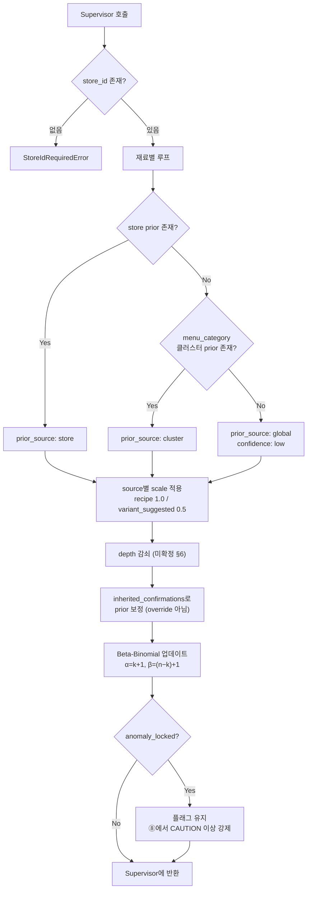

# ⑤ 확률(Bayesian) 에이전트

담당: 윤지 / 상태: v3 (확정 — 공식 확정으로 구현 착수 가능) / 상위 문서: `catoin-multi-agent-architecture.md`

---

## 0. 역할 범위

④가 확장한 재료 각각에 대해 **해당 가게에서 그 재료가 실제로 들어갈 확률**을 Beta-Binomial로 추정한다.

| 하지 않음 | 담당 |
|---|---|
| DANGER / CAUTION / SAFE 판정 | ⑧ XAI |
| threshold(F2 컷오프) 결정 | §6 미확정 |
| 사용자 알레르기 태그 매칭 | ⑧ |
| 재료 확장 | ④ |
| `ingredient_risk_scores` 직접 UPDATE | ⑦ (**직접 UPDATE 금지**) |

**핵심 원칙**: `store_id` 스코프로 분리된 prior만 사용한다. 전역 prior는 최후의 수단이다.

---

## 1. 확률 공식 (확정)

`normalize_ingredients.py` 실제 구현과 일치. **Beta(1,1) 사전분포 기반 라플라스 스무딩.**

```python
A0, B0 = 1.0, 1.0                       # Beta(1,1) 사전분포
alpha = k_count + A0                    # = k_count + 1
beta  = (n_total - k_count) + B0        # = (n_total - k_count) + 1

posterior_mean = alpha / (alpha + beta)
```

| 기호 | 정의 |
|---|---|
| `k_count` | 그 메뉴의 레시피 중 해당 재료가 등장한 횟수 |
| `n_total` | 그 메뉴의 전체 레시피 수 |

**검증 예시**: 갈비구이-마늘 `n_total=57, k_count=53` → `α=54, β=5` → `posterior_mean ≈ 0.915`

> 이 공식은 baseline 모델(`predict_ingredients`), train/test 재계산(`compute_prior_from`), store 계층 구조의 global prior까지 전 구간에서 동일하게 사용된다.
> **doc2의 `α=5/β=1` 초기화 규칙은 폐기됨** (팀 확정).

### 1-1. `n_total = 0` 처리

Beta(1,1)이 사전분포이므로 관측 0건이면 `α=1, β=1` → `posterior_mean = 0.5`.

- 0 나눗셈은 발생하지 않는다.
- 다만 **0.5는 SAFE도 DANGER도 아닌 완전 무정보 상태**이므로 `confidence: low`를 부여하고, ⑧에서 CAUTION 이상을 유지하도록 신호를 보낸다.

---

## 2. 입력 / 출력 스펙

### 2-1. 입력 (Supervisor로부터)

| 필드 | 타입 | 필수 | 설명 |
|---|---|---|---|
| `store_id` | string | **필수** | prior 스코프. null이면 에러 |
| `menu_category` | string | 필수 | 클러스터 fallback용 (④ 출력) |
| `ingredients` | IngredientNode[] | 필수 | ④ 또는 ⑥ 출력. `source`, `depth`, `k_count`, `n_total`, **`anomaly_locked`**(④가 ③/Supervisor로부터 받아 그대로 보존한 값) 포함 |
| `inherited_confirmations` | Confirmation[] | 선택 | ③ 2차 호출 결과. **prior 보정용, override 아님** |

**이 에이전트에 오는 재료 / 오지 않는 재료**

| 구분 | ⑤에 오는가 | 이유 |
|---|---|---|
| `scope: exact` + `override_eligible: true` | ❌ 오지 않음 | Supervisor가 override 처리 후 제외 |
| `scope: exact` + `override_eligible: false` (anomaly) | ✅ **온다** | override 거부됐으므로 확률 계산이 필요. 결과는 CAUTION 이상 유지 |
| `scope: inherited` | ✅ 온다 | `inherited_confirmations`로 prior 보정에만 사용 |
| 미확인 재료 | ✅ 온다 | 기본 계산 대상 |

### 2-2. 출력 (Supervisor에게 반환)

```json
{
  "store_id": "str",
  "probabilities": [
    {
      "ingredient": "새우",
      "posterior_mean": 0.62,
      "alpha_post": 3.0,
      "beta_post": 1.8,
      "prior_source": "store",
      "source": "expanded",
      "depth": 2,
      "confidence": "medium",
      "anomaly_locked": false
    }
  ]
}
```

### 2-3. `prior_source` — fallback 단계 (내림차순 우선)

| 값 | 의미 | 조건 |
|---|---|---|
| `store` | 해당 가게 고유 prior | `ingredient_risk_scores`에 store_id 매칭 레코드 존재 |
| `cluster` | 동일 `menu_category` 클러스터 prior | store prior 없음. `menus.csv`가 다중 카테고리이므로 이 fallback은 **유효함** |
| `global` | 전역 prior | **최후의 수단.** `confidence: low` 강제 |
| `uninformative` | 근거 전무 (`n_total=0` 포함) | ⑧에서 CAUTION 이상 강제 유지 |

### 2-4. `anomaly_locked`

③에서 `override_eligible: false`로 넘어온 재료에 `true`를 부여한다.
⑧은 이 플래그가 있으면 **posterior_mean과 무관하게 CAUTION 이상을 유지**한다.

---

## 3. 처리 로직



### 3-1. 근거 강도별 처리 — **scale은 α·β 동일 비율 축소**

| ④의 `source` | 근거 | scale |
|---|---|---|
| `recipe` | DB 명시 재료 (**DB 등록 변형 재료 포함**) | 1.0 |
| `expanded` | 재귀 확장 도출 | depth 감쇠 (§6) |
| `variant_suggested` | 런타임 태깅 제안, DB 미반영 | **0.5** |

**α만 줄이면 안 되는 이유 (중요)**

α만 축소하면 posterior mean이 **낮아진다** → 재료가 없다고 판단 → **SAFE 쪽으로 기움** → **FN 발생.**
변형 재료는 "없을 가능성이 높다"가 아니라 **"불확실하다"** 이다. 불확실은 낮은 확률이 아니라 **넓은 분포**다.

```
확정 재료:           α=8,  β=2   → mean 0.80, 좁은 분포
variant (틀린 방식):  α=4,  β=2   → mean 0.67   ← SAFE 쪽으로 이동. 위험
variant (올바른 방식): α=4,  β=1   → mean 0.80, 넓은 분포  ← mean 보존, 불확실성만 증가
```

→ **α, β를 동일 비율로 축소해 pseudo-count 총량만 줄인다.** posterior mean은 보존되고 분산만 커져, ⑧에서 "확률은 높은데 confidence가 낮다 → 사장님 질문 우선순위 상향"으로 자연스럽게 연결된다.

> `variant_origin: db_registered`(④ DB 컬럼 등록 변형)는 관리자 컨펌을 거친 확정 데이터이므로 `source: recipe`이며 **scale 축소 대상이 아니다.** 축소는 `runtime_tagged`에서 나온 `variant_suggested`에만 적용한다.

### 3-2. 함수 시그니처

```python
A0, B0 = 1.0, 1.0                                      # Beta(1,1) 라플라스 스무딩


def estimate_probabilities(
    store_id: str,                                     # 필수
    menu_category: str,
    ingredients: list[IngredientNode],
    inherited_confirmations: list[Confirmation] | None = None,
) -> BayesianResult:
    """재료별 존재 확률(posterior mean) 산출. 판정하지 않음."""


def resolve_prior(
    store_id: str, ingredient: str, menu_category: str,
) -> tuple[float, float, PriorSource]:
    """store → cluster → global → uninformative 순 fallback.
    전역 prior는 최후의 수단이며 confidence를 low로 강등."""


def apply_source_scale(
    alpha: float, beta: float,
    source: Literal["recipe", "expanded", "variant_suggested"],
    depth: int,
) -> tuple[float, float]:
    """α·β를 동일 비율로 축소. mean 보존, 분산 증가.
    recipe=1.0, variant_suggested=0.5, expanded=depth 감쇠(§6)."""


def beta_binomial_update(
    k_count: int, n_total: int,
    a0: float = A0, b0: float = B0,
) -> tuple[float, float]:
    """α = k_count + a0, β = (n_total − k_count) + b0.
    normalize_ingredients.py 구현과 동일."""
```

### 3-3. 의사코드

```
if store_id is None:
    raise StoreIdRequiredError

results = []
for ing in ingredients:
    a0, b0, prior_src = resolve_prior(store_id, ing.name, menu_category)
    a0, b0 = apply_source_scale(a0, b0, ing.source, ing.depth)   # α·β 동일 비율

    if inherited_confirmations:
        a0, b0 = adjust_with_inherited(a0, b0, ing.name, inherited_confirmations)
        # prior 보정만. status를 확정값으로 쓰지 않는다.

    alpha = ing.k_count + a0
    beta  = (ing.n_total - ing.k_count) + b0

    results.append(Probability(
        posterior_mean = alpha / (alpha + beta),
        alpha_post     = alpha,
        beta_post      = beta,
        prior_source   = prior_src,
        confidence     = grade(prior_src, ing.source, ing.depth, ing.n_total),
        anomaly_locked = ing.anomaly_locked,
    ))

return BayesianResult(probabilities=results)
```

---

## 4. Supervisor와의 계약 (Contract)

**호출 조건**: ④가 `exists_in_db: true`를 반환했거나 ⑥이 재료 후보를 반환한 경우. ③이 `completeness: complete`면 호출되지 않는다.

### 4-1. Supervisor → ⑤ (받는 것)

| 필드 | 보장 사항 |
|---|---|
| `store_id` | 가게 식별 완료값. null 불가 |
| `ingredients` | ④ 또는 ⑥ 출력. `source` / `depth` / `k_count` / `n_total` 채워져 있음 |
| `inherited_confirmations` | ③ 2차 호출(`scope: inherited`) 결과만. override 대상 `exact`는 오지 않음 |

### 4-2. ⑤ → Supervisor (돌려주는 것)

| 필드 | 후속 판단 |
|---|---|
| `posterior_mean` | → ⑧이 F2 최적화 threshold와 대조해 판정 |
| `prior_source: uninformative` | → ⑧에서 CAUTION 이상 강제 유지 |
| `confidence: low` | → ⑧이 사장님 질문 생성 우선순위 상향 |
| `anomaly_locked: true` | → ⑧이 **확률과 무관하게 CAUTION 이상 강제** |

**⑤가 하지 않는 것**: DB 쓰기, 판정, 타 에이전트 호출. 특히 **`ingredient_risk_scores` 직접 UPDATE 금지** — α/β 재계산은 ⑦ 반영 이후 애플리케이션 로직이 수행한다.

---

## 5. 케이스별 관여 범위 / 예외

### 5-1. 원본 시나리오별 동작

| 케이스 | ⑤의 동작 |
|---|---|
| **1) DB 존재 + 피드백 없음** | store prior로 전 재료 확률 계산 |
| **2) DB 존재 + 피드백 일부** | 미확인 재료만 계산. override 재료는 Supervisor가 제외 |
| **2-b) 피드백 전부 (anomaly 없음)** | **호출되지 않음** |
| **2-c) 피드백 전부 (anomaly 포함)** | anomaly 재료만 계산 + `anomaly_locked: true` |
| **3-a) DB 등록 변형** | 재료 `source: recipe` → scale 1.0. `inherited` prior 보정 적용 |
| **3-b) 신규 변형** | `variant_suggested` 포함 → scale 0.5 (mean 보존) |
| **4) DB에 없는 unknown 메뉴** | ⑥ 웹서치 결과로 계산. `prior_source`는 보통 `cluster` / `global` |
| **5) 웹서치도 실패 (엣지)** | 호출되지 않거나 `uninformative` 반환. **SAFE로 떨어뜨리지 않음** |

### 5-2. 예외 처리

| 상황 | 처리 |
|---|---|
| `store_id` 누락 | `StoreIdRequiredError`. **전역 prior fallback 금지** |
| store prior 없음 | cluster → global 순 fallback. `prior_source` 반드시 표기 |
| 전역 prior도 없음 | `uninformative` + `confidence: low`. **SAFE 방향 기본값 금지** |
| `n_total = 0` | Beta(1,1)로 `mean = 0.5`, `confidence: low`, `uninformative` 표기 |
| `k_count > n_total` | 데이터 무결성 오류. 로그 + 해당 재료 `uninformative` 처리 |
| `k_count` / `n_total` 필드 부재 | `0, 0`으로 간주 → 위와 동일 처리 |
| `inherited`와 store prior 상충 | store prior 우선, `inherited`는 가중 보정에만 사용 |
| 재료 리스트 빈 배열 | 빈 결과 + 경고 플래그. ⑧에서 CAUTION 이상 유지 |
| `anomaly_locked` 재료의 확률이 낮게 나옴 | **확률과 무관하게 플래그 유지.** ⑧이 CAUTION 이상 강제 |

---

## 6. 테스트 케이스

| # | 입력 | 기대 동작 | 검증 포인트 |
|---|---|---|---|
| 1 | 갈비구이-마늘 `k=53, n=57` | `α=54, β=5`, mean ≈ 0.915 | `normalize_ingredients.py`와 동일 결과 |
| 2 | store prior 존재 재료 | `prior_source: store` | 전역 prior 섞이지 않을 것 |
| 3 | 신규 가게 (store prior 없음) | `cluster` fallback | `global`로 바로 떨어지지 않을 것 |
| 4 | 전역 prior도 없음 | `uninformative` + `low` | **SAFE 쪽 기본값으로 가지 않을 것** |
| 5 | `variant_suggested` 재료 | α·β 0.5배 | **posterior mean이 낮아지지 않을 것** (분산만 증가) |
| 6 | `db_registered` 변형 재료 | scale 1.0 | 신규 변형과 같게 취급되지 않을 것 |
| 7 | depth 0 vs depth 3 동일 재료 | 감쇠 정책대로 차등 | depth 무시되지 않을 것 |
| 8 | `inherited` 확인 정보 포함 | prior 보정만 수행 | **override로 처리되지 않을 것** |
| 9 | `anomaly_locked: true` 재료 | 확률 계산 + 플래그 유지 | 재료가 누락되지 않을 것 |
| 10 | `store_id` 누락 | 즉시 에러 | 전역 fallback 없을 것 |
| 11 | `n_total = 0` | mean 0.5 + `confidence: low` | 0 나눗셈 없을 것, SAFE 처리 안 될 것 |
| 12 | `k_count > n_total` | `uninformative` + 오류 로그 | 음수 β 발생하지 않을 것 |
| 13 | 동일 입력 2회 실행 | 동일 결과 | 재현성 (부작용 없을 것) |

---

## 7. 미확정 항목 (팀 확인 대기)

- [ ] **depth 감쇠 함수** — 감쇠 여부 및 형태(선형 / 지수 / 없음). ④ §8과 연동 결정
- [ ] **`variant_suggested` scale 0.5의 적정성** — 초기값으로 0.5 채택. F2 튜닝 시 재조정
- [ ] **`inherited_confirmations` prior 보정 강도** — 상속 정보를 α₀/β₀에 얼마나 반영할지 (구체 계수)
- [ ] **클러스터 축 확장 여부** — 현재 `menu_category` 기준으로 확정. 업종/지역 축을 추가할지는 미정
- [ ] **F2 최적화 threshold를 누가 계산하는가** — Supervisor 내부 규칙 vs ⑧ XAI 내부. 원본 §4 미해결
- [ ] **`confidence` 등급 기준** — `low`/`medium`/`high` 경계를 무엇으로 나눌지 (prior_source, source, n_total 조합)

## 8. 확정된 결정 (변경 금지)

- **공식**: `α = k_count + 1`, `β = (n_total − k_count) + 1` (Beta(1,1) 라플라스 스무딩) — 팀 확정, `normalize_ingredients.py` 구현과 일치. doc2의 `α=5/β=1` 규칙은 폐기
- **scale 방식**: α·β **동일 비율** 축소 (mean 보존, 분산 증가). α 단독 축소 금지
- **`variant_suggested` scale**: 0.5. `db_registered` 변형은 1.0
- **fallback 순서**: `store → cluster → global → uninformative`. 전역 prior는 최후의 수단
- **anomaly 재료**: 확률 계산은 수행하되 `anomaly_locked`로 CAUTION 이상 강제
