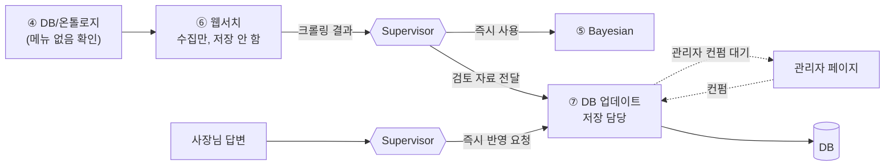
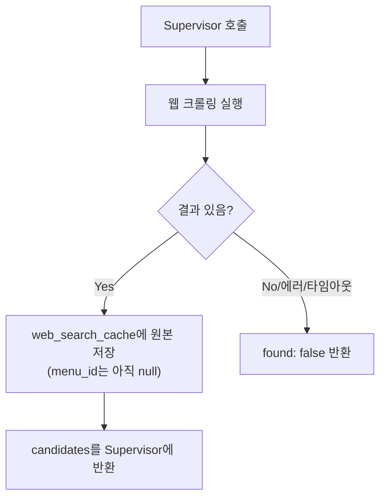
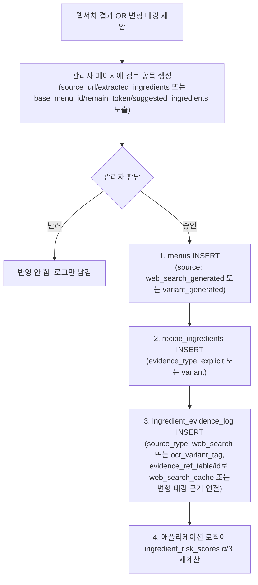
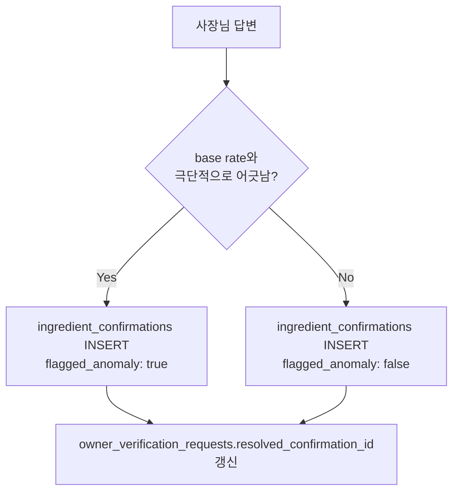

# ⑥⑦ 웹서치 · DB 업데이트 에이전트 스펙

담당: 정유진
상태: 초안 (미확정 항목은 §8 참조)
상위 문서: `catoin-multi-agent-architecture.md`, `catoin-db-schema.md`

---

## 0. 왜 한 문서, 왜 이 둘인가

⑥과 ⑦은 "웹서치 결과 → 관리자 컨펌 → DB 반영"이라는 하나의 파이프라인으로 강결합되어 있어 따로 쪼개면 핸드오프 계약이 두 문서에 흩어져 어긋나기 쉽다. 이 문서의 핵심 축은 **증거 신뢰도 계층**이다.

| 구분 | 예시 | 처리 주체 | 반영 시점 |
|---|---|---|---|
| **soft evidence** | 웹서치 크롤링 결과, ④의 변형 태깅 제안 | ⑥ → ⑦ | **관리자 컨펌 후에만** DB 반영 |
| **hard evidence** | 사장님 답변 | ⑦만 | **즉시** 반영 |

이 구분이 왜 필요한가: `catoin-db-schema.md` §6 원칙 — "웹서치 캐시 데이터는 실제 식당 레시피로 간주하지 않고, danger 판정을 낮추는 데 쓰지 않음". 기계가 혼자 추측한 데이터를 사람 검토 없이 공유 DB(`ingredient_risk_scores`)에 자동으로 흘려보내면, 크롤링 하나가 잘못돼도 그 가게를 스캔하는 모든 이후 사용자의 확률이 조용히 오염된다. 사장님 답변은 사람이 직접 확인해준 것이므로 이 위험이 없어 즉시 반영한다.

---

## 1. 두 에이전트의 역할 분담



- **⑥ 웹서치**: DB에 없는 메뉴를 크롤링으로 조사만 함. **DB에 아무것도 쓰지 않는다.** 크롤링 원본은 캐시에만 남긴다.
- **⑦ DB 업데이트**: 이 파이프라인에서 유일하게 실제 스키마 테이블에 쓰기 권한을 가진 에이전트. 증거 종류에 따라 즉시 반영/컨펌 대기를 분기한다.

---

## 2. ⑥ 웹서치 에이전트

### 2-1. 입력 / 출력

**입력 (Supervisor로부터)**

| 필드 | 타입 | 필수 | 설명 |
|---|---|---|---|
| `store_id` | string | 필수 | 로그·캐시 연결용 (web_search_cache 자체는 store 무관이지만 호출 맥락 기록용) |
| `menu_name` | string | 필수 | ④가 `exists_in_db: false`로 반환한 정규화된 메뉴명 |

**출력 (Supervisor에게 반환)**

```json
{
  "menu_name": "마라탕",
  "found": true,
  "candidates": [
    {
      "source_url": "https://example.com/recipe/mala-tang",
      "extracted_ingredients": ["소고기", "두부", "청경채", "고추기름"],
      "fetched_at": "2026-09-11T10:00:00Z"
    }
  ]
}
```

- `found: false`면 `candidates`는 빈 배열. → ⑧ XAI가 "완전 정보 없음" 경로(엣지 케이스 4)로 처리.
- 검색 결과가 여러 개면 후보를 전부 담아서 반환 — 병합/선택은 이 에이전트가 하지 않는다(§8 미확정).

### 2-2. 처리 로직



1. `menu_name`으로 웹 검색 실행 (실패/타임아웃 시 바로 `found: false`)
2. 검색 결과마다 `web_search_cache`에 **즉시** 한 행씩 INSERT — `menu_id`는 아직 존재하지 않으므로 `null`. 이건 관리자 컨펌과 무관하게 항상 저장한다 (원본 로그이지 risk-affecting 데이터가 아니므로 게이트 대상이 아님).
3. 캐시된 `extracted_ingredients`를 그대로 Supervisor에 반환.

### 2-3. 이 에이전트가 하지 않는 것

| 하지 않음 | 담당 |
|---|---|
| `menus`/`recipe_ingredients` INSERT | ⑦ (관리자 컨펌 후) |
| 여러 후보 중 어느 걸 믿을지 병합/선택 | ⑦ 또는 관리자 (§8 미확정) |
| 확률 계산 | ⑤ Bayesian |
| 재호출/재시도 여부 판단 | Supervisor |

---

## 3. ⑦ DB 업데이트 에이전트

### 3-1. 입력 / 출력

**입력 (Supervisor로부터, 3가지 트리거)**

| 트리거 | 필드 | 신뢰도 |
|---|---|---|
| 웹서치 결과 | `{store_id, menu_name, candidates}` (⑥ 출력 그대로) | soft |
| ④의 변형 태깅 제안 | `{store_id, base_menu_id, remain_token, suggested_ingredients}` | soft |
| 사장님 답변 | `{store_id, menu_id, ingredient_id, present, question_id}` | hard |

**출력 (Supervisor에게 반환)**

```json
{
  "status": "pending_admin_review" ,
  "review_item_id": "str | null",
  "applied": false
}
```
hard evidence 처리 시:
```json
{
  "status": "applied",
  "confirmation_id": "str",
  "flagged_anomaly": false,
  "applied": true
}
```

### 3-2. soft evidence 처리 (관리자 컨펌 게이트)



**순서가 고정인 이유**: `menus` → `recipe_ingredients` → `ingredient_evidence_log` 순서를 지키지 않으면 FK가 끊긴다 (`catoin-db-schema.md` §7-3, §7-5). `ingredient_risk_scores`는 이 로그 재계산 결과로만 갱신되고 **직접 UPDATE는 절대 금지**.

**관리자 페이지에 뭐가 보이는가** (§8에서 UI 세부는 미확정이지만 최소 노출 데이터):
- 웹서치 건: 메뉴명, 후보 URL별 추출 재료 목록, 크롤링 시각
- 변형 태깅 건: 원본 메뉴명, remain 토큰, 제안된 재료

### 3-3. hard evidence 처리 (즉시 반영)



- `ingredient_confirmations`는 UNIQUE `(store_id, menu_id, ingredient_id)` — 같은 조합에 재답변이 오면 upsert.
- `flagged_anomaly=true`여도 **현재 스펙상 확정값 자체는 그대로 저장·신뢰됨** (`catoin-db-schema.md` 원칙). 이게 FN-minimization과 충돌할 수 있다는 문제는 아직 미확정 (§8, `catoin-multi-agent-architecture.md` 5번 섹션과 동일 이슈).
- 답변 처리 완료 시 `owner_verification_requests.resolved_confirmation_id`를 방금 만든 confirmation 행으로 갱신 — XAI가 생성한 질문과 실제 반영 결과를 연결하기 위함.

### 3-4. Supervisor와의 계약

| ⑦이 받는 것 | 보장 사항 |
|---|---|
| soft evidence 트리거 | 실시간 사용자 응답 흐름과 완전히 분리된 별도 호출. 응답을 기다리지 않음(fire-and-forget에 가까움) |
| hard evidence 트리거 | 사장님이 질문에 답변을 제출한 시점에 호출, 즉시 완료 응답 기대 |

| ⑦이 돌려주는 것 | Supervisor의 후속 판단 |
|---|---|
| soft evidence `status: pending_admin_review` | 사용자에게는 이미 별도로 결과가 나간 뒤이므로 후속 조치 없음 (로그용) |
| hard evidence `status: applied` | 다음 조회부터 이 메뉴는 시나리오 2(사장님 피드백 있음) 경로를 탐 |

### 3-5. 예외 처리

| 상황 | 처리 |
|---|---|
| 관리자가 오랫동안 컨펌 안 함 | review item은 대기 상태 유지, DB 미반영 (SLA 미확정, §8) |
| 웹서치 후보가 여러 개고 서로 재료 목록이 다름 | 전부 관리자에게 노출, 병합 규칙은 관리자 판단 또는 별도 규칙 필요 (§8) |
| 같은 메뉴에 대해 웹서치 제안과 변형 태깅 제안이 동시에 옴 | 각각 독립된 review item으로 취급 (병합하지 않음) |
| `ingredient_confirmations` upsert 중 기존 값과 다른 답변이 옴 | 최신 답변으로 덮어쓰되 변경 이력은 남기지 않음 — 이력 추적 필요 여부 미확정 (§8) |

### 3-6. 이 에이전트가 하지 않는 것

| 하지 않음 | 담당 |
|---|---|
| 웹 크롤링 | ⑥ |
| 확률 계산 | ⑤ Bayesian |
| DANGER/CAUTION/SAFE 판정 | ⑧ XAI |
| 관리자 승인/반려 판단 자체 | 관리자 (사람) |

---

## 4. 테스트 케이스

| # | 입력 | 기대 동작 | 검증 포인트 |
|---|---|---|---|
| 1 | ⑥ 웹서치 성공 (마라탕) | `web_search_cache`에 즉시 저장, `menus`/`recipe_ingredients`는 미반영 | 관리자 컨펌 전엔 risk score에 영향 없을 것 |
| 2 | ⑥ 웹서치 실패/타임아웃 | `found: false` 반환, 캐시에 아무것도 안 남음 | ⑧이 "완전 정보 없음" 경로로 감 |
| 3 | 관리자가 웹서치 제안 승인 | `menus`→`recipe_ingredients`→`ingredient_evidence_log` 순서로 INSERT | FK 순서 위반 시 실패해야 함 |
| 4 | 관리자가 제안 반려 | DB 변경 없음 | `ingredient_risk_scores` 그대로 |
| 5 | 사장님 정상 답변 (돈까스 + "돼지고기 있음") | `ingredient_confirmations` 즉시 INSERT, `flagged_anomaly: false` | 다음 조회 시 확정값 그대로 반환 |
| 6 | 사장님 이상 답변 (돈까스 + "돼지고기 없음") | `flagged_anomaly: true`로 저장은 되지만 **그대로 반영됨** | 현재 스펙상 SAFE로 내려갈 수 있음 — 재검토 필요 항목과 연결 |
| 7 | 변형 태깅 제안 승인 | `base_menu_id`로 연결된 새 `menus` 행 생성, 원본 메뉴 risk score 불변 | 원본과 변형의 evidence가 안 섞일 것 |

---

## 5. 미확정 항목 (팀 확인 대기)

- [ ] **웹서치 후보가 여러 개일 때 병합/선택 규칙** — 관리자가 하나씩 다 보고 고르는지, 자동으로 합치는 로직이 필요한지 (`catoin-multi-agent-architecture.md` 5번 섹션과 동일 이슈)
- [ ] **관리자 컨펌 SLA** — 검토 대기가 얼마나 길어질 수 있는지, 오래 방치된 review item을 어떻게 표시할지
- [ ] **`flagged_anomaly` 신뢰 여부** — anomaly로 표시돼도 확정값을 그대로 쓰는 현재 규칙이 FN-minimization과 충돌 가능 (재검토 필요)
- [ ] **사장님 오조작(버튼 잘못 누름) 대비** — anomaly 플래그는 통계적으로 이상한 답변만 잡지, 그럴듯한 오조작은 못 걸러냄. 재확인 UI 등 필요
- [ ] **`ingredient_confirmations` 재답변 시 이력 보존 여부** — 덮어쓰기만 할지, 변경 이력을 남길지
- [ ] **메뉴판 1장당 여러 unknown 메뉴가 나올 때 ⑥ 호출 배치/캐싱 전략** (`catoin-multi-agent-architecture.md` 5번 섹션과 동일 이슈)
