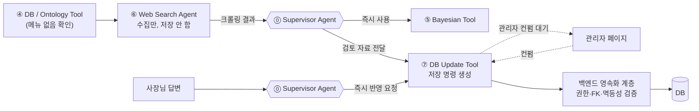
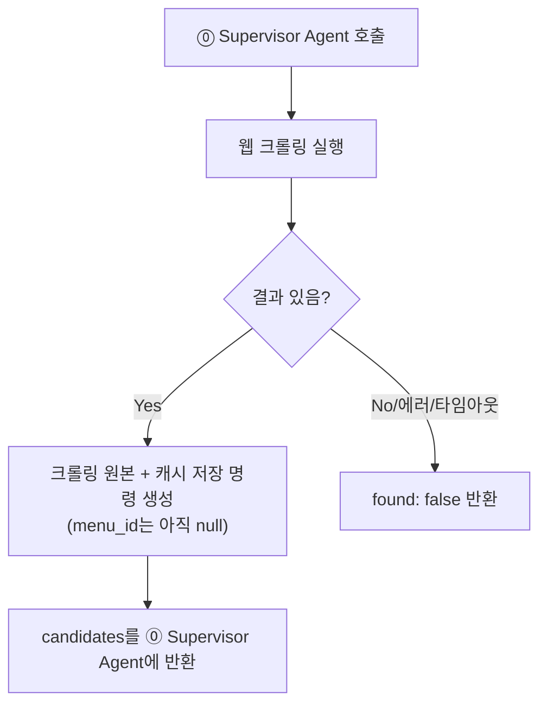

# ⑥ Web Search Agent 스펙

담당: 정유진
상태: 초안 (미확정 항목은 §5 참조)
상위 문서: `catoin-multi-agent-architecture.md`, `catoin-db-schema.md`
짝 문서: [`agent-7-dbupdate.md`](agent-7-dbupdate.md) (⑦ DB Update Tool) — ⑥이 수집한 soft evidence를 실제 저장 명령으로 바꾸는 쪽

---

## 0. 증거 신뢰도 계층 (⑥⑦ 공통 전제)

⑥과 ⑦은 "웹서치 결과 → 관리자 컨펌 → DB 반영"이라는 하나의 파이프라인을 나눠 맡는다. 두 문서의 공통 축은 **증거 신뢰도 계층**이다.

| 구분 | 예시 | 처리 주체 | 반영 시점 |
|---|---|---|---|
| **soft evidence** | 웹서치 크롤링 결과, ④의 변형 태깅 제안 | ⑥ → ⑦ → 백엔드 | **관리자 컨펌 후에만** DB 반영 |
| **hard evidence** | 사장님 답변 | ⑦ → 백엔드 | **즉시** 반영 |

이 구분이 왜 필요한가: `catoin-db-schema.md` §6 원칙 — "웹서치 캐시 데이터는 실제 식당 레시피로 간주하지 않고, danger 판정을 낮추는 데 쓰지 않음". 기계가 혼자 추측한 데이터를 사람 검토 없이 공유 DB(`ingredient_risk_scores`)에 자동으로 흘려보내면, 크롤링 하나가 잘못돼도 그 가게를 스캔하는 모든 이후 사용자의 확률이 조용히 오염된다. 사장님 답변은 사람이 직접 확인해준 것이므로 이 위험이 없어 즉시 반영한다.

**⑥은 이 계층에서 soft evidence를 만들어내는 쪽이고, 저장 권한은 전혀 없다.**

---

## 1. ⑥ ↔ ⑦ 역할 분담



- **⑥ Web Search Agent**: DB에 없는 메뉴를 크롤링으로 조사만 함. **DB에 아무것도 쓰지 않는다.** 크롤링 원본과 캐시 저장 요청을 함께 반환한다.
- **⑦ DB Update Tool**: 증거 종류에 따라 관리자 검토 명령과 즉시 반영 명령을 구분해 만든다. 상세는 [`agent-7-dbupdate.md`](agent-7-dbupdate.md).

> ⑥이 Agent이고 ⑦이 Tool인 이유: ⑥은 검색 여부·쿼리·출처 신뢰도를 **판단**해야 하므로 LLM 추론 노드이고, ⑦은 증거 종류에 따라 정해진 저장 명령을 **수행**하는 실행 노드다 (`docs/ppt-baseline.md` 7쪽 "Agent는 판단하고 Tool은 수행한다").

---

## 2. 입력 / 출력

**입력 (⓪ Supervisor Agent로부터)**

| 필드 | 타입 | 필수 | 설명 |
|---|---|---|---|
| `store_id` | integer | 필수 | 양수인 가게 컨텍스트. 로그·캐시 연결용 (web_search_cache 자체는 store 무관) |
| `menu_name` | string | 필수 | ④가 `exists_in_db: false`로 반환한 정규화된 메뉴명 |

**출력 (⓪ Supervisor Agent에게 반환)**

```json
{
  "menu_name": "마라탕",
  "found": true,
  "candidates": [
    {
      "source_url": "https://example.com/recipe/mala-tang",
      "extracted_ingredients": ["소고기", "두부", "청경채", "고추기름"],
      "fetched_at": "2026-09-11T10:00:00Z"
    }
  ]
}
```

- `found: false`면 `candidates`는 빈 배열. → ⑧ Decision Policy / XAI Agent가 "완전 정보 없음" 경로(엣지 케이스 4)로 처리.
- **크롤링 개수: 상위 10개 출처**. FN-minimization 원칙상 후보를 넓게 모아 놓치는 재료 확률을 낮추는 쪽을 택함 — 대신 관리자가 검토할 후보가 많아지는 트레이드오프는 그대로 있음(§5).
- 10개 후보를 전부 담아서 반환 — 병합/선택은 ⑥이 하지 않는다(§5 미확정).

---

## 3. 처리 로직



1. `menu_name`으로 웹 검색 실행 (실패/타임아웃 시 바로 `found: false`)
2. 검색 결과마다 `web_search_cache` 저장 명령 생성 — `menu_id`는 아직 존재하지 않으므로 `null`. 백엔드는 멱등 키를 검증해 즉시 저장한다(원본 로그이지 risk-affecting 데이터가 아니므로 관리자 게이트 대상이 아님).
3. 캐시된 `extracted_ingredients`를 그대로 ⓪ Supervisor Agent에 반환.

**fallback**: 웹서치도 실패하면 "정보 없음"(`NO_INFORMATION`) 상태로 CAUTION 이상 처리 — SAFE로 떨어뜨리지 않는다 (FN-minimization 원칙, `docs/ppt-baseline.md` 8쪽 "4 정보 부족→보수적 판정").

### 3-1. ⑥이 하지 않는 것

| 하지 않음 | 담당 |
|---|---|
| `menus`/`recipe_ingredients` INSERT | ⑦ DB Update Tool (관리자 컨펌 후) |
| 여러 후보 중 어느 걸 믿을지 병합/선택 | ⑦ 또는 관리자 (§5 미확정) |
| 확률 계산 | ⑤ Bayesian Tool |
| 재호출/재시도 여부 판단 | ⓪ Supervisor Agent |
| DANGER/CAUTION/SAFE 판정 | ⑧ Decision Policy / XAI Agent |

---

## 4. 테스트 케이스

| # | 입력 | 기대 동작 | 검증 포인트 |
|---|---|---|---|
| 1 | 웹서치 성공 (마라탕) | 캐시 저장 명령 반환, 백엔드가 `web_search_cache`에 즉시 저장 | `menus`/`recipe_ingredients`는 미반영일 것 |
| 2 | 웹서치 실패/타임아웃 | `found: false` 반환, 캐시에 아무것도 안 남음 | ⑧이 "완전 정보 없음" 경로로 감 |

> 관리자 컨펌 이후 단계(승인/반려, FK 순서)의 테스트 케이스는 [`agent-7-dbupdate.md`](agent-7-dbupdate.md) §4에 있다.

---

## 5. 미확정 항목 (팀 확인 대기)

- [ ] **10개 후보의 병합/선택 규칙** — 관리자가 10개를 하나씩 다 보고 고르는지, 자동으로 합치는 로직(예: 다수결로 겹치는 재료만 채택)이 필요한지. 후보 수가 많아진 만큼 관리자 리뷰 부담을 어떻게 줄일지도 함께 결정 필요 (`catoin-multi-agent-architecture.md` 5번 섹션과 동일 이슈). ⑦과 공통 항목
- [ ] **메뉴판 1장당 여러 unknown 메뉴가 나올 때 ⑥ 호출 배치/캐싱 전략** (`catoin-multi-agent-architecture.md` 5번 섹션과 동일 이슈)
- [ ] **출처 신뢰도 가중치를 ⑥에서 어디까지 판단할지** — `docs/ppt-baseline.md` 9쪽 "5 출처 신뢰도 반영"(Dawid-Skene 응용, 출처별 weight 추적)이 ⑥의 출처 평가와 ⑤의 가중치 반영 중 어디에 들어가는지 미확정
