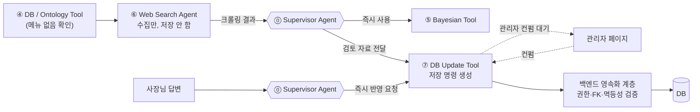
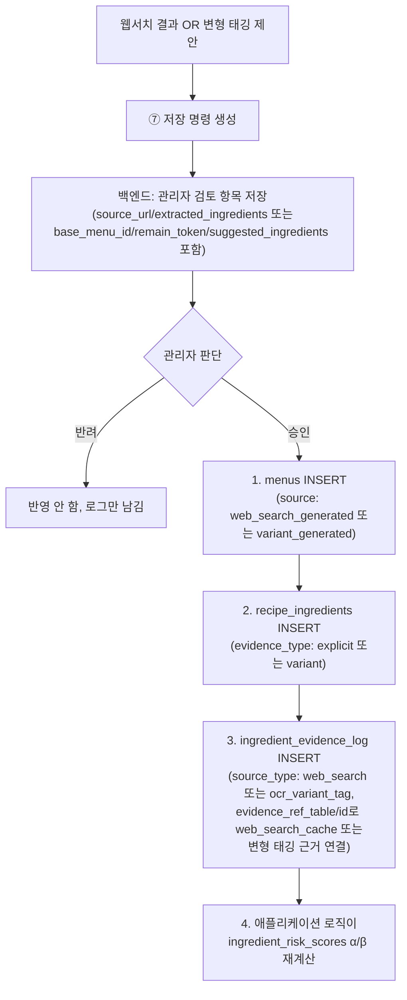
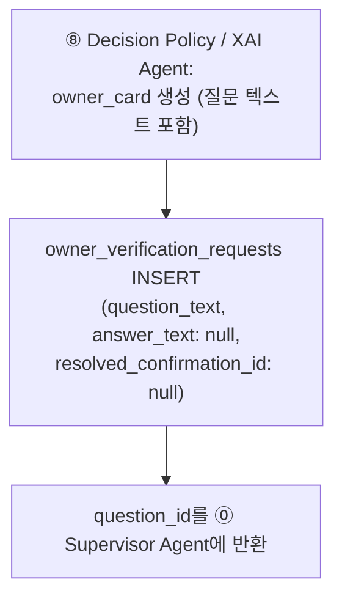
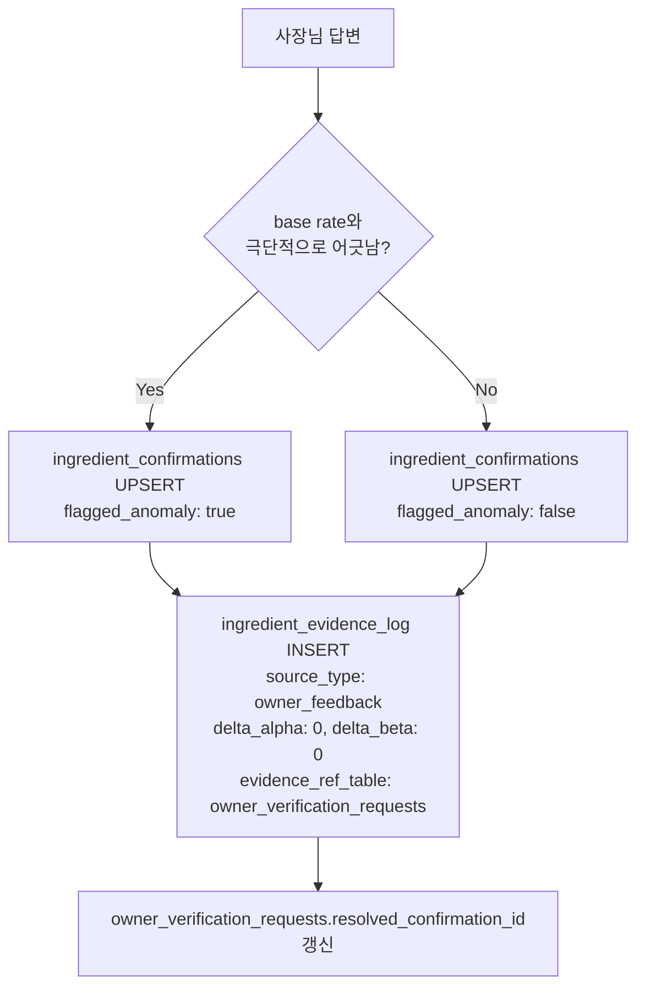

# ⑦ DB Update Tool 스펙

담당: 윤지
상태: 초안 (미확정 항목은 §5 참조)
상위 문서: `caution-multi-agent-architecture.md`, `caution-db-schema.md`
짝 문서: [`agent-6-websearch.md`](agent-6-websearch.md) (⑥ Web Search Agent) — ⑦이 받는 soft evidence를 수집하는 쪽

---

## 0. 증거 신뢰도 계층 (⑥⑦ 공통 전제)

⑥과 ⑦은 "웹서치 결과 → 관리자 컨펌 → DB 반영"이라는 하나의 파이프라인을 나눠 맡는다. 두 문서의 공통 축은 **증거 신뢰도 계층**이다.

| 구분 | 예시 | 처리 주체 | 반영 시점 |
|---|---|---|---|
| **soft evidence** | 웹서치 크롤링 결과, ④의 변형 태깅 제안 | ⑥ → ⑦ → 백엔드 | **관리자 컨펌 후에만** DB 반영 |
| **hard evidence** | 사장님 답변 | ⑦ → 백엔드 | **즉시** 반영 |

이 구분이 왜 필요한가: `caution-db-schema.md` §6 원칙 — "웹서치 캐시 데이터는 실제 식당 레시피로 간주하지 않고, danger 판정을 낮추는 데 쓰지 않음". 기계가 혼자 추측한 데이터를 사람 검토 없이 공유 DB(`ingredient_risk_scores`)에 자동으로 흘려보내면, 크롤링 하나가 잘못돼도 그 가게를 스캔하는 모든 이후 사용자의 확률이 조용히 오염된다. 사장님 답변은 사람이 직접 확인해준 것이므로 이 위험이 없어 즉시 반영한다.

**⑦은 이 계층을 저장 명령으로 번역하는 쪽이고, 물리 DB 쓰기 권한은 갖지 않는다.**

---

## 1. ⑥ ↔ ⑦ 역할 분담



- **⑥ Web Search Agent**: DB에 없는 메뉴를 크롤링으로 조사만 함. 상세는 [`agent-6-websearch.md`](agent-6-websearch.md).
- **⑦ DB Update Tool**: 증거 종류에 따라 관리자 검토 명령과 즉시 반영 명령을 구분해 만든다. DB 자격 증명은 갖지 않으며 실제 저장은 백엔드가 수행한다.

> ⑦이 Tool인 이유: 증거 종류에 따라 정해진 저장 명령을 **수행**하는 실행 노드이고, 무엇을 믿을지에 대한 판단은 하지 않는다 (`docs/ppt-baseline.md` 7쪽 "Agent는 판단하고 Tool은 수행한다").

---

## 2. 입력 / 출력

**입력 (⓪ Supervisor Agent로부터, 4가지 트리거)**

| 트리거 | 필드 | 신뢰도 |
|---|---|---|
| 웹서치 결과 | `{store_id, menu_name, candidates}` (⑥ 출력 그대로) | soft |
| ④의 변형 태깅 제안 | `{store_id, base_menu_id, remain_token, suggested_ingredients}` | soft |
| ⑧의 질문 생성 요청(`owner_card`) | `{store_id, scan_session_id, menu_id, ingredient_id, question_text}` | 신규 질문 |
| 사장님 답변 | `{store_id, menu_id, ingredient_id, present, question_id}` | hard |

**출력 (⓪ Supervisor Agent에게 반환)**

```json
{
  "action": "create_review_item",
  "idempotency_key": "str",
  "payload": {}
}
```
질문 생성 처리 시:
```json
{
  "status": "created",
  "question_id": "str",
  "applied": true
}
```
hard evidence 처리 시:
```json
{
  "action": "upsert_ingredient_confirmation",
  "idempotency_key": "str",
  "payload": {
    "flagged_anomaly": false
  }
}
```

이 출력은 저장 완료 응답이 아니라 **백엔드에 대한 명령**이다. 백엔드가 성공적으로 커밋한 뒤 생성 ID와 최종 상태를 응답한다.

---

## 3. 처리 로직

### 3-1. soft evidence 처리 (관리자 컨펌 게이트)



**순서가 고정인 이유**: `menus` → `recipe_ingredients` → `ingredient_evidence_log` 순서를 지키지 않으면 FK가 끊긴다 (`caution-db-schema.md` §7-3, §7-5). `ingredient_risk_scores`는 이 로그 재계산 결과로만 갱신되고 **직접 UPDATE는 절대 금지**.

**관리자 페이지에 뭐가 보이는가** (§5에서 UI 세부는 미확정이지만 최소 노출 데이터):
- 웹서치 건: 메뉴명, 후보 URL별 추출 재료 목록, 크롤링 시각
- 변형 태깅 건: 원본 메뉴명, remain 토큰, 제안된 재료

### 3-2. 질문 생성 처리 (`owner_verification_requests` 최초 INSERT)



- **질문 내용(무엇을 물을지)은 ⑧이 만들고, 그걸 실제로 저장하는 것만 ⑦이 한다** — "판정/설명은 ⑧, DB 쓰기는 ⑦"이라는 기존 역할 분리를 그대로 따름.
- 이 단계에서 만들어진 `question_id`가 이후 "사장님 답변" 트리거(§2)에서 그대로 쓰인다 — 답변 처리는 질문이 이미 존재한다고 전제하므로, 이 단계가 빠지면 사장님 답변을 저장할 대상 행 자체가 없다.

### 3-3. hard evidence 처리 (즉시 반영)



- `ingredient_confirmations`는 UNIQUE `(store_id, menu_id, ingredient_id)` — 같은 조합에 재답변이 오면 **upsert(덮어씀)**. 이 테이블은 항상 "현재값 스냅샷" 1행만 유지하고, 과거 답변은 남기지 않는다.
- **답변 이력은 `ingredient_evidence_log`에 별도로 남긴다.** upsert와 별개로, 매 답변마다 `source_type: owner_feedback`, `evidence_ref_table: owner_verification_requests`(해당 질문 행 참조)로 **새 행을 추가**한다 — 이 테이블은 절대 덮어쓰지 않으므로, "사장님이 같은 질문에 답을 몇 번 바꿨는지" 같은 이상 패턴을 나중에 여기서 확인할 수 있다. `delta_alpha`/`delta_beta`는 확정 답변이 확률 계산을 거치지 않으므로 `0`으로 기록 — 재계산 로직에 영향 없이 순수 이력 기록 용도.
- `flagged_anomaly=true`여도 **⑦은 저장만 함, "그대로 신뢰할지"는 ⑦의 책임이 아님** — `present: false`(없음 확정)이면서 anomaly인 값은 `caution-multi-agent-architecture.md` ③ Exact Feedback Tool이 미확인으로 재분류해서 Bayesian 확률과 비교 후 더 위험한 쪽으로 판정함 (`caution-db-schema.md` 예외 조항 참고). 저장(⑦)과 신뢰 판단(③)의 책임을 분리한 것.
- 답변 처리 완료 시 `owner_verification_requests.resolved_confirmation_id`를 방금 만든 confirmation 행으로 갱신 — ⑧이 생성한 질문과 실제 반영 결과를 연결하기 위함.

### 3-4. ⓪ Supervisor Agent와의 계약

| ⑦이 받는 것 | 보장 사항 |
|---|---|
| soft evidence 트리거 | 실시간 사용자 응답 흐름과 완전히 분리된 별도 호출. 응답을 기다리지 않음(fire-and-forget에 가까움) |
| hard evidence 트리거 | 사장님이 질문에 답변을 제출한 시점에 호출, 즉시 완료 응답 기대 |

| ⑦이 돌려주는 것 | 백엔드의 후속 처리 |
|---|---|
| soft evidence `action: create_review_item` | 멱등 검증 후 검토 항목 저장. 사용자 분석 응답과 분리 |
| hard evidence `action: upsert_ingredient_confirmation` | 권한·FK 검증 후 트랜잭션 저장. 커밋 성공 뒤에만 반영 완료 응답 |

### 3-5. 예외 처리

| 상황 | 처리 |
|---|---|
| 관리자가 오랫동안 컨펌 안 함 | review item은 대기 상태 유지, DB 미반영 (SLA 미확정, §5) |
| 웹서치 후보가 여러 개고 서로 재료 목록이 다름 | 전부 관리자에게 노출, 병합 규칙은 관리자 판단 또는 별도 규칙 필요 (§5) |
| 같은 메뉴에 대해 웹서치 제안과 변형 태깅 제안이 동시에 옴 | 각각 독립된 review item으로 취급 (병합하지 않음) |
| `ingredient_confirmations` upsert 중 기존 값과 다른 답변이 옴 | `ingredient_confirmations`는 최신 답변으로 덮어쓰되, `ingredient_evidence_log`(`source_type: owner_feedback`)에는 매번 새 행이 남으므로 변경 이력 자체는 보존됨 |

### 3-6. ⑦이 하지 않는 것

| 하지 않음 | 담당 |
|---|---|
| 웹 크롤링 | ⑥ Web Search Agent |
| 확률 계산 | ⑤ Bayesian Tool |
| DANGER/CAUTION/SAFE 판정 | ⑧ Decision Policy / XAI Agent |
| 관리자 승인/반려 판단 자체 | 관리자 (사람) |
| 물리 DB 쓰기와 트랜잭션 | 백엔드 영속화 계층 |

### 3-7. 예외 — `menu_ingredient_cache`는 ⑦을 거치지 않음

"DB 쓰기는 ⑦만 한다"는 원칙에 **딱 하나의 예외**가 있다: `menu_ingredient_cache`(`caution-db-schema.md` §6 참고)는 ④가 직접 쓴다. 이 테이블은 ④가 이미 계산한 재귀 확장 결과를 저장만 하는 파생 캐시이지, 새로운 증거·사실이 아니기 때문에 관리자 컨펌 게이트가 필요 없다는 게 근거다. **다른 모든 테이블(`menus`/`recipe_ingredients`/`ingredient_evidence_log`/`ingredient_risk_scores`/`ingredient_confirmations`/`owner_verification_requests`)은 예외 없이 ⑦만 쓴다.**

---

## 4. 테스트 케이스

| # | 입력 | 기대 동작 | 검증 포인트 |
|---|---|---|---|
| 1 | 관리자가 웹서치 제안 승인 | 백엔드가 `menus`→`recipe_ingredients`→`ingredient_evidence_log` 순서로 INSERT | FK 순서 위반 시 트랜잭션 전체 실패 |
| 2 | 관리자가 제안 반려 | DB 변경 없음 | `ingredient_risk_scores` 그대로 |
| 3 | 사장님 정상 답변 (돈까스 + "돼지고기 있음") | ⑦이 명령 생성, 백엔드가 `ingredient_confirmations` 즉시 UPSERT | 커밋 후 다음 조회부터 확정값 반환 |
| 4 | 사장님 이상 답변 (돈까스 + "돼지고기 없음") | `flagged_anomaly: true`로 저장은 되지만, ③이 미확인으로 재분류해서 Bayesian 확률과 비교 | 확률이 낮지 않으면 SAFE로 내려가지 않고 CAUTION 이상 유지될 것 |
| 5 | 변형 태깅 제안 승인 | `base_menu_id`로 연결된 새 `menus` 행 생성, 원본 메뉴 risk score 불변 | 원본과 변형의 evidence가 안 섞일 것 |

> 웹서치 수집 단계(성공/타임아웃)의 테스트 케이스는 [`agent-6-websearch.md`](agent-6-websearch.md) §4에 있다.

---

## 5. 미확정 항목 (팀 확인 대기)

- [ ] **10개 후보의 병합/선택 규칙** — 관리자가 10개를 하나씩 다 보고 고르는지, 자동으로 합치는 로직(예: 다수결로 겹치는 재료만 채택)이 필요한지. 후보 수가 많아진 만큼 관리자 리뷰 부담을 어떻게 줄일지도 함께 결정 필요 (`caution-multi-agent-architecture.md` 5번 섹션과 동일 이슈). ⑥과 공통 항목
- [ ] **관리자 컨펌 SLA** — 검토 대기가 얼마나 길어질 수 있는지, 오래 방치된 review item을 어떻게 표시할지
- [ ] **사장님 오조작(버튼 잘못 누름) 대비** — anomaly 플래그는 통계적으로 이상한 답변만 잡지, 그럴듯한 오조작은 못 걸러냄. 재확인 UI 등 필요
- [ ] **`ingredient_confirmations` 재답변 시 이력 보존 여부** — 덮어쓰기만 할지, 변경 이력을 남길지
