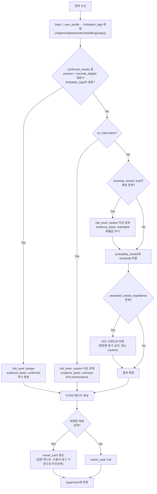

# ⑧ Decision Policy / XAI Agent 스펙

담당: 정유진
상태: 초안 (미확정 항목은 §8 참조)
상위 문서: `caution-multi-agent-architecture.md`, `caution-db-schema.md`

---

## 0. 역할 범위

두 가지 책임을 가진다.

1. **판정**: 확정값(hard evidence)과 확률(soft evidence)을 사용자 개인의 알레르기·식이 제약과 대조해 DANGER/CAUTION/SAFE를 결정
2. **설명**: 판정 근거를 사람이 이해할 수 있는 문장으로 바꾸고, 정보가 부족한 재료에 대해 사장님에게 물어볼 질문을 만듦

판정 로직과 설명 로직을 분리하지 않고 ⑧ 하나에 묶은 이유는 반대로 **"둘 다 사용자 프로필과 재료 데이터를 같은 순간에 대조해야" 자연스럽기 때문**이다. 대신 ⑧을 확률 계산(⑤)이나 하드 오버라이드 조회(③)로부터는 분리해둬서, 판정 기준(threshold)이나 문구·언어가 바뀔 때 이 문서/⑧만 고치면 되게 했다.

---

## 1. 입력 / 출력 스펙

### 입력 (Supervisor가 취합해서 전달)

| 필드 | 타입 | 필수 | 출처 | 설명 |
|---|---|---|---|---|
| `confirmed_results` | `ConfirmedResult[]` | 있으면 전달 | ③ Exact Feedback Tool | hard evidence. 재료별 `status` 3값과 `override_eligible`을 담은 목록. 없으면 빈 배열 `[]`. 형식은 아래 참고 |
| `probability_results` | `{ingredient_id: {posterior_mean: float, confidence: float(0~1), prior_source: str, anomaly_locked: bool}}` | 있으면 전달 | ⑤ Bayesian Tool | soft evidence. 입력 `confidence`는 ⑤가 계산한 0~1 숫자이고, 아래 출력의 `evidence_basis`(confirmed/estimated/unknown)와는 별개다. `anomaly_locked: true`면 확률값과 무관하게 CAUTION 이상 강제(아래 처리 로직 참고) |
| `proposed_variant_ingredients` | `{ingredient_id: source}` | 있으면 전달 | ④ 변형 태깅 | **DB 미반영 제안**, source=`variant_suggested` 등 신뢰도 낮음 |
| `no_information` | bool | 필수 | ④/⑥ | 메뉴/재료 정보 자체가 없을 때 true (엣지 케이스 4) |
| `user_profile` | object | 필수 | `user_profiles` | `religion_type`, `is_vegetarian`, `vegetarian_type`, `no_alcohol`, `allergies`, `no_spicy` |

#### `confirmed_results` 항목 형식 (⓪ §4-7과 동일)

```json
[
  {
    "ingredient": {
      "ingredient_id": "ingredient-001",
      "canonical_name": "돼지고기"
    },
    "constraint_tags": ["is_pork"],
    "status": "present",
    "override_eligible": true,
    "evidence_refs": ["evidence-001"]
  }
]
```

| 필드 | 뜻 |
|---|---|
| `ingredient` | 확인된 재료. `ingredient_id`와 표준 이름 |
| `constraint_tags` | 이 재료가 걸리는 제한 태그 (예: 돼지고기 → `is_pork`). `forbidden_tags`와 비교하는 기준 |
| `status` | `present`(있다고 확인) / `absent`(없다고 확인) / `unknown`(아직 확인 안 됨) |
| `override_eligible` | 이 확인값으로 판정을 덮어써도 되는지. anomaly(통계적으로 이상한 답변)이거나 3개월이 지난 확인값이면 `false` |
| `evidence_refs` | 근거 ID 목록 |

- **`status`는 3값을 유지한다. `true/false` 2값으로 축약하지 않는다** (AGENTS.md 확정). 2값이면 "없다고 확인됨"과 "아직 안 물어봄"이 구분되지 않아, 안 물어본 재료가 "없음"으로 읽혀 SAFE가 될 수 있다 (FN).
- hard evidence로 쓰는 것은 **`override_eligible: true`이고 `status`가 `present` 또는 `absent`인 항목뿐**이다.
- `status: unknown`은 "없음"으로 취급하지 않는다. 확인값이 없는 것과 같다.
- `override_eligible: false`인 항목은 hard evidence로 쓰지 않는다. 이 재료는 ③이 ⑤로 넘겼으므로 `probability_results`의 확률로 판정한다.

### 출력 (Supervisor에게 반환)

```json
{
  "risk_level": "danger" | "caution" | "safe",
  "hits": ["is_pork"],
  "evidence_basis": "confirmed" | "estimated" | "unknown",
  "message": {
    "ko": "돼지고기 성분이 포함되어 있어요.",
    "en": "This menu contains pork.",
    "ja": "このメニューには豚肉が含まれています。",
    "zh-Hans": "这道菜含有猪肉成分。",
    "zh-Hant": "這道菜含有豬肉成分。",
    "es": "Este plato contiene cerdo."
  },
  "owner_card": {
    "menu_id": "str",
    "ingredient_id": "str",
    "question": {
      "ko": "이 메뉴에 돼지고기 성분이 들어가나요?",
      "en": "Does this menu contain pork?",
      "ja": "このメニューには豚肉が入っていますか？",
      "zh-Hans": "这道菜里有猪肉吗？",
      "zh-Hant": "這道菜裡有豬肉嗎？",
      "es": "¿Este plato contiene cerdo?"
    }
  } | null
}
```

`evidence_basis` 필드가 핵심이다 — 같은 `risk_level: danger`라도 **확정값 기반인지 확률 추정 기반인지**를 사용자에게 다른 톤으로 전달해야 한다 (§4 참고).

> 이름: 원래 `confidence`였으나 ⑤가 계산하는 0~1 숫자 `confidence`(재료별 근거 충분도)와 이름이 겹쳐 `evidence_basis`(판정 근거 종류)로 바꿨다 (2026-10-08). 값은 그대로 `confirmed | estimated | unknown`이다.

---

## 2. 처리 로직


```mermaid
flowchart TD
    IN["입력 수신"] --> P1["Step 1: user_profile → forbidden_tags 매핑\n(religion/vegetarian/alcohol/allergy/spicy)"]
    P1 --> P2{"confirmed_results 중\npresent + override_eligible 재료가\nforbidden_tags와 겹침?"}
    P2 -->|Yes| DANGER["risk_level: danger\nevidence_basis: confirmed\n즉시 확정"]
    P2 -->|No| P3{no_information?}
    P3 -->|Yes| CAUTION1["risk_level: caution 이상 강제\nevidence_basis: unknown\n(FN-minimization)"]
    P3 -->|No| P3B{"anomaly_locked: true인\n재료 존재?"}
    P3B -->|Yes| CAUTION2["risk_level: caution 이상 강제\nevidence_basis: estimated\n확률값 무시"]
    P3B -->|No| P4["probability_results에 threshold 적용"]
    CAUTION2 --> P4
    P4 --> P5{proposed_variant_ingredients\n존재?}
    P5 -->|Yes| P6["낮은 신뢰도로 반영\n(확정형 문구 금지, 최소 caution)"]
    P5 -->|No| P7[결과 확정]
    P6 --> P7
    P7 --> MSG["다국어 메시지 생성"]
    DANGER --> MSG
    CAUTION1 --> MSG
    MSG --> OC{애매한 재료\n존재?}
    OC -->|Yes| CARD["owner_card 생성\n(질문 텍스트, 사용자 태그 기준으로 우선순위)"]
    OC -->|No| DONE["owner_card: null"]
    CARD --> OUT[Supervisor에 반환]
    DONE --> OUT
```

### 2-1. Step별 설명

1. **forbidden_tags 매핑**: `religion_type`(halal→is_pork/is_alcohol 등), `vegetarian_type`, `no_alcohol`, `allergies`, `no_spicy`를 하나의 금지 태그 집합으로 변환.
2. **hard evidence 우선 체크**: `confirmed_results` 중 `status: present`이고 `override_eligible: true`인 재료의 `constraint_tags`가 forbidden_tags와 겹치면 다른 계산 없이 즉시 `danger` + `evidence_basis: confirmed`. `status: absent`이고 `override_eligible: true`인 재료는 확률과 무관하게 "없음"으로 확정한다. `unknown`이나 `override_eligible: false`인 항목은 이 단계에서 쓰지 않는다.
3. **정보 없음 우선순위**: hard evidence로 안 걸렸어도 `no_information: true`면 확률 계산 자체를 건너뛰고 `caution` 이상 강제 (엣지 케이스 4와 동일 원칙).
3-1. **anomaly_locked 강제**: `probability_results[ingredient_id].anomaly_locked: true`인 재료는 posterior_mean이 아무리 낮게 나와도 `caution` 이상으로 강제하고 `evidence_basis: estimated`로 표시 — ③이 override를 거부한 이상 답변이 확률 계산을 거치며 조용히 SAFE로 새는 것을 막기 위함(이 값이 ④를 거쳐 여기까지 끊기지 않고 와야 함).
4. **확률 기반 판정**: (anomaly_locked가 아닌 재료에 한해) `probability_results`에 판정 임계값(§3, 미확정)을 적용해 caution/safe 결정.
5. **변형 제안 반영**: `proposed_variant_ingredients`가 있으면 확정 재료와 **절대 같은 신뢰도로 취급하지 않는다** — 최소 caution 처리하고, 문구도 추정형으로만 생성 (danger 확정 근거로 쓰지 않음).
6. **메시지 생성**: `evidence_basis`에 따라 확정형/추정형 문구 템플릿 분기 (§4).
7. **사장님 질문 생성**: 확정도 안 되고 확률도 애매한 재료 중 사용자 태그와 관련 있는 것 하나를 골라 `owner_card` 생성.

---

## 3. 판정 임계값 (doc3 4번 섹션과 동일 이슈, 아직 미확정)

- DANGER/CAUTION/SAFE를 가르는 확률 컷오프 자체가 아직 숫자로 정해지지 않음 — F2 score 최적화로 정하기로만 합의됨
- 컷오프 계산/보관 주체가 Supervisor 내부 규칙인지 XAI 내부 상수인지도 미정 — 이 문서에서는 일단 **XAI가 threshold를 들고 있다고 가정**하고 작성함 (§8에서 재확인 필요)

---

## 4. 다국어 메시지 정책

6개 언어를 지원하기로 확정: `ko`(한국어), `en`(영어), `ja`(일본어), `zh-Hans`(중국어 간체), `zh-Hant`(중국어 번체), `es`(스페인어).

**확정형 vs 추정형 톤 구분이 핵심 설계 포인트다**:

| evidence_basis | 문구 톤 | 예시 (ko) |
|---|---|---|
| `confirmed` | 단정형 | "돼지고기 성분이 포함되어 있어요." |
| `estimated` | 추정형, 확률 뉘앙스 포함 | "돼지고기가 들어있을 가능성이 있어요." |
| `unknown` | 정보 부족 명시 | "이 메뉴에 대한 정보가 부족해 안전을 확인할 수 없어요." |

이 구분을 안 하면 확률 추정치를 확정 사실처럼 전달하게 되어, 사용자가 과신하거나(추정을 확정으로 오해) 반대로 신뢰를 잃을(나중에 틀렸을 때) 위험이 있다.

---

## 5. Supervisor와의 계약

| ⑧이 받는 것 | 보장 사항 |
|---|---|
| `confirmed_results`/`probability_results` | Supervisor가 ③/⑤ 호출을 마친 뒤에만 전달 — 부분적으로만 채워질 수 있음(둘 다 없을 수도 있음, 그 경우 `no_information` 처리) |
| `user_profile` | 온보딩 단계에서 필수로 수집되므로 항상 존재함이 보장됨 (비로그인/미입력 케이스 없음) |

| ⑧이 돌려주는 것 | Supervisor의 후속 판단 |
|---|---|
| `owner_card != null` | Supervisor가 ⑦에 전달 → ⑦이 저장 명령 생성 → **백엔드가 `owner_verification_requests`에 INSERT**. XAI와 ⑦은 DB 자격 증명을 갖지 않음 |
| `risk_level` | 최종 사용자 응답에 그대로 포함, 추가 라우팅 없음 (파이프라인의 마지막 단계) |

---

## 6. 예외 처리

| 상황 | 처리 |
|---|---|
| `confirmed_results`와 `probability_results`가 동시에 같은 재료를 다르게 판정 | `override_eligible: true`인 `confirmed_results`(hard evidence)가 우선. `override_eligible: false`면 확률 쪽을 따른다 |
| `confirmed_results`에 `status: unknown` 항목이 있음 | "없음"으로 읽지 않는다. 확인값이 없는 재료로 처리 |
| `proposed_variant_ingredients`만 있고 나머지는 다 없음 | caution으로 처리하되 `evidence_basis: estimated`, danger로 격상 금지 |
| 사용자 태그와 무관한 재료만 애매함 | `owner_card` 생성 안 함 — 관련 없는 질문으로 사장님 피로도 유발 방지 |

---

## 7. 테스트 케이스

| # | 입력 | 기대 출력 | 검증 포인트 |
|---|---|---|---|
| 1 | 할랄 사용자 + `confirmed_results`: 돼지고기 `status: present`, `constraint_tags: [is_pork]`, `override_eligible: true` | `danger`, `evidence_basis: confirmed` | 확정형 문구 사용 |
| 2 | 비건 사용자 + probability: `{is_milk: 0.3}` (threshold 미만) | `safe` 또는 `caution` (threshold에 따라) | 추정형 문구, danger로 확정 짓지 않음 |
| 3 | `no_information: true` | `caution` 이상 강제 | FN-minimization 원칙 위반 없을 것 |
| 4 | `proposed_variant_ingredients`만 있음(차돌된장찌개, 소고기 제안) + 채식 사용자 | `caution`, `evidence_basis: estimated` | `danger`로 절대 확정 짓지 않을 것 |
| 5 | 알레르기 태그와 무관한 애매 재료만 존재 | `owner_card: null` | 불필요한 사장님 질문 생성 안 할 것 |
| 6 | `confirmed_results`(`override_eligible: true`)와 `probability_results`가 상반 | `confirmed_results` 값이 이김 | hard evidence 우선순위 확인 |
| 7 | 할랄 사용자 + `confirmed_results`: 돼지고기 `status: unknown` | 돼지고기를 "없음"으로 처리하지 않음 | `unknown`이 SAFE 근거가 되지 않을 것 (3값 검증) |
| 8 | 할랄 사용자 + `confirmed_results`: 돼지고기 `status: absent`, `override_eligible: false` + `probability_results`: 돼지고기 0.8 | 확률 쪽으로 판정 (`caution` 이상) | override 불가 확인값이 확률을 덮지 않을 것 |

---

## 8. 미확정 항목 (팀 확인 대기)

- [ ] **DANGER/CAUTION/SAFE 컷오프 실제 값** — F2 최적화로 정하기로만 합의, 숫자 미정
- [ ] **컷오프 계산/보관 주체** — Supervisor 내부 규칙인지 XAI 내부 상수인지
