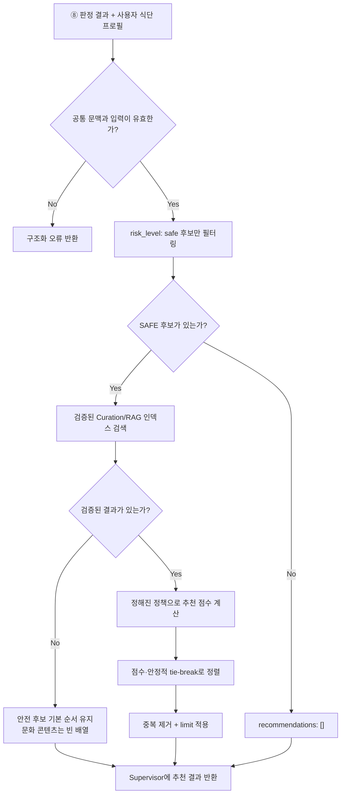

# ⑨ Curation Tool 스펙

담당: 정유진
상태: 초안 (미확정 항목은 §8 참조)
상위 문서: `ppt-baseline.md`, `caution-multi-agent-architecture.md`

---

## 0. 역할 범위

⑨ Curation Tool은 ⑧ Decision Policy / XAI Agent의 안전 판정이 끝난 뒤, **안전 후보를 대상으로 검증된 큐레이션/RAG 인덱스를 검색하고 순위를 매겨 메뉴와 한식 문화 콘텐츠를 추천**한다.

핵심 책임은 세 가지다.

1. ⑧이 `safe`로 판정한 후보만 추천 대상에 포함
2. 검증된 큐레이션/RAG 인덱스에서 후보 메뉴와 문화 콘텐츠 검색
3. 정해진 랭킹 정책에 따라 결과를 정렬하고 근거·출처와 함께 Supervisor에 반환

⑨는 **Tool**이다. 위험 여부를 새로 판단하는 Agent가 아니라, ⑧의 확정된 판정과 정해진 검색·랭킹 절차를 수행한다. LLM을 사용하더라도 안전 판정을 재해석하거나 출처에 없는 내용을 생성하는 데 사용할 수 없다.

| 하지 않음 | 담당 |
|---|---|
| DANGER/CAUTION/SAFE 판정 | ⑧ Decision Policy / XAI Agent |
| 재료 포함 여부 추론 | ③·④·⑤·⑥ |
| ⑧의 판정·근거·위험 재료 수정 | 수행하지 않음 |
| 일반 웹에서 검증되지 않은 추천 근거 수집 | ⑥ Web Search Agent 또는 별도 검증 파이프라인 |
| 큐레이션 데이터 물리 DB 쓰기 | 백엔드 영속화 계층 |
| 스폰서 여부로 안전 판정 변경 | 수행하지 않음 |

### 0-1. 확정된 결정 (변경 금지)

PPT 기준상 위험도 판정과 추천 로직은 분리한다. 따라서 ⑨는 다음 확정 원칙을 지켜야 한다.

- `risk_level: safe`인 메뉴만 추천 후보로 사용한다.
- `danger`, `caution`, `unknown`, `partial_failed` 항목을 안전 메뉴처럼 추천하지 않는다.
- 추천 점수와 관계없이 ⑧의 `risk_level`, `confidence`, 근거, 위험 재료를 변경하지 않는다.
- 추천할 안전 후보가 없으면 빈 배열을 반환한다. 후보를 채우기 위해 CAUTION을 SAFE로 낮추지 않는다.
- ⑨이 실패하거나 timeout이 발생해도 기존 안전 판정 응답은 그대로 반환한다.

### 0-2. 검증된 인덱스만 사용하는 이유

추천 설명과 한식 문화 콘텐츠는 사용자에게 사실처럼 보일 수 있다. 출처가 검증되지 않은 일반 웹 문서를 바로 사용하면 문화 정보 오류뿐 아니라 재료·식이 제약과 관련된 잘못된 설명이 섞일 수 있다.

따라서 ⑨는 팀이 승인한 큐레이션/RAG 인덱스만 조회하고, 반환 항목마다 원문을 추적할 수 있는 `source_id`를 포함한다. 인덱스의 소유 주체·스키마·검수 절차는 §8에서 확정한다.

---

## 1. 입력 / 출력 스펙

아래 JSON은 PPT의 역할 정의를 구현 계약으로 옮긴 **초안**이다. 필드명과 필수 여부는 ⑧·Supervisor·백엔드 담당자 리뷰 후 확정한다.

### 1-1. 입력 (⓪ Supervisor Agent로부터)

| 필드 | 타입 | 필수 | 설명 |
|---|---|---|---|
| `context` | object | 필수 | `schema_version`, `trace_id`, `scan_session_id`, 양의 정수 `store_id` |
| `decision_results` | CurationDecisionItem[] | 필수 | ⑧이 반환한 메뉴별 최종 판정. `item_id`, `menu_id`, 메뉴명, `risk_level`, `confidence`, 근거 포함 |
| `user_profile` | object | 필수 | 추천 필터링에 필요한 최소 식단 프로필. 원본 사용자 식별자는 전달하지 않음 |
| `locale` | string | 선택 | 콘텐츠 표시 언어. 기본값과 지원 언어 범위는 §8에서 확정 |
| `limit` | integer | 선택 | 최대 추천 개수. 허용 범위와 기본값은 §8에서 확정 |

```json
{
  "context": {
    "schema_version": "1.0",
    "trace_id": "0199...",
    "scan_session_id": "scan-123",
    "store_id": 123456
  },
  "decision_results": [
    {
      "item_id": "scan-123:0",
      "menu_id": "menu-001",
      "normalized_menu_name": "비빔밥",
      "risk_level": "safe",
      "confidence": "confirmed",
      "hits": [],
      "evidence_refs": ["evidence-001"]
    },
    {
      "item_id": "scan-123:1",
      "menu_id": "menu-002",
      "normalized_menu_name": "김치찌개",
      "risk_level": "caution",
      "confidence": "estimated",
      "hits": ["is_pork"],
      "evidence_refs": ["evidence-002"]
    }
  ],
  "user_profile": {
    "religion_type": null,
    "is_vegetarian": false,
    "vegetarian_type": null,
    "no_alcohol": false,
    "allergies": [],
    "no_spicy": false
  },
  "locale": "ko",
  "limit": 5
}
```

`decision_results`는 ⑧의 최종 결과를 복사해 전달한다. ⑨는 이 값의 소유자가 아니며 수정할 수 없다.

### 1-2. 출력 (⓪ Supervisor Agent에게 반환)

```json
{
  "recommendations": [
    {
      "rank": 1,
      "item_id": "scan-123:0",
      "menu_id": "menu-001",
      "menu_name": "비빔밥",
      "score": 0.91,
      "reason_codes": ["safe_confirmed", "profile_match"],
      "culture_contents": [
        {
          "content_id": "culture-101",
          "title": "비빔밥의 구성과 먹는 방법",
          "summary": "검증된 인덱스에서 가져온 요약",
          "source_id": "curation-source-11"
        }
      ],
      "sponsored": false
    }
  ],
  "warnings": []
}
```

- `rank`는 1부터 시작하고 응답 안에서 중복되지 않는다.
- `item_id`와 `menu_id`는 입력에 존재한 값을 그대로 사용한다. 인덱스 검색 결과만으로 새로운 안전 메뉴 ID를 만들어내지 않는다.
- `score`는 추천 순위를 위한 값이며 위험 확률이나 안전 신뢰도가 아니다.
- `reason_codes`는 랭킹 이유를 구조화해서 전달한다. 사용자용 문구 생성 방식은 §8에서 확정한다.
- `culture_contents`는 검증된 인덱스에 존재하고 `source_id`로 추적 가능한 항목만 포함한다.
- `sponsored`는 안전 판정과 분리하기 위한 표시 필드다. 실제 스폰서 콘텐츠의 포함·정렬 정책은 §8에서 확정한다.

---

## 2. 처리 로직



### 2-1. Step별 설명

1. **입력 검증**: 공통 문맥과 메뉴별 최종 판정 형식을 검증한다.
2. **안전 필터**: `risk_level == safe`인 항목만 남긴다. 이 단계는 랭킹보다 항상 먼저 실행한다.
3. **RAG 검색**: 안전 후보의 `menu_id`, 표준 메뉴명, 사용자 언어를 이용해 검증된 인덱스에서 메뉴·문화 콘텐츠를 검색한다.
4. **프로필 필터**: 사용자 식단 프로필과 명백히 충돌하는 결과는 제외한다. 이 필터는 새로운 위험 판정이 아니라 이미 확정된 사용자 제약을 추천 결과에 다시 적용하는 방어 절차다.
5. **점수 계산**: 팀이 확정한 랭킹 규칙으로 점수를 계산한다. 구체적인 feature와 가중치는 §8에서 결정한다.
6. **안정적 정렬**: 점수가 같을 때도 같은 입력에는 같은 결과 순서가 나오도록 tie-break 규칙을 적용한다.
7. **결과 제한**: 중복 메뉴·중복 콘텐츠를 제거하고 `limit`만큼 반환한다.
8. **출처 포함**: 문화 콘텐츠마다 `source_id`를 포함해 검증된 원문으로 추적할 수 있게 한다.

### 2-2. 랭킹과 안전성의 관계

추천 점수는 SAFE 후보 사이의 노출 순서만 결정한다. 다음 항목은 점수에 관계없이 추천 대상이 될 수 없다.

- `risk_level`이 `danger` 또는 `caution`인 메뉴
- 정보 부족으로 `confidence: unknown`인 메뉴
- 일부 처리 실패로 안전 판정이 완결되지 않은 메뉴
- 사용자 식단 프로필과 충돌하는 콘텐츠
- 검증된 인덱스에서 출처를 찾을 수 없는 문화 콘텐츠

---

## 3. Curation/RAG 인덱스 계약 — 제안 (팀 승인 필요)

PPT는 **검증된 큐레이션/RAG 인덱스** 사용을 요구한다. 최소한 다음 정보를 반환할 수 있어야 한다.

| 필드 | 설명 |
|---|---|
| `content_id` | 콘텐츠 고유 식별자 |
| `menu_id` | 연결된 표준 메뉴 식별자 |
| `locale` | 콘텐츠 언어 |
| `title` | 사용자에게 표시할 제목 |
| `content` | 검증된 원문 또는 요약 대상 본문 |
| `source_id` | 원출처 추적 식별자 |
| `review_status` | 사람 또는 승인 파이프라인의 검수 상태 |
| `updated_at` | 최신성 확인 시각 |

⑨는 검증이 완료된 문서만 검색 대상으로 사용해야 한다. 위 필드명과 `review_status`의 실제 상태값, 저장소가 벡터 DB인지 관계형 DB와 벡터 검색을 결합할지, 인덱스 갱신을 누가 담당할지는 §8에서 결정한다.

---

## 4. Supervisor와의 계약

| ⑨가 받는 것 | 보장 사항 |
|---|---|
| `context` | 유효한 `schema_version`, `trace_id`, `scan_session_id`, 양의 정수 `store_id` |
| `decision_results` | ⑧ 처리가 끝난 메뉴별 최종 판정. 입력 순서와 `item_id`가 보존됨 |
| `user_profile` | 추천 필터에 필요한 최소 식단 정보만 포함 |

| ⑨가 돌려주는 것 | Supervisor의 후속 처리 |
|---|---|
| `recommendations` | 최종 응답의 추천 영역에 추가하되 기존 판정 결과는 수정하지 않음 |
| 빈 배열 | 추천 없음으로 처리하고 판정 결과는 정상 반환 |
| warning/error | 로그와 응답 메타데이터에 남기되 안전 판정 응답을 실패시키지 않음 |

⑨는 ⑧이나 다른 Agent·Tool을 직접 호출하지 않는다. 인덱스 조회도 Supervisor가 전달한 요청 범위 안에서 수행하고 결과는 Supervisor에게만 반환한다.

---

## 5. 스폰서 콘텐츠 분리 원칙

PPT의 “Sponsored 콘텐츠와 AI 안전 판정은 명확히 분리” 원칙을 따른다.

- 스폰서 여부는 ⑧의 위험도 판정 입력으로 전달하지 않는다.
- 안전 필터를 통과하지 못한 메뉴는 스폰서 여부와 관계없이 추천하지 않는다.
- 스폰서 콘텐츠를 반환한다면 `sponsored: true`를 명시해 일반 추천과 구분한다.
- 스폰서 점수가 안전 점수처럼 보이거나 판정 근거에 섞이지 않게 한다.
- SAFE 후보 사이에서 스폰서 요소를 랭킹에 반영할지, 별도 영역으로 분리할지는 §8에서 결정한다.

---

## 6. 예외 처리

| 상황 | 처리 |
|---|---|
| SAFE 후보 없음 | `recommendations: []`, 오류로 취급하지 않음 |
| RAG 인덱스 timeout·장애 | 추천 빈 배열 또는 안전 후보 기본 순서 반환, ⑧ 판정 결과 유지 |
| 검색 결과에 출처 없음 | 해당 콘텐츠 제외 + warning |
| 검색 결과의 `menu_id`가 입력 후보와 다름 | 해당 결과 제외 + warning |
| 중복 메뉴·콘텐츠 | `menu_id`·`content_id` 기준 중복 제거 |
| 요청 `limit`이 허용 범위 밖 | 기본값 또는 최댓값으로 제한하고 warning |
| 지원하지 않는 locale | 확정된 fallback 언어 사용 또는 콘텐츠 제외. 정책은 §8에서 결정 |
| 스폰서 메뉴가 CAUTION/DANGER | 추천 제외. 스폰서 여부로 판정 변경 금지 |

⑨의 실패는 추천 기능의 실패일 뿐 안전 판정 실패가 아니다. Supervisor는 ⑨ 오류가 발생해도 ⑧ 결과를 사용자에게 반환해야 한다.

---

## 7. 테스트 케이스

| # | 입력 | 기대 출력 | 검증 포인트 |
|---|---|---|---|
| 1 | SAFE 2개 + CAUTION 1개 | SAFE 2개만 추천 후보 | CAUTION 제외 |
| 2 | SAFE 후보 없음 | 빈 추천 배열 | 후보를 만들기 위한 판정 완화 없음 |
| 3 | SAFE 후보 + 검증된 문화 콘텐츠 | `source_id`가 있는 추천 결과 | 출처 추적 가능 |
| 4 | SAFE 후보 + 미검증 콘텐츠 | 미검증 콘텐츠 제외 | 검증된 인덱스만 사용 |
| 5 | RAG timeout | 기존 판정 유지 + 추천 fallback | 전체 요청 실패 없음 |
| 6 | 동일 점수 후보 2개 | 반복 실행 시 동일 순서 | 안정적 tie-break |
| 7 | DANGER 스폰서 메뉴 | 추천 제외 | 스폰서와 안전 판정 분리 |
| 8 | 입력과 다른 `menu_id` 검색 결과 | 해당 결과 제외 + warning | 인덱스 결과로 후보 확장 금지 |
| 9 | 사용자 프로필과 충돌하는 콘텐츠 | 추천 제외 | 식단 제약 재검증 |
| 10 | ⑨ 출력 반환 전후 | ⑧의 판정·근거 동일 | 판정 수정 금지 |

---

## 8. 미확정 항목 (팀 확인 대기)

- [ ] **입력·출력 JSON 최종 계약** — ⑧·Supervisor·백엔드 담당자와 필드명, 타입, 필수 여부 확정
- [ ] **추천 후보 범위** — 현재 메뉴판에서 SAFE인 메뉴만 추천할지, 같은 가게 또는 전체 메뉴 카탈로그의 SAFE 메뉴까지 확장할지
- [ ] **Curation/RAG 인덱스 소유 주체와 저장 방식** — 벡터 DB, 관계형 DB, 파일 기반 인덱스 중 무엇을 사용할지
- [ ] **콘텐츠 검수·승인 기준** — `review_status`를 누가 부여하고 언제 재검수할지
- [ ] **랭킹 feature와 가중치** — 안전 확정도, 사용자 선호, 문화 콘텐츠 품질, 다양성 등을 어떤 순서로 반영할지
- [ ] **동점 tie-break 규칙** — 메뉴판 원본 순서, `menu_id`, 콘텐츠 최신성 중 무엇을 우선할지
- [ ] **추천 개수** — 기본 Top-K와 `limit` 허용 범위
- [ ] **지원 언어와 fallback** — 문화 콘텐츠가 요청 언어로 없을 때 사용할 언어와 번역 정책
- [ ] **스폰서 콘텐츠 노출 방식** — SAFE 후보 내 별도 영역으로 분리할지, 랭킹에 반영할지
- [ ] **추천 이유 문구 생성 주체** — ⑨의 템플릿인지 별도 표현 계층인지
- [ ] **인덱스 장애 fallback** — 빈 배열만 반환할지, 메뉴판 원본 순서의 SAFE 후보를 반환할지
- [ ] **캐시와 인덱스 갱신 주기** — 콘텐츠 수정·삭제가 추천 결과에 반영되는 시점
- [ ] **개인정보 최소화 범위** — ⑨에 전달할 `user_profile` 필드의 최종 목록과 로그 보존 정책
