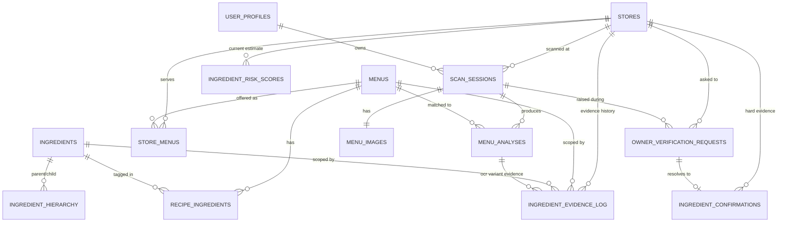

# Catoin DB 스키마 설계 (백엔드 전달용) — v3

v1 → v2에서 구조적 빈틈(FK 깨짐, 로그/스냅샷 분리, OCR 변형재료 미반영, 추적 링크) 전부 수정 완료.
v3는 **구조 변경 없음, 테이블명만 직관적으로 정리**.

---

## 0. 설계 원칙

| 원칙 | 이유 |
|---|---|
| store_id 없는 학습/피드백 테이블 금지 | 가게 간 위험도 추정치 오염 방지 |
| **`ingredient_risk_scores`(현재 스냅샷)과 `ingredient_evidence_log`(원본 증거)를 분리** | 나중에 출처 신뢰도 학습(Dawid & Skene 1979 계열 — 관찰자별 오류율을 EM/계층 베이지안으로 추정) 붙이려면 이벤트 단위 로그가 반드시 필요함 |
| 웹서치로 새로 발견한 메뉴도 정식 FK 경로로 편입 | `menu_id` FK 깨짐 방지 |
| 모든 override/피드백은 "어디서 왔는지" 추적 가능해야 함 | 디버깅, 이상 피드백 감사 |

---

## 1. ERD

---

## 2. 전역 참조 테이블 (store 무관)

### `menus`
| 컬럼 | 타입 | 설명 |
|---|---|---|
| `id` | PK | |
| `name_ko` | varchar | 베이스 메뉴명 (변형 메뉴면 변형 표기 그대로, 예: "차돌된장찌개") |
| `base_menu_id` | FK → menus, nullable | 이름 변형 메뉴가 참조하는 원본 메뉴. `NULL`이면 독립 메뉴(변형 아님) |
| `category` | varchar | 메뉴 카테고리 |
| `ambiguity_flags` | text[] | `has_unclear_broth` 등 |
| `source` | enum | `curated`(원래 76개 큐레이션) \| `web_search_generated`(웹서치 에이전트가 자동 생성) \| `variant_generated`(변형 태깅 과정에서 자동 생성) |
| `needs_review` | boolean | `web_search_generated`/`variant_generated`로 들어온 메뉴는 기본 `true` |

> **웹서치 에이전트 플로우**: DB에 없는 메뉴 발견 시, `menus`에 `source: web_search_generated`로 먼저 행 생성 → 그 `menu_id`로 `recipe_ingredients`, `ingredient_evidence_log` 채움. FK가 끊기지 않게 하는 순서.

> **변형 메뉴 플로우**: 메뉴명이 기존 메뉴와 longest-match 되고 남은 토큰(remain)이 있으면(예: "차돌된장찌개" → base="된장찌개", remain="차돌"), **원본 메뉴 row를 그대로 쓰지 않고** `base_menu_id`로 원본을 참조하는 새 `menus` 행을 `source: variant_generated`로 생성 → 그 변형 메뉴의 `menu_id`로 `recipe_ingredients`(변형 재료, `evidence_type: variant`)와 `ingredient_evidence_log`를 채움. 이렇게 분리해야 변형 메뉴("차돌된장찌개")에서 나온 증거가 원본 메뉴("된장찌개")의 확률과 섞이지 않음.

### `ingredients`
| 컬럼 | 타입 | 설명 |
|---|---|---|
| `id` | PK | |
| `name_ko` | varchar | 재료명 |
| `tag` | varchar | `is_pork`, `is_shrimp` 등 |
| `taxonomy_category` | varchar | 교차오염 / 발효장류 / 소스 / 육수 / 양념 / 고명견과 / 유지류 |

### `recipe_ingredients` (구 menu_recipe_ingredients)
베이스 레시피 — 메뉴당 재료 목록, store 무관
| 컬럼 | 타입 | 설명 |
|---|---|---|
| `menu_id` | FK → menus | |
| `ingredient_id` | FK → ingredients | |
| `evidence_type` | enum | `explicit`(레시피 명시) \| `variant`(변형/remain 토큰 유래) |

PK: `(menu_id, ingredient_id)`

### `ingredient_hierarchy` (구 ingredient_relations)
재귀 확장용 (예: 김치찌개 → 김치 → 액젓 → 새우)
| 컬럼 | 타입 | 설명 |
|---|---|---|
| `parent_ingredient_id` | FK → ingredients | |
| `child_ingredient_id` | FK → ingredients | |

순환 참조 방지를 위해 `recursive_expand.py`의 cycle detection 로직 유지.

---

## 3. 가게 스코프 테이블 (store_id 필수)

### `stores`
| 컬럼 | 타입 | 설명 |
|---|---|---|
| `id` | PK | store_id |
| `name` | varchar | 상호명 |
| `lat`, `lng` | decimal | GPS 좌표 |
| `address` | varchar | |
| `source` | enum | `gps_matched` \| `manual_search` \| `new` |
| `created_at` | timestamp | |

### `store_menus`
이 가게가 실제로 취급하는 걸로 확인된 메뉴 (OCR 스캔 이력)
| 컬럼 | 타입 | 설명 |
|---|---|---|
| `store_id` | FK → stores | |
| `menu_id` | FK → menus | |
| `first_seen_at` | timestamp | |

PK: `(store_id, menu_id)`

### `ingredient_risk_scores` (구 store_menu_ingredient_priors)
**"이 가게, 이 메뉴, 이 재료가 들어있을 확률이 지금 얼마냐"** — 현재 스냅샷, Bayesian 에이전트가 읽는 테이블
| 컬럼 | 타입 | 설명 |
|---|---|---|
| `store_id` | FK → stores, NOT NULL | |
| `menu_id` | FK → menus, NOT NULL | |
| `ingredient_id` | FK → ingredients | |
| `alpha` | float | 현재 α |
| `beta` | float | 현재 β |
| `evidence_count` | int | 누적 증거 건수 |
| `updated_at` | timestamp | |

**UNIQUE `(store_id, menu_id, ingredient_id)`**

**이 테이블은 직접 UPDATE 하지 않음.** 항상 `ingredient_evidence_log`에 이벤트 INSERT → 애플리케이션 로직이 재계산해서 반영.

**신규 가게 초기화**: 새 테이블 안 만들고, `recipe_ingredients`에 `explicit`로 태깅된 재료는 `alpha=5, beta=1`(있을 가능성 높음), 안 된 재료는 `alpha=1, beta=5`로 규칙 기반 디폴트 생성.

### `ingredient_evidence_log` (구 prior_update_log)
**"왜 그 확률로 바뀌었냐"의 원본 증거 로그.** 나중에 출처 신뢰도 학습(Dawid & Skene 1979 / Whitehill et al. 2009 GLAD / Kim & Ghahramani Bayesian Classifier Combination 계열) 붙일 때 이 테이블이 학습 데이터가 됨.
| 컬럼 | 타입 | 설명 |
|---|---|---|
| `id` | PK | |
| `store_id` | FK → stores, NOT NULL | |
| `menu_id` | FK → menus | |
| `ingredient_id` | FK → ingredients | |
| `delta_alpha` | float | 이번 이벤트로 증가한 α |
| `delta_beta` | float | 이번 이벤트로 증가한 β |
| `source_type` | enum | `web_search` \| `owner_feedback` \| `user_feedback` \| `ocr_variant_tag` |
| `evidence_ref_table` | varchar | 참조 테이블명 (`menu_analyses` / `owner_verification_requests` / `web_search_cache`) |
| `evidence_ref_id` | bigint | 위 테이블의 PK |
| `created_at` | timestamp | |

**OCR 변형재료 반영**: 기존 변형 토큰 태깅 로직(remain 토큰 → 재료 태그 매핑, 예: "차돌" → 소고기)을 재사용해서, `menu_analyses` 저장과 별개로 (위 변형 메뉴 플로우로 생성된) 변형 `menu_id` 기준으로 `ingredient_evidence_log`에 `source_type: ocr_variant_tag`로 한 줄 남김. **이건 다른 출처(`web_search`/`owner_feedback`/`user_feedback`)와 동등한 확률 갱신용 증거 신호일 뿐, 확정 판정이 아님** — 하드 오버라이드는 `ingredient_confirmations`만 담당.

### `ingredient_confirmations` (구 store_menu_ingredient_exact)
**"확정된 사실"** — hard evidence override
| 컬럼 | 타입 | 설명 |
|---|---|---|
| `store_id` | FK → stores | |
| `menu_id` | FK → menus | |
| `ingredient_id` | FK → ingredients | |
| `present` | boolean | 재료 존재 여부 (확정값) |
| `source` | enum | `owner_confirmed` \| `user_reported` |
| `flagged_anomaly` | boolean | base rate와 극단적으로 어긋나는 답변 플래그 |
| `confirmed_at` | timestamp | |

**UNIQUE `(store_id, menu_id, ingredient_id)`**. 이 테이블에 행이 있으면 원칙적으로 `ingredient_risk_scores` 조회를 스킵하고 이 값을 그대로 씀.

**예외 — `flagged_anomaly: true` + `present: false`**: "재료 없음" 확정 답변이 base rate와 극단적으로 어긋나는 경우엔 확정값을 무조건 신뢰하지 않는다. 이때는 `ingredient_risk_scores` 확률도 함께 조회해서, 확률이 낮지 않으면 확정값(없음) 대신 CAUTION 이상으로 유지한다. `present: true`인 이상 답변(예: 원래 안 들어가는 재료를 있다고 확인)은 이미 안전한 방향(위험 인정)이라 이 예외 대상이 아님 — FN-minimization 원칙상 "없다"는 이상 답변으로 실제 위험을 놓치는 경우만 막으면 됨.

### `owner_verification_requests` (구 owner_questions)
**"사장님에게 검증을 요청한 건"** — XAI 에이전트가 생성한 질문과 답변 로그
| 컬럼 | 타입 | 설명 |
|---|---|---|
| `id` | PK | |
| `store_id` | FK → stores | |
| `scan_session_id` | FK → scan_sessions | 어느 스캔에서 발생했는지 |
| `menu_id` | FK → menus | |
| `ingredient_id` | FK → ingredients | |
| `question_text` | text | |
| `answer_text` | text, nullable | |
| `resolved_confirmation_id` | FK → ingredient_confirmations, nullable | 답변이 반영된 확정 행 링크 |
| `answered_at` | timestamp, nullable | |

---

## 4. 세션/스캔 테이블 (기존 `ai_ocr` ERD와 이름 동일하게 유지)

### `scan_sessions` — 기존 구조 + `store_id`, `user_id` FK
### `menu_images` — 기존 구조 그대로
### `menu_analyses` — 기존 구조 + `menu_id` nullable FK

---

## 5. 사용자 프로필

### `user_profiles`
| 컬럼 | 타입 | 설명 |
|---|---|---|
| `id` | PK | |
| `religion_type` | enum, nullable | `halal` \| `kosher` \| `hindu` |
| `is_vegetarian` | boolean | |
| `vegetarian_type` | enum, nullable | `vegan` \| `lacto` \| `ovo` \| `lacto_ovo` \| `pesco` |
| `no_alcohol` | boolean | |
| `allergies` | text[] | |
| `no_spicy` | boolean | |

---

## 6. 캐시 테이블

### `web_search_cache`
| 컬럼 | 타입 | 설명 |
|---|---|---|
| `id` | PK | |
| `menu_id` | FK → menus, nullable | 생성된 `menus` 행과 연결 |
| `menu_name` | varchar | |
| `source_url` | varchar | |
| `extracted_ingredients` | text[] | |
| `fetched_at` | timestamp | |

원칙: 이 캐시 데이터는 "실제 식당 레시피"로 간주하지 않고, danger 판정을 낮추는 데 쓰지 않음 (`ai_web_search_agent` 기존 원칙 유지).

---

## 7. 백엔드에게 강조할 핵심 제약사항

1. `ingredient_risk_scores`, `ingredient_confirmations`, `ingredient_evidence_log` 세 테이블 전부 `store_id NOT NULL` DB 레벨 강제
2. **`ingredient_risk_scores`는 직접 UPDATE 금지** — 항상 `ingredient_evidence_log` INSERT → 재계산 순서
3. 웹서치 에이전트가 새 메뉴 발견 시 `menus` INSERT(`source: web_search_generated`)가 반드시 먼저 실행
4. `owner_verification_requests.resolved_confirmation_id`는 사장님 답변이 실제로 확정 테이블에 반영된 시점에 채움
5. 이름 변형 메뉴(remain 토큰 매칭)는 원본 메뉴 row를 재사용하지 말고 `base_menu_id`로 연결된 새 `menus` INSERT(`source: variant_generated`)가 먼저 실행 — 원본 메뉴와 변형 메뉴의 증거/확률이 섞이지 않게 하기 위함
6. 3·5번의 웹서치/변형 태깅 기반 INSERT는 **AI가 실시간으로 자동 실행하지 않음** — 사용자에게 결과를 보여주는 흐름과는 분리된 관리자 페이지에서, 사람이 컨펌한 시점에만 실행됨 (사장님 답변 기반 `ingredient_confirmations`는 예외로 즉시 반영)
