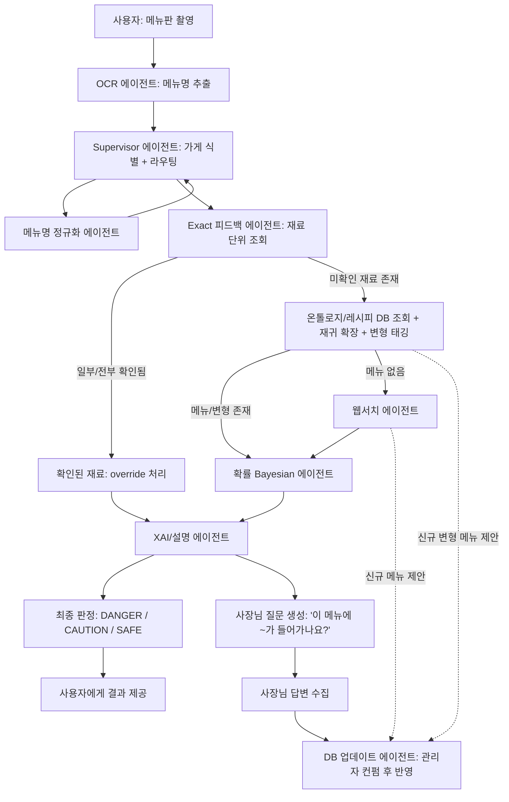
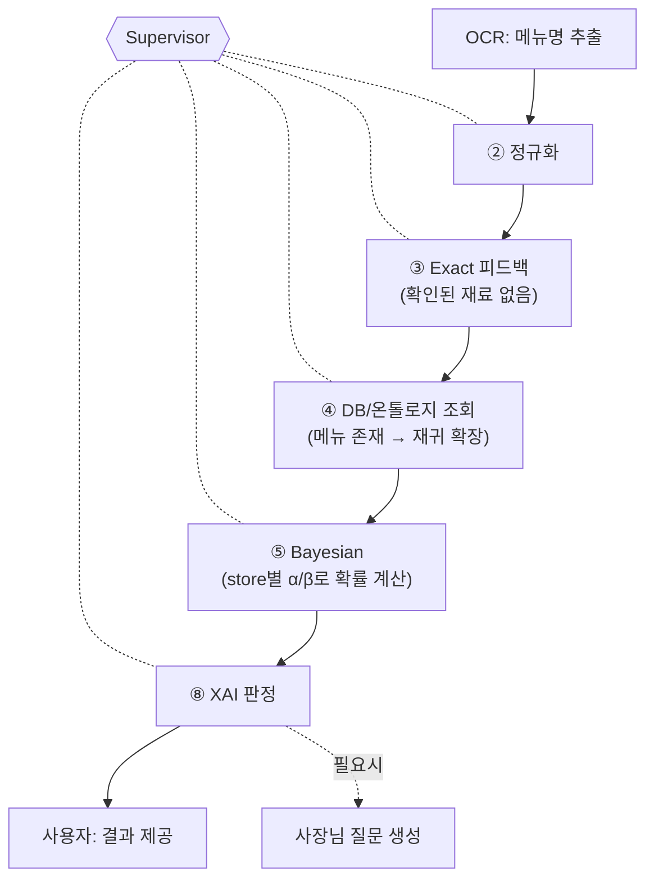
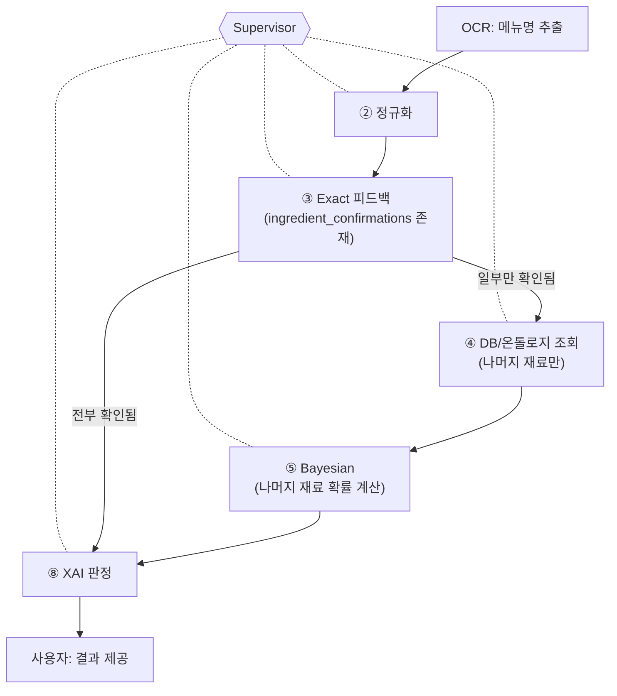
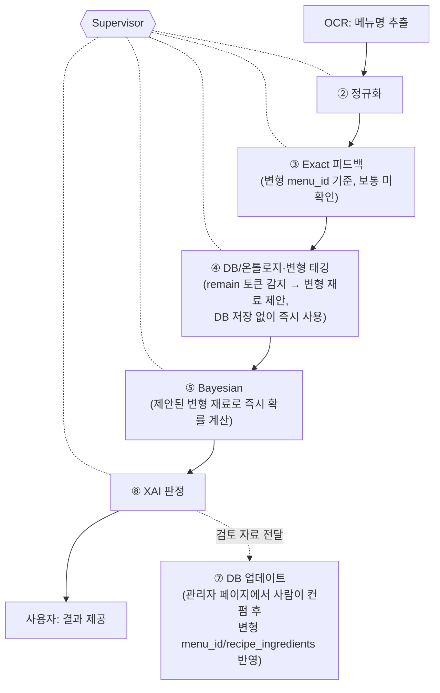
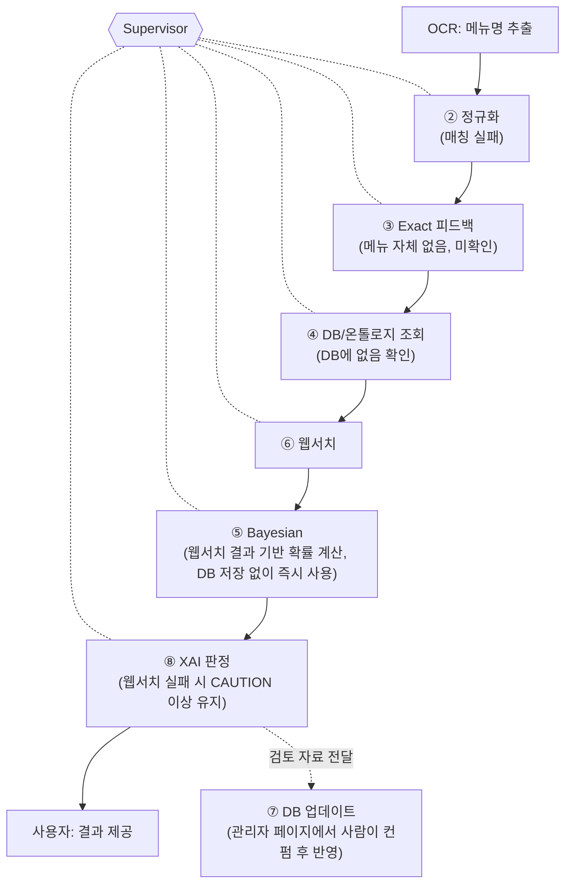

# Catoin 멀티 에이전트 아키텍처

목적: 외국인 관광객이 한식당 메뉴판을 찍으면, OCR → 재료 분석 → DANGER/CAUTION/SAFE 판정까지 자동으로 수행하는 안전 서비스.
북극성 지표: **FN(false negative) 최소화**, F2 score 기준.

---

## 1. 서비스 흐름도

※ 이 흐름도는 처리 순서만 보여주며, 실제 호출은 전부 Supervisor를 경유함 (2번 오케스트레이션 구조 참고)

### 케이스별 시나리오

**1) DB에 있는 메뉴 + 사장님 피드백 없음**

**2) DB에 있는 메뉴 + 사장님 피드백 있음**

**3) DB에 있는 변형 재료 (예: 차돌된장찌개)**

**4) DB에 없는 unknown 메뉴**

---

## 2. 오케스트레이션 구조

모든 에이전트는 Supervisor하고만 통신한다 (실선 = 호출, 반대 화살표 = 결과 반환). 에이전트 간 직접 연결은 없음 — Supervisor가 명령을 내리고 결과를 받아 다음 명령을 내리는 중앙집중형 구조.

※ DB 업데이트 에이전트는 예외: 사장님 답변(hard evidence)은 Supervisor가 즉시 호출·반영하지만, 웹서치/변형 태깅(soft evidence)은 Supervisor를 거쳐 관리자 페이지로 검토 자료가 전달되고, **관리자가 컨펌한 시점에만** 실행됨 (3번 섹션 ⑦ 참고)

---

## 3. 에이전트별 역할 정의

### ① Supervisor 에이전트 (가게 식별 통합 + 전체 오케스트레이션)
- **입력**: 사용자 GPS 좌표, (필요시) 상호명 검색어, OCR 메뉴명 리스트
- **처리**:
  - **정규화 위임**: OCR 메뉴명 리스트를 정규화 에이전트에 전달 → 정규화된 메뉴명을 받아 이후 단계에 사용.
  - **가게 식별**: 카카오/네이버 지도 API로 반경 내 후보 가게 리스트 제공 → 사용자 확인. 신규 가게면 store_id 발급.
  - **라우팅**: 메뉴 아이템별로 파이프라인 라우팅. Exact 매칭이 재료 전부 커버하면 가벼운 경로로 즉시 종료, 미확인 재료가 있으면 무거운 경로(DB→확률→웹서치)로 위임.
- **출력**: `store_id` (모든 하위 에이전트가 이 값으로 스코프를 잡음) + 정규화된 메뉴명 + 각 메뉴 아이템에 대한 처리 경로 결정 + 최종 결과 취합
- **주의**: 이 store_id가 없으면 Exact 피드백도, Bayesian prior도 전역으로 섞여버림 (기존에 겪은 버그 재발 지점) — 반드시 모든 저장/조회 쿼리에 필수 파라미터로 강제할 것. 나머지 모든 에이전트는 Supervisor의 호출을 받아서만 동작.

### ② 메뉴명 정규화 에이전트
- **입력**: OCR 메뉴명 리스트 (Supervisor로부터 호출됨)
- **처리**: 오탈자 교정, 표기 변형 통일(띄어쓰기/약어/외래어 표기 등), `menus.name_ko`와 매칭 가능한 형태로 정제
- **출력**: 정규화된 메뉴명 리스트 → Supervisor에게 반환

### ③ Exact 피드백 에이전트 (재료 단위로 재설계)
- **입력**: store_id, 메뉴명 (Supervisor로부터 전달받음)
- **처리**: 해당 가게·메뉴에 대해 **재료 단위**로 이미 확인된 정보(사장님 확인 or 과거 사용자 hard evidence)가 있는지 조회
- **출력**: `{재료: 확인여부}` 맵 → **Supervisor에게 반환**. 전부 확인되면 Supervisor가 확률 모델 호출을 스킵, 일부만 확인되면 나머지 재료만 Supervisor가 다음 에이전트로 라우팅
- **설계 원칙**: 메뉴 단위 이분법 금지 — 부분 확인을 지원해야 함

### ④ DB/온톨로지 조회 + 재귀 확장 + 변형 태깅 에이전트
- **입력**: 메뉴명 (Exact로 미확인된 재료만, Supervisor로부터 전달받음)
- **처리**:
  - **기본 조회**: 레시피 DB(`menus`/`recipe_ingredients`) 조회 → `recursive_expand.py` 로직으로 재귀 확장 (예: 김치찌개 → 김치 → 액젓 → 새우) → hidden_rules.py 99개 재료 taxonomy 매핑
  - **변형 태깅**: longest-match로 기본 메뉴를 찾고 남은 토큰(remain)이 있으면(예: "차돌된장찌개" → base="된장찌개", remain="차돌"), 변형 재료를 태깅해서 **제안**(이 시점엔 DB에 쓰지 않고, ⑤ Bayesian이 즉시 사용). 실제 DB 반영 시엔 **원본 메뉴 row를 그대로 쓰지 않고** `base_menu_id`로 원본을 참조하는 새 `menus` 행(`source: variant_generated`)을 만들어야 함 — 원본 메뉴의 확률과 안 섞이게 하기 위함이며, 이 INSERT는 ⑦ DB 업데이트 에이전트가 관리자 컨펌 후 처리
- **출력**: 확장된 재료 리스트(교차오염/발효장류/소스/육수/양념/고명견과/유지류 카테고리 태깅 포함) + (변형 메뉴인 경우) 제안된 변형 재료 태그(DB 미반영 상태) + 메뉴 DB 존재 여부 → **Supervisor에게 반환**
- **분기**: 메뉴가 DB에 없으면 Supervisor가 그 결과를 보고 웹서치 에이전트 호출 여부를 결정

### ⑤ 확률(Bayesian) 에이전트
- **입력**: store_id, 확장된 재료 리스트, 각 재료의 alpha/beta prior (Supervisor로부터 전달받음)
- **처리**: Beta-Binomial 업데이트 (α_prior = k_count+1, β_prior = (n_total−k_count)+1) — **store_id 스코프로 분리된 prior 사용**
- **출력**: 재료별 존재 확률 (posterior mean) → **Supervisor에게 반환**
- **주의**: 여기서 전역 prior를 쓰면 안 됨. store별 prior가 없으면 유사 가게 클러스터 prior로 fallback (완전 전역은 최후의 수단)

### ⑥ 웹서치 에이전트
- **입력**: 메뉴명 (Supervisor가 DB에 없는 경우에만 호출 — 전체 아이템마다 호출 금지, 비용/속도 문제)
- **처리**: 웹 크롤링으로 레시피/재료 정보 수집
- **출력**: 크롤링된 재료 후보 리스트 → **Supervisor에게 반환** (Supervisor가 확률 계산에 즉시 사용하고, 관리자 검토용으로 DB 업데이트 에이전트도 호출)
- **fallback**: 웹서치도 실패하면 "정보 없음" 상태로 CAUTION 이상 처리 (SAFE로 떨어뜨리지 않음 — FN-minimization 원칙)

### ⑦ DB 업데이트 에이전트
- **입력**: Supervisor로부터 전달받은 웹서치 결과 OR 사장님 답변 피드백 OR ④의 변형 태깅(ocr_variant_tag) 결과
- **처리**:
  - **웹서치/변형 태깅 결과(신규 메뉴·재료)**: 실시간 사용자 응답 흐름과는 분리된 별도 프로세스. AI는 여기서 DB를 바로 갱신하지 않고, **관리자 페이지에 검토 자료로 전달**만 함 — **사람이 컨펌해야** `menus` INSERT(`source: web_search_generated`/`variant_generated`, 먼저 실행) → `recipe_ingredients`/`ingredient_evidence_log`(`source_type: web_search`/`ocr_variant_tag`) 순으로 반영되고, 이후 애플리케이션 로직이 `ingredient_risk_scores`의 α/β를 재계산. **`ingredient_risk_scores` 직접 UPDATE 금지**
  - **사장님 답변 피드백(확정 저장, hard evidence)**: `ingredient_confirmations`에 override로 저장하되, base rate와 극단적으로 어긋나면(예: 돈까스인데 "돼지고기 없음") `flagged_anomaly` 처리 후 저장. 이건 사장님이 이미 확인해준 값이라 즉시 반영.
- **출력**: 갱신된 DB (다음 조회부터 반영) → 처리 완료 여부를 **Supervisor에게 반환**
- **주의**: 웹서치 기반 신규 데이터는 AI가 자동으로 쓰지 않음 — 사용자에게 결과를 보여주는 것과 DB에 영구 반영하는 것은 별개 트리거임

### ⑧ XAI/설명 에이전트
- **입력**: Supervisor가 취합해서 전달한 확인된 재료 override 결과 + 확률 에이전트 결과 + 사용자 알레르기/식이 태그
- **처리**: 사용자 태그와 충돌하는 재료 식별, 확률 기반 근거 설명, DANGER/CAUTION/SAFE 판정(F2 최적화 threshold 적용), 사장님에게 물어볼 질문 생성
- **출력**: 사용자용 최종 설명 + 판정 결과 + 사장님 질문 텍스트 → **Supervisor에게 반환**
- **분리 이유**: 판정 로직(확률 계산)과 설명/표현 로직을 분리해두면, 판정 기준이나 문구/언어가 바뀔 때 XAI 에이전트만 수정하면 되어 유지보수가 쉬움

---

## 4. 판정 임계값 (미확정 — 개발자가 채울 것)
- DANGER / CAUTION / SAFE 구간을 나누는 확률 컷오프는 F2 score 최적화로 결정
- 누가 계산하는지(Supervisor 내부 규칙 vs XAI 에이전트 내부): **디벨롭 담당자가 결정 필요**

## 5. 아직 열려있는 질문
- 사장님 피드백의 신뢰도 가중치를 일반 사용자 피드백과 다르게 줄 것인지 (McCoy & Prelec 2024 hierarchical trust-weight 적용 여부)
- 웹서치 크롤링 결과와 기존 DB 값이 충돌할 때 병합 규칙
- 메뉴판 1장당 수십 개 아이템이 나올 때 무거운 경로(웹서치, 확률모델) 호출을 얼마나 배치/캐싱할지
