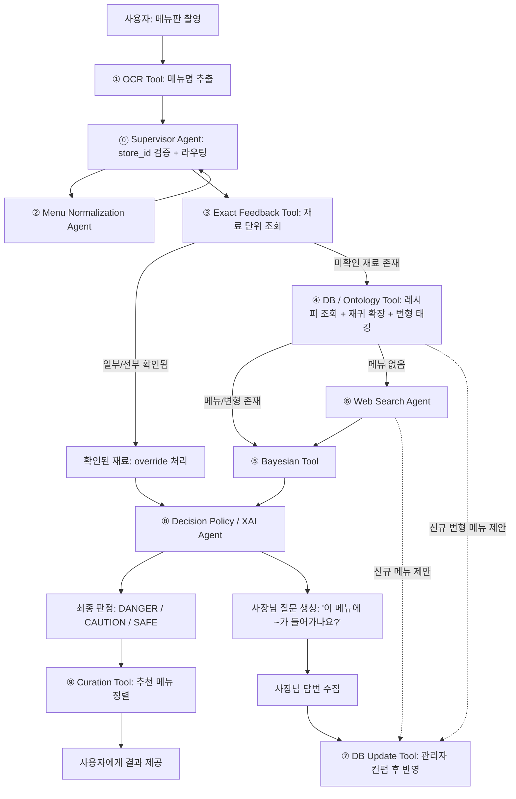
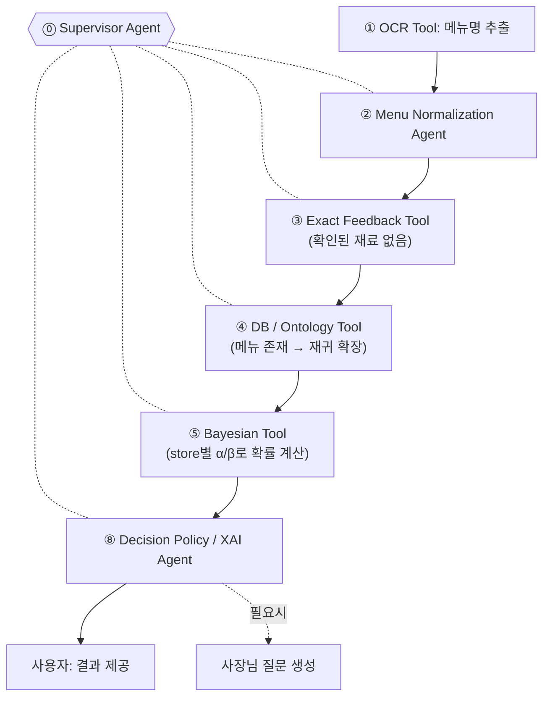
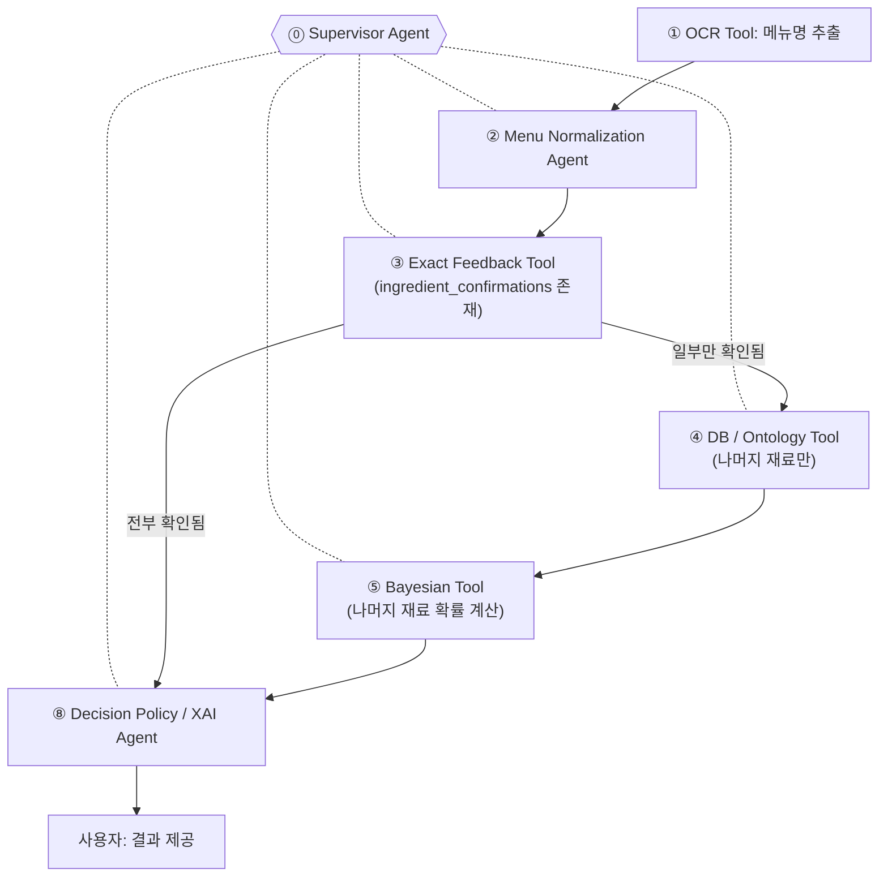
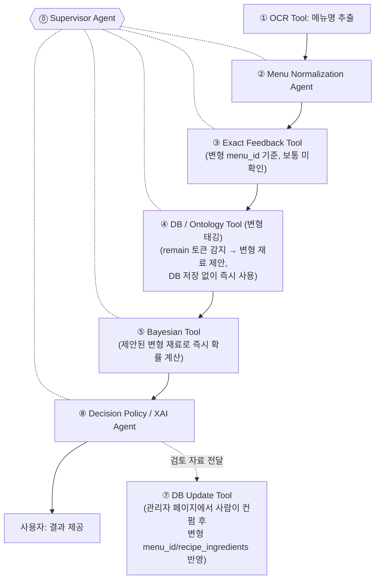
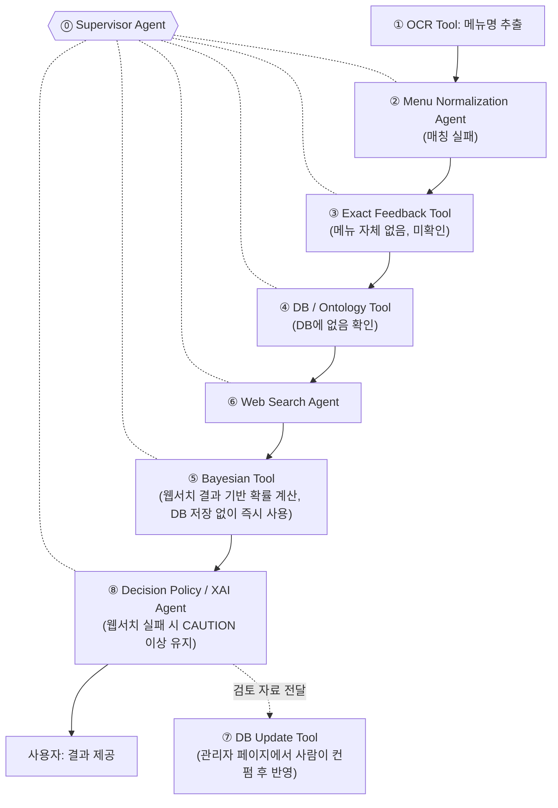
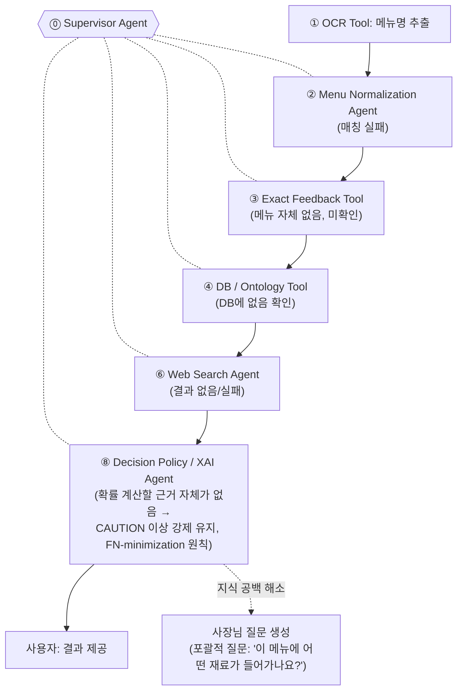
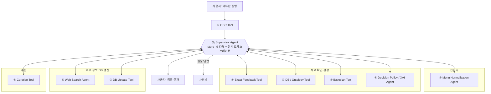

# Caution 멀티 에이전트 아키텍처

목적: 외국인 관광객이 한식당 메뉴판을 찍으면, OCR → 재료 분석 → DANGER/CAUTION/SAFE 판정까지 자동으로 수행하는 안전 서비스.
북극성 지표: **FN(false negative) 최소화**, F2 score 기준.

---

## 1. 서비스 흐름도

※ 이 흐름도는 처리 순서만 보여주며, 실제 호출은 전부 ⓪ Supervisor Agent를 경유함 (2번 오케스트레이션 구조 참고)

### 케이스별 시나리오

#### 정상 케이스

**1) DB에 있는 메뉴 + 사장님 피드백 없음**

**2) DB에 있는 메뉴 + 사장님 피드백 있음**

**3) DB에 있는 변형 재료 (예: 차돌된장찌개)**

**4) DB에 없는 unknown 메뉴**

#### 엣지 케이스

**5) 웹서치까지 실패한 경우 (완전 정보 없음)**

---

## 2. 오케스트레이션 구조

모든 Agent·Tool은 ⓪ Supervisor Agent하고만 통신한다 (실선 = 호출, 반대 화살표 = 결과 반환). Agent·Tool 간 직접 연결은 없음 — ⓪ Supervisor Agent가 명령을 내리고 결과를 받아 다음 명령을 내리는 중앙집중형 구조.

※ ⑦ DB Update Tool은 예외: 사장님 답변(hard evidence)은 Supervisor가 즉시 호출·반영하지만, 웹서치/변형 태깅(soft evidence)은 ⓪ Supervisor Agent를 거쳐 관리자 페이지로 검토 자료가 전달되고, **관리자가 컨펌한 시점에만** 실행됨 (3번 섹션 ⑦ 참고)

---

## 3. Agent / Tool 역할 정의

### ⓪ Supervisor Agent (`store_id` 검증 + 전체 오케스트레이션)
- **역할 개요**: 사용자 스캔 요청이 들어오는 순간부터 최종 결과를 돌려줄 때까지 전체 파이프라인을 지휘하는 유일한 진입점. 나머지 Agent·Tool(①~⑨)은 독립적으로 움직이지 않고 전부 Supervisor의 호출을 받아야만 실행되며, 결과도 Supervisor에게만 반환한다(2번 섹션 참고). 중앙집중형으로 설계한 이유는 store_id 스코프를 모든 하위 쿼리에 강제할 단일 지점이 필요하기 때문 — 이 스코프가 새면 가게 간 데이터가 섞일 위험이 있음.
- **입력**: 백엔드가 검색·선택·존재/활성 검증을 마친 양의 정수 `store_id`, OCR 메뉴명 리스트(메뉴판 1장에 보통 여러 개)
- **처리**:
  1. **정규화 위임**: OCR 메뉴명 리스트를 ② Menu Normalization Agent에 배치로 통째로 전달 → 정규화된 리스트를 받아 이후 단계에 사용. 아이템 하나마다 왕복하지 않는 이유는 메뉴판 1장당 수십 개 항목이 나올 수 있어 매번 왕복하면 느려지기 때문(5번 섹션 배치/캐싱 이슈 참고).
  2. **가게 컨텍스트 검증**: `store_id`가 JSON 정수이며 0보다 큰지 검증하고 이후 모든 하위 Agent·Tool 호출에 같은 값을 전달. 가게 검색·Kakao fallback·사용자 선택·기존 공공데이터 매칭·스캔 연결은 백엔드 책임이며 AI는 가게 마스터를 변경하지 않음.
  3. **메뉴 아이템별 라우팅**: 정규화된 메뉴명마다 ③ Exact Feedback Tool을 먼저 호출. 재료가 전부 확인되면(hard evidence 존재) 곧바로 ⑧ Decision Policy / XAI Agent로 넘어가는 **가벼운 경로**로 처리 종료, 일부/전부 미확인이면 ④ DB / Ontology Tool → (필요시) ⑤ Bayesian Tool / ⑥ Web Search Agent를 순서대로 호출하는 **무거운 경로**로 위임.
  4. **결과 취합**: 메뉴판에 있는 모든 아이템의 ⑧ 결과가 모이면 하나의 응답으로 묶어 사용자에게 반환.
- **출력**: 입력과 동일한 정수 `store_id` (모든 하위 Agent·Tool이 이 값으로 스코프를 잡음) + 정규화된 메뉴명 + 각 메뉴 아이템에 대한 처리 경로 결정 + 최종 결과 취합
- **주의**: 이 store_id가 없으면 ③ Exact Feedback Tool도, ⑤ Bayesian Tool의 prior도 전역으로 섞여버림 — 반드시 모든 저장/조회 쿼리에 필수 파라미터로 강제할 것. 나머지 모든 Agent·Tool은 ⓪ Supervisor Agent의 호출을 받아서만 동작.

### ① OCR Tool
- **역할 개요**: 메뉴판 이미지에서 메뉴명·가격·설명 텍스트를 구조화하여 추출하는 입구. ⓪ Supervisor Agent보다 앞단에서 동작하며, 이후 모든 단계는 여기서 나온 메뉴명 리스트를 입력으로 받는다.
- **입력**: 사용자가 촬영한 메뉴판 이미지
- **처리**: CLOVA OCR로 텍스트·영역을 추출하고 GPT 후처리로 메뉴 블록을 구조화 (구현 상세는 [`../ai_ocr/README.md`](../ai_ocr/README.md))
- **출력**: 원본 메뉴명 리스트(메뉴판 표시 순서 유지) → ⓪ Supervisor Agent에게 전달
- **주의**: 오탈자·표기 변형 교정은 ①의 책임이 아니다 — ② Menu Normalization Agent가 담당한다. ①은 "읽은 그대로"를 넘긴다.
- **스펙 문서**: 별도 문서 없음. 구현 README가 기준.

### ② Menu Normalization Agent
- **역할 개요**: OCR이 뽑아낸 원본 메뉴명은 오탈자, 띄어쓰기 차이, 상호별 표기 스타일(예: "김치찌개" vs "김치 찌개")이 섞여있어 DB의 `menus.name_ko`와 문자열 그대로는 잘 안 맞는 경우가 많음. 이후 단계(③ Exact Feedback Tool, ④ DB / Ontology Tool)가 정확한 문자열 매칭을 할 수 있도록 전처리만 전담.
- **입력**: OCR 메뉴명 리스트 (Supervisor로부터 배치로 전달받음)
- **처리**:
  - 오탈자·잡문자 교정 (OCR 특유의 접두/접미 기호 제거, 예: `"■김치찌개–"` → `"김치찌개"`)
  - 띄어쓰기·약어·외래어 표기 통일 (예: "돈까스"/"돈가스" 통일)
  - 대/중/소, 1인/2인, 곱빼기 같은 옵션 표기를 메뉴 식별에 방해되지 않게 분리
  - `menus.name_ko`와 매칭 가능한 정규 형태로 최종 정제
- **출력**: 정규화된 메뉴명 리스트 → Supervisor에게 반환
- **주의**: 여기서 못 잡은 표기 변형(신조어, 매장 고유 이름)은 정규화 실패로 남고, 다음 단계(④)의 longest-match/변형 태깅으로 넘어감 — 정규화가 100% 매칭을 보장하진 않음.

### ③ Exact Feedback Tool (재료 단위로 재설계)
- **역할 개요**: 확률로 추정하기 전에 "이미 사람이 확인해준 확실한 값이 있는지"부터 재료 단위로 체크하는 1차 관문. 여기서 확인되면 Bayesian 계산 자체가 불필요해 비용·속도 면에서 이득이고, 무엇보다 사람이 확인한 값이 확률 추정치보다 신뢰도가 높음.
- **입력**: store_id, 메뉴명 (Supervisor로부터 전달받음)
- **처리**: `ingredient_confirmations` 테이블에서 해당 store_id·menu_id 조합으로 이미 저장된 확정값(사장님 확인 또는 과거 hard evidence)이 있는지 **재료 하나하나 단위로** 조회. 메뉴 전체가 아니라 재료 단위로 확인 여부가 갈릴 수 있음(예: 돼지고기는 확인됐지만 액젓 여부는 아직 미확인). **예외**: `flagged_anomaly: true`이면서 `present: false`("없음" 확정이 base rate와 극단적으로 어긋남)인 재료는 확정으로 취급하지 않고 **미확인으로 분류** — Bayesian 확률과 비교해서 더 위험한 쪽으로 판정하도록 함(`caution-db-schema.md` 참고)
- **출력**: `{재료: 확인여부}` 맵 → **Supervisor에게 반환**. 전부 확인되면 Supervisor가 확률 모델 호출을 스킵, 일부만 확인되면(anomaly 예외 포함) 나머지 재료만 ⓪ Supervisor Agent가 다음 노드로 라우팅
- **설계 원칙**: 메뉴 단위 이분법(전부 확인 vs 전부 미확인) 금지 — 부분 확인을 지원해야 "새우젓만 사장님이 확인해줬고 나머지는 아직 모름" 같은 현실적인 상황을 표현할 수 있음.

### ④ DB / Ontology Tool (조회 + 재귀 확장 + 변형 태깅)
- **역할 개요**: Exact로 확인 안 된 재료에 대해, 이 메뉴에 원래 뭐가 들어가는지(레시피 DB)와 숨겨진 파생 재료(재귀 확장), 그리고 메뉴명 변형(remain 토큰)까지 한 번에 처리하는 지식 조회 담당. 여기서 메뉴 자체를 못 찾으면 그때만 웹서치로 넘어감.
- **입력**: 메뉴명 (Exact로 미확인된 재료만, Supervisor로부터 전달받음)
- **처리**:
  - **기본 조회**: 레시피 DB(`menus`/`recipe_ingredients`) 조회 → `recursive_expand.py` 로직으로 재귀 확장 (예: 김치찌개 → 김치 → 액젓 → 새우) → hidden_rules.py 99개 재료 taxonomy 매핑
  - **변형 태깅**: longest-match로 기본 메뉴를 찾고 남은 토큰(remain)이 있으면(예: "차돌된장찌개" → base="된장찌개", remain="차돌"), 변형 재료를 태깅해서 **제안**(이 시점엔 DB에 쓰지 않고, ⑤ Bayesian Tool이 즉시 사용). 실제 DB 반영 시엔 **원본 메뉴 row를 그대로 쓰지 않고** `base_menu_id`로 원본을 참조하는 새 `menus` 행(`source: variant_generated`)을 만들어야 함 — 원본 메뉴의 확률과 안 섞이게 하기 위함이며, 이 INSERT는 ⑦ DB Update Tool이 관리자 컨펌 후 처리
- **출력**: 확장된 재료 리스트(발효장류/소스/육수/양념/고명견과/유지류/기타 카테고리 태깅 포함, 교차오염은 모델 범위 외로 제외, 재료마다 `anomaly_locked` 값을 입력받은 그대로 보존해 포함) + (변형 메뉴인 경우) 제안된 변형 재료 태그(DB 미반영 상태) + 메뉴 DB 존재 여부 → **Supervisor에게 반환**
- **분기**: 메뉴가 DB에 없으면 ⓪ Supervisor Agent가 그 결과를 보고 ⑥ Web Search Agent 호출 여부를 결정

### ⑤ Bayesian Tool
- **역할 개요**: ③ Exact Feedback Tool로 확인되지 않은 재료에 대해 "이 가게 이 메뉴에 얼마나 있을 것 같은지"를 가게별 과거 데이터로 추정하는 확률 엔진. 확정값이 아니라 추정치이기 때문에, 이 결과는 항상 ⑧이 임계값과 함께 해석해서 DANGER/CAUTION/SAFE로 변환한다.
- **입력**: store_id, 확장된 재료 리스트, 각 재료의 alpha/beta prior (Supervisor로부터 전달받음)
- **처리**: Beta-Binomial 업데이트 (α = k_count+1, β = (n_total−k_count)+1, Beta(1,1) 라플라스 스무딩) — **agent-5-Statistics.md 확정 공식**(doc2 갱신 완료). store_id 스코프 prior를 `store → cluster(menu_category) → global → uninformative` 순으로 fallback해서 사용하고, 재료 출처(recipe/expanded/variant_suggested)에 따라 α·β를 동일 비율로 스케일 조정
- **출력**: 재료별 존재 확률 (posterior mean) → **Supervisor에게 반환**
- **주의**: 전역 prior는 최후의 수단(`uninformative`). ③에서 override 거부된 anomaly 재료는 `anomaly_locked: true`로 표시되어, 확률 값과 무관하게 ⑧이 CAUTION 이상을 강제하도록 함.

### ⑥ Web Search Agent
- **역할 개요**: ④ DB / Ontology Tool이 메뉴 자체를 못 찾았을 때만 호출되는 마지막 정보 수집 수단. 비용·속도 문제로 전체 메뉴 아이템마다 부르지 않고 "완전히 모르는 메뉴"에만 사용한다. 크롤링 데이터는 실제 이 가게의 레시피가 아니므로 태생적으로 신뢰도가 낮은 정보원으로 취급된다.
- **입력**: 메뉴명 (Supervisor가 DB에 없는 경우에만 호출 — 전체 아이템마다 호출 금지, 비용/속도 문제)
- **처리**: 웹 크롤링으로 레시피/재료 정보 수집
- **출력**: 크롤링된 재료 후보 리스트 → **Supervisor에게 반환** (Supervisor가 확률 계산에 즉시 사용하고, 관리자 검토용으로 ⑦ DB Update Tool도 호출)
- **fallback**: 웹서치도 실패하면 "정보 없음" 상태로 CAUTION 이상 처리 (SAFE로 떨어뜨리지 않음 — FN-minimization 원칙)

### ⑦ DB Update Tool
- **역할 개요**: AI 판단 결과를 어떤 저장 명령으로 전달할지 결정하는 관문. 증거의 신뢰도에 따라 즉시 반영 요청(hard evidence)과 관리자 검토 요청(soft evidence)을 명확히 구분한다. 물리 DB 쓰기와 트랜잭션은 백엔드가 담당한다.
- **입력**: Supervisor로부터 전달받은 웹서치 결과 OR 사장님 답변 피드백 OR ④의 변형 태깅(ocr_variant_tag) 결과
- **처리**:
  - **웹서치/변형 태깅 결과(신규 메뉴·재료, soft evidence)**: 실시간 사용자 응답 흐름과는 분리된 별도 프로세스. AI는 여기서 DB를 바로 갱신하지 않고, **관리자 페이지에 검토 자료로 전달**만 함 — **사람이 컨펌해야** `menus` INSERT(`source: web_search_generated`/`variant_generated`, 먼저 실행) → `recipe_ingredients`/`ingredient_evidence_log`(`source_type: web_search`/`ocr_variant_tag`) 순으로 반영되고, 이후 애플리케이션 로직이 `ingredient_risk_scores`의 α/β를 재계산. **`ingredient_risk_scores` 직접 UPDATE 금지**
  - **사장님 답변 피드백(확정 저장, hard evidence)**: `ingredient_confirmations` upsert 명령을 만들되, base rate와 극단적으로 어긋나면(예: 돈까스인데 "돼지고기 없음") `flagged_anomaly`를 포함. 백엔드가 권한·FK·멱등성을 검증한 뒤 즉시 반영.
- **출력**: 백엔드가 검증·저장할 구조화된 명령(`action`, `idempotency_key`, `payload`)
- **주의**: 웹서치 기반 신규 데이터는 AI가 자동으로 쓰지 않음 — 사용자에게 결과를 보여주는 것과 DB에 영구 반영하는 것은 별개 트리거임. `flagged_anomaly: true` + `present: false`인 확정값은 저장은 그대로 하되, ③ Exact Feedback Tool이 이를 미확인으로 분류해서 Bayesian 확률과 비교 후 더 위험한 쪽으로 판정하도록 함 — 저장(⑦)과 신뢰 여부 판단(③)의 책임을 분리.

### ⑧ Decision Policy / XAI Agent
- **역할 개요**: 판정과 설명을 담당하는 파이프라인의 마지막 단계. ⑤ Bayesian Tool이 만든 확률과 ③ Exact Feedback Tool이 만든 확정값을 사용자 개인의 알레르기·식이 제약과 대조해 최종 위험도를 정하고, 그 근거를 사람이 이해할 수 있는 문장으로 바꾼다. 동시에 정보가 부족한 재료에 대해 사장님에게 물어볼 질문도 함께 만든다.
- **입력**: Supervisor가 취합해서 전달한 확인된 재료 override 결과 + ⑤ Bayesian Tool 결과(재료별 `anomaly_locked` 포함) + 사용자 알레르기/식이 태그
- **처리**: 사용자 태그와 충돌하는 재료 식별, 확률 기반 근거 설명, DANGER/CAUTION/SAFE 판정(F2 최적화 threshold 적용), 사장님에게 물어볼 질문 생성
- **출력**: 사용자용 최종 설명 + 판정 결과 + 사장님 질문 텍스트 → **Supervisor에게 반환**
- **분리 이유**: 판정 로직(확률 계산)과 설명/표현 로직을 분리해두면, 판정 기준이나 문구/언어가 바뀔 때 ⑧만 수정하면 되어 유지보수가 쉬움

### ⑨ Curation Tool
- **역할 개요**: 판정이 끝난 뒤 안전 후보를 대상으로 검증된 큐레이션/RAG 인덱스를 검색·랭킹해 메뉴와 한식 문화 콘텐츠를 추천한다. **위험도 판정과 추천 로직은 분리**되어 있어, ⑨는 ⑧의 판정 결과를 바꾸지 않는다.
- **입력**: ⑧의 판정 결과(메뉴별 risk_level·근거) + 사용자 식단 프로필
- **처리**: 안전 후보 랭킹, 큐레이션/RAG 인덱스 검색
- **출력**: 추천 메뉴 정렬 결과 + 한식 문화 콘텐츠 → ⓪ Supervisor Agent에게 반환
- **스펙 문서**: 아직 없음 (문서 #81 / 구현 #78). 10/2 회의에서 "사용자 프로필 기반으로 안전한 메뉴·추천 큐레이션 제공"으로 역할만 확정됨.

---

## 4. 판정 임계값 (미확정 — 개발자가 채울 것)
- DANGER / CAUTION / SAFE 구간을 나누는 확률 컷오프는 F2 score 최적화로 결정
- 누가 계산하는지(Supervisor 내부 규칙 vs ⑧ 내부): **디벨롭 담당자가 결정 필요**

## 5. 아직 열려있는 질문
- 사장님 피드백의 신뢰도 가중치를 일반 사용자 피드백과 다르게 줄 것인지 (McCoy & Prelec 2024 hierarchical trust-weight 적용 여부)
- 웹서치 크롤링 결과와 기존 DB 값이 충돌할 때 병합 규칙
- 메뉴판 1장당 수십 개 아이템이 나올 때 무거운 경로(웹서치, 확률모델) 호출을 얼마나 배치/캐싱할지
- `ingredient_confirmations` UNIQUE `(store_id, menu_id, ingredient_id)` 제약과 `agent-3-exact.md`의 "동일 재료 중복 레코드 존재" 가정이 서로 충돌 — DB가 애초에 중복을 막는데 agent-3은 중복을 걷어내는 dedupe/conflict 로직을 전제로 설계됨. 둘 중 하나를 고쳐야 함
